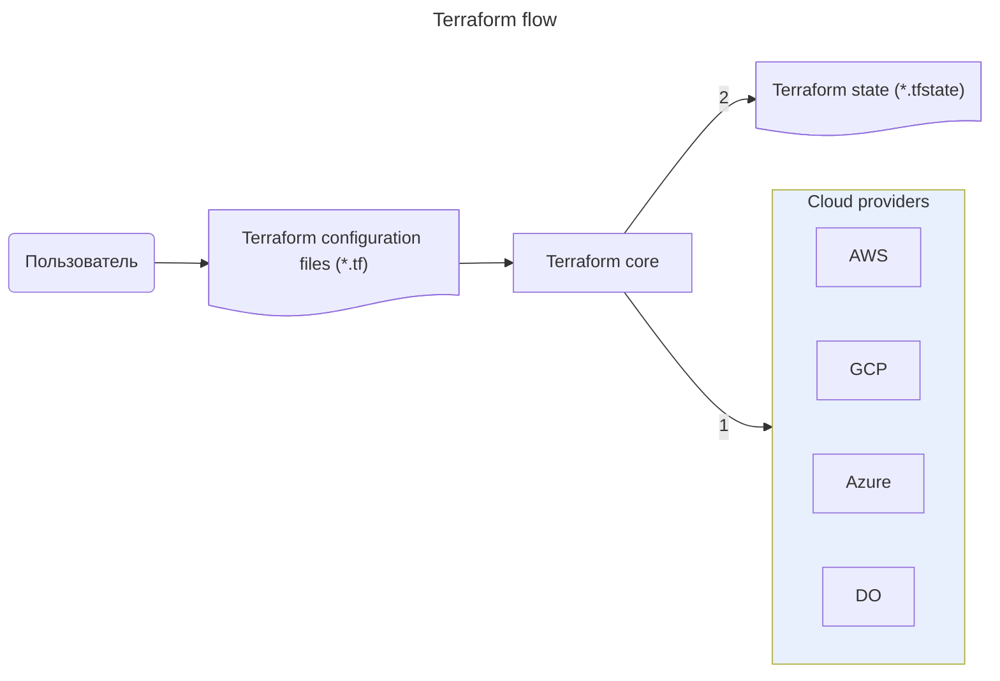

---
aliases:
  - ycloud
  - terraform
  - packer
---
## Terraform — infrastructure as code tool



Подготовив один файл спецификации, вы автоматически развернёте из него готовую инфраструктуру при помощи **Terraform**
* Terraform имплементирует декларативное управление инфраструктурой
	* [[Ansible]] имплементирует императивное управление инфраструктурой
* Terraform-спецификации можно упаковать в образы виртуальной машины при помощи [[Packer]]

### terraform спецификации

- структура спецификации terraform-файла
    
    ```jsx
    resource "yandex_compute_instance" "vm-1" {
      ...
    }
     
    resource "yandex_vpc_network" "network-1" {
      ...
    }
     
    resource "yandex_vpc_subnet" "subnet-1" {
      ...
    } 
    ```
    
- пример
    
    ```jsx
    terraform {
      required_providers {
        yandex = {
          source = "yandex-cloud/yandex"
        }
      }
    }
     
    provider "yandex" {
      token     = "<OAuth-токен>"
      cloud_id  = "<идентификатор_облака>"
      folder_id = "<идентификатор_каталога>"
      zone      = "<зона_доступности_по_умолчанию>"
    }
    ```
    
- Terraform позволяет предварительно посмотреть план выполнения: что будет создано и удалено в процессе работы
- В Terraform объекты можно связывать друг с другом
- terraform-файлы пишутся на `HCL`, хранятся в формате `.tf`
- при запуске Terraform просматривает все файлы в директории и воспринимает их как единую спецификацию.

### как использовать terraform спецификацию

1. `terraform init` инициализирует провайдеров, указанных в файле спецификации.
2. `terraform plan` запускает проверку спецификации. Если есть ошибки — появятся предупреждения. Если ошибок нет, отобразится список элементов, которые будут созданы или удалены.
3. `terraform apply` запускает развёртывание инфраструктуры.
4. `terraform destroy` удалить инфраструктуру когда она больше не нужна
Вот так выглядит каркас спецификации для Terraform. Он состоит из описания **ресурсов**: ВМ, сетей, подсетей и т. д.

```json
resource "yandex_compute_instance" "vm-1" {
  ...
}
 
resource "yandex_vpc_network" "network-1" {
  ...
}
 
resource "yandex_vpc_subnet" "subnet-1" {
  ...
}
```

## Спецификации Terraform

[Terraform](https://www.terraform.io/), как и Packer, разработала компания HashiCorp. Облачные провайдеры, в том числе Yandex Cloud, поддерживают спецификации Terraform. Обычно они пишутся на языке HCL и хранятся в файлах формата `.tf`. Для удобства таких файлов может быть несколько. При запуске Terraform просматривает все файлы в директории и воспринимает их как единую спецификацию.

Значения параметров или задаются в спецификации, или передаются в качестве **переменных**, чтобы адаптировать спецификацию для конкретных задач.
```
variable "folder-id" {
  type = string
}
 
provider "yandex" {
  token     = "<OAuth-токен>"
  cloud_id  = "<идентификатор_облака>"
  folder_id = var.folder-id
  zone      = "<зона_доступности_по_умолчанию>"
}
```

## Как использовать спецификации Terraform

Инфраструктура разворачивается в три этапа:

1. Команда `terraform init` инициализирует провайдеров, указанных в файле спецификации.
2. Команда `terraform plan` запускает проверку спецификации. Если есть ошибки — появятся предупреждения. Если ошибок нет, отобразится список элементов, которые будут созданы или удалены.
3. Команда `terraform apply` запускает развёртывание инфраструктуры.

Если инфраструктура больше не нужна, её можно удалить командой `terraform destroy`.