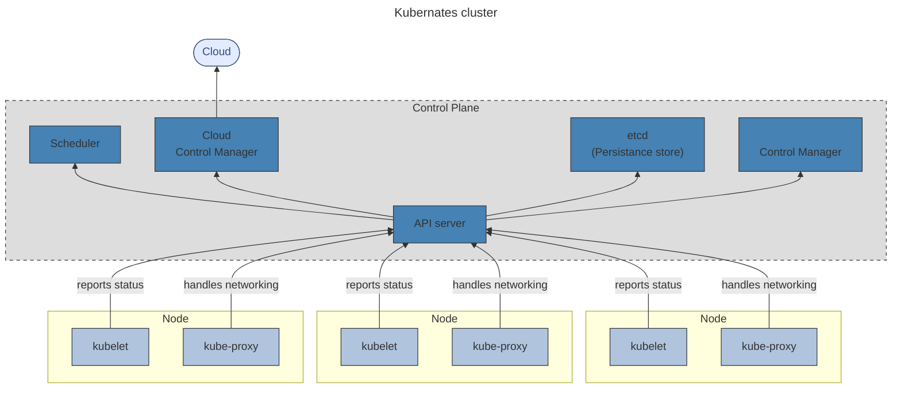

---
aliases:
  - ycloud
---
## оркестрация
отслеживать работоспособность и перезапускать при сбоях, обновлять, разворачивать, масштабировать, останавливать. Такое управление называется **оркестрацией**.

## [[software-engineer/технологии/kubernetes/Kubernetes]]
Наиболее популярная система управления контейнерами — [Kubernetes](https://kubernetes.io/)®, также известная как **K8s**. Это система с открытым исходным кодом, которая автоматизирует операции с контейнерами: мониторинг, распределение нагрузки, предоставление ресурсов и пр.

### Структура k8s
под
* нод
	* кластер
		* панель управления
			* Kubernetes API
			* планировщик
			* контроллеры основных ресурсов
		* неймспейс
[[Kubernetes]] расширения
* обязательные
	1. [внутренний DNS-сервер](https://kubernetes.io/docs/concepts/services-networking/dns-pod-service/
* необязательные
	* графический веб-интерфейс [Dashboard](https://kubernetes.io/docs/tasks/access-application-cluster/web-ui-dashboard/)
	* инструмент для мониторинга ресурсов кластера [Container Resource Monitoring]
###### под
В Kubernetes контейнеры или наборы контейнеров размещаются на **подах** (pod). 
* Под — это логический хост. 
###### узел
Один или несколько подов, а также сервисы для управления подами образуют **узел**, или **ноду** (node). 
* Узел — это рабочая машина, виртуальная либо физическая. 
	* Однотипные узлы образуют **группу узлов**.
###### кластер
В свою очередь, узлы объединяются в **кластер**. 
###### панель управления
У каждого кластера есть своя панель управления (**control plane**), именно она и обеспечивает оркестрацию.
Один из узлов кластера становится главным — **мастером** (master). Он запускает управляющие процессы Kubernetes: 
* сервер **Kubernetes API**, 
* **планировщик** 
* и **контроллеры основных ресурсов**.
###### неймспейс
В одном физическом кластере могут находиться несколько виртуальных. Виртуальный кластер называется **пространством имён** (**namespace**).
* В отличие от нод и подов, которые в кластере есть всегда, пространства имён надо использовать тогда, когда в них возникает реальная необходимость.
###### расширения
В кластер Kubernetes можно устанавливать расширения, облегчающие управление. Например, графический веб-интерфейс [Dashboard](https://kubernetes.io/docs/tasks/access-application-cluster/web-ui-dashboard/) или инструмент для мониторинга ресурсов кластера [Container Resource Monitoring](https://kubernetes.io/docs/tasks/debug-application-cluster/resource-usage-monitoring/). Они необязательны. Единственное обязательное расширение — это [внутренний DNS-сервер](https://kubernetes.io/docs/concepts/services-networking/dns-pod-service/) кластера. Он необходим для общения сервисов между собой.
###### структура K8s

## Что делает [[software-engineer/технологии/kubernetes/Kubernetes]]

- **Автоматическое развёртывание.** Вы можете описать состояние контейнеров в виде конфигурации, и Kubernetes автоматически обеспечит заданное состояние: будет развёртывать и удалять контейнеры, перераспределять ресурсы.
- **Мониторинг сервисов и балансировка.** Kubernetes распределяет сетевой трафик так, чтобы развёртывание было стабильным.
- **Оркестрация хранилища.** Kubernetes позволяет автоматически смонтировать систему хранения: локальное или облачное хранилище.
- **Самоконтроль.** Kubernetes перезапускает отказавшие контейнеры, заменяет их и завершает работу контейнеров, которые не соответствуют заданному уровню работоспособности.
## Yandex Managed Service for [[software-engineer/технологии/kubernetes/Kubernetes]]
Чтобы упростить администрирование и интеграцию, в Yandex Cloud есть сервис [Managed Service for Kubernetes](https://cloud.yandex.ru/docs/managed-kubernetes/).
- При использовании Yandex Managed Service for Kubernetes вы создаёте кластер и группы узлов. При этом мастер-ноды, пространство имён, сервис DNS и прочие необходимые элементы развёртываются автоматически. А за обслуживание и обновление всей инфраструктуры кластера отвечает облачный провайдер.
- Приложения, помещённые в такой кластер, автоматически масштабируются: при пиковых нагрузках ресурсы подтягивают, при спаде — освобождают.
- У Yandex Managed Service for Kubernetes есть свой графический интерфейс. Дополнительные расширения не требуются.
- Для хранения Docker-образов для подов кластера используйте Yandex Container Registry.
- Мастер-узел можно настроить так, что он будет автоматически реплицироваться во всех зонах доступности Yandex Cloud.
- Благодаря интеграции с сервисом Yandex Identity and Access Management можно добавлять пользователей в кластеры Kubernetes по учётным записям вашей организации или, например, почте на @yandex.ru.