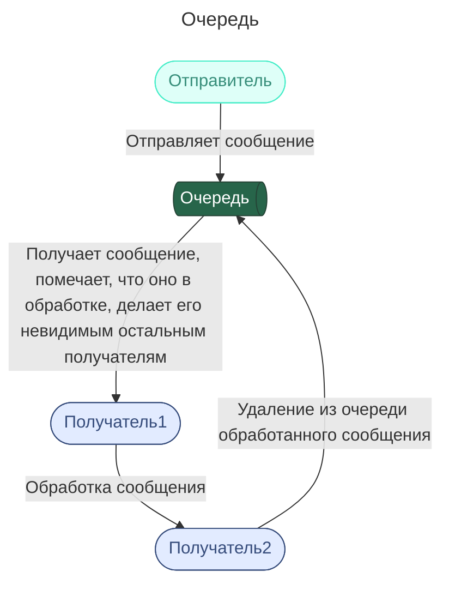

## Yandex Message Queue

* Сообщение состоит из тела — ваших данных — и метаданных, его дополнительных атрибутов.

В **Базовых параметрах**, помимо имени и типа очереди, вы можете указать:
- **Стандартный таймаут видимости.** Это время, на которое сообщение скрывается из очереди после чтения получателем. Пока сообщение скрыто, другие получатели не могут получить сообщение из очереди. Минимальный таймаут видимости — 30 секунд, максимальный — 12 часов.
- **Срок хранения сообщений.** Вы можете указать, как долго каждое сообщение может храниться в очереди в ожидании чтения получателем. Это значение должно быть в промежутке от 60 секунд до 14 дней.
- **Максимальный размер сообщения.** Может составлять от 1 до 256 КБ.
- **Задержка доставки.** Иногда нужно, чтобы обработчик получил сообщение не сразу, а позже. Здесь вы можете указать время, в течение которого новое сообщение нельзя получить из очереди. Значение должно быть в промежутке от 0 секунд до 15 минут.
- **Время ожидания при получении сообщения.** В течение этого времени получатель будет ожидать сообщения. Если они появятся в очереди, вызов будет сделан раньше, чем указано в этой настройке. Если же по истечении этого времени сообщения не появились, будет возвращён пустой список.
https://practicum.yandex.ru/trainer/ycloud/lesson/8c0ac091-328e-4c5e-ba72-0452b6bb0431/
