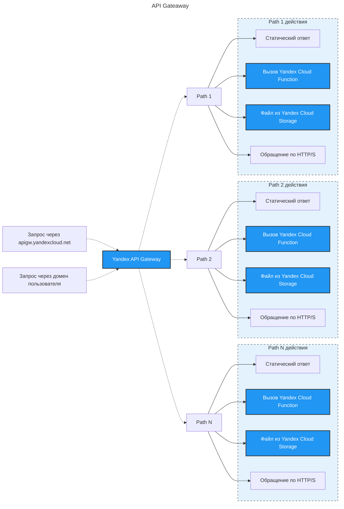

## Yandex Serverless Integrations
**Yandex Serverless Integrations** — это сервис для настройки интеграций и управления FAAS с помощью serverless-технологий. Он содержит три сервиса:
### Workflows, EventRouter, API Gateway
- **Workflows** — позволяет выстраивать и автоматизировать рабочие процессы при помощи декларативной спецификации Yandex Workflows Language (YaWL).
- **EventRouter** — осуществляет обмен событиями между вашими сервисами и сервисами Yandex Cloud с возможностью их фильтрации, трансформации и маршрутизации.
- **API Gateway** — используется для создания API-шлюзов, которые поддерживают спецификацию OpenAPI 3.0 и набор расширений для взаимодействия из интернета с сервисами Yandex Cloud.
	- **Yandex API Gateway** является управляемым RESTful API — это единая точка входа, которая позволяет объединить публикацию функций, объектов и интерфейсов к другим облачным сервисам в единый комплекс. API Gateway находится между внешним пользователем и сервисами облака и обрабатывает пользовательские запросы.
	- На рынке существует много готовых API-шлюзов, в том числе NGINX, Apigee, Axway, 3scale, которые можно развернуть на ВМ в вашем облаке. Удобнее воспользоваться готовым serverless-решением — Yandex API Gateway.
## serverless компоненты от ycloud
### Yandex Message Queue
Когда на запрос клиента нужно ответить быстро, а обработка запроса требует времени, её можно сделать асинхронной и параллельной, используя очереди сообщений на базе **Yandex Message Queue**.
### YDB
Набор serverless-сервисов полноценен, если в нём есть базы данных. В Yandex Cloud это **YDB** — распределённая отказоустойчивая Distributed SQL база данных с возможностью использовать SQL или Document API (AWS DynamoDB API)
### Yandex Object Storage
**Yandex Object Storage** — масштабируемое облачное объектное хранилище данных, совместимое с Amazon S3 API. У Object Storage есть ряд преимуществ перед обычным сервером, на который можно писать данные в произвольную папку.
### Yandex Serverless Containers
**Yandex Serverless Containers** — сервис для запуска Docker-контейнеров без создания виртуальных машин и кластеров Kubernetes. Serverless Containers сам использует функции Yandex Cloud Functions для развёртывания контейнеров. Это даёт ряд преимуществ: функции автоматически масштабируются, нет необходимости настраивать балансировщик нагрузки, функцию можно развернуть за секунды.
### Yandex Cloud Logging
**Yandex Cloud Logging** — сервис для агрегации и чтения логов пользовательских приложений и ресурсов Yandex Cloud. Вы можете создать свою лог-группу, объединяющую несколько облачных сервисов. Это удобно в тех случаях, когда вам нужно отладить работу, скажем, микросервисного приложения. Объединив логи Cloud Functions, API Gateway и Message Queue, вы будете видеть в консоли управления запросы к API-шлюзу, действия с событиями в очереди и журнал исполнения программного кода.
### Yandex IoT Core
**Yandex IoT Core** — сервис интернета вещей для двустороннего обмена сообщениями между реестрами и устройствами. Этот сервис использует протокол [Message Queuing Telemetry Transport](https://ru.wikipedia.org/wiki/MQTT) (MQTT), который применяется в автоиндустрии, логистике, платформах умных домов, умных бытовых устройствах и т. д.
### Yandex Data Streams
**Yandex Data Streams** — масштабируемый сервис для управления потоками данных в режиме реального времени.
### Yandex Query
**Yandex Query** — сервис для аналитики данных. Он способен выполнять федеративные запросы к объектному хранилищу, управляемым базам данных в облаке
### Yandex Cloud Postbox
**Yandex Cloud Postbox** — платформа электронной почты, которая предоставляет простой и экономичный способ отправки
### Yandex Cloud Notification Service
**Yandex Cloud Notification Service** — сервис для мультиканальной отправки SMS / Push-уведомлений пользователям на мобильные устройства iOS и Android.

В Yandex Cloud есть так называемый [Free tier](https://cloud.yandex.ru/docs/billing/concepts/serverless-free-tier) — в определённых пределах каждый пользователь может использовать сервис бесплатно. Это позволяет попробовать serverless-экосистему в деле и даже успешно эксплуатировать в облаке приложения с небольшой нагрузкой.
* **free tier** -- свободный уроверь, уровень нетарифицируемого использования.
# API Gateway

**Yandex Serverless Integrations**, в составе которого есть **API Gateway**, работающий по модели PaaS. Сервис предоставит:
- функциональность прокси-сервера, масштабируемость и отказоустойчивость инфраструктуры;
- возможность описывать API в стандартном виде с помощью спецификации OpenAPI;
- возможность применять интеграционные решения на основе расширений OpenAPI.

