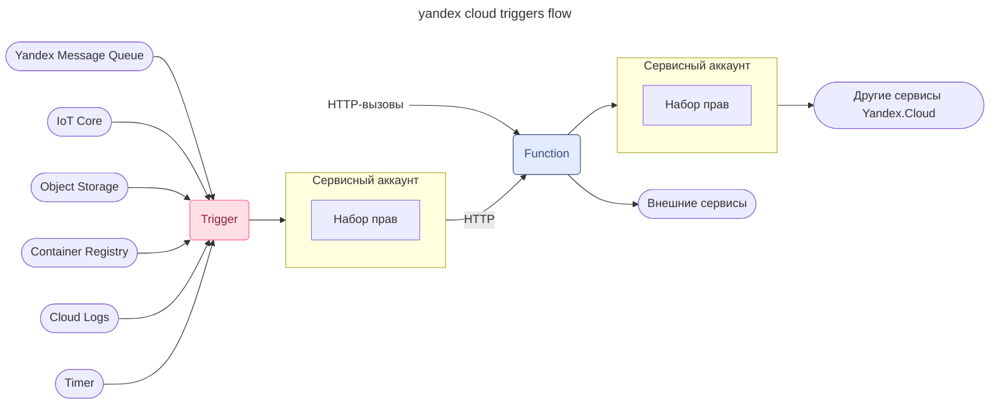

---
aliases:
  - ycloud
  - serverless
---
# serverless поход

Чтобы запустить приложение, нужно арендовать виртуальную машину определённой мощности, настроить на ней операционную систему и развернуть среду исполнения своего кода. Чтобы записывать и читать данные в БД, нужно определить, сколько потребуется CPU, какой будет нужен объём памяти и жёсткого диска. Ресурсы придётся оплачивать вне зависимости от того, используете вы их или нет.

Чтобы запустить приложение, нужно арендовать виртуальную машину определённой мощности, настроить на ней операционную систему и развернуть среду исполнения своего кода. Чтобы записывать и читать данные в БД, нужно определить, сколько потребуется CPU, какой будет нужен объём памяти и жёсткого диска. Ресурсы придётся оплачивать вне зависимости от того, используете вы их или нет.

**Serverless platform** предоставляет доступ к вычислительным ресурсам облака: вы не арендуете серверы или виртуальные машины и не настраиваете сети. Оплата происходит посекундно за фактическое использование ресурсов.

Использование serverless-сервисов при разработке приложений даёт следующие преимущества:
1. Позволяет разработчикам сфокусироваться на работе над кодом. Больше не нужно разворачивать, настраивать и обслуживать какую-либо инфраструктуру (серверы, виртуальные машины, контейнеры).
2. Часто даёт возможность снизить операционные расходы по сравнению с запуском приложений на виртуальной машине или в средах контейнерной виртуализации — за счёт более эффективного распределения мощностей провайдером.
3. Позволяет минимизировать риски непредсказуемости спроса — в случае как переоценки, так и недооценки будущей нагрузки. 
- Serverless-подход позволяет использовать вычислительные ресурсы облака без настройки сети, аренды серверов и виртуальных машин.
- Serverless-сервисы снижают операционные расходы и риски непредсказуемости спроса.
# Yandex Cloud Functions
Базовым сервисом для serverless-разработки в Yandex Cloud является **Yandex Cloud Functions**. Он относится к категории ==Function-as-a-Service (FaaS)== — одному из видов Platform as a Service (PaaS): платформой Cloud Functions пользуется клиент, в то время как её обслуживанием занимается провайдер. Главная задача Cloud Functions — исполнить программный код, который написан на одном из поддерживаемых языков программирования
## serverless-функции
Вместо организации среды приложения вы можете создать так называемую **serverless-функцию**. Это программа, которая предназначена для решения какой-то одной простой задачи. Код этой программы упаковывается в изолированный контейнер и выполняется на вычислительных ресурсах дата-центра облачной платформы.

Yandex Cloud Functions следует общей концепции бессерверных вычислений, позволяет запускать ваш код в виде функции в безопасном, отказоустойчивом и автоматически масштабируемом окружении без создания и обслуживания виртуальных машин
### триггеры

---

[[Yandex Serverless Integrations]]
# очереди сообщений
Очереди используются внутри программ при взаимодействии потоков и в организации больших систем, где взаимодействуют несколько программ или сервисов. В таких системах очереди помогают решать проблемы интеграции приложений, их отказоустойчивости и масштабирования, например:
- надёжной передачи данных и команд между компонентами;
- обработки данных от множества устройств IoT;
- обработки событий, по которым должна быть вызвана функция.
## Виды очередей

Существует два распространённых типа очередей: FIFO и стандартная. стандартные очереди поддерживают сравнительно большое количество вызовов API в секунду (отправка, принятие или удаление сообщения).

[[Yandex Message Queue]]

