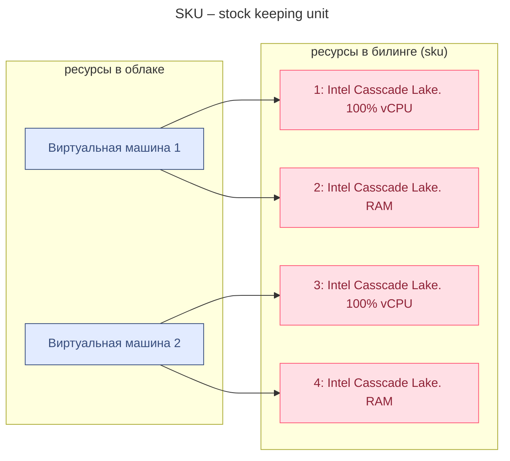
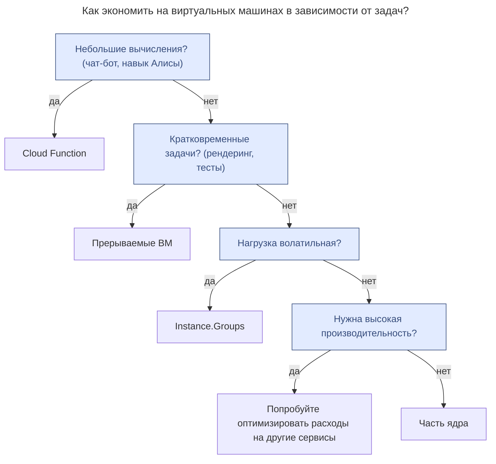

---
aliases:
  - ycloud
---
# Pay as you go – PAYG
«плати, пока пользуешься». Как в каршеринге: пока едешь на арендованной машине — платишь, поездка закончилась — закончили платить.

>👉 Затраты в Yandex Cloud зависят от количества потреблённых ресурсов и времени их использования.

# SKU – stock keeping unit

# биллинт yclod
* ycloud могут только резиденты рф
* есть калькулятор для расчета стоимости оп SKU
Вот три способа контролировать затраты в Yandex Cloud:
1. Детализация затрат в консоли.
2. Использование [DataLens](https://datalens.yandex.ru/).
	1. DataLens — это знакомый вам сервис визуализации данных. Для биллинга он удобен тем, что позволяет следить за каждым ресурсом. Например, за конкретной виртуальной машиной.
3. Отгрузка детализации в формате CSV.
## оптимизация затрат

