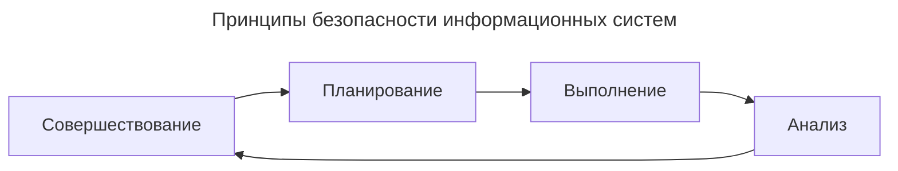
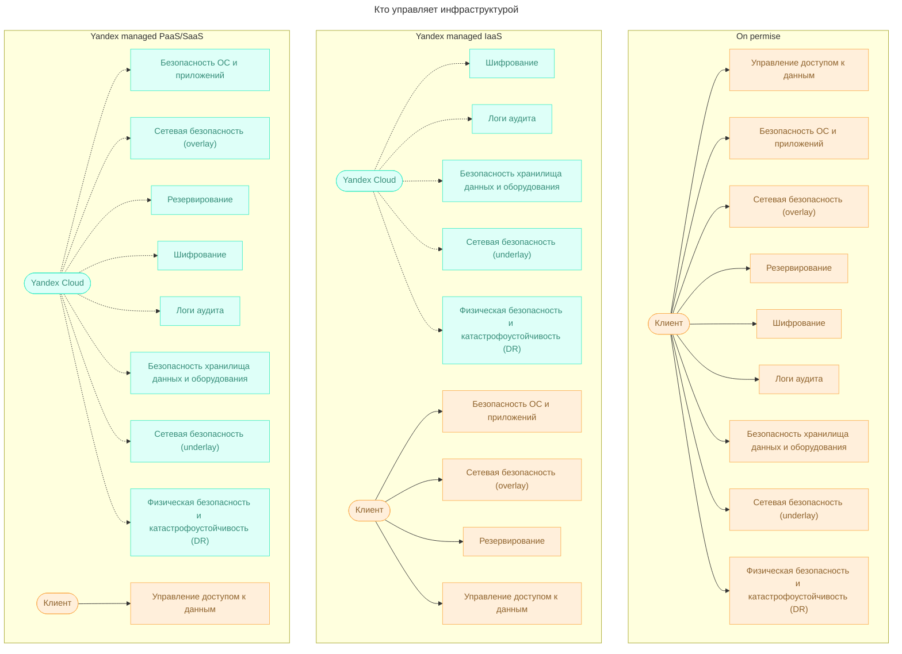
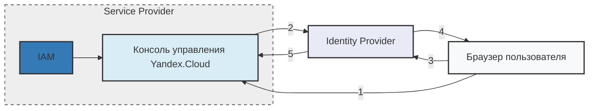
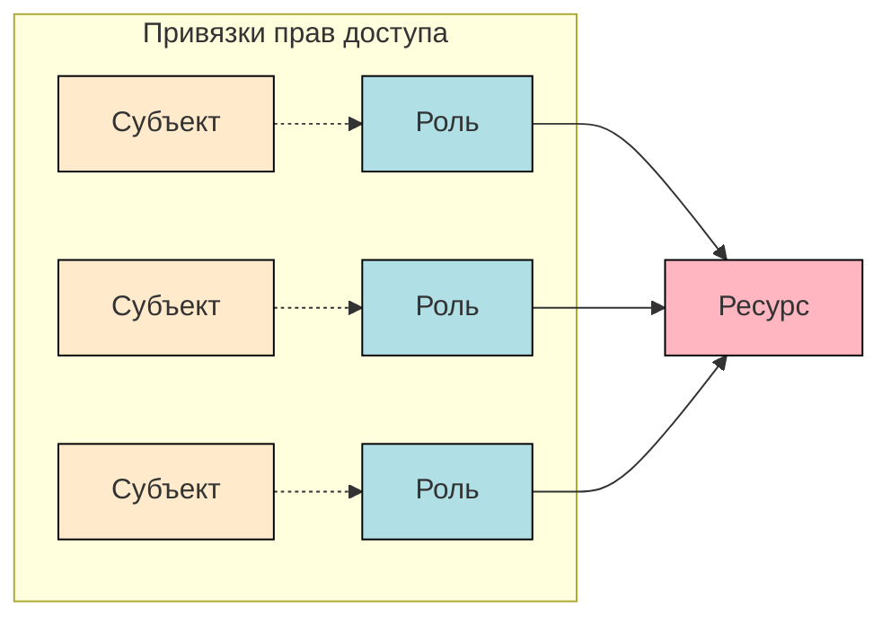
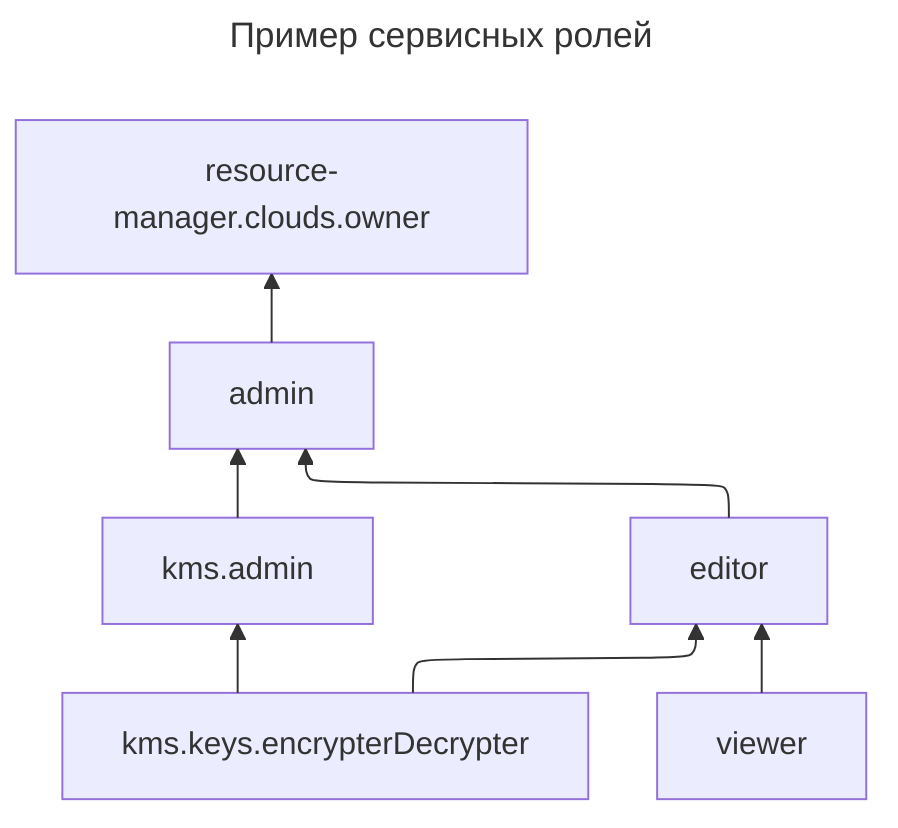
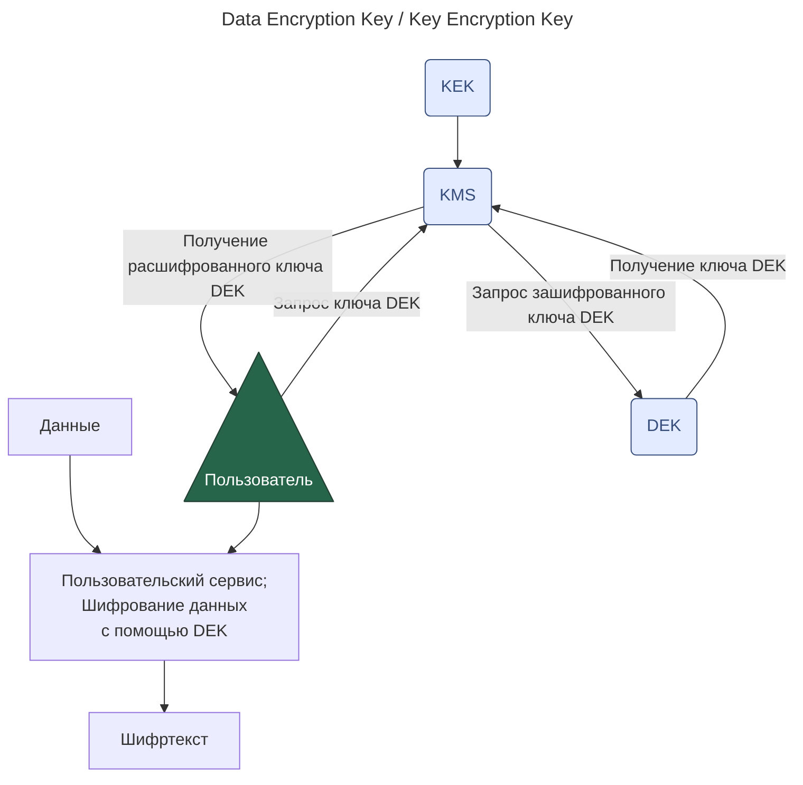

# Принципы безопасности информационных систем
Принципы безопасности информационных систем одинаковы в обоих случаях: это защита конфиденциальности, целостности и доступности информации.
**Конфиденциальность** означает, что доступ к информации должны иметь только те, кто имеет на это право
**Целостность** подразумевает защиту данных от несанкционированного изменения или удаления, а если такое всё-таки произошло — у вас должна быть возможность всё восстановить.
**Доступность** означает, что тот, кто владеет информацией, или тот, для кого она предназначена, имеет к ней надёжный бесперебойный доступ. 
	например, вы должны знать, как защититься от распределённой сетевой атаки (**DDoS, Distributed Denial of Service**), направленной на то, чтобы вывести из строя ваш веб-ресурс.
Обеспечение безопасности — это не разовое мероприятие, а **постоянный процесс**, основанный на следующих принципах:
- планирование технических и организационных мер с учетом имеющихся рисков и угроз;
- выполнение этих мер;
- мониторинг и анализ функционирования вашей системы;
- совершенствование применяемых инструментов защиты.

## shared responsibility
>[!info] разделяемая ответственность -- shared responsibility
В то, чтобы работа в облаке была безопасной, вносят вклад и облачный провайдер, и пользователь. Это называется разделяемой ответственностью ==shared responsibility==.

# Законодательство о защите данных

Чтобы получать и обрабатывать персональные данные, необходимо соблюдать требования [Федерального закона №152-ФЗ](http://www.consultant.ru/document/cons_doc_LAW_61801/)
Исходя из положений законодательства, персональные данные могут быть четырёх категорий:
- **специальные**: например национальность, политические взгляды, состояние здоровья;
- **биометрические**: фото, отпечатки пальцев;
- **общедоступные**: например ФИО, дата рождения, номер телефона;
- **иные**: например, какие покупки делал конкретный человек в вашем интернет-магазине.
По закону на оператора возлагается ряд обязанностей. В частности, он должен:
- заранее четко сформулировать цели обработки персональных данных и действовать в соответствии с этими целями;
- обрабатывать персональные данные только после получения согласия на это от субъектов (например, от сотрудников компании или пользователей приложения);
- обеспечить защиту персональных данных от незаконного доступа;
- хранить персональные данные российских граждан на серверах, расположенных на территории России.
https://practicum.yandex.ru/trainer/ycloud/lesson/9812b87f-2705-41bf-a5c1-56fa76c37475/
Суть **постановления** заключается в том, что защита персональных данных должна осуществляться дифференцированно. Для этого вводятся понятия **типа угрозы** и **уровня защищённости**.
- **первый** — угрозы, связанные с уязвимостями в системном ПО;
- **второй** — угрозы, связанные с уязвимостями в прикладном ПО;
- **третий** — угрозы, не связанные с ПО.
Если вы собираетесь работать с пользователями из стран Европейского союза, то вам придётся учитывать требования регламента **GDPR** ([General Data Protection Regulation](https://gdpr-info.eu/)). Это закон о защите персональных данных, действующий во всех странах ЕС.
# стандарты
Важно понимать, что, в отличие от требований законодательства, нарушение которых грозит санкциями и штрафами, стандарты безопасности — это просто правила и практики, которые подавляющее большинство экспертов считает эффективными.
## Стандарты серии ISO/IEC 27000

Документы этой серии определяют, как правильно создать систему управления информационной безопасностью (**СУИБ**).
**тандарт ISO/IEC 27001** содержит требования к СУИБ. Он определяет, как её правильно внедрять, поддерживать и совершенствовать.
**Стандарт ISO/IEC 27017** включает практические рекомендации по обеспечению информационной безопасности для облачных провайдеров. Эти рекомендации дополняют требования, которые изложены в стандарте ISO/IEC 27001.
**Стандарт ISO/IEC 27018** содержит практические рекомендации по защите персональных данных при их обработке провайдерами облачных сервисов.
## PCI DSS
PCI DSS (Payment Card Industry Data Security Standard) содержит основные требования для защиты данных держателей платёжных карт.
## ГОСТ Р 57580.1‑2017
Для обеспечения безопасности банковских и финансовых операций существует и национальный российский стандарт — ГОСТ Р 57580. Его требованиям должны соответствовать все кредитные и некредитные финансовые организации.
# инструменты обеспечения безопасности
## контроль доступа
* **сервис IAM** (Identity and Access Management)
## шифрование данных
С помощью **сервиса KMS** (Key Management Service) вы можете:
- создавать ключи шифрования и управлять ими;
- использовать ключи в популярных библиотеках;
- шифровать и расшифровывать данные небольшого объёма;
- организовывать криптографическую защиту больших объёмов данных с использованием схемы [envelope encryption](https://cloud.yandex.ru/docs/kms/concepts/envelope).
**Сервис Lockbox** помогает защитить ваши секреты, то есть любую информацию, которую нужно хранить в тайне. Это могут быть, например, логины и пароли или ключи сервисного аккаунта.
## cетевая безопасность
Для управления входящим трафиком используется **балансировщик нагрузки**. Он позволяет снизить риски для безопасности, поскольку уменьшает поверхность атаки и ограничивает трафик на виртуальные машины только необходимыми протоколами. Балансировщик может быть интегрирован с **сервисом DDoS Protection** для защиты от DDoS-атак.

Чтобы управлять исходящим трафиком, рекомендуется предоставлять виртуальным машинам доступ в интернет через **NAT** (Network Address Translation) — механизм преобразования сетевых адресов, который работает в качестве сетевого шлюза или прокси-сервера.

Контроль над всеми видами трафика обеспечивается **группами безопасности**. Этот инструмент — фактически набор правил получения и отправки трафика — позволяет управлять доступом виртуальных машин к ресурсам, расположенным в облаке или в интернете.

Безопасный доступ к облачной инфраструктуре можно обеспечить с помощью виртуальных каналов **VPN** (Virtual Private Network). Для этого на отдельной виртуальной машине настраивают VPN-сервер или используют готовые образы VPN-серверов из Marketplace.

Выделенное сетевое соединение между локальной инфраструктурой и ресурсами в облаке организуют при помощи **сервиса Cloud Interconnect**. Такое соединение надёжнее, быстрее и безопаснее подключения через интернет.
## мониторинг доступности ресурсов
Одним из принципов информационной безопасности является обеспечение доступности ресурсов. Для этих целей предназначен **сервис Yandex Monitoring**
## внешнее сканирование безопасности
Чтобы убедиться в том, что ваша система хорошо защищена, её можно проверить на наличие уязвимостей. Для этого проводят внешний поиск уязвимостей (**пентесты**).
Внешнее сканирование безопасности может проводиться как самим пользователем, так и привлечённым подрядчиком. В любом случае обязательно делать это по согласованию с Yandex Cloud и в соответствии с [правилами организации сканирования](https://yandex.ru/legal/cloud_pentest/).
## мarketplace
Необходимые вам инструменты обеспечения безопасности можно найти и в [Marketplace](https://cloud.yandex.ru/marketplace?categories=security). В нём размещено несколько комплексных систем защиты ресурсов, межсетевых экранов, в том числе для веб-приложений (WAF, Web Application Firewall), образы для развёртывания серверов удалённого доступа OpenVPN и IPSec VPN.

ПО в Marketplace в основном платное. Оплата производится по моделям Pay as you go или BYOL. В первом случае тарифицируется только время фактического использования ПО. Во втором вам понадобится приобрести у поставщика ПО собственную лицензию.
# Сервис авторизации IAM
Теперь рассмотрим, как получить доступ к ресурсам Yandex Cloud. Предусмотрены три типа аккаунтов.
1. **Тип 1. Учетная запись Яндекс ID**. Это единый аккаунт для всех сервисов Яндекса, в котором хранятся личные данные пользователей, выполняется их аутентификация и авторизация. Если аутентификация прошла успешно, то Яндекс ID устанавливает в браузере пользователя cookie на домен верхнего уровня _.yandex_. Испльзует токены для проверки аутентификации
	1. IAM-токен — это информация для авторизации,  подписанная секретным ключом IAM
	2. Если вы работаете в интерфейсе командной строки (CLI), то на вашем компьютере будет сохранен OAuth-токен Яндекс ID
2. **Тип 2. Федерация удостоверений.** Удостоверения (credentials) — это информация об атрибутах пользователей, таких как логин или адрес электронной почты, и способах аутентификации. При использовании федерации удостоверений они хранятся не у облачного провайдера, а у третьей доверенной стороны — поставщика удостоверений (IdP, Identity Provider).

схема 

1. **Тип 3.** Аутентифицированные пользователи могут выполнять операции с облаком не только под своими пользовательскими аккаунтами, но и через сервисные аккаунты. **Сервисные аккаунты** — это специальный тип аккаунтов, которые используются для доступа к ресурсам Yandex Cloud от имени приложений. Также под сервисными аккаунтами могут выполнять операции облачные функции и сервисы, которые запущены в виртуальных машинах. Аутентификацию сервисного аккаунта можно выполнять тремя способами:
	1. **Авторизованные ключи.** Используются для получения IAM-токена с помощью открытого и секретного ключа. Этот способ вы примените в следующей практической работе.
	2. **API-ключи.** Используются в некоторых сервисах для упрощённой аутентификации вместо IAM-токена. Могут пригодиться для работы с сервисами SpeechKit, Vision и Translate.
	3. **Статические ключи доступа.** Необходимы при использовании AWS-совместимых сервисов, например в Object Storage или Message Queue.
## RBAC (Role Based Access Control)
RBAC (Role Based Access Control). То есть каждому пользователю можно назначить определённую роль для доступа к тому или иному ресурсу.
**Роль** — это набор разрешений, которые описывают допустимые операции над ресурсом.
Роли на ресурс назначаются в виде списка связей «роль — субъект». Такие связи называются привязками прав доступа (access bindings), их можно добавлять и удалять, то есть контролировать права доступа к ресурсу.

В реализованной в Yandex Cloud ролевой модели имеется два типа ролей: **примитивные** (общие для всех сервисов) и **сервисные** (выдаются только на один сервис). **Сервисные роли** зависят от специфики каждого отдельного сервиса и могут назначаться на объекты, для которых эти роли предназначены. Некоторые сервисные роли назначаются на ресурс (например на ключ шифрования в сервисе KMS), а некоторые — только на контейнер, в котором размещены ресурсы (например роль `compute.admin` назначается на каталог или облако).
К **примитивным ролям** относятся:
1. `viewer` — позволяет просматривать информацию о ресурсе или список ресурсов, если назначена на каталог;
2. `editor` — позволяет управлять ресурсами: создавать, изменять и удалять объекты;
3. `admin` — позволяет управлять ресурсами и правами доступа к ним.

Пример сервисных ролей 

лучшие практики https://practicum.yandex.ru/trainer/ycloud/lesson/85145767-e20a-4860-9cb8-a322d9ee5db1/
## доступность ресурсов
Прежде всего, сеть должна надёжно выполнять свои функции — в том числе, обеспечивать высокую доступность ресурсов.
## периметр безопасности
Следующий принцип построения сетей — создание периметра безопасности. Идея заключается в том, чтобы предусмотреть минимально необходимое количество точек выхода в интернет и обеспечить их защиту.
## принцип наименьших привилегий
Третий элемент обеспечения сетевой безопасности в облаке — реализация принципа наименьших привилегий. Этот принцип требует, чтобы каждый ресурс в вашем облаке был связан только с теми ресурсами в облаке или интернете, которые необходимы для его корректной работы.
# Сервис Certificate Manager
## TLS-сертификаты
Делая что-либо в интернете, мы заинтересованы в том, чтобы передаваемые данные были защищены. Для этого используется протокол HTTPS (HyperText Transfer Protocol Secure) — по сути, комбинация из протокола передачи данных прикладного уровня HTTP и криптографического протокола транспортного уровня SSL (Secure Socket Layer). Современная версия SSL-протокола называется TLS (Transport Layer Security), однако сама аббревиатура SSL стала настолько привычной, что её часто употребляют до сих пор.

Когда вы используете TLS-протокол, информация передаётся внутри зашифрованной сессии. Работает это так:
1. Ваш браузер обращается к защищённому сайту (серверу) и запрашивает у него идентификационную информацию.
2. Сервер отправляет в ответ копию своего TLS-сертификата.
3. Браузер проверяет сертификат по списку доверенных центров сертификации. Если всё в порядке, то браузер создает, шифрует и отправляет серверу ключ симметричного шифрования для предстоящей сессии передачи данных.
4. Сервер расшифровывает ключ и направляет браузеру подтверждение, после чего все передаваемые между ними данные шифруются этим ключом.

То есть, чтобы использовать протокол HTTPS, на вашем сайте (сервере) должен быть установлен TLS-сертификат. Он представляет собой небольшой файл, в котором обычно содержится следующая информация:
- доменное имя, для которого выпущен сертификат;
- лицо (юридическое или физическое), либо устройство, для которого он выпущен;
- серийный номер сертификата выдающего центра сертификации;
- цифровая подпись центра сертификации;
- дата выдачи и срок действия сертификата;
- публичный ключ 
	- приватный ключ находится на сервере и никуда не передаётся; эта пара ключей нужна для шифрования симметричного ключа, который используется в сессии передачи данных.

TLS-сертификаты выдают центры сертификации **Certification Authority**, которые подписывают запросы на сертификат и могут проверять информацию о владельце сайта. В зависимости от глубины такой проверки выпускаемые сертификаты бывают нескольких типов.

Самые надёжные — сертификаты с расширенной проверкой **EV, Extended Validation** и с проверкой организации **OV, Organization Validation**. При выпуске таких сертификатов проверяется юридическое и физическое существование запрашивающей организации и её право на домен, а для EV-сертификатов — ещё и соответствие её деятельности представленным документам.

Для сертификатов с проверкой домена **DV, Domain Validation** всё проще — проверяется только право собственности на домен. Зато этот тип сертификата могут получить не только юридические, но и физические лица.

## Ключи шифрования KMS
Чтобы сохранить чувствительную информацию закрытой от тех, для кого она не предназначена, нужно прежде всего грамотно настроить к ней доступ. Следующим эшелоном защиты является шифрование хранящихся и передаваемых данных. Это поможет сохранить их конфиденциальность и целостность, даже если в вашу систему кто-то несанкционированно проник.

Существуют **симметричные** и **асимметричные** алгоритмы шифрования. В **симметричных** данные шифруются и расшифровываются одним и тем же ключом. **Асимметричные** методы построены на использовании двух ключей: открытого и закрытого (секретного). Открытый ключ нужен для шифрования, а закрытый — для расшифрования. Данные устойчивы к атакам методом перебора, если они зашифрованы с использованием ключа длиной не менее 128 бит для симметричных алгоритмов и не менее 1024 бит для асимметричных. Сами алгоритмы при этом, естественно, должны быть современными и актуальными.

На надёжность защиты влияет не только длина ключа. Важно и то, где и как хранятся ключи. Это считается одним из наиболее уязвимых мест систем защиты, основанных на шифровании.

Предположим, что у нас есть единое хранилище данных, к которому обращаются несколько сервисов. Для защиты данных мы используем симметричную криптографию (она намного быстрее и требует меньше вычислительных ресурсов). Это значит, что у каждого сервиса должен быть доступ к ключу шифрования.

Более надёжный вариант — зашифровать ключ шифрования данных **DEK (Data Encryption Key)** c помощью ещё одного ключа **KEK (Key Encryption Key)**. Теперь даже если злоумышленник и найдёт на взломанном сервере зашифрованный ключ DEK, то расшифровать данные в хранилище он сможет далеко не сразу. Подобная схема защиты называется **envelope encryption**.

Чтобы использовать такую схему, нам придётся решить две проблемы: где хранить ключ KEK, чтобы минимизировать вероятность его компрометации, и как безопасно пользоваться открытой версией ключа DEK. Можно использовать специальный сервис **KMS**, который:
- надёжно хранит ключ KEK и никуда его не передаёт;
- после получения запроса раскодирует зашифрованный ключ DEK и отправляет его пользователю.

Открытый ключ DEK должен использоваться только во время выполнения операций шифрования и расшифрования данных, а после завершения этих операций его нужно сразу уничтожить.

KMS нужен для того, чтобы генерировать ключи шифрования. Сделать это можно через консоль управления, с помощью CLI, а также REST или gRPC API. Сервис поддерживает симметричное шифрование с алгоритмами AES-128, AES-192 и AES-256 (число в названии алгоритма обозначает длину ключа в битах).

У созданного в сервисе ключа есть следующие параметры:
- **идентификатор** — уникален в рамках всего Yandex Cloud и используется для работы с ключами с помощью SDK, API и CLI;
- **название** — может быть не уникально и используется для работы с ключами с помощью CLI (только если в каталоге есть лишь один ключ с таким названием);
- **используемый алгоритм шифрования**;
- **период ротации** — промежуток времени между автоматической сменой ключа;
- **статус** — состояние ключа (`Creating`, `Active` или `Inactive`).