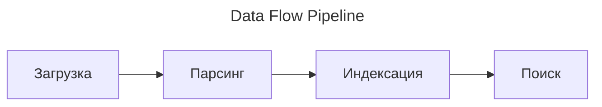
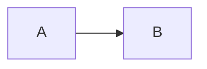
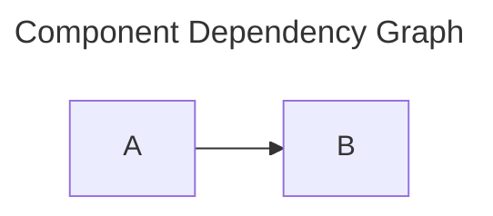

## Markdown Formatting Examples for AI Agent

---

### Rule 1: Front Matter

#### ❌ Before

```markdown
# KD-дерево

KD-дерево — это структура данных для организации точек в k-мерном пространстве.
```

#### ✅ After

```markdown
---
aliases:
  - KD-дерево
  - KD Tree
  - k-мерное дерево
  - k-d tree
---

# KD-дерево

KD-дерево — это структура данных для организации точек в k-мерном пространстве.
```

---

### Rule 2: Headings

#### ❌ Before

```markdown
## 1. Введение
## Шаг 1: Установка
### **Настройка окружения**
###### 🚀 Запуск
> (jumped from ## to #### without ###)
```

#### ✅ After

```markdown
## Общие сведения о noctalia
## Установка noctalia
### Настройка загрузчика noctalia
### 🚀 Запуск загрузчика noctalia
> (levels sequential: ## → ### → ####)
```

---

### Rule 3: Emoji in Headings

#### ❌ Before

```markdown
## 🚀 Быстрый старт
### Установка
## 🚀 Конфигурация
### 🚀 Запуск

> `🚀` used in 3 headings — remove all instances.
```

#### ✅ After

```markdown
## Быстрый старт
### Установка
## Конфигурация
### Запуск

> Emoji kept if ≤1 heading; here removed from all.
```

---

### Rule 4: Lists

#### ❌ Before

```markdown
* Первый уровень
  * Второй уровень
    * Третий уровень
      * Четвёртый уровень
        * Пятый уровень (exceeds max 4)
- Текст


- Текст (extra blank line inside list)

1. Первый
2. Второй
3. Четвёртый (broken numbering)
```

#### ✅ After

```markdown
- Первый уровень
  - Второй уровень
    - Третий уровень
      - Четвёртый уровень
- Текст
- Текст
1. Первый
2. Второй
3. Четвёртый
```

---

### Rule 5: Code Blocks

#### ❌ Before

```markdown
Создание индекса:

python
index = build_kdtree(points)

Комментарий выше — висячий код без fences.
```

#### ✅ After

Создание индекса:

```python
index = build_kdtree(points)
```

---

### Rule 6: Text — Links, Brackets, Tags, Pros/Cons

#### ❌ Before

```markdown
Подробнее см. [документация](https://example.com/kd-tree).
Обычный массив \[1, 2, 3\] но скобки внутри текста.
Иван Иванов предложил подход.
Книга "Алгоритмы" (Sedgewick).

**Плюсы:**
- Быстрый поиск
- Просто реализовать

**Минусы:**
- Деградация на высоких размерностях
- Сложность удаления
```

#### ✅ After

```markdown
Подробнее см. \[\[kd-tree-docs\]\].
Обычный массив \[1, 2, 3\] — скобки эскейпнуты.
Иван Иванов #👨 предложил подход.
Книга "Алгоритмы" #📘 (Sedgewick).

Особенности:
- ✅ Быстрый поиск
- ✅ Просто реализовать
- ❌ Деградация на высоких размерностях
- ❌ Сложность удаления
```

---

### Rule 7: Diagrams — Mermaid

#### ❌ Before

```markdown
Поток данных: загрузка → парсинг → индексация → поиск
```

#### ✅ After

Поток данных:



---

### Rule 8: Mermaid Header

#### ❌ Before



#### ✅ After




---

### Rule 9: Formulas

#### ❌ Before

```markdown
Расстояние: \$\$\$d = \sqrt{\sum_{i=1}^{k}(x_i - y_i)^2}\$\$\$
Евклидово: \$\$\$\$d = \sqrt{x^2 + y^2}\$\$\$\$
```

#### ✅ After

```markdown
Расстояние:

\$\$d = \sqrt{\sum_{i=1}^{k}(x_i - y_i)^2}\$\$

Евклидово:

\$\$d = \sqrt{x^2 + y^2}\$\$
```

---

### Rule 10: Whitespace

#### ❌ Before

```markdown
## Заголовок


Текст блока 1.


Текст блока 2. 
- **Оператор `<->`** ...синоним
```

#### ✅ After

```markdown
## Заголовок

Текст блока 1.

Текст блока 2.
- **Оператор `<->`** — синоним

> 1 blank line between blocks, no trailing spaces, no extra blank lines, mangled segment fixed.
```

---

### Rule 11: File Safety

> **Procedural rule — no before/after example.**
> NEVER rename or delete files. Write in place (UTF-8). NEVER touch `README.md` (root), `activities/` dir, or `attachments/` dir, and nothing outside assigned scope.

---

### Rule 12: Remove Duplicate Sections

#### ❌ Before

```markdown
## Поиск в KD-дереве

Поиск ближайшего соседа начинается с корня. На каждом шаге сравниваем координату по текущей оси. Рекурсивно спускаемся в левое или правое поддерево. Если расстояние до гиперплоскости меньше текущего минимума, проверяем и вторую сторону.

## Алгоритм поиска

Поиск ближайшего соседа начинается с корня. На каждом шаге сравниваем координату по текущей оси. Рекурсивно спускаемся в поддерево. Проверяем вторую сторону, если гиперплоскость ближе минимума. Сложность: O(log n) в среднем случае.
```

#### ✅ After

```markdown
## Поиск в KD-дереве

Поиск ближайшего соседа: от корня, сравниваем координату по текущей оси, рекурсивно спускаемся в поддерево. Если гиперплоскость ближе текущего минимума — проверяем вторую сторону. Средняя сложность: O(log n).
```
```
