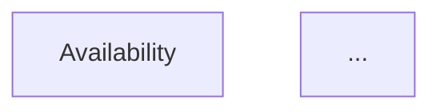
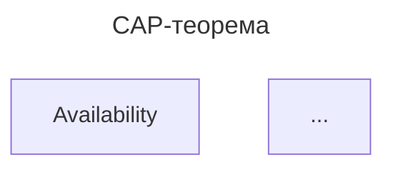

## Эталонные примеры «было → стало»

### Правило: заголовки без пропуска уровней

#### Было (неправильно):

```markdown
# Заголовок
### Подзаголовок
```

#### Стало (правильно):
```markdown
# Заголовок
## Подзаголовок
```

### Правило: Заголовки никогда не содержат форматирования отличающегося от последовательных уровней заголовка

#### Было (неправильно):
```markdown
## Полморфизм `ad-hoc`
#### **1. Основные понятия**
```
#### Стало (правильно):
```markdown
# Полморфизм `ad-hoc`
## Основные понятия
```

### Правило: убрать лишние переводы строк в списках
#### Было (неправильно):
```markdown

- **Рекомендательные системы**: «Похожие товары».
    
- **Геопоиск**: «Ближайшие кафе».
    
- **Компьютерное зрение**: Поиск похожих изображений.
    
```

#### Стало (правильно):
```markdown

- **Рекомендательные системы**: «Похожие товары». 
- **Геопоиск**: «Ближайшие кафе».
- **Компьютерное зрение**: Поиск похожих изображений.
```

### Правило: Экранировать квадратные скобки, если они не часть блока кода
#### Было (неправильно):
```markdown
# Данные: [(x, y), ...]
points = [(1, 2), (3, 4), (5, 6), (7, 8)]
```

#### Стало (правильно):
```markdown
# Данные: \[(x, y), ...\]
points = \[(1, 2), (3, 4), (5, 6), (7, 8)\]
```

### Правило: Каждый русский термин в aliases обязательно должен быть продублирован английским известным техническим термином, означающим то же самое
#### Было (неправильно):
```markdown
---
aliases:
  - КАП
  - Корпоративная аналитическая платформа
---
```

#### Стало (правильно):
```markdown
---
aliases:
  - CAP
  - КАП
  - Corporate Analytical Platform
  - Корпоративная аналитическая платформа
---
```

### Правило: Убрать из текста ссылки на внешние ресурсы
#### Было (неправильно):
```markdown
**Узкий ИИ (ANI):** хорошо делает что‑то одно (игра в шахматы, классификация картинок, генерация текста). [ultralytics](https://www.ultralytics.com/ru/glossary/artificial-general-intelligence-agi)
```

#### Стало (правильно):
```markdown
**Узкий ИИ (ANI):** хорошо делает что‑то одно (игра в шахматы, классификация картинок, генерация текста).
```

### Правило: Если в тексте есть упоминание человека, либо книги, необходимо макировать это упоминание соответствующим тегом
#### Было (неправильно):
```markdown
Hans-Bernd Kittlaus и Peter N. Clough 
«Software Product Management and Pricing. Key Success Factors for Software Organizations»
```

#### Стало (правильно):
```markdown
Hans-Bernd Kittlaus и Peter N. Clough [#👨](app://obsidian.md/index.html#%F0%9F%91%A8)  
«Software Product Management and Pricing. Key Success Factors for Software Organizations» [#📘](app://obsidian.md/index.html#%F0%9F%93%98)
```

### Правило: Стандартизировать все фрагменты Pros/Cons
#### Было (неправильно):
```markdown
### ✅ Плюсы:
- Встроен в JDK — никаких зависимостей.
- Мощный, выразительный API для асинхронного программирования.

### ❌ Минусы:
- Сложность для новичков (глубокие цепочки могут быть трудны для отладки).
- Нет встроенной поддержки backpressure (в отличие от Reactive Streams).
```

#### Стало (правильно):
```markdown
Особенности:
- ✅ Встроен в JDK — никаких зависимостей.
- ✅ Мощный, выразительный API для асинхронного программирования.
- ❌ Сложность для новичков (глубокие цепочки могут быть трудны для отладки).
- ❌ Нет встроенной поддержки backpressure (в отличие от Reactive Streams).
```


### Правило: Mermaid-diagrams всегда содержат заголовок вида: `title: <descriptive title>`
#### Было (неправильно):
```markdown


#### Стало (правильно):
```markdown

