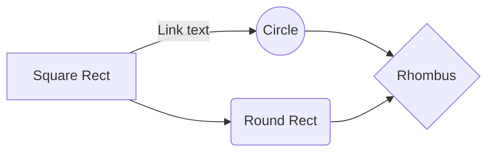

# symbols

— em dash
≡ tribar
∞ infinity symbol
⊂ ∅ ∈ ∉ ≈

**Pros / cons API Gateway**
+ ✔️**Единая точка входа.** Клиенты взаимодействуют с системой через единый интерфейс, что упрощает управление и мониторинг.
- ❌ **Безопасность.** API Gateway обеспечивает централизованную аутентификацию и 

# mermaid
https://docs.mermaidchart.com/mermaid-oss/syntax/flowchart.html#new-arrow-types
# markdown

## Callouts

> Human beings face ever more complex and urgent problems, and their effectiveness in dealing with these problems is a matter that is critical to the stability and continued progress of society.

\- Doug Engelbart, 1961
> [!quote]
> Lorem ipsum dolor sit amet
> Alias: `cite`

> [!example]
> Lorem ipsum dolor sit amet

> [!note]
> Lorem ipsum dolor sit amet

> [!info]
> Lorem ipsum dolor sit amet

> [!todo]
> Lorem ipsum dolor sit amet

> [!abstract]
> Lorem ipsum dolor sit amet
> Aliases: `summary`, `tldr`

> [!tip]
> Lorem ipsum dolor sit amet 
> Aliases: `hint`, `important`

> [!success]
> Lorem ipsum dolor sit amet
> Aliases: `check`, `done`

> [!question]
> Lorem ipsum dolor sit amet
> Aliases: `help`, `faq`

> [!warning]
> Lorem ipsum dolor sit amet
> Aliases: `caution`, `attention`

> [!failure]
> Lorem ipsum dolor sit amet
> Aliases: `fail`, `missing`

> [!danger]
> Lorem ipsum dolor sit amet
> Alias: `error`

> [!bug]
> Lorem ipsum dolor sit amet

## Charts
see https://mermaid.js.org/syntax/examples.html

## Tables
| First name | Last name |
| ---------- | --------- |
| Max        | Planck    |
| Marie      | Curie     |
## Basics

## Emphasis

**Bold text**
*Italic text*
~~Striked out text~~
==Highlighted text==
**Bold text and _nested italic_ text**
***Bold and italic text***

## List
\- dfsdf
\- dfs
- First list item
- Second list item
- [x] Milk
- [?] Eggs
- [-] Burger
- [ ] Burger
1. First list item
2. Second list item
c. Second
d. xxxxx
E. mmmm
		ваыавываываыва

## Footnote
You can also use inline footnotes. ^[This is an inline footnote.]
## Lines
***
****
* * *
---
----
- - -
___
____
_ _ _
## Comment
on edit view to see it
This is an %%inline%% comment.

%%
This is a block comment.
!!
Block comments can span multiple lines.
%%
## Links

[Basic formatting syntax](https://help.obsidian.md/Editing+and+formatting/Basic+formatting+syntax)

KD-дерево — это **бинарное дерево**, которое рекурсивно разбивает пространство по **[[Геометрия#Гиперплоскость|гиперплоскостям]]** (например, вертикальным и горизонтальным линиям для 2D).
## LaTex

$a_1x_1+a_2x_2+⋯+a_nx_n+b=0$
$$
\begin{vmatrix}a & b\\
c & d
\end{vmatrix}=ad-bc
$$
# obsidian setup
## hotkeys

| shortcut           |                         action |
| ------------------ | ------------------------------:|
| Alt + Shift + 1    |      Files: Show wile explorer |
| Ctrl + Shift + –   | Fold all in headings and lists |
| Ctrl + Shift + F12 |          Outline: Show outline |
| Alt + 1            |            Toggle left sidebar |
| Ctrl + F12         |           Toggle right sidebar |
| Ctrl + Shift + \`  |                     dark theme |
| Ctrl + E           |               edit/reader mode |
| Ctrl + \`          |                    light theme |
todo: 
[+] copy me from **flow** `..obsidian\flow\.obsidian\hotkeys.json`
## plugins
### community plugins
1. Remotely Save
	* do not sync settings anywhere
2. Smart Typography
3. *Image Toolkit*
4. *Folders to Graph*
5. *markdown export*
### core plugins
1. Search
2. File recovery
3. Files
4. Graph view
5. Outline
6. Word count
# obsidian cli
https://obsidian.md/help/cli
