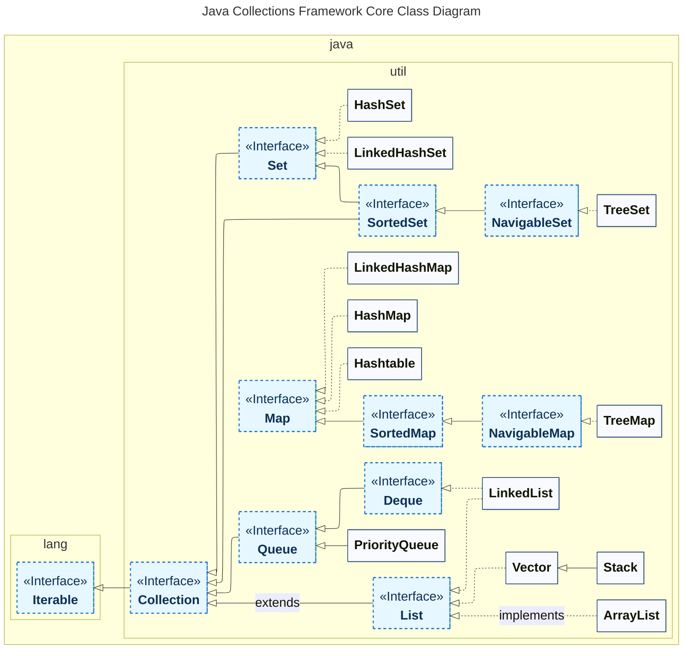
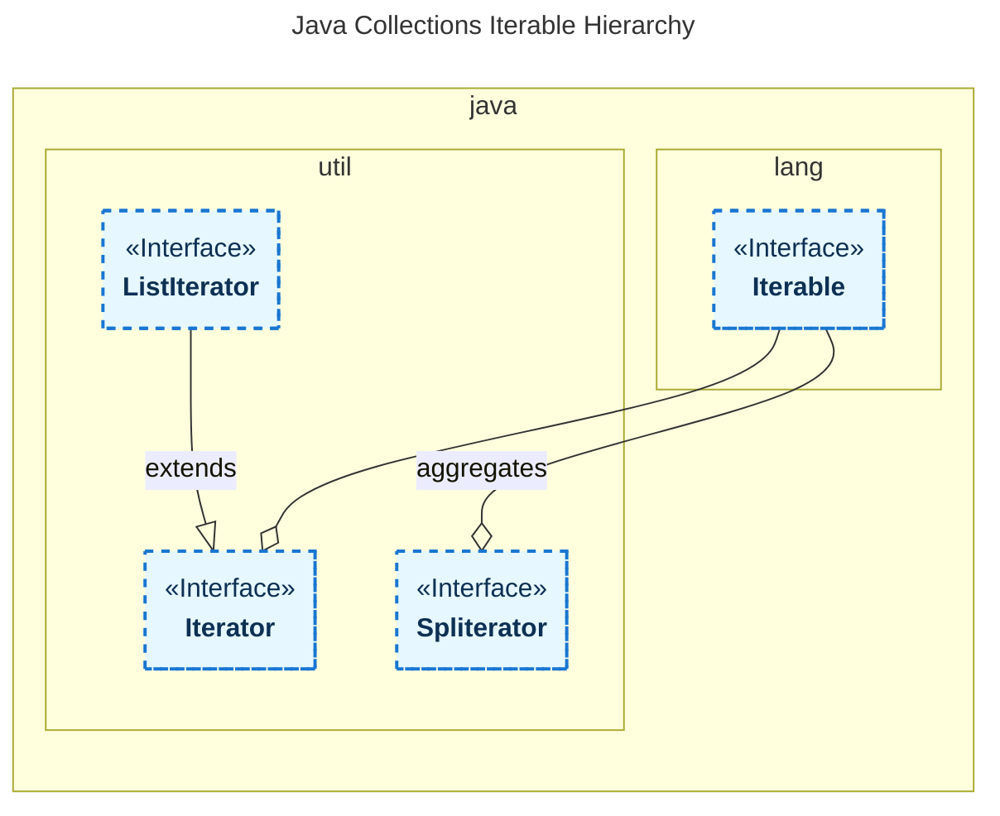

> [!info] `java.util.Collection`

# Структура **Java Collection Framework**
`import java.util.Collection` — **Java Collection Framework**
Java Collection — это фреймворк, который обеспечивает унифицированную архитектуру для управления групповыми структурами данных
- Java Collection Framework включена в JDK
- Java Collection Framework представляет собой иерархию интерфейсов и классов.


    
- `Collection` и `Map` разделают все коллекции, входящие во фреймворк по типу хранения данные: линейные наборы данных и наборы типа ключ-значение (словари).
    
![[attachments/Untitled 12 3.png|Untitled 12 3.png]]
# interface Map
базовые методы для работы с данными вида «ключ — значение». Которые выражены через интефейс `interface Entry<K, V>`
- Основные методы:
    
    ```Java
    V get(Object key);
    V put(K key, V value);
    remove()
    putAll()
    clear()
    keySet()
    values()
    Set<Map.Entry<K, V>> entrySet() //returns set view of the mappings contained in this map
    equals()
    getOrDefault()
    forEach()
    void replaceAll(BiFunction<? super K, ? super V, ? extends V> function) // Replaces each entry's value with the result of invoking the given function
    V putIfAbsent(K key, V value)
    boolean replace(K key, V oldValue, V newValue)
    V replace(K key, V value)
    computeIfAbsent()
    computeIfPresent()
    compute() // Attempts to compute a mapping for the specified key and its current mapped value
    merge()
    of()
    ofEntries()
    entry()
    ```
    
## class HashMap
`extends AbstractMap<K,V>` `implements Map<K,V>, Cloneable, Serializable`
This implementation provides constant-time performance for the basic operations (get and put). It is unsynchronized and permits nulls.
- операции поиска и модификации за константное время, при условии что распределение по бакетам ==**buckets**== близкое к равномерному
- Элементы хранятся в случайном порядке.
- Небезопасная структура для потоков. Можно обернуть в synchronizedMap, чтобы решить проблему.
    - `Map m = Collections.synchronizedMap(new HashMap(...));`
- Производительность зависит от ==**initial capacity**== и ==**load factor**==
    - конуструктор `HashMap(int initialCapacity, float loadFactor)`
        - `loadFactor` — показатель сколько должно быть элементов, прежде чем размер (capacity) увеличится.
            - По-умолчанию = `0,75`
        - Когда **==количество Entry<K, V>-объектов==** в превышает произведение **==load factor== * ==capacity==**, хэш-таблица повторно хэшируется, так чтобы в хэш-таблице стало примерно в два раза больше сегментов
            - `] ( count(Entry<K, V>) > (loadFactor * currentCapacity) ) ⇒ reahash(~capacity*2)`
- В основе структуры лежит массив, поделенный на ячейки — ==**buckets**==
    - **Как происходит добавление** ==**Entry<K, V>-объекта**==
        1. Берем хэшкод ключа объекта Entry `int K.hashCode()`;
        2. По хэшкоду берем хэш при помощи `int HashMap.`**`hash(Object key)`** .
            - Это нужно для более равномерного распределения по бакетам
            - Если `(key==null)`, то вручную возвращаем `0`. Таким образом объекты с null ключом гарантировано попадают в бакет # 0;
        3. Вычисляем индекс бакета по хэшу. Для этого берем значение хэш и делаем логическое И с (количество бакетов - 1). Это необходимо чтобы энтри попал в один из бакетов, даже если значение хеша больше, чем количество бакетов
            1. если в бакете пусто, кладет туда ==**Entry<K, V>**==
            2. если в бакете до 8 елементов, они структурируются в **==LinkedList<Entry<K, V>>==**
                1. c 8 элемента коллекция в бакете преобразуется в КЧ-дерево.
    - Как происходит поиск по ключу
        1. вычисляем индекс бакета, в котором элемент может содержаться. Берем хешкод ключа, пропускаем через int HashMap.hash(Object key), применяем лоигческое и к значению хэша И количество индексов бакетов. После
            1. ?если в бакете пусто - возвращаем null?
            2. если в бакете список или дерево, рекурсивно обходим, на каждом шаге выполняем сравнение: hashCode(). Если hashCode() совпал, тогда сравниваем ключи по equals(). Возвращаем результат. Если в бакете 1 элемент - проводим такое же сравнение.
### HashMap vs Hashtable?
- Hashtable — потокобезопасный, а HashMap нет.
## class LinkedHashMap
`extends HashMap<K,V>` `implements Map<K,V>`
LinkedHashMap provides constant-time performance for the basic operations (add, contains and remove), assuming the hash function disperses elements properly among the buckets.
- элементы хранятся в порядке добавления.
- операции поиска и модификации за константное время
## interface SortedMap
`extends Map<K,V>`
В интерфейсе появился компаратор
```Java
Comparator<? super K> comparator();
```
## interface NavigableMap
`extends SortedMap<K,V>`
Появились методы работы с последовательностью
```Java
lowerEntry()
lowerKey()
floorEntry()
floorKey()
ceilingEntry()
ceilingKey()
higherEntry()
higherKey()
firstEntry()
lastEntry()
pollFirstEntry()
pollLastEntry()
descendingMap()
navigableKeySet()
descendingKeySet()
subMap()
headMap()
tailMap()
subMap()
headMap()
tailMap()
```
## class TreeMap
`extends AbstractMap<K,V>` `implements NavigableMap<K,V>, Cloneable, Serializable`
Основные операции (containsKey(), get(), put() and remove()) работают за логарифмическое время. Algorithms are adaptations of those in _**Cormen**_, Leiserson, and Rivest's Introduction to Algorithms.
Элементы хранятся в заданном порядке. Должны быть `Comparable`, либо `Comparator`.
## class Hashtable
`extends Dictionary<K,V>` `implements Map<K,V>, Cloneable, Serializable`
Has two parameters that affect its performance: `**initialCapacity**` and `**loadFactor**`
Load factor (.75) offers a good tradeoff between time and space costs. Higher values decrease the space overhead but increase the time cost to look up an entry.
The initial capacity controls a tradeoff between wasted space and the need for rehash operations, which are time-consuming.
```Java
Hashtable()
Hashtable(int initialCapacity, float loadFactor)
```
# interface Collection
`extends Iterable<E>` `import java.util.Collection`
Корневой интерфейс для последовательных коллекций
- Включает методы
    
    ```Java
    boolean add(E e)
    boolean addAll(Collection c) // добавить к одной коллекции другую
    void clear()
    boolean contains(Object e)
    boolean containsAll(Collection c) // одна коллекция содержит другую
    boolean equals(Object o)
    int hashCode()
    boolean isEmpty()
    Iterator iterator()
    Stream parallelStream()
    boolean remove(Object e)
    boolean removeAll(Collection c) // удалить ий одной коллелкции другую
    boolean removeIf(Predicate filter)
    boolean retainAll(Collection c) // оставить только общие элементы
    int size()
    Stream stream()
    Spliterator spliterator()
    Object[] toArray()
    t[] toArray(T[] a) //Convert collection into an array
    // code example
    Collection<String> stringCollection = new ArrayList<>();
    stringCollection.add("hello");
    stringCollection.add("world");
    System.out.println("Number of elements: " + stringCollection.size());
    ```
    
## interface List
`interface List<E> extends Collection<E>`
Упорядоченная коллекция элементов.
**У всех элементов коллекции есть индекс.** Поэтому добавились, которые позволяеют обращаться через индекс элемента
```Java
Object set(int index, Object o)
Object get(int index)
List sublist(int fromIndex, int toIndex)
void add(int index, Object e)
Boolean addAll(int index, Collection c)
Object getIndex(int index)
Object remove(int index)
ListIterator listIterator()
```
### class LinkedList
`extends AbstractSequentialList<E>` `implements List<E>, Deque<E>, Cloneable, Serializable`
Основан на двунаправленном связном списке. Поэтому добавление, удаление происходит за константу, а поиск за линейное время. Так как связный список состоит из сущности с полями: значение, ссылка на след сущность. Позволяет хранить фрагментированные данные.
### class ArrayList
`extends AbstractList<E>` `implements List<E>, RandomAccess, Cloneable, Serializable`
Основан на массиве. Хорошо, то что константное время поиска. Плохо, что при заполнении массива, создается новый в полтора раза больше. Объект массива храниться в памяти единым блоком. Поэтому плохой вариант, для ситуации с дефицитом памяти.

|                | Поиск   | Добавление | Удаление |
| -------------- | ------- | ---------- | -------- |
| **LinkedList** | O(n)    | O(1) ✔️    | O(1) ✔️  |
| **ArrayList**  | O(1) ✔️ | O(n)       | O(n)     |
### class Vector (deprecated)
`extends AbstractList` `implements List, RandomAccess, Cloneable, Serializable`
Потокобезопасный ArrayList. Блокировка объекта для других потоков, когда обращение к Vector. Медленее добавление, удаление объектов.
### class Stack (deprecated)
`extends Vector` `java.util.Stack`
Реализация стэка (”стопка бумаг”, модель LIFO). Добавились методы:
```Java
E push(E item) // добваить в верх голову
E peek() // показать верхний элемент, без удаления из стека
E pop() // выдать верхний элемент с удалением из стека
```
Устарел. Рекомендуется использовать **Deque**.
## interface Queue
`extends Collection<E>`
Очередь FIFO
```Java
boolean add(E e);
boolean offer(E e); //добавить элемент, если возможно.
E remove(); // получить элемент из головы и удалить его из очереди
E poll(); // то же что и remove(), только null вместо NoSuchElementException
E element(); // получить эл из головы, но не удалить из очереди
E peek(); // то же что и element(), только null вместо NoSuchElementException
```
### class PriorityQueue
`extends AbstractQueue implements Queue` `implements Serializable`
- позволяет делать сортировку элементов.
    - все элементы должны быть comparable
- добавление, удаление элементов на логарифмическое время (`balanced binary heap`)
- чтение за константу, так как реализация но основе массива
### interface Dequeue
`extends Queue<E>`
Двусторонная очередь, которая позволяет реализовать LIFO и FIFO. Рекомендуется исползовать вместое устаревшего Stack. Добавились методы:
```Java
void addFirst(E e);
void addLast(E e);
boolean offerFirst(E e);
boolean offerLast(E e);
E removeFirst();
E removeLast();
E pollFirst();
E pollLast();
E getFirst();
E getLast();
E peekFirst();
E peekLast();
boolean removeFirstOccurrence(Object o);
boolean removeLastOccurrence(Object o);
Iterator<E> iterator();
Iterator<E> descendingIterator(); // возвращает элементы в порядке от хвоста к голове.
```
### class LinkedList
- [[java.util.Collection]]
    
    ```Java
    Queue<String> que = new LinkedList<>();
    que.offer("first");
    que.offer("second");
    System.out.println(que.peek()); // first
    System.out.println(que.poll()); // first
    System.out.println(que.poll()); // second
    System.out.println(que.poll()); // null
    ```
    
### class ArrayDeque
`extends AbstractCollection<E>` `implements Deque<E>, Cloneable, Serializable`
Реализация двусторонней очереди, основанная на массиве.
- быстрее чем Stack, если используется как LIFO
- быстрее чем LinkedList, если используется как FIFO
## interface Set
`extends Collection<E>`
Неупорядоченное множество элементов. Дубли запрещены. Аналог математического множества. Получать объекты можно только через `**Iterator**`.
```Java
Object[] toArray();
<E> Set<E> of() // Returns an unmodifiable set containing zero elements.
```
### class HashSet
`extends AbstractSet<E>` `implements Set<E>, Cloneable, Serializable`
Основноые операции (add, remove, contains and size) выполняеются за константное время.
  
```Java
static <T> HashSet<T> newHashSet(int numElements)
HashSet(int initialCapacity, float loadFactor)
```
### class LinkedHashSet
`extends HashSet<E>` `implements Set<E>, Cloneable, Serializable`
Множество, в котором сохраняется порядок элементов согласно очередности добавления. Базовый операции выполняются за константное время. (add, contains and remove)
```Java
LinkedHashSet(int initialCapacity, float loadFactor)
```
### interface SortedSet
`extends Set<E>`
Упорядоченной множество элементов. Элементы реализуют интерфейс `Comparable` или указан `Comparator`.
```Java
E first(); // returs highest element in the set
E last(); // returs lowest element in the set
SortedSet<E> subSet(E fromElement, E toElement);
SortedSet<E> headSet(E toElement); // Returns a view of the portion of this set whose elements are greater than or equal to fromElement
SortedSet<E> tailSet(E fromElement);
```
### interface NavigableSet
`extends SortedSet<E>`
Упорядоченное множество с возможностью менять направление сортировки.
```Java
E floor(E e) // returns element >= e
E ceiling(E e) // returns element >  e
E pollFirst() // Retrieves and removes the last (highest) element
E pollLast()
NavigableSet<E> descendingSet() // Returns a reverse order view of this set
Iterator<E> descendingIterator()
```
`descendingSet()` возвращает вид view, т.е. не копию множества, а ссылки на объекты множества в обратном порядке. При изменении элементов вида, меняются элменты множества.
### class TreeSet
`extends AbstractSet<E>` `implements NavigableSet<E>, Cloneable, Serializable`
В основе лежат красночерные деревья ==RBTree==. А значит получаем логарифмическую сложность для основных операций (add, remove and contains).
```Java
@Test
public void whenUsingTailSet_shouldReturnTailSetElements() {
    NavigableSet<Integer> treeSet = new TreeSet<>(Arrays.asList(1,2,3,4,5,6));
    Set<Integer> subSet = treeSet.tailSet(3);
    assertEquals(subSet, treeSet.subSet(3, true, 6, true));
}
```
# Iterator vs ListIterator vs Spliterator

Сравнительная таблица

| Характеристика             | Iterator              | ListIterator                          | Spliterator                         |
| -------------------------- | --------------------- | ------------------------------------- | ----------------------------------- |
| **Направление обхода**     | Вперёд                | Вперёд и назад                        | Вперёд                              |
| **Модификация коллекции**  | Удаление (`remove()`) | Добавление, удаление, замена          | Нет                                 |
| **Работа с индексами**     | Нет                   | Да (`nextIndex()`, `previousIndex()`) | Нет                                 |
| **Параллельная обработка** | Нет                   | Нет                                   | Да (`trySplit()`)                   |
| **Тип коллекций**          | Любые `Iterable`      | Только `List`                         | Любые `Iterable`, массивы, потоки   |
| **Fail‑fast**              | Да (обычно)           | Да (обычно)                           | Да (при изменении источника)        |
| **Основное применение**    | Общий обход коллекций | Детальная работа со списками          | Параллельные потоки, большие данные |
Являются частью любой коллекии


### Iterator

**Назначение**: базовый инструмент для однопроходного обхода любой коллекции (List, Set, Map.values и др.).

**Ключевые методы**:
- `hasNext()` — есть ли следующий элемент;
- `next()` — вернуть следующий элемент;
- `remove()` — удалить текущий элемент (опционально).


**Особенности**:
- **Однонаправленный обход** — только вперёд (`next()`).
- **Минимальные возможности** — чтение и удаление (не всегда поддерживается).
- **Fail‑fast** — вызывает `ConcurrentModificationException` при изменении коллекции во время итерации (если реализация поддерживает).
- **Универсальность** — работает с любой коллекцией, реализующей интерфейс `Iterable`.


**Пример**:
```java
List<String> list = Arrays.asList("a", "b", "c");
Iterator<String> it = list.iterator();
while (it.hasNext()) {
    String item = it.next();
    System.out.println(item);
    // it.remove(); // можно удалить текущий элемент
}
```

### ListIterator


**Назначение**: расширенный итератор для списков (`ArrayList`, `LinkedList` и др.), поддерживающий двунаправленный обход и модификацию.


**Ключевые методы** (дополнительно к `Iterator`):
- `hasPrevious()` — есть ли предыдущий элемент;
- `previous()` — вернуть предыдущий элемент;
- `add(E e)` — вставить элемент перед текущим;
- `set(E e)` — заменить текущий элемент;
- `nextIndex()` / `previousIndex()` — получить индекс текущего положения.


**Особенности**:
- **Двунаправленный обход** — вперёд и назад.
- **Полная модификация** — добавление, удаление, замена элементов во время итерации.
- **Работа с индексами** — можно отслеживать позицию в списке.
- **Только для списков** — не работает с `Set`, `Map` и др.

- **Fail‑fast** — аналогично `Iterator`.


**Пример**:
```java
List<String> list = new ArrayList<>(Arrays.asList("a", "b", "c"));
ListIterator<String> lit = list.listIterator();
while (lit.hasNext()) {
    String item = lit.next();
    if ("b".equals(item)) {
        lit.set("B");  // заменить "b" на "B"
        lit.add("X");  // вставить "X" после "B"
    }
}
// Список станет: ["a", "B", "X", "c"]
```

### Spliterator

**Назначение**: итератор для **параллельной обработки** больших коллекций и потоков (`Stream`). Введён в Java 8.


**Ключевые методы**:
- `tryAdvance(Consumer<? super T> action)` — обработать следующий элемент (если есть);
- `forEachRemaining(Consumer<? super T> action)` — обработать все оставшиеся элементы;
- `trySplit()` — разделить на две части для параллельной обработки;
- `estimateSize()` — оценить количество оставшихся элементов.


**Особенности**:
- **Параллелизм** — поддерживает разбиение (`trySplit()`) для обработки в нескольких потоках.
- **Внутренняя итерация** — управление обходом берёт на себя `Spliterator`, а не вызывающий код.
- **Работа с потоками** — основное применение в `Stream API` (`parallelStream()`).
- **Только чтение** — не поддерживает модификацию коллекции во время обхода.
- **Гибкая оценка размера** — `estimateSize()` может возвращать приблизительное значение.
- **Потокобезопасность** — при корректном использовании может работать в многопоточной среде.


**Пример** (низкоуровневое использование):
```java
List<String> list = Arrays.asList("a", "b", "c", "d");
Spliterator<String> spliterator = list.spliterator();

// Разделить на две части
Spliterator<String> part1 = spliterator.trySplit();
Spliterator<String> part2 = spliterator;

// Обработать части в разных потоках
part1.forEachRemaining(System.out::println);  // "a", "b"
part2.forEachRemaining(System.out::println);  // "c", "d"
```

### Enumeration
Устаревший интерфейс был заменён `Iterator`.

> **Примечание**: В большинстве случаев для обхода коллекций достаточно `for‑each` или `Stream API`, которые внутренне используют `Iterator`/`Spliterator`. Явное применение этих интерфейсов нужно при реализации кастомных коллекций или низкоуровневой оптимизации.