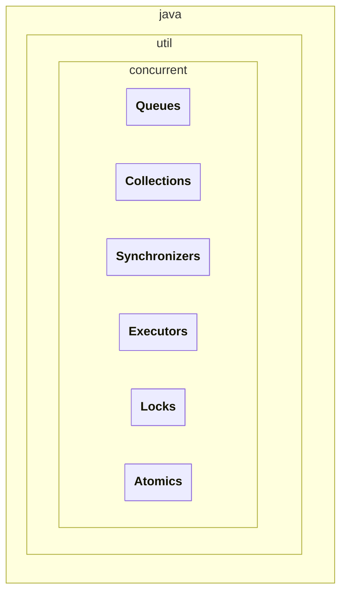
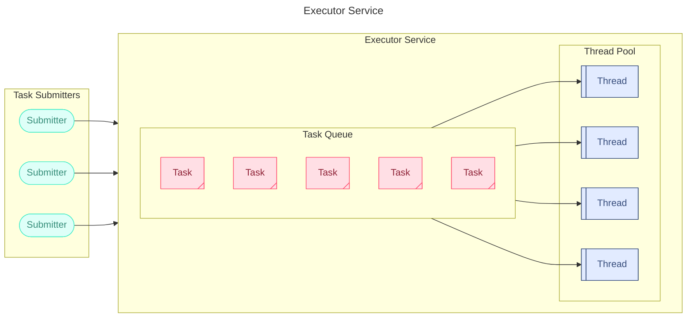

>[!info] `java.util.concurrent`
> _concurrent ≅ параллельный_
# структура пакета



Пакет concurrent включает в себя блоки:
1. **`Collections`** — Набор более эффективно работающих в многопоточной среде коллекций нежели стандартные универсальные коллекции из java.util пакета
2. **`Queues`** — Объекты создания блокирующих и неблокирующих очередей с поддержкой многопоточности.  
3. **`synchronizers`** — Объекты синхронизации, позволяющие разработчику управлять и/или ограничивать работу нескольких потоков.  
4. **`Atomic`** — Набор атомарных классов, позволяющих использовать принцип действия механизма оптимистической блокировки для выполнения атомарных операций.  
5. **`Locks`** — Механизмы синхронизации потоков, альтернативы базовым `synchronized`, `wait`, `notify`, `notifyAll`
6. **`Executors`** — Механизмы создания пулов потоков и планирования работы асинхронных задач

> [!info] Многопоточный пакет util.concurrent  
> Описание многопоточного пакета java.  
> [https://java-online.ru/concurrent.xhtml#collections](https://java-online.ru/concurrent.xhtml#collections)  
# сoncurrent сollections
`java.util.concurrent.*`
Реализация интерфейсов List, Set и Map в Collection Framework стабильно работают только в монопоточном режиме.
Пакет `java.util.concurrent` предлагает свой набор потокобезопасных классов, допускающих одновременное чтение и внесение изменений разными потоками. Итераторы классов данного пакета представляют данные на определенный момент времени и не вызывают исключение `ConcurrentModificationException`. Все операции по изменению коллекции (add, set, remove) приводят к созданию новой копии внутреннего массива. Этим гарантируется, что при проходе итератором по коллекции не будет `ConcurrentModificationException`. Следует помнить, что при копировании массива копируются только ссылки на объекты.
Виды имплементаций `Concurrent Collections` бывают типов
- `**CopyOnWrite***` **— коллекции для интерфейсов Set, List**
- `**Concurrent***` **— коллекции для интерфейсов Queue, Set, Map**
- **`BlockingQueue` — коллекции для интерфейсов Queue**
Пакет содержит классы формирования неблокирующих `Concurrent` и блокирующих `Blocking` очередей для многопоточных приложений. Неблокирующие очереди «заточены» на скорость выполнения, блокирующие очереди приостанавливают потоки при работе с очередью.
![[attachments/Untitled 13 2.png|Untitled 13 2.png]]

## `CopyOnWrite`  — имплементации для Set, List
Этот набор контейнеров базируется что на `Copy-On-Write-алгоритме`. Который обладает следующими особенностями
- при выполнении операций модификации коллекции создается **копия коллекции, которая в последствии заменяет оригинал**
    - операции модификации медленные
- **итератор консистентный**
    - данные в итераторе всегда актуальные
    - операции чтения быстрые
### class CopyOnWriteArrayList
`CopyOnWriteArrayList` реализует алгоритм CopyOnWrite и является потокобезопасным аналогом ArrayList. Класс `CopyOnWriteArrayList` содержит изменяемую ссылку на неизменяемый массив, обеспечивая преимущества потокобезопасности без необходимости использования блокировок. Т.е. при выполнении модифицирующей операции CopyOnWriteArrayList создаёт новую копию списка и гарантирует, что её итераторы вернут состояние списка на момент создания итератора и не вызовут `ConcurrentModificationException`.
### class CopyOnWriteArraySet
`CopyOnWriteArraySet` выполнен на основе CopyOnWriteArrayList с реализацией интерфейса Set.
## `Concurrent` — имплементации для Queue, Set, Map
- При операциях модификации **копия коллекции не создается**
    - Быстрее проходит операции модификации, чем у `CopyOnWrite`, но
- **Слабокосистентный итератор**
    - данные в итераторе могут оказаться неактуальными, а в состоянии на момент создания итерратора. `size()` — может быть неактуальным
    - могут быть неточные данные при чтении
### class ConcurrentLinkedQueue
`extends AbstractQueue` `implements Queue<E>, Serializable`
Размер очереди `ConcurrentLinkedQueue` не имеет ограничений. Имплементация очереди использует **wait-free алгоритм** адаптированный для работы с garbage collector'ом. Данный алгоритм довольно эффективен и очень быстр, т.к. построен на CAS (Compare-And-Swap) операции.
### class ConcurrentHashMap
ConcurrentHashMap<K, V> реализует (implements) интерфейс `java.util.concurrent.ConcurrentMap` и отличается от `HashMap` и `Hashtable` внутренней структурой хранения пар key-value. СoncurrentHashMap использует несколько сегментов, и данный класс можно рассматривать как группу HashMap’ов. По умолчанию количество сегментов равно 16. Доступ к данным определяется по сегментам, а не по объекту. Итераторы данного класса фиксируют структуру данных на момент начала его использования.
### class ConcurrentLinkedDequeue
`ConcurrentLinkedDeque` следует использовать в том случае, если необходимо реализовывать LIFO, поскольку за счет двунаправленности данный класс проигрывает по производительности очереди `ConcurrentLinkedQueue`
### interface ConcurrentNavigableMap
Интерфейс `ConcurrentNavigableMap` расширяет возможности интерфейса `NavigableMap` для использования в многопоточных приложениях; итераторы класса декларируются как потокобезопасные и не вызывают `ConcurrentModificationException`.
### class ConcurrentSkipListMap
`ConcurrentSkipListMap` является аналогом коллекции `TreeMap` с сортировкой данных по ключу и с поддержкой многопоточности.
### class ConcurrentSkipListSet
`ConcurrentSkipListSet` выполнен на основе `ConcurrentSkipListMap` с реализацией интерфейса Set.
## `BlockingQueue` — коллекции интерфейса Queue
- Бывают только блокирующие очереди
- Есть свои методы блокировки и снятия блокировки с коллекции, которые работают быстрее, чем `wait()`, `notify()` — методы класса `Object`.
- `LinkedTransferQueue`
### interface BlockingQueue
`extends Queue<E>`
`import` **`java.util.concurrent`**`.BlockingQueue`
Очередь, которая дополнительно поддерживает операции, ожидающие, пока очередь станет пустой или ожидающие, пока в очереди освободится место для элемента.
### class LinkedBlockingQueue
`extends AbstractQueue<E>` `implements BlockingQueue<E>, java.io.Serializable`
`import` **`java.util.concurrent`**`.LinkedBlockingDeque`
Реализация очереди с блокировками на основе связанных элементов. ФИФО.
### class ArrayBlockingQueue
`extends AbstractQueue<E>` `implements BlockingQueue<E>, Serializable`
`import` **`java.util.concurrent`**`.ArrayBlockingQueue`
FIFO
### class PriorityBlockingQueue
`extends AbstractQueue<E>` `implements BlockingQueue<E>, Serializable`
`import` **`java.util.concurrent`**`.PriorityBlockingQueue`
implementation uses an array-based binary heap
- Добавление, удаление за логарифмическое время, так как реализация основана на куче
- Все элементы comparable
### class DelayQueue
`class DelayQueue<E` **`extends Delayed`**`>` `extends AbstractQueue<E> implements BlockingQueue<E>`
`import` **`java.util.concurrent`**`.DelayQueue`
Очердь в которой можно взаимодействовать с объектами только по истечению периода задарежки, который задат через специальный интерфейс.
`**interface Delayed extends Comparable<Delayed>**`
### class SynchronousQueue
`extends AbstractQueue<E>` `implements BlockingQueue<E>, Serializable`
`import` **`java.util.concurrent`**`.SynchronousQueue`
A blocking queue in which each insert operation must wait for a corresponding remove operation by another thread, and vice versa. A synchronous queue does not have any internal capacity, not even a capacity of one. You cannot peek at a synchronous queue because an element is only present when you try to remove it; you cannot insert an element (using any method) unless another thread is trying to remove it; you cannot iterate as there is nothing to iterate.
### interface BlockingDeque
`extends BlockingQueue<E>, Deque<E>`
`import` **`java.util.concurrent`**`.BlockingDeque`
Двусторонняя очередь, которая дополнительно поддерживает операции, ожидающие, пока очередь не станет непустой или ожидающие, пока в очереди освободится место для элемента.
### class LinkedBlockingDeque
`extends AbstractQueue<E>` `implements BlockingDeque<E>, Serializable`
`import` **`java.util.concurrent`**`.LinkedBlockingDeque`
Двунаправленная очередь с блокировками ожидания пока освободится место в очереди, на основе связанных элементов.
# synchronizers — синхронизаторы
==Мьютекс встроен в класс Object и, следовательно, имеется у каждого объекта==
Пакет `java.util.concurrent` содержит пять объектов синхронизации, позволяющих накладывать определенные условия для синхронизации потоков.
1. **`Semaphore`** «**семафор**»
    
    объект синхронизации, ограничивающий одновременный доступ к общему ресурсу нескольким потокам с помощью счетчика. При запросе разрешения и значении счетчика больше нуля доступ предоставляется, а счетчик уменьшается; в противном случае — доступ запрещается. При освобождении ресурса значение счетчика семафора увеличивается. Количество разрешений семафора определяется в конструкторе. Второй конструктор семаформа включает дополнительный параметр «справедливости», определяющий порядок предоставления разрешения ожидающим доступа потокам. Описание с примером представлено здесь.
    
2. `**CountDownLatch**` «**защелка с обратным отсчетом**»
    
    объект синхронизации потоков, блокирующий один или несколько потоков до тех пор, пока не будут выполнены определенные условия. Количество условий задается счетчиком. При обнулении счетчика, т.е. при выполнении всех условий, блокировки выполняемых потоков будут сняты и они продолжат выполнение кода. Примером CountDownLatch может служить экскурсовод, собирающий группу из заданного количества туристов. Как только группа собрана она отправляется на экскурсию. Необходимо отметить, что счетчик одноразовый и не может быть инициализирован по-новому. Описание с примером представлено здесь
    
3. `**CyclicBarrier**` «**циклический барьер**»
    
    объект синхронизации типа `CyclicBarrier` используется, как правило, в распределённых вычислениях. Барьерная синхронизация останавливает участника (исполняемый поток) в определенном месте в ожидании прихода остальных потоков группы. Как только все потоки достигнут барьера, барьер снимается и выполнение потоков продолжается. Циклический барьер CyclicBarrier, также, как и CountDownLatch, использует счетчик и похож на него. Отличие связано с тем, что «защелку» нельзя использовать повторно после того, как её счётчик обнулится, а барьер можно использовать (в цикле). Описание с примером представлено здесь
    
4. `**Phaser**`
    
    объект синхронизации типа «**Барьер**», но, в отличие от CyclicBarrier, может иметь несколько барьеров (фаз), и количество участников на каждой фазе может быть разным. Описание с примером представлено здесь
    
5. `**Exchanger**`
    
    объект синхронизации, используемый для двустороннего обмена данными между двумя потоками. При обмене данными допускается null значения, что позволяет использовать класс для односторонней передачи объекта или же просто, как синхронизатор двух потоков. Обмен данными выполняется вызовом метода exchange, сопровождаемый самоблокировкой потока. Как только второй поток вызовет метод exchange, то синхронизатор Exchanger выполнит обмен данными между потоками. Описание с примером представлено здесь
    
## class Semaphore
`implements Serializable` `package java.util.concurrent`
основные методы: создать семафор, задать количество одновременных разрешений для потоков, получать разрешения и возвращать их обратно семофору. Конкурирующие потоки будут ожидать, пока число разрешений не станет > 0;
```Java
public void acquire() throws InterruptedException //acquires a permit from this semaphore, blocking until one is available, or the thread is interrupted.
public void release() // releases a permit, returning it to the semaphore.
public Semaphore(int permits)
public Semaphore(int permits, boolean fair) //if fair is true semaphore will guarantee FIFO granting
```
![[attachments/Untitled 5.gif|Untitled 5.gif]]
## class CountDownLatch «защелка с обратным отсчетом»
`import java.util.concurrent.CountDownLatch`
объект синхронизации потоков `CountDownLatch`, блокирующий один или несколько потоков до тех пор, пока не будут выполнены определенные условия. Количество условий задается счетчиком. При обнулении счетчика, т.е. при выполнении всех условий, блокировки выполняемых потоков будут сняты и они продолжат выполнение кода. Примером CountDownLatch может служить экскурсовод, собирающий группу из заданного количества туристов. Как только группа собрана она отправляется на экскурсию. Необходимо отметить, что счетчик одноразовый и не может быть инициализирован по-новому.
![[attachments/Untitled 1 2.gif|Untitled 1 2.gif]]
## class CyclicBarrier
`import java.util.concurrent.CyclicBarrier`
Объект синхронизации `CyclicBarrier` представляет собой барьерную синхронизацию, используемую, как правило, в распределённых вычислениях. Эффективно использование барьеров при циклических расчетах. При барьерной синхронизации алгоритм расчета делят на несколько потоков. С помощью барьера организуют точку сбора частичных результатов вычислений, в которой подводится итог этапа вычислений.
В исходном коде барьер для группы потоков означает, что каждый поток должен остановиться в определенном месте и ожидать прихода остальных потоков группы. Как только все потоки достигнут барьера, их выполнение продолжится.
![[attachments/Untitled 2 2.gif|Untitled 2 2.gif]]
## class Phaser
`import java.util.concurrent.Phaser`
Параллельный алгоритм делится на фазы синхронизации. Каждая фаза представляет собой циклический барьер
- Phaser может иметь несколько фаз (барьеров). Если количество фаз равно 1, то плавно переходим к `CyclicBarrier` (осталось только все исполнительные потоки остановить у барьера).
- Каждая фаза (цикл синхронизации) имеет свой номер.
- Количество участников-потоков для каждой фазы жестко не задано и может меняться. Исполнительный поток может регистрироваться в качестве участника и отменять свое участие;
- Исполнительный поток не обязан ожидать, пока все остальные участники соберутся у барьера. Достаточно только сообщить о своем прибытии
![[attachments/Untitled 3 2.gif|Untitled 3 2.gif]]
## class Exchanger
`import java.util.concurrent.Exchanger`
Класс Exchanger (обменник) предназначен для упрощения процесса обмена данными между двумя потоками исполнения. Принцип действия класса Exchanger связан с ожиданием того, что два отдельных потока должны вызвать его метод `**exchange()**`. Как только это произойдет, _Exchanger_ произведет обмен данными, предоставляемыми обоими потоками.
![[attachments/Untitled 4 2.gif|Untitled 4 2.gif]]
# atomic — атомарные классы
`java.util.concurrent.atomic`
Пакет включает атомарные классы поддерживающие выполнение атомарных операций.
Операция является **`атомарной`**, если её можно безопасно выполнять при параллельных вычислениях в нескольких потоках, не используя при этом ни блокировок, ни синхронизацию synchronized.
Атомарный класс включает метод `**compareAndSet**`, реализующий механизм оптимистичной блокировки и позволяющий изменить значение только в том случае, если оно равно ожидаемому значению. Т.е. если значение атомарного класса было изменено в другом потоке, то оно не будет равно ожидаемому значению, и метод compareAndSet не позволит изменить значение.
Ряд архитектур процессоров имеют инструкцию **`Compare-And-Swap (CAS)`**, которая реализует операцию `**compareAndSet**`. Таким образом, на уровне инструкций процессора имеется поддержка необходимой атомарной операции. В архитектурах процессоров, где инструкция не поддерживается, операции реализованы иными низкоуровневыми средствами.
Пакет включает классы `AtomicBoolean`, `AtomicInteger`, `AtomicIntegerArray`, `AtomicIntegerFieldUpdater`, `AtomicLong`, `AtomicLongArray`, `AtomicLongFieldUpdater`, `AtomicMarkableReference`, `AtomicReference`, `AtomicReferenceArray`, `AtomicReferenceFieldUpdater`, `AtomicStampedReference`, `DoubleAccumulator`, `DoubleAdder`, `LongAccumulator`, `LongAdder`, `Striped64`
```Java
public final boolean compareAndSet(int expectedValue, int newValue)
```
Основные классы
|   |   |
|---|---|
|AtomicBoolean  <br>AtomicInteger  <br>AtomicLong  <br>AtomicReference|Atomic-классы для boolean, integer, long и ссылок на объекты.  <br>Классы этой группы содержат метод compareAndSet.  <br>Кроме этого, классы имеют метод getAndSet, который безусловно устанавливает новое значение и возвращает старое.  <br>Классы AtomicInteger и AtomicLong имеют также методы инкремента/декремента/добавления нового значения.|
|AtomicIntegerArray  <br>AtomicLongArray  <br>AtomicReferenceArray|Atomic-классы для массивов.  <br>Элементы массивов могут быть изменены атомарно.|
|AtomicIntegerFieldUpdater  <br>AtomicLongFieldUpdater  <br>AtomicReferenceFieldUpdater|Atomic-классы для **обновления полей по их именам** с использованием reflection.  <br>Смещения полей для CAS операций определяется в конструкторе и кэшируются. Сильного падения производительности из-за reflection не наблюдается.|
|AtomicStampedReference  <br>AtomicMarkableReference|Atomic-классы для реализации некоторых алгоритмов.|
## class AtomicInteger
`extends Number` `implements java.io.Serializable`
`java.util.concurrent.atomic.AtomicInteger`
```Java
AtomicInteger atomicInt = new AtomicInteger(0);
ExecutorService executor = Executors.newFixedThreadPool(6);
IntStream.range(0, 10).forEach(i -> executor.submit(
        ()->{
                System.out.println(atomicInt.getAndSet(atomicInt.get()+10));
            }
        )
);
executor.close();
System.out.printf("======%n%s",atomicInt.get());
```
## class LongAdder
```Java
ExecutorService executor = Executors.newFixedThreadPool(4);
LongAdder adder = new LongAdder();
IntStream.range(0, 5)
        .forEach(i -> executor.submit(
                        () -> {
                            adder.increment();
                            System.out.println(adder);
                        }
                )
        );
executor.close();
```
# locks — блокираторы
`import java.util.concurrent.locks`
Блокировка объектами интерфейса `Lock` заменяет использование `synchronized`-блоков, а `Condition` заменят использование — объектные методы монитора `wait(), notify(), notifyAll()`. При этом получаем более высокую гибкость иснстументов управления потоком и, потенциально, более высокую производительнсть.
## interface Lock
Интерфейс `Lock` — это абстракция, допускающая выполнение блокировок, которые реализуются как классы Java, а не как возможность языка (объекта). Это расширяет возможности применения блокировок потока выполнения по сравнению с syncronized-блоками.
```Java
Lock lk = ...;
lk.lock();
try {
   // доступ к защищенному блокировкой ресурсу
} finally {
    // освобождение блокировки
    lk.unlock();
}
```
### class ReentrantLock  
  
«повторно используемая блокировка»
`implements Lock, java.io.Serializable` `import java.util.concurrent.locks.ReentrantLock`
`ReentrantLock` реализует интерфейс `Lock`. Аналогично `synchronized` обеспечивает многопоточность, но имеет дополнительные возможности, связанные с опросом о блокировании (`lock polling`), ожиданием блокирования в течение определенного времени и прерыванием ожидания блокировки.
`ReentrantLock` предлагает более высокую эффективность функционирования в условиях жесткой состязательности. Другими словами, когда несколько потоков пытаются получить доступ к совместно используемому ресурсу, виртуальной машине JVM потребуется меньше времени на установление очередности потоков и больше времени на ее выполнение.
```Java
Lock l = new ReentrantLock();
try {
    l.lockInterruptibly();
    try {
        // работа с защищенным ресурсом
    } finally {
        l.unlock();
    }
} catch (InterruptedException e) {
    System.err.println("Interrupted wait");
}
```
## interface Condition «условие»
`Condition` — интерфейсное условие в сочетании с блокировкой `Lock` позволяет заменить методы монитора/мьютекса (`wait`, `notify` и `notifyAll`) на интерфейсный объект с методами `await(), signal(), signalAll()`
Условие `Condition`, иначе именуемое как очередь условия, предоставляет средство управления для одного потока, чтобы приостановить его выполнение до тех пор, пока он не будет уведомлен другим потоком. Объект `Condition` связывают с блокировкой.
Готовых реализаций нет. Интерфейс реализуется для каждого типа отдельно.
```Java
// Чтобы получить Condition для блокировки Lock используют метод newCondition().
ReentrantLock locker = new ReentrantLock();
Condition condition = locker.newCondition();
//Чтобы перевести поток в ожидание, если определенное условие не выполняется, то используется метод await :
while (условие){
  condition.await();
}
//После завершения всех действий в потоке (при выходе) подается сигнал об изменении условия другим потокам :
condition.signalAll();
```
## Interface ReadWriteLock  
«блокировка чтения-записи»  
`ReadWriteLock` — интерфейс создания read/write блокировок, который реализует один единственный класс `ReentrantReadWriteLock`. Интерфейс подразумевает, что мы разделить блокировку чтения и блокировку записи ресурса, что позволит блокировать доступ не к ресурсу к опреации над ресурсом.
### class ReentrantReadWriteLock  
«повторно используемая блокировка чтения-записи»  
Блокировку чтение-запись следует использовать при длительных и частых операциях чтения и редких операциях записи. Тогда при доступе к защищенному ресурсу используются разные методы блокировки, как показано ниже
```Java
ReadWriteLock rwl = new ReentrantReadWriteLock();
Lock  readLock    = rwl.readLock();
Lock  writeLock   = rwl.writeLock();
```
## class LockSupport
`java.util.concurrent.locks`
Basic thread blocking primitives for creating locks and other synchronization classes. Класс который позволяет манипулировать потоками при помощи методов `park()`, `unpark()`
Без конструктора. Все методы — `static`.
```Java
static Object getBlocker(Thread t) //Returns the blocker object supplied to the most recent invocation of a park method that has not yet unblocked, or null if not blocked.
static void park() //Disables the current thread for thread scheduling purposes unless the permit is available.
static void park(Object blocker) //Disables the current thread for thread scheduling purposes unless the permit is available.
static void parkNanos(long nanos) //Disables the current thread for thread scheduling purposes, for up to the specified waiting time, unless the permit is available.
static void parkNanos(Object blocker, long nanos) //Disables the current thread for thread scheduling purposes, for up to the specified waiting time, unless the permit is available.
static void parkUntil(long deadline) //Disables the current thread for thread scheduling purposes, until the specified deadline, unless the permit is available.
static void parkUntil(Object blocker, long deadline) //Disables the current thread for thread scheduling purposes, until the specified deadline, unless the permit is available.
static void unpark(Thread thread) //Makes available the permit for the given thread, if it was not already available.
```
# executors «сервисы исполнения»
### ThreadPool — пулы потоков
Модель пула потоков помогает нам экономить ресурсы в многопоточных приложениях так как чем больше потоков генерируется, тем меньше времени каждый поток тратит на работу.



Пул потоков служит для
- контроля количества созданных потоков
- жизненный цикла потока
- планирования выполнения задачи и сохранения предстоящих заданий в очереди.
### interface Future
`import java.util.concurrent.Future`
Интерфейс `Future` служит для получения результат асинхронного вычисления. Предусмотрены методы для проверки того, завершено ли вычисление, ожидания завершения и получения результата вычислений.
```Java
boolean cancel(boolean mayInterruptIfRunning) // отменить выполнение
Throwable exceptionNow() // Returns the exception thrown by the task
V get() // Returns the computed result
V get(long timeout, TimeUnit unit)
boolean isCancelled();
boolean isDone();
V resultNow() // Returns the computed result, without waiting. для случаем когда мы заведомо знаем, что задание было выполнено
State state() // ENUM текущего состояния выполенния
```
### interface Callable
`import java.util.concurrent.Callable`
Функциональный интерфес служит для описания задания, которое возвращает результат.
```Java
public interface Callable<V> {
    /**
     * Computes a result, or throws an exception if unable to do so.
     * @return computed result
     * @throws Exception if unable to compute a result
     */
    V call() throws Exception;
}
```
### interface Runnable
`import java.lang.Future` `@FunctionalInterface`
Функциональный интерфес который позволяет выполнять процедуру без параметров
```Java
@FunctionalInterface
public interface Runnable {
    /**
     * Runs this operation.
     */
    void run();
}
```
## class Executors
`import java.util.concurrent.Executors`
Представляют собой набор public static методов для создания пулов потока типов `ExecutorService` либо `ScheduledExecutorService`.
class Executors так же содержит методы для создания и выполнения заданий потока типа Callable и фабрику потоков выполнения.
Все методы класса Executors **public static**.
```Java
ExecutorService newCachedThreadPool()
ExecutorService newCachedThreadPool(ThreadFactory threadFactory)
ExecutorService newFixedThreadPool(int nThreads)
ExecutorService newFixedThreadPool(int nThreads, ThreadFactory threadFactory)
ExecutorService newSingleThreadExecutor()
ExecutorService newSingleThreadExecutor(ThreadFactory threadFactory)
ExecutorService newThreadPerTaskExecutor(ThreadFactory threadFactory)
ExecutorService newVirtualThreadPerTaskExecutor()
ExecutorService newWorkStealingPool()
ExecutorService newWorkStealingPool(int parallelism)
ExecutorService unconfigurableExecutorService(ExecutorService executor)
ScheduledExecutorService newScheduledThreadPool(int corePoolSize)
ScheduledExecutorService newScheduledThreadPool(int corePoolSize, ThreadFactory threadFactory)
ScheduledExecutorService newSingleThreadScheduledExecutor()
ScheduledExecutorService newSingleThreadScheduledExecutor(ThreadFactory threadFactory)
ScheduledExecutorService unconfigurableScheduledExecutorService(ScheduledExecutorService executor)
Callable callable(Runnable task) // выполняет Runnable-задания и возвращает результат
ThreadFactory defaultThreadFactory() //
/*
This class supports the following kinds of methods:
- Methods that create and return an ExecutorService set up with commonly useful configuration settings.
- Methods that create and return a ScheduledExecutorService set up with commonly useful configuration settings.
- Methods that create and return a "wrapped" ExecutorService, that disables reconfiguration by making implementation-specific methods inaccessible.
- Methods that create and return a ThreadFactory that sets newly created threads to a known state.
- Methods that create and return a Callable out of other closure-like forms, so they can be used in execution methods requiring Callable.
*/
```
### `Executors.newSingleThreadExecutor()`
метод класса Executors, который позволяет запустить выполнение в один поток.
```Plain
Executor executor = Executors.newSingleThreadExecutor();
executor.execute(() -> System.out.println("Hello World"));
```
### `Executors.newFixedThreadPool(int n)`
`public statiuc newFixedThreadPool(int nThreads)` создает ThreadPoolExecutor с `corePoolSize` и `maximunPoolSize` равными и `keepAliveTime` равными 0, что означает, что потоки в пуле потоков всегда
```Java
ThreadPoolExecutor executor = (ThreadPoolExecutor) Executors.newFixedThreadPool(2);
executor.submit(() -> {
    Thread.sleep(1000);
    return null;
});
executor.submit(() -> {
    Thread.sleep(1000);
    return null;
});
executor.submit(() -> {
    Thread.sleep(1000);
    return null;
});
```
## interface ExecutorService
`extends Executor, AutoCloseable` `import java.util.concurrent.ExecutorService`
Интерфейс предназначен для запуска потоков и получения результата выполнения метода в потоке.
Метод `submit()` принимает задачу через функциональный интерфейс типа `Runnable` или `Callable`, и возвращает объект типа `Future`
```Java
Future<?> submit(Runnable task);
<T> Future<T> submit(Runnable task, T result);
<T> Future<T> submit(Callable<T> task);
```
Метод `execute()` запускает выполнение потока.
```Java
void execute(Runnable command);
```
Метод `invokeAll()` работает со списками задач с блокировкой потока до завершения всех задач в переданном списке или до истечения заданного времени.
Метод `invokeAny()` блокирует вызывающий поток до завершения любой из переданных задач. Реализация данного интерфейса включает метод `shutdown()`, позволяющий завершить все принятые на исполнение задачи и блокирует поступление новых.
### class ThreadPoolExecutor
`extends AbstractExecutorService` `import java.util.concurrent.ThreadPoolExecutor`
Реализация пула потоков с множеством параметров и хуков для настройки. Параметры конфигурации, которые мы в основном обсуждаем: `corePoolSize`, `MaximumPoolSize`, `keepAliveTime`.
Пул потоков состоит из фиксированного числа основных потоков.
**`corePoolSize`** — общее количество основных потоков, которые необходимо создать и сохранить в пуле  
**`keepAliveTime`** — интервал времени, в течение которого избыточные потоки (то есть созданные экземпляры потоков превышают corePoolSize) существуют в состоянии ожидания
### class ForkJoinPool
`extends AbstractExecutorService` `import java.util.concurrent.ForkJoinPool`
`ForkJoinPool` является основной частью платформы **fork / join**. Это решает общую проблему генерации нескольких задач в рекурсивных алгоритмах. С простым ThreadPoolExecutor вы быстро исчерпаете потоки, потому что для выполнения каждой задачи или подзадачи требуется собственный поток. В каркасе fork / join любая задача может разветвляться на множество подзадач и использовать метод join для ожидания их завершения. Преимущество структуры fork / join заключается в том, что она не создает новые потоки для каждой задачи или подзадачи, а реализует алгоритм кражи работы.
```Java
SimpleClass simpleClass = new SimpleClass();
ForkJoinPool forkJoinPool = new ForkJoinPool();
System.out.println(forkJoinPool.invoke(simpleClass));
```

> [!info] Введение в пул потоков Java - Русские Блоги  
> Введение в пул потоков Java, Русские Блоги, лучший сайт для обмена техническими статьями программиста.  
> [https://russianblogs.com/article/8618542401/](https://russianblogs.com/article/8618542401/)  
## interface ScheduledExecutorService
`extends ExecutorService`
Расширяет `ExecutorService` добавлением периодичности выполнения тасков через возможность запуска заданий по истечению задержки.
### class ScheduledThreadPoolExecutor
`extends ThreadPoolExecutor` `implements ScheduledExecutorService`
Класс реализует интерфейс `ScheduledThreadPoolService`. Расширяет интерфейс несколькими методами связанными с управлением расписанием.