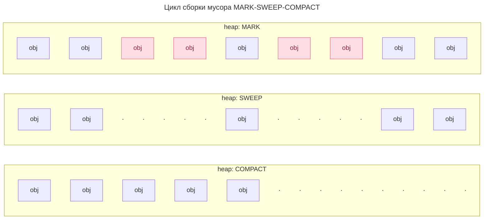
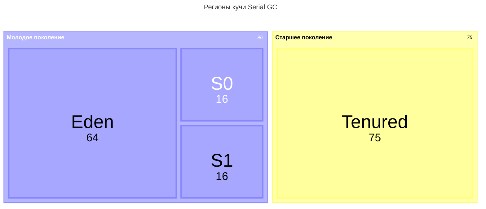
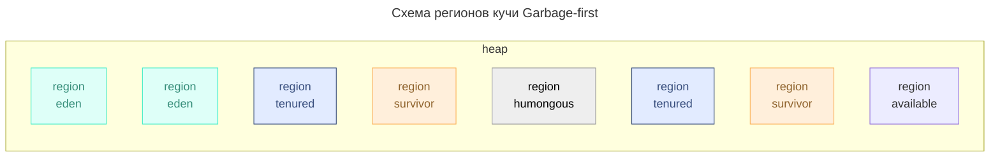

---
aliases:
  - GC
  - сборка мусора
  - Слабая гипотеза о поколениях
---
# сборка мусора

В большинстве случаев в Java мы не удаляем объекты из памяти вручную. Потому что сборка мусора — это автоматизированный процесс.

Все объекты в Runtime можно разделить на
- **живые** – эти объекты, которые используются основными потоками приложения.
- **мертвые** – эти объекты на которые не осталось ссылок из корневых множеств.

Присутствие в Runtime большой теневой службы создает конкуренцию за вычислительные ресурсы. Поэтому столько сколько существуют сборщики мусора, идет работа над их оптимизацией.

Присутствие в Runtime большой теневой службы создает конкуренцию за вычислительные ресурсы. Поэтому столько сколько существуют сборщики мусора, идет работа над их оптимизацией.

В основу одной из первых идей оптимизации работы сборщика легла т.н. слабая гипотеза о поколениях.
## Слабая гипотеза о поколениях

Объекты в runtime можно разделить на категории по их числу и продолжительности жизни:
* **short-lived objects ≡ короткоживущие объекты** 
	* объекты, цикл жизни которых не превышает цикл выполнения 1 метода
	* eg. итераторы, объекты в циклах, переменные методов, боксинг-оболочки
* **medium-lived objects ≡ объекты со средней продолжительностью жизни**
	* объекты, цикл жизни которых от 1 до нескольких циклов выполнения методов
	* eg. объекты сессий, кэш, транспортные объекты
* **long-lived оbjects ≡ долгоживущие объекты**
	* объекты цикл жизни которых стремиться ко времени работы приложения
	* eg. cервисы, cтатические поля классов, константы

Учитывая рассмотренные особенности принято делить объекты на поколения:
* **young generation ≡ молодое поколение**  
	* short-lived
	* medium-lived objects
* **old generation ≡ старшее поколение**
	* long-lived оbjects

Согласно многим исследования абсолютное большинство объектов относят к молодому поколению.

>[!example] слабая гипотеза о поколениях
>Вероятность смерти как функция от возраста снижается очень быстро.
>*молодые объекты «умирают» чаще чем старые* при чем их большинство

Вывод из слабой гипотезы о поколениях в том, что имеет смысл разделить кучу на регионы по поколениям и проводить чистку в регионе молодого поколения чаще чем в регионе старшего.

Отсюда появляется делений циклов сборки
* **minor gc ≡ минорный цикл сборки**
	* Цикл сборки мусора в молодом поколении называется **минорным**
* **major gc ≡ мажорный цикл сборки**
	* Цикл сборки мусора в старом поколении называется **мажорным**. Он случается реже чем мажорный цикл. В общем случае происходит по событию заполнения 
* **full gc ≡ полный цикл сборки**
	* full gc = minor gc + major gc. Обычно инициируется когда сборщик переходит в т.н. failure mode. Например по причине того, что новые объекты создаются быстрее чем он успевает высвобождать данные

Выделение поколений с отдельными циклами сборки мусора привело к необходимости выделить структурировать кучу `heap` на регионы `regions` по их назначению. Модель регионов кучи определяется сборщиком мусора.

Некоторые из моделей регионов так же основываются на слабой гипотезе о поколениях. 
- Пример структуры кучи Parallel GC HotSpot JDK8+
	-  ![[attachments/Untitled 6 2.webp|Untitled 6 2.webp|600]]

## Критерии эффективности сборщика

Типовые метрики, по которым оценивается качество сборщика следующие:

* **`максимальное STW`** — на длительном промежутке работы приложения
* **`throughput` пропускная способность** — это отношение общего времени работы программы к общему времени простоя на длительном промежутке
* **`resources`объем ресурсов** процессорного времени или памяти, потребляемых сборщиком
* **`promptness` период проворства** — время от момента, когда объект стал нам не нужен, до момента его фактического удаления из памяти
	* может иметь значение в ситуациях ограниченной памяти имеет значение
  
>[!warning] Невозможно оптимизировать все критерии сразу
>Поэтому при выборе и настройке сборщика приходится подбирать оптимальное решение для конкретной ситуации
## Цикл сборки мусора
Цикл алгоритма сборки мусора можно поделить на фазы.

В общем случае можно выделить следующие фазы сборки:
1. **MARK** – пометить живые объекты в процессе обхода графа объектов. 
   **\[EVACUATE\]** – эвакуация живых объектов
2. **SWEEP** – «подметать» зачистка мертвых объектов
3. **COMPACT** – дефрагментация объектов в памяти

Цикл сборки

**EVACUATE**
Фаза эвакуации объектов – это процесс, при котором объекты «эвакуируются» из одного региона памяти в другой. Главная цель эвакуации объектов – разделить регионы памяти на содержащий живые и мертвые объекты перед очисткой.

Процесс эвакуации включает следующие шаги:
1. Определение «живых» объектов
2. Перемещение «живые» объектов
3. Обновление ссылок
	* ссылки на эвакуированный объект обновляются, чтобы указывать на новое местоположение объекта в памяти

Фазы сборки мусора могут происходить в конкурентном режиме или в режиме `STW ≡ Stop The World`
* `Concurrent` конкурентный режим означает, что потоки выполнения сборщика происходят параллельно с основными потоками приложения
* Выполнение фазы сборки мусора в `STW` приводит к прерыванию выполнения основных потоков приложения.

>[!info] mutator threads
>Для выполнения операций сборки бывает важно прервать основные потоки приложения, т.к. среди них есть т.н. потоки-мутаторы `mutator threads`. Мутаторы меняют ссылки на объекты. Изменение графа ссылок одновременно со сканированием графа сборщиком мусора может привести к проблеме плавающего мусора либо проблеме коррупции данных.

### GC Roots – корневые множества

GC Roots (корни сборки мусора) — это специальные точки входа, с которых сборщик мусора начинает анализ достижимости объектов.
* Если объект не достижим ни из одного из корней, он является "мусором" и подлежит очистке.

В Java к GC Roots относятся:
1. **Thread Stacks** – Активные потоки выполнения
2. **Статические поля** классов, включая переменные и методы.
3. **JNI ссылки** – объекты, на которые ссылаются нативные методы через Java Native Interface также являются корнями.
4. Мониторы и **объекты синхронизации**
	* `synchronized` блоки
	* объекты в состоянии `wait()` или `notify()`
5. Объекты загруженные через системный класслоадер **Bootstrap ClassLoader**
	* в частности объекты `java.lang` пакета. 
		* к примеру`System.out`, `System.in`, `Runtime.getRuntime()`
6. Специальные объекты JVM, например **String Pool**

## Сравнение сборщиков

JDK 12 поставляет 7 сборщиков на выбор: 
1. `Serial`
2. `Parallel`
3. `Concurrent Mark Sweep` (CMS)
4. `Garbage-First` (G1)
5. `Shenandoah` 
6. `ZGC`
7. `Epsilon`
8. `C4` – Continuously Concurrent Compacting Collector от Azul

Краткое сравнение сборщиков

|                            | Parallel   | G1             | ZGC                        | Shenandoah         | Azul C4               |
| -------------------------- | ---------- | -------------- | -------------------------- | ------------------ | --------------------- |
| Max STW-pause,   ms ~   | 10 000     | 200            | 10                         | 10                 | 5                     |
| Throughput                 | ⭐⭐⭐⭐⭐      | ⭐⭐⭐            | ⭐⭐                         | ⭐⭐                 | ⭐⭐⭐⭐⭐                 |
| Promptness                 | ⭐          | ⭐⭐⭐            | ⭐⭐⭐⭐⭐                      | ⭐⭐⭐⭐⭐              | ⭐⭐⭐⭐⭐                 |
| Max heap, GB               | 10         | 100            | 16 384                     | 16 384             | ∞                     |
| Max CPU load               | Low        | mid            | high   G1 + 20%         | high G1 + 30%   | high G1 + 5%       |
| Max mem load               | mid        | mid            | high   G1 + 30%         | high   G1 + 20% | mid                   |
| Latency guarantee          | нет        | soft real time | near strict   real time | near real time     | strict   real time |
| Java                       | JDK 5+     | JDK 9+         | JDK 11+                    | JDK 12+            | JDK 8+                |
| Memory barriers            | mark phase | write, SATB    | load, store                | read, write        | read, write           |
| Barriers throughput cost ≤ | 3%         | 15%            | 4%                         | 10%                | 8%                    |

## Serial GC
Вышел в JDK 1. Подходит для сборки мусора в монопоточном режиме.

**регионы кучи** 
* эдем `eden` 
* область выживши `Survival 0`, `Survival 1` ≡ From Spaсe, To Space
* `Tenured`

схема регионов

* распределение поколений по регионам на примере Serial GC 
	* ![[6b03a9e6d8174da3a7b228eb9acbe001.png]]

**алгоритм сборки**
* все новые объекты появляются в Эдеме
* при заполнении Эдема происходит `minor gc`, в ходе которой все живые перемещаются всегда в 1 область: S0 или S1
* после некоторого числа перемещений по пространствам выживших объект переходит в старшее поколение и перемещается в Tenured регион
* когда заканчивается место в Tenured запускается `major gc`
* после `major gc` производится дефрагментация региона

**особенности работы**
* минорный и мажорный цикл сборки происходят в `STW` в 1 поток
* большие объекты `объекты-акселераты` создаются сразу в Tenured

**применение**
Oracle рекомендует этот сборщик для одноядерных систем с размером кучи до 100 МБ, когда прерывания работы основных потоков до 10 секунд не являются критическим

## Parallel GC
Параллельный сборщик мусора является адоптированной версией серийного сборщика для многоядерных систем. Сохраняет похожую структуру регионов и идею алгоритма сборки как в серийном.

**регионы кучи**: 
* эдем `eden` 
* область выживши `Survival 0`, `Survival 1`
* `Old Gen`

**особенности работы**
- `minor gc` и `major gc` происходит в **несколько потоков** в `STW` 
- при настройке можно указать целевые показатели максимального STW и пропускной способности, к которым он будет стремиться
	- не стоит задавать оба показателя сразу, т.н. ведет к непредсказуемому поведению
- более короткие `STW` по сравнению с серийным сборщиком в следствии распараллеливания работы
- Для эффективной работы рекомендованный запас свободной памяти составляет 30% памяти кучи. Риск при нехватке - частые Full GC.

**применение**
Многоядерные систем с размером кучи до 4 ГБ, когда прерывания работы основных потоков до 10 секунд не являются критическим
## CMS GC — Concurrent Mark Sweep
Идея алгоритма сборки заложена в названии. Идея в том, чтобы фазы маркировки и удаления мертвых объектов происходили конкурентно с основными потоками приложения.

**региона кучи**: 
* эдем `eden` 
* область выживши `Survival 0`, `Survival 1`
* `Tenured`

**особенности алгоритма**
* В реальности фаза маркировки объектов была поделена на 3 подэтапа, 2 из которых происходят в режиме STW-прерывания.
	* Из-за того, что один из подэтапов маркировки происходит в конкурентом режиме есть шанс, что мусор может быть помечен как живой объект. В спецификации эта аномалия называется плавающим мусором `floating garbage`
* minor gc происходит в несколько потоков в STW
* major gc происходит в несколько потоков в конкурентном режиме, 
	* major gc запускается не по событию заполнения региона, а по периоду и в нем отсутствует фаза дефрагментации объектов региона старшего поколения. 
	* Этот факт в совокупности с наличием плавающего мусора приводит к повышенному потреблению памяти. Oracle рекомендует увеличить размер кучи CMS-сборщика на 20% по сравнению с кучей для Параллельного сборщика.
* *схема*
	* ![[f9fd549a2a104f1eb7acf5098dd0afe8.png]]

**применимость**
В сравнении с Параллельным сборщиком, CMS обеспечивает более короткие управляемые прерывания. Но при этом снижается пропускная способность приложения.

В современном мире CMS имеет смысл использовать для поддержания legacy систем на JDK 8 либо младше.

Проблема плавающего мусора стала одной из причин, по которой на смену CMS пришел Garbage first сборщик. Это случилось в JDK 9. В этой же версии CMS получает в статус Deprecated, а начиная с JDK 14 CMS удален из поставки.
* JEP 363 2019/08/03 Remove the Concurrent Mark Sweep

## G1 GC – Garbage first
Основная идея Garbage First сборщика состоит в том, чтобы постоянно сканировать регионы и за счет знания о регионах эффективно восстанавливать память.

Схема **регионов кучи**
* G1 делит кучу на множество регионов **равного размера** (обычно от 1 до 32 МБ)
* Тип региона может меняться динамически
* Типы регионов могут быть
	* `eden`, `survivor`, `tenured`
	* `humongous` регионы  – для `humongous` объектов размера более 50% размера региона
	* `available` регионы – зарезервированное пространство для будущих аллокаций

*Схема «Пример деления на регионы сборщиком G1»*

Новшеством G1 сборщика становится внедрение т.н. функций-барьеров.
> [!info] Barrier ≡ Барьеры
>Барьеры — это фрагменты кода, которые при помощи JIT-компиляции встраиваются в точку доступа к объекту памяти
>Барьеры выполняются не в выделенных потоках сборщика, в основных потоках приложения, в т.н. потоках-мутаторах

Самый интересный из барьеров G1 называется `Snapshot-At-The-Beginning Barrier` (SATB)
* SATB-барьер активируется если цикл алгоритма сборщика находится в фазе начальной маркировки живых объектов и происходит изменение ссылки на объект мутатором
* SATB-барьер записывает старую ссылку на объект в т.н. SATB-буфер
* Использование SATB-буферов в фазах алгоритма сборщика позволяет решить проблемы плавающего мусора и коррупции данных в условиях полностью конкурентной маркировки объектов

**особенности алгоритма**
- G1 постоянно сканирует регионы в `конкурентном режиме`, знает в каком больше мусора и чистит эти регионы первыми «Garbage First!»
	- ![[attachments/Untitled 10 2.webp|Untitled 10 2.webp|300]]
- `minor gc` происходят параллельно в `STW` но не во всех регионах, а лишь в некоторых что минимизирует продолжительность `STW`
- Основной цикл сборки называется `mixed gc` т.к. включает в себя фазы маркировки живых объектов и фазу очистку областей старого и молодого поколений.
	- Большинство подэтапов смешанного цикла сборки происходит в конкурентном режиме
- алгоритм сборщика предусматривает специальное поведение в отношении `humongous` объектов. Эти объекты не перемещаются между регионами, и в их регион не подселяют другие объекты. Такой подход позволяет экономить ресурсы, но может стать проблемой в ситуации, если в рантайме появляется много больших объектов
- Есть возможность задать целевой показатель максимальной задержки, под который подстроится алгоритм. `Soft real time` гарантия достижимости целевого показателя.
- Для эффективной работы рекомендованный запас свободной памяти составляет 20% регионов. Риск при нехватке - деградация до Serial mode, снижение throughput

**применение**
В итоге Garbage First сборщик обеспечивает низкие STW прерывания на уровне до 200 мс., но при этом снижается пропускная способность алгоритма. Гарантированный throuput приложения с G1 сборщиком всего 90%.

В итоге G1 стал универсальным сборщиком, который используется JVM по-умолчанию начиная с JDK 9
Он подходит для приложений со средним размером кучи, условно от 4 до 100 ГБ
Подходит для приложений, в которых пропускная способность не является критически значимым показателем
## Z GC
Главная идея Z-сборщика в том, чтобы обеспечить алгоритм сборки при котором задержки не будут увеличиваться с ростом кучи и числа объектов.

В итоге он поддерживает приложения с размером кучи размером до 16 ТБ. А эффективная работа сборщика позволяет обеспечить STW паузы на субмиллисекундном уровне
* т.е. продолжительность прерываний основных потоков при нормальной работе сборщика может составлять менее 1 мс. (обычно <1 мс, максимум 10 мс)

**Модель регионов** основывается не на поколениях, а на цветах указателей
* ZGC структурирует кучу на множество регионов одинакового размера. 
* Роль типов регионов выполняют цвета, закодированные в указателе на объект.
	* Цвет указателя объекта определяется комбинацией из 4 битов. Каждый бит цвета отражает свойство объекта, которое учитывается в алгоритме сборки.
* Так как информация о регионе хранится в указателе, при изменении цвета, объект как бы перемещается в другой регион, что снижает нагрузку на эвакуацию и 
* *схема* указателя в памяти ![[7dab152360259f7536af5cd17cc9677f.png]]

**Особенности алгоритма**
* Указатель на объект реализует модель виртуальной адресации. Указатели хранятся в специальных таблицах, в т.н. `Forwarding Table` поэтому 1 объект памяти может иметь несколько адресов. Соответственно объект может единовременно находится в нескольких регионах и участвовать разных фазах сборки.
 * ZGC поддерживает только системы с 64-битной адресацией
	- 44 бита для адресации 16 ТБ
	- 16 бит зарезервировано
	- 4 бита определяют `цвет указателя` – комбинация битов с флагами: 
		- `marked0 0001, marked1 0010, remapped 0100, finalizable 1000`
* Сборщик использует функции-барьеры. Он управляет логикой барьеров и при этом стремится делегировать максимально большую часть работы с объектами основным потокам приложения
	* В частности, эвакуация объектов, происходит исключительно в рамках основных потоков
	* За счет этой особенности сборщика удалось достичь того, что размер и число объектов в куче не влияет на продолжительность задержек
* Цикл сборки представляет собой 7 фаз. Подробно погружаться в него не будем. Стоит упомянуть, что фазы циклов сборки Z коллектора структурированы таким образом, что начальные фазы текущего цикла включают действия финальных фаз прошлого цикла.
	* При этом для того, чтобы различать в какой фазе цикла находится текущий объект используются быты указателя цвета на объект, в частности биты Marked0, Marked1
Из негативных сторон алгоритма можно выделить следующее
* Из-за широкого применения барьеров скорость чтения объектов памяти основными потоками приложения снижается на до 5%
* Для эффективной работы сборщика необходимо поддерживать запас свободной памяти кучи не менее 25% от общего размера кучи Риск при нехватке – рост числа псевдо-STW прерываний.
>[!info] псевдо-STW прерывания
>псевдо-STW (Stop-The-World) паузы — это кратковременные блокировки потоков приложения, которые возникают из-за нехватки свободной памяти в куче. В отличие от обычных STW-пауз они обычно длятся менее 1 мс, но могут участиться при высокой нагрузке.

Фазы алгоритма ZGC
1. Pause Mark Start – поиска живых объектов по `gc roots` c окрашиванием
2. Concurrent Map – продолжается поиск живых объектов, достижимых из найденных корней в конкурентном режиме
3. Pause Mark End – обрабатывает различные специальные кейсы. В частности, soft- и weak-references 
4. Concurrent Prepare for Relocate – создается набор для перемещения `relocation set`, который включает в себя регионы, в которых есть объекты подлежащие эвакуации
5. Pause Relocate Start – составляются соответствие старого и нового адреса перемещенного объекта, таблицы переадресации `forwarding tables`
6. Concurrent Relocate – продолжается предыдущий шаг при помощи барьеров
7. Concurrent Remap – перенаправляет старые указатели на новые. Данный этап совмещен с Concurrent Map следующего цикла сборки.

**Применение** Z сборщика предполагает все кейсы, где строгий SLA по latency либо большой размер кучи. В частности:
* Известно, что многие сервисы Hypixel-сервера (игры Minecraft) используют этот сборщик
* Z сборщик является типовым решением для таких инструментов, как Elastisearch и Kafka

## Shenandoah GC – Шандара
>*Shenandoah ≡ Шанандо ≡ Шандара*

Основная идея Shenandoah сборщика похожа на ZGC. Shenandoah стремиться к тому, чтобы время и количество прерываний не зависело от размера кучи.

![[Pasted image 20250514235845.png]]
production ready с JDK 15, экспериментальных режим с JDK 12.

**схема регионов** Shenandoah
* Shenandoah структурирует кучу на множество регионов одинакового размера
* Тип региона может меняться в райтнайм динамически
* Регионы бывают типов
	* регион живых объектов, не подлежат очистке
	* регион живых объекты и подлежит очистке
	* регион забронирован для перемещения в него выживших
	* humongous регион для больших объектов

>[!info] **метаданные объекта в куче**
>Каждый объект кучи имеет заголовок `header`. Метаструктура полей заголовка может варьироваться в зависимости от типа объекта, но всегда есть обязательные поля:
>1. `MARK WORD` используется при блокировках, хешировании, очистки мусора
>2. `CLASS POINTER` указатель на класс объекта

**особенности алгоритма**
 * При использовании Shenandoah в метаструктуре объекта кучи появляется 3 обязательное поле – `FORWARD POINTER` указатель перенаправления
	 * если указатель перенаправления указывает на себя, значит происходит работа с целевым объектом, если указывает на другой объект, значит надо обновить ссылку и продолжить работу с объектом указанным в FORWARD POINTER
	 * опять же эту работу делает поток-мутатор за счет наличия соответствующего барьера
	 * такой подход позволяет существенно экономить ресурсы при эвакуации объектов т.к. при эвакуации сборщику не нужно перемещать объект, достаточно объявить его копию и переназначить указатель перенаправления
 * сам алгоритм сборки разбит на 8 фаз, большинство из которых происходит в конкурентом режиме. На графике видно, что STW прерывания есть, отмечены красным, но они занимают незначительное время.
 * более сложны Failure Mode, чем у прочих сборщиков
	 * если сборщик перестает справляться с высвобождением памяти для новых объектов, включается Pacing, который притормаживает работу основных потоков приложения
	 * если Paicing-а недостаточно, включается Degenerated GC, когда все фазы работы сборщика происходить в режиме STW
	 * если и этого недостаточно, останавливаются все потоки и происходит полной сборки мусора.
 * фазы алгоритма Shenandoah GC
	1. Init Mark **Инициация маркировки** происходит в ==STW==
	2. Concurrent Marking **Конкурентная маркировка** происходит параллельно
	3. Final Mark **Финальная маркировка** происходит в ==STW==
	4. Concurrent Sweep **Конкурентная очистка**
	5. Concurrent Evacuation **Конкурентная эвакуация**
	6. Init Update Refs **Инициация обновления ссылок** происходит в ==STW==
	7. Concurrent Update Refs **Конкурентное обновление ссылок** происходит параллельно
	8. Final Update Refs **Финальное обновление ссылок** происходит в ==STW==
## Epsilon GC 
Второе название Epsilon сборщика – **No-Op Garbage Collector** так как он не выполняет никаких действий. Можно легко заполнить память и спровоцировать OutOfMemoryError. Преимущество Эпсилон сборщика в том, что он обещает предельно низкие накладные расходы на сборку мусора без снижения пропускной способности приложения.

> [!quote] JEP 318 от 2017/02/14 08:23, JDK 11
Epsilon управляет распределением памяти, но не реализует какой-либо реальный механизм восстановления памяти. Как только доступная куча Java будет исчерпана, JVM завершит работу

Применение этого сборщика довольно широкое
* short-lived приложения
	* тесты
	* CI/CD пайплайны
* бенчмарки, профилирование
	* можем провести замер производительности без потери пропускной способности связанной с работой сборщика
* специальные задачи, когда требуется low-latency приложение с ручным управлением памятью
	* не знаю зачем создавать такое приложение на java, но благодаря Эпсилон сборщику это возможно.

## Azul C4
>**Continuously Concurrent Compacting Collector**

C4 — первый в мире полностью конкурентный сборщик мусора с постоянной компактификацией, разработанный Azul Systems. 
* Это **единственный** GC, который используется в JVM Azul Zing (на момент 2024 года). 
* C4 является частью ядра [[JVM]] Azul Zing.

**назначение**
**Максимальная предсказуемость**, **низкие паузы** при **очень больших кучах** и вы готовы платить
* считается оптимальным размер кучи 100 ГБ .. 10 ТБ

**регионы кучи**
* все регионы фиксированного размера 2 МБ
* Каждый регион содержит:  
	1. Объекты (размером до 2 МБ)
	2. Битмап живых объектов (1 бит на 8 байт = 256 КБ на регион)
	3. Таблица forwarding pointers (для перемещаемых объектов)
* Типы регионов:
	* `Free` — свободны
	* `Live` — содержат живые объекты
	* `Reclaimable` — содержат мертвые объекты, готовы к сборке
	* `Relocating` — объекты в состоянии перемещения

**особенности алгоритма сборки**
- **Маркировка (Marking)**
    - Все корневые ссылки (стеки, статики, [[JDK JVM JLS JNI|JNI]]) обходятся за один короткий STW (< 1 мс).
    - После этого **все последующие ссылки** отслеживаются через **write barrier**.
    - Если поток пишет ссылку на объект — C4 автоматически проверяет, жив ли этот объект. Если нет — ссылка заменяется на **forwarding pointer**.
- **Перемещение (Relocation)**
    - Когда объект становится "мёртвым", он **не удаляется сразу** — он помечается как "relocating".
    - Когда **любой поток** пытается прочитать ссылку на такой объект — C4 **автоматически перемещает его** в свободную область кучи и обновляет указатель (на лету!).
    - Это называется **"on-demand relocation"** — объекты перемещаются **только при обращении**, а не пачками.
* **Компактификация (Compaction)**
	- Поскольку объекты перемещаются **конкурентно и по запросу**, куча **всегда компактна** — никакой фрагментации.

**особенности работы**
* Полностью конкурентный: все фазы GC (mark, relocate, compact) выполняются **одновременно с приложением** — без stop-the-world (STW) пауз дольше **нескольких миллисекунд** (обычно < 10 мс, даже при сотнях ГБ кучи).
* Постоянная компактификация — нет фрагментации, нет Full GC.
* **Read/Write Barriers**
	- **Write barrier**: при записи ссылки — проверка, жив ли целевой объект.
	- **Read barrier**: при чтении ссылки — если она указывает на перемещаемый объект, выполняется **forwarding** (перенаправление) на новое место.
	- Эти барьеры реализованы **на уровне JIT-компилятора и процессора** (x86_64) — очень оптимизированы.
- Виртуальная цветовая адресация, **pointer coloring** 
	* Указатели в C4 — это **64-битные адреса**, но младшие 3–4 бита используются как **флаги состояния**:
		- `000` — обычный живой объект
		- `001` — объект в процессе перемещения
		- `010` — мёртвый объект
		- `1xx` — специальные метаданные

**применение**
* для production только коммерческая лицензия. 
	* для dev можно внедрить бесплатно
* Лидер в сегменте HFT, HL-financial services

1. **Финансовые рынки / HFT (High-Frequency Trading)**
	- **Клиенты**: Goldman Sachs, JPMorgan, Citadel, Virtu Financial
	- **Задача**: Обработка 100K+ сообщений/сек, latency < 100 мкс, **никаких "глюков" из-за GC**
2. **Крупные облачные платформы (SaaS, микросервисы)**
	- **Клиенты**: SAP, Oracle Cloud, Alibaba Cloud
	- **Задача**: Многотенантные JVM с кучами до 500 ГБ, десятки тысяч транзакций в минуту
3. **Игровые серверы и стриминговые платформы**
	- **Клиенты**: Twitch, Roblox, Epic Games
	- **Задача**: 100K+ игроков на одном сервере, минимальные лаги, предсказуемость
	- **Решение**: Zing + C4 вместо G1/ZGC
4. **Медицинские системы (реальное время)**
	- **Клиенты**: GE Healthcare, Siemens Healthineers
	- **Задача**: Обработка данных с MRI/CT в реальном времени, latency < 1 мс
		- MRI/CT – магнитно-резонансная томография / Компьютерная томография
	- **Решение**: Zing + C4 на embedded-платформах

>[!info] Многотенантный (мультиарендный) — архитектурный подход
это архитектурный подход, при котором один экземпляр программного приложения обслуживает множество клиентов (тенантов), каждый из которых работает в своей изолированной среде, но использует общую базу данных, сервер и приложение. Такой подход позволяет клиентам совместно использовать ресурсы, что снижает затраты и упрощает управление

