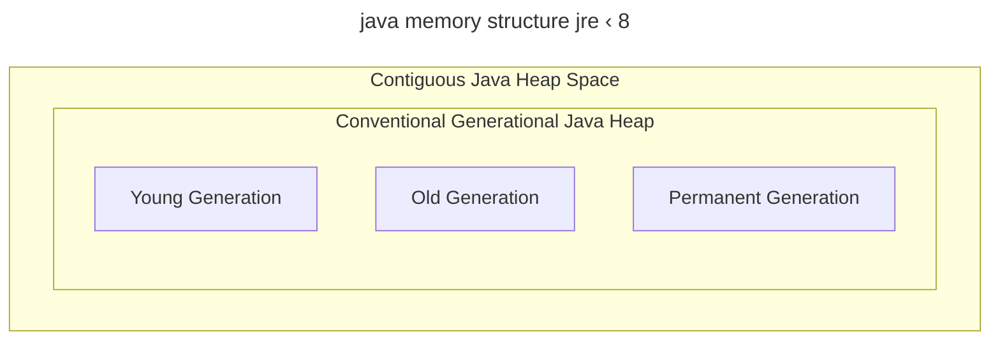
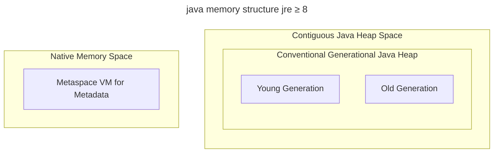

# Java Memory Model
Модель памяти Java (Java Memory Model, JMM) описывает поведение потоков в среде исполнения Java
## Гарантии JMM
### последовательный порядок
Даже при применении реордеринга или распараллеливании операций, результат работы будет не отличим от если бы были выполнены последовательно.
### консистентность значений
Нет взявшихся из ниоткуда значений. Чтение любой переменной выдаст либо значение по умолчанию, либо то, что было записано туда другой командой.
* могут быть исключения с не-volatile long и double, так как невозможно гарантировать атомарное выполнение операций на некоторых процессорах
### отношение порядка happens before
Порядок happens before операций между потоками.

>[!info] happens before — *выполнить прежде* – HB
>отношение ==**строгого частичного порядка**== *happens before* дает разработчику гарантии того, что второй поток будет «в курсе» изменений проведенных первым потоком над разделяемым ресурсом
* отношение `Happens Before` показывает, в каком порядке будут видны действия между потоками. 
* `happens-before` – отношение порядка между атомарными командами
	* оно означает, что вторая команда будет «в курсе» изменения первой команды, и что первая команды выполнилась перед второй.
	* ![[attachments/Untitled 24 2.png|Untitled 24 2.png|300]]

>[!example] JMM: Happens-before: теория
>Пусть есть поток `T1` и поток `T2` и действия `x` и `y`, выполняемые в потоках `T1` и `T2` соответственно. 
>Если `x` *happens-before* `y`, то во время выполнения `y` потоку `T2` будут видны все изменения, выполняемые в `x` тредом `T1`

>[!quote] отношение строгого частичного порядка 
>**бинарное отношение** между элементами множества, определяемое свойствами:
> * Антирефлексивно: ${\displaystyle a\not \prec a}$  
> * Асимметрично: $если\ {\displaystyle a\prec b}, то\ {\displaystyle b\not \prec a}$  
> * Транзитивно: $если\ {\displaystyle a\prec b}\ и\ {\displaystyle b\prec c},\ то\ {\displaystyle a\prec c}$
>[[Формальная логика#Бинарное отношение]] 

https://habr.com/ru/articles/685518/

##### отношение `HB` выполняется для
- cинхронизация и мониторы `volatile`
- запись и чтение
- обслуживание объекта
- обслуживание потока
    - Запуск потока
    - любой код в потоке.
    - Thread `#join()`, `#interrupt()`
>[!info] цикл синхронизация через мониторы
>1. **Захват монитора** (метод `lock`, начало synchronized блока)
>2. Возврат монитора (метод `unlock`, конец synchronized блока)
>3. Захват следующим потоком
# cтруктура JMM
## Heap, Thread Stacks
* JVM делит память на стеки потоков (thread stacks) и кучу (heap) и meta space
	* ![[attachments/Untitled 18 2.png|Untitled 18 2.png|300]]

Каждый поток, работающий в JVM, имеет свой собственный стек. Стек содержит информацию о том, какие методы вызвал поток. Называется **стек потока**. Как только поток выполняет свой код, стек вызовов (потока) меняется.
* Все переменные примитивных типов хранятся в стеках потока. Все объекты ссылочного типа хранятся в **куче**, в то время, как в стеке потока лежит ссылка на объект кучи.
	* ![[attachments/Untitled 19 2.png|Untitled 19 2.png|400]]

Если два потока вызывают метод для одного и того же объекта одновременно, они оба будут иметь доступ к переменным-членам объекта, но каждый поток будет иметь свою собственную копию локальных переменных. Каждый из потоков имеет свою копию локальной переменной со своей ссылкой. Их ссылки являются локальными переменными и поэтому хранятся в стеках потоков. Тем не менее, две разные ссылки указывают на один и тот же объект в куче.
## meta space
Начиная с Java 8, на смену пространству постоянного поколения `PermGen` пришло пространство памяти `MetaSpace`.
Что хранит в себе
1. Метаданные **классов**: список доступных классов, включая имя, родительский класс, интерфейсы, поля и методы.
2. Метаданные **методов**: сигнатуры, модификаторы доступа и другие атрибуты.
3. Метаданные **полей классов**, такие как типы полей и их модификаторы.
4. Информация о доступных **загрузчиках классов**
5. Метаданные **аннотаций**
6. Структуры для поддержки **рефлексии**

аллокация области постоянных объектов в памяти перемещено за пределы кучи

было

стало

  
### аппаратная архитектура памяти и JMM
Каждый процессор содержит набор регистров, которые, по существу, находятся в его памяти. Он может выполнять операции над данными регистрах намного быстрее, чем в над данными, которые находятся в основной памяти компьютера ОЗУ.
> ОЗУ — Оперативное Записывающее Устройство

* Это связано с тем, что процессор может получить доступ к этим регистрам гораздо быстрее.
	* ![[attachments/Untitled 20 2.png|Untitled 20 2.png|400]]
- Процессор (вычислительное ядро) может проводить операции над данными расположенными в
    - регистрах процессора
    - кэш-памяти
    - оперативной памяти
- У каждого вычислительного ядра (процессора) есть собственные регистры памяти и кэш-память. Но, ОЗУ все одна на всю систему.
- В процессе работы данные могут копироваться из ОЗУ в кэш либо в регистры, либо использоваться процессорам напрямую. После обработки данных процессором в кэше или регистрах данные синхронизируются своим оригиналом в ОЗУ
	* Процессор не должен читать/записывать полный кэш каждый раз, когда он обновляется. Обычно кэш обновляется небольшими блоками памяти, называемыми «строками кэша». Одна или несколько строк кэша могут быть считаны в кэш-память, и одна или более строк кэша могут быть сброшены назад в основную память.
- Аппаратная архитектура не различает стеки потоков и кучу. На оборудовании стек потоков и куча (heap) находятся в основной памяти. Части стеков и кучи потоков могут иногда присутствовать в кэшах и внутренних регистрах ЦП
    - ![[attachments/Untitled 21 2.png|Untitled 21 2.png]]

>[!bug] Из-за того что в аппаратной части поток выполнения и данные хранятся смешано, возникает риск ошибок исполнения средки которых

- `visibility` [[Многопоточность#visibility — видимость разделяемых объектов]]
- `race condition` [[Многопоточность#race condition — состояние гонки]]
#### решение проблемы видимости
- Так как один и тот же объект java на уровне архитектуры ЭВМ может находится одновременно как в кэш памяти, так и в ОЗУ возможна ситуация, когда различные потоки выполнения обратятся к разным экземплярам общего ресурса, что повлечет за собой нарушение консистентной данных. 
	- ![[attachments/Untitled 22 2.png|Untitled 22 2.png||400]]

Для того, чтобы исключить такую ситуацию, необходимо объявлять для переменной модификатор `volatile`, который гарантирует, что потоки будут работать с объектом данных в ОЗУ.
#### решение состояния гонки
- В ситуации когда 2 потока выполняемые разными ядрами обращаются к одному и тому же объекту через кэш-память либо через регистры, при обратной синхронизации данных из памяти процессора в ОЗУ результат вычисления может быть потерян из-за отсутствия синхронизации.
	- ![[attachments/Untitled 23 2.png|Untitled 23 2.png|400]]

Для того, чтобы исключить такую ситуацию можно
1. Критический сегмент кода необходимо закрыть модификатором `synchronized`, который гарантирует что только 1 поток единовременно будет выполнять данную операцию.
	- Синхронизированные блоки гарантируют, что все переменные внутри синхронизированного блока, будут считаны из основной памяти, и когда поток выйдет из синхронизированного блока, все обновленные переменные будут снова сброшены в основную память.
2. Другой сценарий решения проблемы — объявить разделяемый ресурс `Atomic*`-типом и выполнять операции над объектом через атомарные операции, которые используют механизм записи аналогичный Compare-and-Swap инструкцию процессора
## анализ памяти
Способы анализа состояния памяти Java можно разделить на внутренние и внешние инструменты.
- **Внутренние**: сбор метрик, акутаторы, чтение мета-информации о бинах
- **Внешние**:
	- входящие в поставку JVM HotSpot утилиты 
		+ VisualVM (с плагином VisualGC)
		+ Java Mission Control
	- JProfiler
	- YourKit
	- различные инструменты/плагины для IDE
>[!danger] калиборовка инструмента
>Каждый инструмент мониторинга стоит калибровать т.к. его наличие влияет на память. Например стоит подключиться к неработающему приложению и помониторить что будет происходит с кучей, чтобы в последствии учиывать погрешность анализа, либо выбрать иной инструмент. 
## настройка кучи в jvm
>[!example] настройка кучи jvm
`-Xms`, `-Xmx` – установка начального и максимального **размера кучи**
`-Xmn` – установка размера **молодого поколения**
`-XX:PermGen`, `-XX:MaxPermGen` – установка начального и максимального размера **постоянного поколения**
`java -XX:+UseParallelGC -Xms256m -Xmx2048m -Xmn1024m -XX:PermGen512m -XX:MaxPermGen1024m -jar my-application.jar  `

 >каждый сборщик мусора умеет запрашивать у ОС дополнительное место и возвращать его, при необходимости. Регулируется флагами `-Xms` и `-Xmx`
