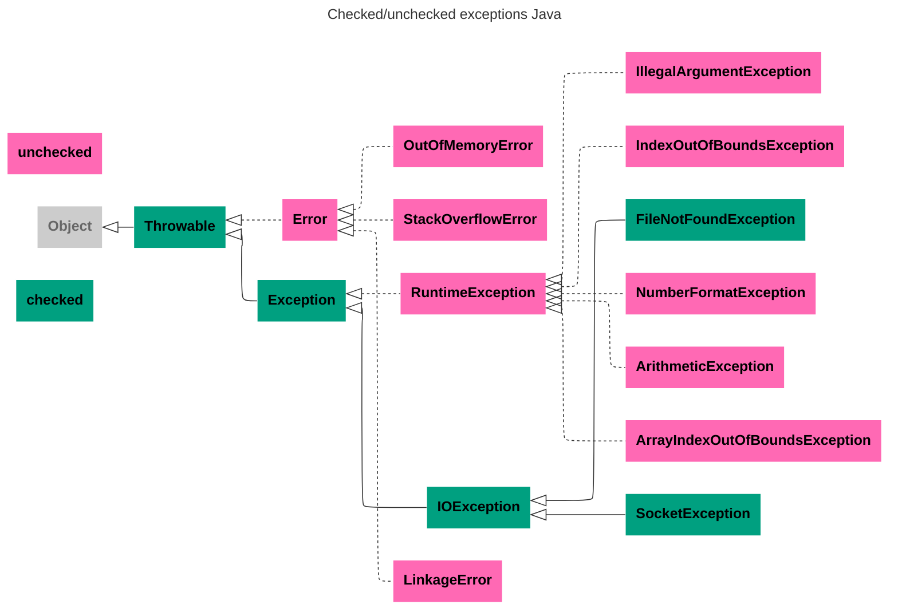

---
aliases:
  - исключения
  - иерархия исключений
  - exceptions
  - try
  - catch
  - error
  - Exception
  - Suppressed Exception
  - StackTrace
---
# Иерархия исключений

Исключения бывают проверяемые и непроверяемые



# class Throwable
`implements Serializable` `java.lang.Throwable`
в `throw, catch` и `throws` могут стоять исключительно Throwable или его наследники. Это «право» находиться в throw, catch и throws никак не отражено в исходном коде.
# checked exceptions — проверяемые
- **проверяемые исключения** это, те, которые можно обработать, Например
    - `IOException` — ввод некорректных данных
    - `FileNotFoundException`
    - `SocketException`
- **yпроверяемые исключения** должны быть явно пойманы в теле метода или объявлены в секции **`throws`** метода
# unchecked exceptions — непроверяемые
Unchecked exceptions can be thrown "at any time" (i.e. run-time). Therefore, methods don't have to explicitly catch or throw unchecked exceptions.
**непроверяемые исключения** вызваны проблемами, которые не могут быть обработаны и обращены. Например «Закончилась память» `OutOfMemoryError`. Мы не можем увеличить объем памяти в JVM. Это необратимое событие.
- `RuntimeException` — базовый класс ошибок, которые возникают во время работы многих методов:
    - `ArythmeticException`, `IndexOutOfBoundsException`, `IllegalArgumentException`, `NumberFormatException`, etc.
- `Error` - базовый класс для непроверяемых событий, которые происходят во внешней среде
    - `java.lang.StackOverflowError` — в стеке вызовов потока хранится больше информации, чем выделено под это памяти
    - `OutOfMemoryError`
    - `java.lang.`**`Link`**`ageError` — возникает, как проблема связывания, как правило на уровне ClassLoader-а. Когда в системе несколько версий одного класса или несколько ClassLoader-ов
# Правила выбрасывания исключений `throw`
1. В сигнатуре метода надо указывать только `checked`-типы выбрасываемых исключений
    1. допускается `throws` нескольких типов перечислением через запиятую
2. Пессимистичный механизм
    1. Для всех проверяемых `checked` исключений надо предупреждать `throws` в сигнатуре о возможном исключении. Можно предупреждать о более высоком (родительском) исключении, чем выбрасываем, и даже о том, чего нет. Но не предупреждать, либо предупреждать о меньшем — недопустимо.
3. **Overriding перегрузка методов throws** возможна только путем уточнения более к нижними типами выбрасываемых исключений, но не вверх к общим типам. Так как нижние методы не смогут обработать более общие исключения, чем были заявлены изначально.
4. Свойство `checked` / `unchecked` для пользовательских типов наследуются от родителя.
    1. Обычно наследуются от типов `Throwable`, `Error`, `Exception`, `RuntimeException`
## Конструирование исключений
`try` – определяет блок кода, в котором может произойти исключение;  
`catch` – определяет блок кода, в котором происходит обработка исключения;  
`finally` – определяет блок кода, который является необязательным, но при его наличии выполняется в любом случае независимо от результатов выполнения блока try.  
`throw` – используется для возбуждения исключения;  
`throws` – используется в сигнатуре методов для предупреждения, о том что метод может выбросить исключение.
```Java
public String input() throws MyException {
// предупреждаем с помощью throws,
// что метод может выбросить исключение MyException
      BufferedReader reader = new BufferedReader(new InputStreamReader(System.in));
    String s = null;
//в блок try заключаем код, в котором может произойти исключение, в данном
// случае компилятор нам подсказывает, что метод readLine() класса
// BufferedReader может выбросить исключение ввода/вывода
    try {
        s = reader.readLine();
// в блок  catch заключаем код по обработке исключения IOException
    } catch (IOException e) {
        System.out.println(e.getMessage());
// в блоке finally закрываем поток чтения
    } finally {
// при закрытии потока тоже возможно исключение, например, если он не был открыт, поэтому “оборачиваем” код в блок try
        try {
            reader.close();
// пишем обработку исключения при закрытии потока чтения
        } catch (IOException e) {
            System.out.println(e.getMessage());
        }
    }
    if (s.equals("")) {
// мы решили, что пустая строка может нарушить в дальнейшем работу нашей программы, например, на результате этого метода нам надо вызывать метод substring(1,2), поэтому мы вынуждены прервать выполнение программы с генерацией своего типа исключения MyException с помощью throw
        throw new MyException("String can not be empty!");
    }
    return s;
}
```
# Exception StackTrace
`StackTrace` — инструмент отладки. Показывает стек вызовов (то есть стек функций, которые были вызваны до возникновения исключения
```Java
Exception in thread "main" java.lang.NullPointerException
  at com.example.myproject.Book.getTitle(Book.java:16)
  at com.example.myproject.Author.getBookTitles(Author.java:25)
  at com.example.myproject.Bootstrap.main(Bootstrap.java:14)
  ...
```

# try-with-resources:

Порядок обработки в try-with-resources:
1. **Выполняется основной блок try** → возникает исключение
2. **Закрываются ресурсы** в обратном порядке создания (LIFO)
3. Исключения из `close()` добавляются как **suppressed** к основному исключению
4. **Пробрасывается основное исключение** со всеми suppressed
# Suppressed Exceptions

**Suppressed Exception** (подавленное/дополнительное исключение) — это механизм в Java, который позволяет связать несколько исключений, возникших в разных частях кода, особенно в конструкциях try-with-resources.

**Когда возникают Suppressed Exceptions?**

**Основной сценарий:** когда в блоке try-with-resources возникают исключения:

1. В **основном блоке try**
2. В одном или нескольких **методах `close()`** ресурсов


**Методы для работы с Suppressed Exceptions:**

```java

try {
    // код с исключениями
} catch (Exception e) {
    // Получить массив suppressed exceptions
    Throwable[] suppressed = e.getSuppressed();
    // Добавить suppressed exception (редко используется вручную)
    e.addSuppressed(newException);
}
```

**Зачем это нужно?**
1. **Не теряем информацию** об ошибках закрытия ресурсов
2. **Сохраняем контекст** всех возникших проблем
3. **Упрощаем отладку** - видим полную картину ошибок
4. **Соблюдаем порядок** - основное исключение остается основным

**Важные особенности:**
- **Порядок закрытия:** ресурсы закрываются в обратном порядке создания
- **Только первое исключение** из блока try считается основным
- **Все исключения из close()** становятся suppressed
- **Если в try нет исключения**, но есть в close() - исключение из close() становится основным

**Suppressed exceptions** — это важный механизм для корректной обработки ошибок при работе с ресурсами в Java!

**Пример**

```java
public class SuppressedExceptionExample {
    public static void main(String[] args) {
        try (Resource1 res1 = new Resource1();
             Resource2 res2 = new Resource2()) {
            
            throw new IOException("Ошибка в основном блоке try!");
            
        } catch (Exception e) {
            System.out.println("Поймано исключение: " + e.getMessage());
            
            // Получаем suppressed exceptions
            Throwable[] suppressed = e.getSuppressed();
            for (Throwable t : suppressed) {
                System.out.println("Suppressed: " + t.getMessage());
            }
        }
    }
}

class Resource1 implements AutoCloseable {
    @Override
    public void close() throws Exception {
        throw new Exception("Ошибка при закрытии Resource1");
    }
}

class Resource2 implements AutoCloseable {
    @Override
    public void close() throws Exception {
        throw new Exception("Ошибка при закрытии Resource2");
    }
}

/* Вывод:
Поймано исключение: Ошибка в основном блоке try!
Suppressed: Ошибка при закрытии Resource2
Suppressed: Ошибка при закрытии Resource1
*/
```
