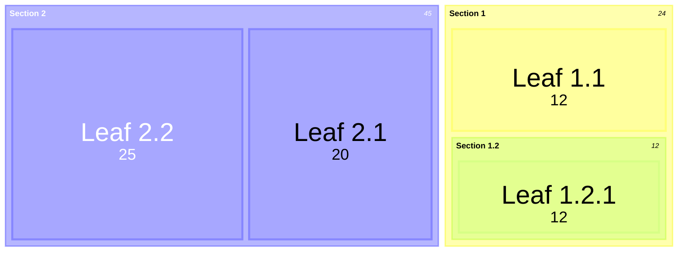
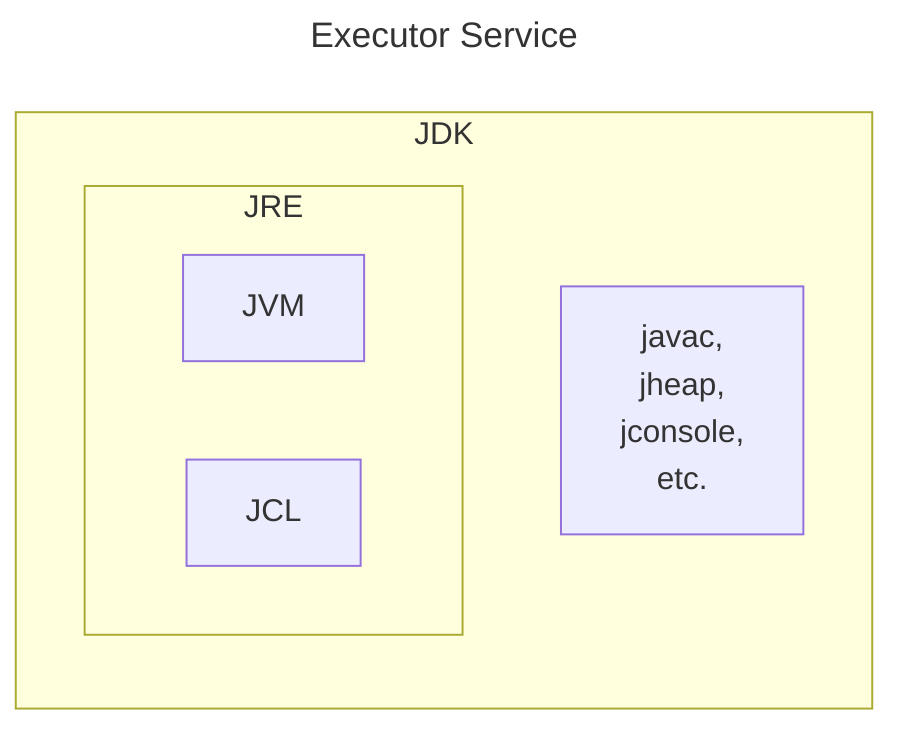
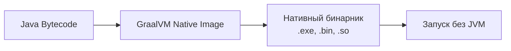

---
aliases:
  - JDK
  - JVM
  - JLS
  - JNI
  - JCP
  - JSR
---

# JNI – Java Native Interface

Java Native Interface (**JNI**) — стандартный механизм для запуска кода под управлением виртуальной машины Java (JVM), который написан на языках C/C++ или Ассемблере и скомпонован в виде динамических библиотек; позволяет не использовать статическое связывание.

>[!info] статическое связывание ≡ early binding
Если **связывание проводится компилятором перед запуском программы**, то оно называется статическим или ранним связыванием (early binding).

JNI — это интерфейс, позволяющий из Java вызывать нативные функции. Например, метод С++, который что-нибудь делает. Допустим, мы пишем большую программу на простом и любимом Java или Kotlin, и нужно реализовать задачу коммивояжера для нашего клиента. Или мы пишем генетический алгоритм, который ищет что-то в большом объёме данных, и так уж вышло, что у нас есть замечательная реализация на С++. Особенно часто я слышу про JNI в gamedev- и в automotive-проектах.

# JLS, JSR, JEP, JCP  — Java Specs
В чем разница (или связь) между JLS, JSR и JEP?
JCP : JEP -> JSR -> JLS
## JSR, Java Specification Requests
[_Java Specification Requests_](https://jcp.org/aboutJava/communityprocess/final/jsr376/index.html)
Запрос спецификации Java (Java Specification Request, JSR) — это **==формальный запрос к сообществу Java на добавление и усовершенствование технологий==**. Это орган, который стандартизирует API-интерфейсы на платформе технологии Java и используется для группировки API-интерфейсов в блоки, например, JAX-RS (Java API для веб-сервисов RESTful). Для каждого JSR всегда существует эталонная реализация по умолчанию.
## JEP, JDK Enhancement Proposal
[_JDK Enhancement Proposal_](http://openjdk.java.net/jeps/0)
JEP - Предложение по улучшению JDK  
## JLS, Java Language Specification
[_Java Language Specification_](https://docs.oracle.com/javase/specs/jls/se9/html/index.html)
JLS - спецификация языка Java
## JCP, Java Community Process
JCP, Java Community Process
# JAR — Java Archive
JAR-файл — это Java-архив (**J**ava **AR**chive). ~~_Аналог exe._~~ Это простой архивный файл, сжатый (иногда с нулевой компрессией) по алгоритму zip. Он был создан для удобства распространения программ, написанных на Java. Так как обычная программа содержит тысячи файлов. Файл может содержать:
```Plain
 - файл манифеста META-INF/MANIFEST.MF
 - java-файлы (исходный код)
 - class-файлы
 - файлы, необходимые для работы программы: картинки, файлы с настройками и прочее (ресурсы)
 - электронные подписи, которые позволяют защитить программу от модификации
```
Манифест - это текстовый файл формата `ключ: значение;` он содержит описание jar-файла. В нем могут быть следующие ключи:
```Plain
 - Manifest-Version - версия манифеста
 - Main-Class - имя главного класса (должен содержать метод main), такой jar-файл можно запустить как обычный исполняемый файл
 - Class-Path - позволяет указать CLASSPATH, который необходим для полноценной работы программы
 - SHA-Digest - контрольная сумма определенного файла внутри архива
```

# JMX — Java Management Extensions
**Java Management Extensions** (JMX) — это технология, входящая в J2SE начиная с J2SE 5.0. JMX ==предназначен для контроля и управления приложениями, системными объектами, устройствами (например, принтерами) и компьютерными сетями==. Она позволяет управлять внутренним состоянием так называемых MBean-ов, которые по сути являются классами Java, предоставляющими доступ к части своих полей и методов извне.
## MBean
Стандартный MBean определяется с помощью интерфейса с именем <имя>MBean и его реализацией <имя> соответственно. Интерфейс определяет все экспортируемые наружу методы и атрибуты MBean-а. Атрибуты должны следовать правилам именования getter-ов и setter-ов.
```Java
public interface MyMBean {
    String getMyName();
    void setSomeValue(int value1);  
    int getSomeValue();
    void writeToConsole(String message);
    String concat(String str1, String str2);
}
```

## J2EE — Java Enterprise Edition
**≡ Jakarta EE ≡ Java EE**
Jakarta EE (ранее — Java Platform, Enterprise Edition, сокр. Java EE, до версии 5.0 — Java 2 Enterprise Edition или J2EE). В 2018 Eclipse Foundation переименовала Java EE в Jakarta EE — **==набор спецификаций и соответствующей документации для языка Java, описывающей архитектуру серверной платформы для задач средних и крупных предприятий==**.
Включат в себя больше пакетов, чем J2SE. Напр: javax.servlet.\*, javax.enterprise.context.\* ,..
## J2SE — Java 2 Standard Edition 
**≡ Java Platform Standard Edition ≡ Java 2 Standard Edition** 
J2SE — стандартная версия платформы Java 2, предназначенная для создания и исполнения апплетов и приложений, рассчитанных на индивидуальное пользование или на использование в масштабах малого предприятия. Не включает в себя многие возможности, предоставляемые более мощной и расширенной платформой Java 2 Enterprise Edition (J2EE), рассчитанной на создание коммерческих приложений масштаба крупных и средних предприятий.
[https://ru.wikipedia.org/wiki/Java_Platform,_Standard_Edition](https://ru.wikipedia.org/wiki/Java_Platform,_Standard_Edition)
Содержит пакеты:
- java.lang
    - Object, Enum, Class, ClassLoader, Throwable, Error, Exception, RuntimeException, Thread, String, StringBuffer, StringBuilder, Comparable, Iterable, Process, Runtime, SecurityManager, System, Math, StrictMath
- java.lang.*
- java.math
- java.sql
- …
# JDK — Java Development Kit





## JCL, Java Class Library
[[java.util.Collection]]
[[java.util.stream]]
[[java.util.concurrent]]
[[java-dev/core/Thread]]
[[java.lang.reflect]]
[[java.io.Serializable]]
[[java.lang.Math]]
[[java.util.function]]
[[java.util.logging]]
[[Java Persistence API]]
**Java Class Library** Features are accessed through classes provided in packages.
- [`java.lang`](https://docs.oracle.com/en/java/javase/19/docs/api/java.base/java/lang/package-summary.html) contains fundamental classes and [interfaces](https://en.wikipedia.org/wiki/Interface_\(Java\)) closely tied to the language and [runtime system](https://en.wikipedia.org/wiki/Java_Runtime_Environment).
- [I/O](https://en.wikipedia.org/wiki/Input/output) and [networking](https://en.wikipedia.org/wiki/Computer_networking) access the platform [file system](https://en.wikipedia.org/wiki/File_system), and more generally [networks](https://en.wikipedia.org/wiki/Computer_network) through the [`java.io`](https://docs.oracle.com/en/java/javase/19/docs/api/java.base/java/io/package-summary.html), [`java.nio`](https://docs.oracle.com/en/java/javase/19/docs/api/java.base/java/nio/package-summary.html) and [`java.net`](https://docs.oracle.com/en/java/javase/19/docs/api/java.base/java/net/package-summary.html) packages. For networking, [SCTP](https://en.wikipedia.org/wiki/SCTP) is available through [`com.sun.nio.sctp`](https://docs.oracle.com/en/java/javase/19/docs/api/jdk.sctp/com/sun/nio/sctp/package-summary.html).
- [Mathematics package](https://en.wikipedia.org/wiki/Java.math): [`java.math`](https://docs.oracle.com/en/java/javase/19/docs/api/java.base/java/math/package-summary.html) provides mathematical expressions and evaluation, as well as arbitrary-precision decimal and integer number datatypes.
- [Collections](https://en.wikipedia.org/wiki/Collection_class) and Utilities : built-in Collection [data structures](https://en.wikipedia.org/wiki/Data_structure), and utility classes, for [Regular expressions](https://en.wikipedia.org/wiki/Regular_expression), [Concurrency](https://en.wikipedia.org/wiki/Concurrent_computing), [logging](https://en.wikipedia.org/wiki/Computer_data_logging) and [Data compression](https://en.wikipedia.org/wiki/Data_compression).
- [GUI](https://en.wikipedia.org/wiki/GUI) and [2D Graphics](https://en.wikipedia.org/wiki/2D_computer_graphics): the [AWT](https://en.wikipedia.org/wiki/Abstract_Window_Toolkit) package ([`java.awt`](https://docs.oracle.com/en/java/javase/19/docs/api/java.desktop/java/awt/package-summary.html)) basic GUI operations and binds to the underlying native system. It also contains the 2D Graphics API. The [Swing](https://en.wikipedia.org/wiki/Swing_\(java\)) package ([`javax.swing`](https://docs.oracle.com/en/java/javase/19/docs/api/java.desktop/javax/swing/package-summary.html)) is built on AWT and provides a platform-independent [widget toolkit](https://en.wikipedia.org/wiki/Widget_toolkit), as well as a [Pluggable look and feel](https://en.wikipedia.org/wiki/Pluggable_look_and_feel). It also deals with editable and non-editable text components.
- Sound: interfaces and classes for reading, writing, [sequencing](https://en.wikipedia.org/wiki/Music_sequencer), and [synthesizing](https://en.wikipedia.org/wiki/Synthesizer) of sound data.
- Text: [`java.text`](https://docs.oracle.com/en/java/javase/19/docs/api/java.base/java/text/package-summary.html) deals with text, dates, numbers and messages.
- Image package: [`java.awt.image`](https://docs.oracle.com/en/java/javase/19/docs/api/java.desktop/java/awt/image/package-summary.html) and [`javax.imageio`](https://docs.oracle.com/en/java/javase/19/docs/api/java.desktop/javax/imageio/package-summary.html) provide APIs to write, read, and modify images.
- [XML](https://en.wikipedia.org/wiki/XML): [SAX](https://en.wikipedia.org/wiki/Simple_API_for_XML), [DOM](https://en.wikipedia.org/wiki/Document_Object_Model), [StAX](https://en.wikipedia.org/wiki/StAX), [XSLT transforms](https://en.wikipedia.org/wiki/XSL_Transformations), [XPath](https://en.wikipedia.org/wiki/XPath) and various APIs for [Web services](https://en.wikipedia.org/wiki/Web_service), as [SOAP protocol](https://en.wikipedia.org/wiki/SOAP) and [JAX-WS](https://en.wikipedia.org/wiki/Java_API_for_XML_Web_Services).
- Security is provided by [`java.security`](https://docs.oracle.com/en/java/javase/19/docs/api/java.base/java/security/package-summary.html) and encryption services are provided by [`javax.crypto`](https://docs.oracle.com/en/java/javase/19/docs/api/java.base/javax/crypto/package-summary.html).
- [Databases](https://en.wikipedia.org/wiki/Database): access to [SQL](https://en.wikipedia.org/wiki/SQL) databases via [`java.sql`](https://docs.oracle.com/en/java/javase/19/docs/api/java.sql/java/sql/package-summary.html)
- Access to Scripting engines: The [`javax.script`](https://docs.oracle.com/en/java/javase/19/docs/api/java.scripting/javax/script/package-summary.html) package gives access to any conforming [Scripting language](https://en.wikipedia.org/wiki/Scripting_language).
- [Applets](https://en.wikipedia.org/wiki/Java_applet): [`java.applet`](https://docs.oracle.com/en/java/javase/19/docs/api/java.desktop/java/applet/package-summary.html) allows applications to be downloaded over a network and run within a guarded sandbox
- [Java Beans](https://en.wikipedia.org/wiki/JavaBean): [`java.beans`](https://docs.oracle.com/en/java/javase/19/docs/api/java.desktop/java/beans/package-summary.html) provides ways to manipulate reusable components.
- Introspection and reflection: [java.lang.Class](http://docs.oracle.com/javase/7/docs/api/java/lang/Class.html) represents a class, but other classes such as Method and Constructor are available in [`java.lang.reflect`](https://docs.oracle.com/en/java/javase/19/docs/api/java.base/java/lang/reflect/package-summary.html).
## javac, java compilator
**Java Compilator**. Оптимизирующий компилятор java, включенный в состав многих JDK. Компилятор принимает исходные коды, соответствующие спецификации Java language specification, и возвращает байт-код, соответствующий спецификации Java Virtual Machine Specification.
**JHeap** — предоставляет набор инструментов, помогающий разработчикам Java обнаруживать и устранять первопричину проблем с памятью в их приложениях.
**JConsole —** это инструмент мониторинга, соответствующий спецификации Java Management Extensions (JMX).
  
## java launcher
java launcher (`java.exe` или `javaw.exe`) — это простое приложение (simple C application): оно загружает различные DLL, которые на самом деле являются JVM.
### JNI, Java Native Interface
Java launcher выполняет определённый набор `Java Native Interface` (`JNI`) вызовов. JNI — это механизм, соединяющий мир виртуальной машины Java и мир C++. Получается, что launcher — это не JVM, а её загрузчик. Он знает, какие правильные команды нужно выполнить, чтобы запустилась JVM. Знает, как организовать всё необходимое окружение при помощи JNI вызовов.
В эту организацию окружения входит и создание главного потока, который обычно называется `main`.

# [[JVM]] — Java Virtual Machine
## обзор имплементаций JVM

📊 **Таблица сравнения основных реализаций JVM**

| **Параметр**                      | **OpenJDK HotSpot**                                             | **Oracle GraalVM**                                               | **Eclipse OpenJ9**                             | **Azul Zing**                                                      |
| --------------------------------- | --------------------------------------------------------------- | ---------------------------------------------------------------- | ---------------------------------------------- | ------------------------------------------------------------------ |
| Разработчик                       | Oracle / OpenJDK                                                | Oracle / GraalVM Team                                            | Eclipse Foundation                             | Azul Systems                                                       |
| Тип                               | Классическая JIT-машина                                         | JIT + AOT (Native Image)                                         | Оптимизированная JIT                           | Высокопроизводительная JIT                                         |
| Стартовое время                   | Среднее (1–3 сек)                                               | ⚡ Очень быстрое (Native Image) / Среднее (JVM mode)              | ⚡ Очень быстрое                                | ⚡ Очень быстрое                                                    |
| Потребление памяти                | Среднее                                                         | ✅ Низкое (Native Image) / Среднее                                | ✅ Низкое                                       | ❌ Высокое (за счёт GC)                                             |
| Производительность (пиковая)      | ✅ Очень высокая                                                 | ✅ Высокая (JVM mode) / 💥 Выше (Native Image для коротких задач) | ✅ Высокая (часто ближе к HotSpot)              | ✅ Самая высокая (особенно при низкой задержке)                     |
| GC (сборщик мусора)               | G1 ZGC Shenandoah CMS Parallel                                  | Зависит от режима (обычно G1/ZGC)                                | Eclipse OOM (Optimized for low pause)          | C4 (Continuously Concurrent Compacting Collector) — почти без пауз |
| Поддержка Native Image (AOT)      | ❌ Нет                                                           | ✅ Да (основная фишка)                                            | ❌ Нет                                          | ❌ Нет                                                              |
| Поддержка многопоточности         | Отличная                                                        | Отличная                                                         | Отличная                                       | ✅ Лучшая в мире (для high-throughput)                              |
| Поддержка ARM / Cloud / Container | ✅ Хорошая                                                       | ✅ Отличная (особенно Native Image)                               | ✅ Отличная                                     | ✅ Отличная                                                         |
| Лицензия                          | GPL v2 with CPE (OpenJDK)                                       | Apache 2.0                                                       | EPL 2.0                                        | Коммерческая (бесплатна до определённого размера)                  |
| Используется в                    | Большинство Java-приложений Spring Micronaut Quarkus (JVM mode) | Serverless микросервисы контейнеры GraalVM Native                | IBM WebSphere Red Hat RHEL Eclipse IDE Alibaba | Финансовые системы HFT трейдинг                                    |
| Особенности                       | Лидер по стабильности экосистема                                | Может компилировать Java в нативный бинарник (без JVM!)          | Маленький footprint отлично для Docker/облака  | Непревзойдённые гарантии низкой задержки (мс)                      |

Устаревшие JVM, сняты с поддержки
1. Oracle JRockit
2. IBM J9 
	* переход на Eclipse OpenJ9

**Native Image**
**Native Image** — это технология, которая **компилирует Java-код Ahead-of-Time (AOT)** в нативный исполняемый файл (бинарник), который может запускаться без JVM.


Приемущества
- **AOT-компиляция** (Ahead-of-Time) вместо JIT
- **Отсутствие JVM** во время выполнения
- **Мгновенный старт** (milliseconds вместо seconds)
- **Меньшее потребление памяти**
- **Более низкая latency**

>[!info] OpenJDK vs Oracle
>OpenJDK является основной реализацией Java, управляемой сообществом и поддерживаемой Oracle, которая предоставляет исходный код. В то время как Oracle JDK
 – коммерческий продукт Oracle, основанный на этом коде, но с закрытым исходным кодом и платной поддержкой. Oracle – основная организация-разработчик и спонсор OpenJDK.
 

**⚡ HFT (High-Frequency Trading)**

**HFT** — это алгоритмический трейдинг, характеризующийся **высокоскоростной торговлей** с использованием мощных компьютеров и сложных алгоритмов.

### Ключевые характеристики:
- ⏱️ **Микросекундные задержки** (latency)
- 🔁 **Огромное количество сделок** в секунду
- 📈 **Арбитражные стратегии**
- 🤖 **Полная автоматизация**


**Какую JVM выбрать**

| Цель                                                   | Рекомендуемая JVM                    |
| ------------------------------------------------------ | ------------------------------------ |
| Обычный enterprise-сервис (Spring Boot Jakarta EE)     | HotSpot (OpenJDK) — безопасный выбор |
| Микросервисы Docker Cloud Serverless                   | GraalVM Native Image или OpenJ9      |
| Приложения с жёсткими требованиями к памяти (IoT edge) | OpenJ9                               |
| Финансовые системы HFT трейдинг                        | Azul Zing                            |
| Быстрый старт приложений (CLI скрипты)                 | GraalVM Native Image                 |
| Альтернатива Oracle — без лицензионных рисков          | OpenJDK + OpenJ9                     |

Назначение JVM

| JVM              | Статус         | Лучше всего подходит для                    |
| ---------------- | -------------- | ------------------------------------------- |
| HotSpot          | 👑 Лидер       | Большинство случаев стабильность экосистема |
| GraalVM          | 🚀 Инноватор   | Serverless контейнеры Native Image          |
| OpenJ9           | 🏆 Экономичный | Docker Kubernetes низкое потребление памяти |
| Azul Zing        | 💰 Премиум     | Финансы HFT где критичны паузы GC           |
| JRockit / IBM J9 | ☠️ Устарели    | Не использовать                             |

Назначение

### 🔍 Подробнее о ключевых альтернативах:
## [[JMM]] – Java Memory model

Модель памяти Java

