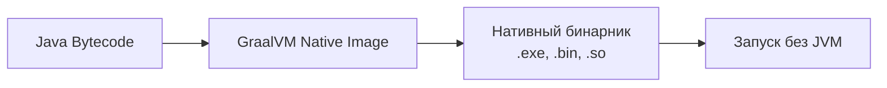

# JVM — Java Virtual Machine
## обзор имплементаций JVM

📊 **Таблица сравнения основных реализаций JVM**

| **Параметр**                      | **OpenJDK HotSpot**                                             | **Oracle GraalVM**                                               | **Eclipse OpenJ9**                             | **Azul Zing**                                                                   |
| --------------------------------- | --------------------------------------------------------------- | ---------------------------------------------------------------- | ---------------------------------------------- | ------------------------------------------------------------------------------- |
| Разработчик                       | Oracle / OpenJDK                                                | Oracle / GraalVM Team                                            | Eclipse Foundation                             | Azul Systems                                                                    |
| Тип                               | Классическая JIT-машина                                         | JIT + AOT (Native Image)                                         | Оптимизированная JIT                           | Высокопроизводительная JIT                                                      |
| Стартовое время                   | Среднее (1–3 сек)                                               | ⚡ Очень быстрое (Native Image) / Среднее (JVM mode)              | ⚡ Очень быстрое                                | ⚡ Очень быстрое                                                                 |
| Потребление памяти                | Среднее                                                         | ✅ Низкое (Native Image) / Среднее                                | ✅ Низкое                                       | ❌ Высокое (за счёт GC)                                                          |
| Производительность (пиковая)      | ✅ Очень высокая                                                 | ✅ Высокая (JVM mode) / 💥 Выше (Native Image для коротких задач) | ✅ Высокая (часто ближе к HotSpot)              | ✅ Самая высокая (особенно при низкой задержке)                                  |
| GC (сборщик мусора)               | G1 ZGC Shenandoah CMS Parallel                                  | Зависит от режима (обычно G1/ZGC)                                | Eclipse OOM (Optimized for low pause)          | [[JMM GCs\|C4]] (Continuously Concurrent Compacting Collector) — почти без пауз |
| Поддержка Native Image (AOT)      | ❌ Нет                                                           | ✅ Да (основная фишка)                                            | ❌ Нет                                          | ❌ Нет                                                                           |
| Поддержка многопоточности         | Отличная                                                        | Отличная                                                         | Отличная                                       | ✅ Лучшая в мире (для high-throughput)                                           |
| Поддержка ARM / Cloud / Container | ✅ Хорошая                                                       | ✅ Отличная (особенно Native Image)                               | ✅ Отличная                                     | ✅ Отличная                                                                      |
| Лицензия                          | GPL v2 with CPE (OpenJDK)                                       | Apache 2.0                                                       | EPL 2.0                                        | Коммерческая (бесплатна до определённого размера)                               |
| Используется в                    | Большинство Java-приложений Spring Micronaut Quarkus (JVM mode) | Serverless микросервисы контейнеры GraalVM Native                | IBM WebSphere Red Hat RHEL Eclipse IDE Alibaba | Финансовые системы HFT трейдинг                                                 |
| Особенности                       | Лидер по стабильности экосистема                                | Может компилировать Java в нативный бинарник (без JVM!)          | Маленький footprint отлично для Docker/облака  | Непревзойдённые гарантии низкой задержки (мс)                                   |

Устаревшие JVM, сняты с поддержки
1. Oracle JRockit
2. IBM J9 
	* переход на Eclipse OpenJ9

**Native Image**
**Native Image** — это технология, которая **компилирует Java-код Ahead-of-Time (AOT)** в нативный исполняемый файл (бинарник), который может запускаться без JVM.

Приемущества Native Image 
- **AOT-компиляция** (Ahead-of-Time) вместо JIT
- **Отсутствие JVM** во время выполнения
- **Мгновенный старт** (milliseconds вместо seconds)
- **Меньшее потребление памяти**
- **Более низкая latency**
Недостатки
* Плаформозависимость
* Большой размер исполняемых файлов
* Ограничения при при использовании рефлексии

>[!info] OpenJDK vs Oracle
>OpenJDK является основной реализацией Java, управляемой сообществом и поддерживаемой Oracle, которая предоставляет исходный код. В то время как Oracle JDK
 – коммерческий продукт Oracle, основанный на этом коде, но с закрытым исходным кодом и платной поддержкой. Oracle – основная организация-разработчик и спонсор OpenJDK.
 

**HFT (High-Frequency Trading)**
**HFT** — это алгоритмический трейдинг, характеризующийся **высокоскоростной торговлей** с использованием мощных компьютеров и сложных алгоритмов.
Ключевые характеристики:
- ⏱️ **Микросекундные задержки** (latency)
- 🔁 **Огромное количество сделок** в секунду
- 📈 **Арбитражные стратегии**
- 🤖 **Полная автоматизация**

**Какую JVM выбрать**

| Цель                                                   | Рекомендуемая JVM                    |
| ------------------------------------------------------ | ------------------------------------ |
| Обычный enterprise-сервис (Spring Boot Jakarta EE)     | HotSpot (OpenJDK) — безопасный выбор |
| Микросервисы Docker Cloud Serverless                   | GraalVM Native Image или OpenJ9      |
| Приложения с жёсткими требованиями к памяти (IoT edge) | OpenJ9                               |
| Финансовые системы HFT трейдинг                        | Azul Zing                            |
| Быстрый старт приложений (CLI скрипты)                 | GraalVM Native Image                 |
| Альтернатива Oracle — без лицензионных рисков          | OpenJDK + OpenJ9                     |

Назначение JVM

| JVM              | Статус         | Лучше всего подходит для                    |
| ---------------- | -------------- | ------------------------------------------- |
| HotSpot          | 👑 Лидер       | Большинство случаев стабильность экосистема |
| GraalVM          | 🚀 Инноватор   | Serverless контейнеры Native Image          |
| OpenJ9           | 🏆 Экономичный | Docker Kubernetes низкое потребление памяти |
| Azul Zing        | 💰 Премиум     | Финансы HFT где критичны паузы GC           |
| JRockit / IBM J9 | ☠️ Устарели    | Не использовать                             |

## Azul Zing
**Azul Zing** — это **коммерческая JVM**, разработанная компанией **Azul Systems**, основанная на OpenJDK, но с мощными оптимизациями для **низкой задержки (low-latency)** и **высокой пропускной способности**. Она не использует стандартные GC из Oracle/OpenJDK — вместо этого у неё есть **собственный, уникальный сборщик мусора** под названием: **[[JMM GCs|C4 (Continuously Concurrent Compacting Collector)]]**