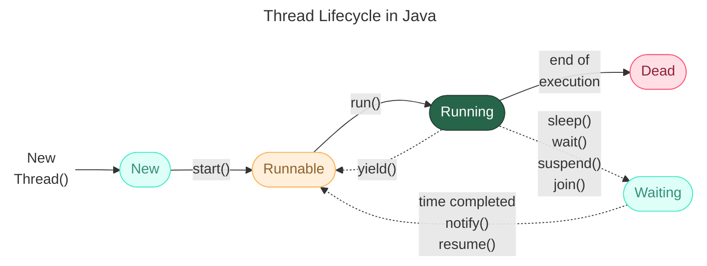

---
aliases:
  - Native Thread
  - Java Thread
  - Hardware Thread
  - Thread
  - потоки выполненеия
  - потоки
---
## Уровни абстракции потоков


**Визуализация:**

```
Spring Boot Thread (Java)
        ↓
JVM Thread (абстракция)
        ↓
OS Native Thread (pthread/WinAPI)
        ↓
CPU Hardware Thread (логическое ядро)
```

**Шаг 1.** Spring Boot создаёт Java‑поток (например, для обработки HTTP‑запроса).
**Шаг 2.** JVM запрашивает у ОС создание нативного потока через системный вызов.
**Шаг 3.** ОС выделяет ресурсы и ставит поток в очередь планировщика.
**Шаг 4.** Планировщик ОС назначает поток на свободный логический процессор (ядро/HT).
**Шаг 5.** Процессор выполняет инструкции потока, используя свои регистры и кэш.


## Java Thread
> Поток в Spring Boot

Это объект класса `java.lang.Thread` — единица выполнения на уровне JVM. В Spring Boot потоки используются для:
* обработки HTTP‑запросов (Tomcat/Undertow);
* выполнения асинхронных методов (`@Async`);
* запуска запланированных задач (`@Scheduled`);
* работы пулов соединений с БД (HikariCP);
* внутренних нужд фреймворка (мониторинг Actuator и т. д.).

**Пример создания потока в Java:**
```java
Thread myThread = new Thread(() -> {
    System.out.println("Выполняется в потоке: " + Thread.currentThread().getName());
});
myThread.start();
```

## Native Thread
> Поток на уровне ОС

Когда JVM создаёт Java‑поток, она запрашивает у операционной системы создание **нативного потока** (native thread). В Linux это реализуется через системный вызов `pthread_create()` (POSIX Threads), в Windows — через WinAPI `CreateThread()`.

**Характеристики нативного потока:**
* имеет уникальный ID в ОС;
* получает квант процессорного времени от планировщика ОС;
* потребляет память под стек (обычно 1 MB по умолчанию);
* может быть приостановлен, возобновлён или завершён планировщиком ОС.

**Проверка потоков ОС:**
* **Linux:** `ps -T -p <PID>` или `top -H -p <PID>`;
* **Windows:** Диспетчер задач → Вкладка «Потоки» (в подробном режиме);
* **Универсально:** `jstack <PID>` — дамп всех потоков JVM с их native ID.

## Hardware Thread
> Поток на уровне процессора

Физическое соответствие зависит от архитектуры процессора:
* **Без Hyper‑Threading (HT):** 1 ядро = 1 поток выполнения.
* **С Hyper‑Threading:** 1 ядро = 2 потока выполнения (два логических процессора на одно физическое ядро).

**Примеры:**
* процессор с 4 ядрами и HT: 8 логических процессоров;
* процессор с 8 ядрами без HT: 8 логических процессоров.

Планировщик ОС распределяет нативные потоки между логическими процессорами.

---


## Практические примеры и проверка

**Пример 1. HTTP‑запрос**

1. Клиент отправляет HTTP‑запрос на Spring Boot‑приложение.
2. Веб‑сервер (Tomcat) берёт поток из своего пула (`max-threads = 200`).
3. JVM создаёт/использует существующий нативный поток.
4. ОС назначает этот поток на одно из логических ядер процессора.
5. Процессор выполняет код контроллера Spring MVC.

**Пример 2. Асинхронный метод (`@Async`)**

1. Вызывается метод с аннотацией `@Async`.
2. Spring использует `ThreadPoolTaskExecutor` для выделения потока.
3. JVM и ОС выполняют те же шаги, что и в примере выше.
4. Поток выполняет асинхронную логику (например, отправку email).

**Как проверить соответствие:**

**Шаг 1. Найдите PID процесса Java:**
```bash
ps aux | grep java
```

**Шаг 2. Посмотрите потоки ОС:**
```bash
ps -T -p <PID>  # Linux
```
Вывод:
```
  PID  SPID TTY          TIME CMD
1234  1235 ?        00:00:01 java
1234  1236 ?        00:00:02 java
...
```
Где `SPID` — ID потока в ОС.

**Шаг 3. Сравните с дампом потоков JVM:**
```bash
jstack <PID> > threads.dump
```
В файле `threads.dump` найдите строки вида:
```
"http-nio-8080-exec-1" #23 daemon prio=5 os_prio=0 tid=0x00007f8a8c001000 nid=0x123a waiting on condition [0x00007f8a7bffd000]
```
* `nid=0x123a` — native ID потока в шестнадцатеричной системе.
* Переведите `0x123a` в десятичную: `4666`.
* Сравните с `SPID` из `ps -T` — они должны совпадать.

---

## Важные нюансы и ограничения


* **Соотношение 1:1.** В HotSpot JVM (стандартная JVM от Oracle/OpenJDK) каждый Java‑поток соответствует ровно одному нативному потоку ОС.
* **Виртуальные потоки (Java 21+):** в Project Loom вводятся виртуальные потоки (`Virtual Threads`), которые могут не иметь прямого соответствия нативному потоку. Они мультиплексируются на небольшое число нативных потоков.
* **Накладные расходы:** создание нативного потока требует ресурсов ОС (память, системные структуры данных). Слишком большое число потоков (>1000) может снизить производительность.
* **Контекстные переключения:** когда ОС переключает потоки между ядрами, происходит сохранение/восстановление состояния процессора (регистры, кэш). Это создаёт накладные расходы.
* **Привязка к ядрам (CPU affinity):** можно принудительно привязать поток ОС к определённым ядрам процессора (через `taskset` в Linux), но Spring Boot этого не делает по умолчанию.
* **Память:** каждый поток потребляет память под стек. По умолчанию в Java — 1 MB на поток. Для 200 потоков Tomcat это 200 MB только под стеки.

---

## Краткий итог


| Уровень | Сущность | Соответствие | Управление |
|--------|----------|--------------|-------------|
| Spring Boot | `Thread` (Java) | Логический поток выполнения в приложении | Spring Framework (пулы, аннотации `@Async`, `@Scheduled`) |
| ОС | Native Thread (`pthread` / `WinAPI Thread`) | Физический поток, управляемый планировщиком ОС | Ядро ОС (Linux/Windows) |
| Процессор | Hardware Thread (ядро / HT) | Единица выполнения инструкций | Аппаратура процессора и микрокод |


**Ключевой вывод:** поток Spring Boot — это абстракция над нативным потоком ОС, который выполняется на аппаратном потоке процессора. JVM обеспечивает прозрачное соответствие Java‑потоков нативным потокам, а ОС и процессор отвечают за их реальное выполнение.


# Java class Thread
> [java.lang.Thread](https://docs.oracle.com/javase/8/docs/api/java/lang/Thread.html) `implements Runnable`


Поток представляет собой способ вторгнуться в выполнение некоторого таска (задания).
Каждый поток входит в группу потоков `ThreadGroup`. У потока есть приоритет.

Жизненный цикл потока




основные методы

```Java
yield() // "уступить". Просим JVM выделить меньше времени на вып потока
Thread.currentThread().sleep(60*1000); // приостановить работу
thread.interrupt(); // прекратить выполнение потока, не убивая его, для сохранения консистентности данных.
Thread.interrupted() // проверить состояние потока,
thread.join(); // дождаться завершния другого потока
public State getState() // состояние потока
			enum State {
				NEW,
				RUNNABLE,
				BLOCKED,
				WAITING,
				TIMED_WAITING,
				TERMINATED;
			}
isAlive()
```
## Создание потока
### через наследование
Можно создать поток через наследование
```Java
public static class MyThread extends Thread {
      @Override
      public void run() {
          System.out.println("Hello, World!");
      }
  }
  public static void main(String []args){
      Thread thread = new MyThread();
      thread.start();
  }
```
Но это не очень хорошо, так как нарушает SRP (SOLID) ибо у нас появляется сущность которая управляет и потоком и выполняет дополнительные действия.
### через `Runnable` inteface
Более правильно создать поток, передав в него task через функциональный интерфейс Runnable
```Java
public static void main(String []args){
	Runnable task = () -> {
		System.out.println("Hello, World!");
	};
	Thread thread = new Thread(task);
	thread.start();
}
```
## class ThreadGroup
`implements Thread.UncaughtExceptionHandler`
```Java
Thread currentThread = Thread.currentThread();
ThreadGroup threadGroup = currentThread.getThreadGroup();
System.out.println("Thread: " + currentThread.getName());
System.out.println("Thread Group: " + threadGroup.getName());
System.out.println("Parent Group: " + threadGroup.getParent().getName());
```
