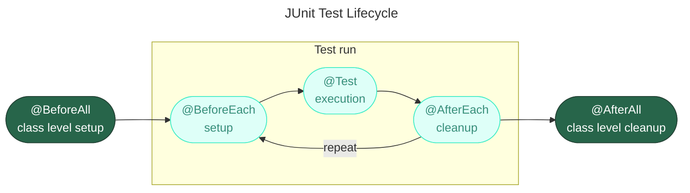

`import org.junit;`
- Spring — фреймворков для создания веб-приложений
- JUnit — фреймворк для тестирования
> [!info] Туториал по JUnit 5  - Введение  
> Три дня назад мной был опубликован перевод: JUnit — создание отчетов в формате HTML В комментарии к нему @LeshaRB задал вопрос: &quot;Это будет перевод всех статей цикла Junit5 или просто одна?  
> [https://habr.com/ru/articles/590607/](https://habr.com/ru/articles/590607/)  
# dependency
### pom.xml for Apache Maven
[https://howtodoinjava.com/junit5/junit5-maven-dependency/](https://howtodoinjava.com/junit5/junit5-maven-dependency/)
```XML
<properties>
    <junit.jupiter.version>5.8.1</junit.jupiter.version>
    <junit.platform.version>1.8.1</junit.platform.version>
</properties>
<dependencies>
    <dependency>
        <groupId>org.junit.jupiter</groupId>
        <artifactId>junit-jupiter-engine</artifactId>
        <version>${junit.jupiter.version}</version>
        <scope>test</scope>
    </dependency>
    <dependency>
        <groupId>org.junit.jupiter</groupId>
        <artifactId>junit-jupiter-api</artifactId>
        <version>${junit.jupiter.version}</version>
        <scope>test</scope>
    </dependency>
    <dependency>
        <groupId>org.junit.jupiter</groupId>
        <artifactId>junit-jupiter-params</artifactId>
        <version>${junit.jupiter.version}</version>
        <scope>test</scope>
    </dependency>
    <dependency>
        <groupId>org.junit.platform</groupId>
        <artifactId>junit-platform-suite</artifactId>
        <version>${junit.platform.version}</version>
        <scope>test</scope>
    </dependency>
</dependencies>
```
# Аннотации JUnit5
`@TestMethodOrder`
```XML
@Order(5)
@Tag("model")
```
Они нужны для обозначения жизненного цикла среды тестирования



Типовые аннотации

| **Аннотации**  | **Описание**                                                                                                             |
| -------------- | ------------------------------------------------------------------------------------------------------------------------ |
| `@BeforeEach`  | Аннотированный метод будет запускаться перед каждым тестовым методом в тестовом классе.                                  |
| `@AfterEach`   | Аннотированный метод будет запускаться после каждого тестового метода в тестовом классе.                                 |
| `@BeforeAll`   | Аннотированный метод будет запущен перед всеми тестовыми методами в тестовом классе. Этот метод должен быть статическим. |
| `@AfterAll`    | Аннотированный метод будет запущен после всех тестовых методов в тестовом классе. Этот метод должен быть статическим.    |
| `@Test`        | Он используется, чтобы пометить метод как тест junit.                                                                    |
| `@DisplayName` | Используется для предоставления любого настраиваемого отображаемого имени для тестового класса или тестового метода      |
| `@Disable`     | Он используется для отключения или игнорирования тестового класса или тестового метода из набора тестов.                 |
| `@Nested`      | Используется для создания вложенных тестовых классов                                                                     |
| `@Tag`         | Пометьте методы тестирования или классы тестов тегами для обнаружения и фильтрации тестов.                               |
| `@TestFactory` | Отметить метод - это тестовая фабрика для динамических тестов.                                                           |

# Assertions утверждения
[https://habr.com/ru/articles/591587/](https://habr.com/ru/articles/591587/)
Assertions (утверждения) позволяют сравнить ожидаемый результат с фактическим результатом теста.
Для того чтобы держать вещи простыми, все утверждения JUnit Jupiter являются `static` методы в класса [org.junit.jupiter.Assertions](https://junit.org/junit5/docs/current/api/org.junit.jupiter.api/org/junit/jupiter/api/Assertions.html), например `assertEquals()`, `assertNotEquals()`.
```Java
void testCase()
{
    //Test will pass
    Assertions.assertNotEquals(3, Calculator.add(2, 2));
    //Test will fail
    Assertions.assertNotEquals(4, Calculator.add(2, 2), "Calculator.add(2, 2) test failed");
    //Test will fail
    Supplier<String> messageSupplier  = () -> "Calculator.add(2, 2) test failed";
    Assertions.assertNotEquals(4, Calculator.add(2, 2), messageSupplier);
}
```
## Виды ассертов
1. assertEquals() и assertNotEquals()
2. assertArrayEquals()
3. assertIterableEquals()
4. assertLinesMatch()
5. assertNotNull() и assertNull()
6. assertNotSame() и assertSame()
7. assertTimeout() и assertTimeoutPreemptively()
8. assertTrue() и assertFalse)
9. assertThrows()
10. Пример fail()
# Assumptions предположения
Класс [Assumptions](https://junit.org/junit5/docs/current/api/org.junit.jupiter.api/org/junit/jupiter/api/Assumptions.html) (предположения) предоставляет `static`методы для поддержки выполнения условного теста на основе предположений. Неуспешное предположение приводит к прерыванию теста.
Предположения обычно используются всякий раз, когда нет смысла продолжать выполнение  
данного метода тестирования. В отчете о тестировании эти тесты будут  
отмечены как пройденные.  
Предположения класс имеет три таких методов: `assumeFalse()`, `assumeTrue()` и `assumingThat()`
```Java
public class AppTest {
    @Test
    void testOnDev()
    {
        System.setProperty("ENV", "DEV");
        Assumptions.assumeTrue("DEV".equals(System.getProperty("ENV")), AppTest::message);
    }
    @Test
    void testOnProd()
    {
        System.setProperty("ENV", "PROD");
        Assumptions.assumeFalse("DEV".equals(System.getProperty("ENV")));
    }
    private static String message () {
        return "TEST Execution Failed :: ";
    }
}
```