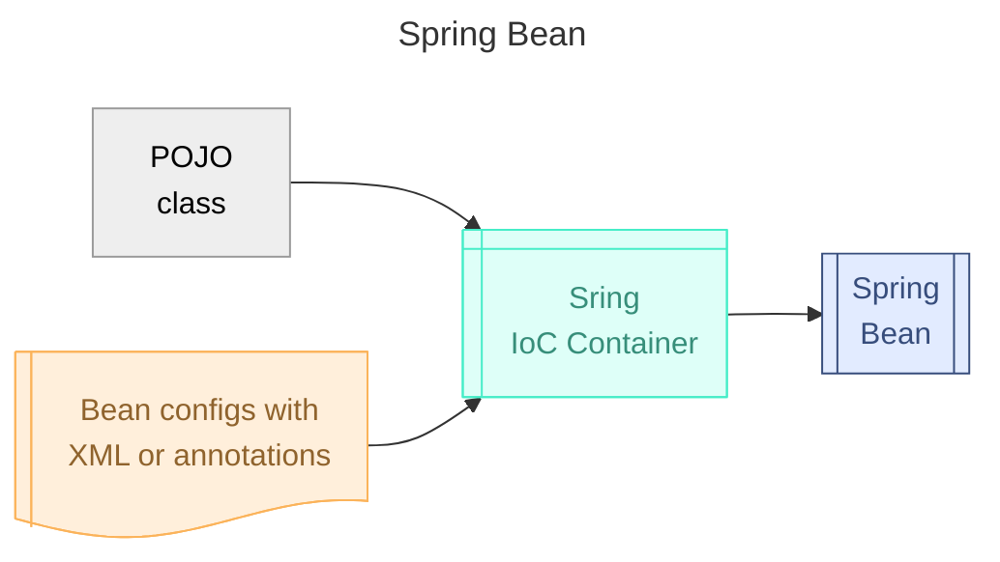
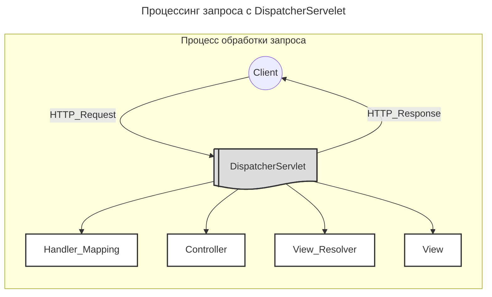
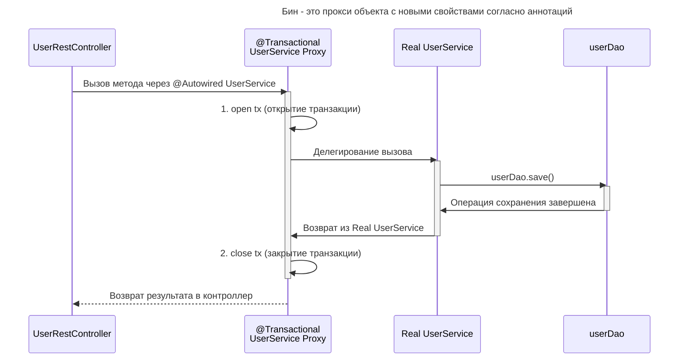

## Spring Framework
Ключевой элемент Spring — поддержка инфраструктуры на уровне приложения: основное внимание уделяется «водопроводу» бизнес-приложений, поэтому разработчики могут сосредоточиться на бизнес-логике без лишних настроек в зависимости от среды исполнения.
- Spring Framework — это набор разных мини-фреймворков. Каждый из них нужен для работы над определёнными приложениями или их частями.

```mermaid
%%{init: {'theme': 'base', 'themeVariables': {'primaryColor':'#FFD700','secondaryColor':'#FFA500','tertiaryColor':'#FF8C00','fontFamily':'Arial','edgeLabelBackground':'#FFF','textColor':'#000','lineColor':'#000','border1':'#000','border2':'#000','border3':'#000'}}}%%
flowchart TD
    subgraph SpringCoreOuter["SPRING CORE"]
    
        SpringCore["SPRING CORE"]
        AOP["AOP<br><br>(declarative transaction, object pooling, interceptors)"]
        IoC["IoC (DI) Container<br><br>(dependency management, object lifecycle management)"]
        ComponentService["Component/Service abstraction"]
    end

    SpringDAO["Spring DAO<br><br>(transaction, jdbc support, dao support)"] --> SpringCore
    SpringORM["Spring ORM<br><br>(Hibernate, JDO, Toplink, iBatis)"] --> SpringCore
    SpringWeb["Spring Web<br><br>(WebApplicationContext, Web utilities)"] --> SpringCore
    SpringMVC["Spring Web MVC<br><br>(Web MVC Framework, Web Jsp/Velocity/PDF/Excel/JasperReport)"] --> SpringCore

    WebRemoting["Web remoting<br><br>(Web services, RMI, Hessian, Burlap)"] --> AOP
    EJB["EJB/JMS/JMX"] --> AOP
    Mail["Mail"] --> IoC
    Scheduling["Scheduling"] --> ComponentService
    Additional["Additional capabilities<br><br>1. Ehcache support<br>2. Mock Testing<br>3. Rich Client"] --> ComponentService

    style SpringCore fill:#FFD700,stroke:#000,stroke-width:2px
    style SpringDAO fill:#FFD700,stroke:#000
    style SpringORM fill:#FFD700,stroke:#000
    style SpringWeb fill:#FFD700,stroke:#000
    style SpringMVC fill:#FFD700,stroke:#000
    style WebRemoting fill:#FFD700,stroke:#000
    style EJB fill:#FFD700,stroke:#000
    style Mail fill:#FFD700,stroke:#000
    style Scheduling fill:#FFD700,stroke:#000
    style Additional fill:#FFD700,stroke:#000
```
    
    ![[attachments/Untitled 6 3.png|Untitled 6 3.png]]



Spring включает в себя
- Inversion of Control container
    
    Inversion of Control-контейнер: конфигурирование компонентов приложений и управление жизненным циклом Java-объектов.
    
- Spring AOP
    
    Фреймворк аспектно-ориентированного программирования: работает с функциональностью, которая не может быть реализована возможностями объектно-ориентированного программирования на Java без потерь.
    
- Spring Data
    
    Фреймворк доступа к данным: работает с системами управления реляционными базами данных на Java-платформе, используя JDBC- и ORM-средства и обеспечивая решения задач, которые повторяются в большом числе Java-based environments.
    
- Spring MVC
    
    Фреймворк MVC: каркас, основанный на HTTP и сервлетах, предоставляющий множество возможностей для расширения и настройки (customization).
    
- другие
    
    Фреймворк управления транзакциями: координация различных API управления транзакциями и инструментарий настраиваемого управления транзакциями для объектов Java.
    
    Фреймворк удалённого доступа: конфигурируемая передача Java-объектов через сеть в стиле RPC, поддерживающая RMI, CORBA, HTTP-based протоколы, включая web-сервисы (SOAP).
    
    Фреймворк аутентификации и авторизации: конфигурируемый инструментарий процессов аутентификации и авторизации, поддерживающий много популярных и ставших индустриальными стандартами протоколов, инструментов, практик через дочерний проект Spring Security (ранее известный как Acegi).
    
    Фреймворк удалённого управления: конфигурируемое представление и управление Java-объектами для локальной или удалённой конфигурации с помощью JMX.
    
    Фреймворк работы с сообщениями: конфигурируемая регистрация объектов-слушателей сообщений для прозрачной обработки сообщений из очереди сообщений с помощью JMS, улучшенная отправка сообщений по стандарту JMS API.
    
    Тестирование: каркас, поддерживающий классы для написания модульных и интеграционных тестов.
    
# Spring Сore
Spring Сore решает задач:
- управление контекстом
- управление бинами
- внедрение зависимостей
Хорошая практика стремиться к том, чтобы вообще не создавать объекты вручную, кроме модельных объектов.
- Мы лишь конфигурируем классы чтобы «объяснить» (аннотации, XML, yaml) фреймворку Spring, какие именно объекты он должен создать за нас.



  
### @ControllerAdvice — обработка исключений
@ControllerAdvice — Способ обработки исключений он позволяет изменить как код, так и тело стандартного ответа при ошибке.
## Inversion of Control container
Spring управляет созданием объектов и потому его контейнер называется IoC-контейнер
## Spring `@Bean`
Объекты, которые создаются Spring-ом и находятся под его управлением, называются бинами.
## Dependency Injection — внедрение зависимости
Мы объявляем тип сущности, чаще интерфейс, под который в который Spring сам подставит нужный объект, бин.
## ApplicationContext class
Чтобы инициализировать контейнер и создать в нем бины, нужно создать экземпляр класса ApplicationContext.
```Java
// ApplicationContext ctx = new ClassPathXmlApplicationContext("config.xml");
ConfigurableApplicationContext ctx = new AnnotationConfigApplicationContext(AppConfig.class);
// получить ныжный бин
App app = ctx.getBean(App.class);
```
## `@Configuration` класс конфигурации
- Класс конфигурации приложения аннтоируется `@Configuration`. В нем перечислены бины и их конфигурация для инъекций зависимостей
    
    ```Java
    package com.yet.spring;
    
    import org.springframework.beans.factory.annotation.Autowired;
    import org.springframework.beans.factory.annotation.Value;
    import org.springframework.boot.context.properties.ConfigurationProperties;
    import org.springframework.context.annotation.*;
    
    import java.text.DateFormat;
    import java.util.Date;
    import java.util.HashMap;
    import java.util.Map;
    
    @Configuration
    @Import(LoggerConfig.class)
    @PropertySource("classpath:app.properties")
    public class AppConfig {
        @Autowired
        private EventLogger consoleEventLogger;
        @Value("${client.full-name}")
        private String cliName;
    
        @Bean
        @ConfigurationProperties(prefix = "client")
        public Client client() {
            Client cli = new Client(cliID, cliName);
            cli.setGreeting(cliGreeting);
            return cli;
        }
    
        @Bean
        @Scope(value="prototype")
        public Event event() {
            return new Event(new Date(), DateFormat.getDateTimeInstance());
        }
    
        @Bean
        public App app() {
            Map<EventType, EventLogger> loggers = new HashMap<>() {{
                put(EventType.ERROR, combinedEventLogger);
                put(EventType.INFO, consoleEventLogger);
            }};
            return new App(client(), сacheFileEventLogger, loggers);
        }
    }
    ```
    
### `@Autowired` — подставить бин по типу
- вставить значение поля из ApplicationContext
Если бин объявлен через @Autowired, при создании экземпляра Spring создаст объект, а потом через сеттер подставит @Autowired-бин в поле.
### `@Qualifier(”bean name”)` — создать бин по имени
подставить бин в поле по имени
### `@Component` — бин
Аннотация `@Component` говорит фреймворку превратить класс в бин. При запуске Spring создаст экземпляр класса Engine. Этот экземпляр будет синглтоном в нашем случае
вставить значение поля из контекста
### **`@Service`, `@Repository`, `@Controller` — бин**
Являются синонимами к @Component, но улучшают читабельность кода показывая к какой бизнес-логике относится бин
### `@PostConstruct, @PreDestroy` — постконструкторы
@PostConstruct, @PreDestroy — методы с данной аннотацией будут выполнение при конструкции, либо перед уничтожением экземпляра объекта.
### `@Value` — подставить значение
`@Value(”${client.id}”)` подстановка значений
### `@Scope` — прототипирование бина
`@Scope(singleton | prototype | request | session | application | websocket | myUserScope)` — прототипирование бина
# Spring Boot
Это отдельный модуль, который упрощает настройку фреймворка Spring и ускоряет запуск проектов. Он может автоматически сконфигурировать приложение и создать веб-сервер для его запуска.
- Spring Boot нужен для того, чтобы запустить приложение в 3 строчки.
    
    ```Java
    @SpringBootApplication
    public class Application {
        public static void main(String[] args) {
            SpringApplication.run(Application.class, args);
        }
    }
    ```
    
## `@SpringBootApplication`
Spring Boot `@SpringBootApplication` annotation is used to mark a configuration class that declares one or more @Bean methods and also triggers auto-configuration and component scanning. It’s same as declaring a class with `@Configuration`, `@EnableAutoConfiguration` and `@ComponentScan` annotations.
`@SpringBootApplication` является композицией бинов `@Configuration`, `@EnableAutoConfiguration` and `@ComponentScan`
### `@EnableAutoConfiguration`
включает автоматическую настройку Spring ApplicationContext путем сканирования компонентов пути к классам и регистрации бинов, соответствующих различным условиям
### `@ComponentScan`
В `@ComponentScan` вы указываете пакеты, которые должны сканироваться. Spring будет искать бины не только в пакетах для сканирования, но и в их подпакетах
# Spring MVC
**Spring MVC** — это веб-фреймворк Spring. Он позволяет создавать веб-сайты или RESTful сервисы (например, JSON/XML) и хорошо интегрируется Spring.
- **Как работает Spring MVC**



    
Ниже приведена последовательность событий, соответствующая входящему HTTP-запросу:
    
- После получения HTTP-запроса `DispatcherServlet` обращается к интерфейсу `**HandlerMapping**`, который определяет, какой Контроллер должен быть вызван, после чего, отправляет запрос в нужный Контроллер.
- Контроллер принимает запрос и вызывает соответствующий служебный метод, основанный на GET или POST. Вызванный метод определяет данные Модели, основанные на определённой бизнес-логике и возвращает в `DispatcherServlet` имя Вида (`View`).
- При помощи интерфейса `**ViewResolver**` `DispatcherServlet` определяет, какой Вид нужно использовать на основании полученного имени.
- После того, как Вид (`View`) создан, `DispatcherServlet` отправляет данные Модели в виде атрибутов в Вид, который в конечном итоге  
	отображается в браузере.  
	

Все вышеупомянутые компоненты, а именно, `**HandlerMapping**`, `**Controller**` и `**ViewResolver**`, являются частями интерфейса `**WebApplicationContext**` `extends` `**ApplicationContext**`, с некоторыми дополнительными особенностями, необходимыми для создания web-приложений.
    
- **Патент MVC**
    
    **Патент MVC** - вариант многоуровневой архитектуры приложения
    
    - Model (Модель) инкапсулирует (объединяет) данные приложения, в целом они будут состоять из POJO или бинов
    - View (Представление) отвечает за отображение данных Модели, — как правило, генерируя HTML, которые мы видим в своём браузере.
    - Controller (Контроллер) обрабатывает запрос пользователя, создаёт соответствующую Модель и передаёт её для отображения в Вид.
## Spring MVC DispatcherServlet
Диспетчер сервлетов — **фронт-контроллер —** обрабатывать HTTP-запрос.
## Контроллер — `@Controller`
- Компонент, который получает запросы от от диспетчере и вызывает методы сервисного слоя для выполнения
    
    ```Java
    @RestController
    @RequestMapping("/clients")
    @AllArgsConstructor
    @Controller
    public class ClientsController {
    
        private final ClientService clientService;
    
        @GetMapping
        public List<ClientDto> getClients() {
            return clientService.findAll();
        }
    
        @GetMapping("/{id}")
        public ClientDto getClientByID(@PathVariable Long id) {
            return clientService.findById(id);
        }
    
        @GetMapping("/email:{email}")
        public ClientDto getClientByEmail(@PathVariable(value = "email", required = false) String email) {
            return clientService.findByEmail(email);
        }
    
        @PostMapping
        public ClientDto createClient(@RequestBody ClientDto client) {
            return clientService.save(client);
        }
    
        @PutMapping("/email:{email}")
        public ClientDto updateClient(@PathVariable String email, @RequestBody ClientDto client) {
            return clientService.update(client, email);
        }
    
        @DeleteMapping("/email:{email}")
        public Boolean deleteClientByEmail(@PathVariable String email) {
            return clientService.deleteByEmail(email);
        }
    
        @DeleteMapping("/{id}")
        public Boolean deleteClientByID(@PathVariable Long id) {
            return clientService.deleteById(id);
        }
    }
    ```
    
**`DispatcherServlet`** отправляет запрос контроллерам для выполнения определённых функций. Аннотация `@Controller` указывает, что конкретный класс является контроллером.
### `@RequestMapping` — связывание url и обработчика
```Java
@Controller
public class HelloController {
   @RequestMapping(value = "/hello", method = RequestMethod.GET)
   public String printHello(ModelMap model) {
      model.addAttribute("message", "Hello Spring MVC Framework!");
      return "hello";
   }
}
```
Аннотация @RequestMapping используется для мапинга (связывания) с URL для всего класса или для конкретного метода обработчика.
### `@GetMapping`, `@PostMapping`, `@PutMapping`, `@DeleteMapping`, `@PatchMapping`
maps HTTP GET/POST/PUT/DELETE/PATCH requests to a specific handler method in Spring controllers
## Представление
Существует несколько различных библиотек шаблонов, которые хорошо интегрируются с Spring MVC, из которых вы можете выбрать: `Thymeleaf`, `Velocity`, `Freemarker`, `Mustache` и даже `JSP` (хотя это не библиотека шаблонов).
## Spring ViewResolver
Класс, который пытается _найти_ ваш шаблон, называется **ViewResolver**. Поэтому всякий раз, когда запрос поступает в ваш контроллер, Spring проверяет настроенные ViewResolvers и запрашивает их, чтобы найти шаблон с заданным именем. Если у вас нет настроенных МiewResolvers, это не сработает.
### @RestController
Аннотация `@RestController` говорит о том, что все сущности будут автоматически отображаться в JSON-формате
`@RestController` combines `@Controller` and `@ResponseBody`, two annotations that results in web requests returning data rather than a view.
### ResponseEntity
- Можно вручную регулировать тело и заголовок ответа, при помощи типа `ResponseEntity`
    
    ```Java
    @GetMapping("/hello")
    ResponseEntity<String> hello() {
        return new ResponseEntity<>("Hello World!", HttpStatus.OK);
    }
    // - - - - - - - - - - - - - - - - - - - - - - - - - - - - - - - - - - - - - -
    @GetMapping("/age")
    ResponseEntity<String> age(@RequestParam("yearOfBirth") int yearOfBirth) {
        if (isInFuture(yearOfBirth)) {
            return ResponseEntity.badRequest()
                .body("Year of birth cannot be in the future");
        }
    
        return ResponseEntity.status(HttpStatus.OK)
            .body("Your age is " + calculateAge(yearOfBirth));
    }
    ```
    
    см. [https://www.baeldung.com/spring-response-entity](https://www.baeldung.com/spring-response-entity)
    
## Thymeleaf шаблонизатор
- Thymeleaf is a modern server-side Java template engine for both web and standalone environments.
    
    ```Java
    <table>
      <thead>
        <tr>
          <th th:text="#{msgs.headers.name}">Name</th>
          <th th:text="#{msgs.headers.price}">Price</th>
        </tr>
      </thead>
      <tbody>
        <tr th:each="prod: ${allProducts}">
          <td th:text="${prod.name}">Oranges</td>
          <td th:text="${\#numbers.formatDecimal(prod.price, 1, 2)}">0.99</td>
        </tr>
      </tbody>
    </table>
    ```
    
Поддержка в Thymeleaf встроена в Spring MVC. Для того, чтобы Spring смог генерировать HTML-страницы на шаблонах Thymeleaf надо
- В файле конфигурации подключить и настроить `ServletContextTemplateResolver`, `SpringTemplateEngine`, `ThymeleafViewResolver`, `ResourceBundleMessageSource`. См. [https://www.baeldung.com/thymeleaf-in-spring-mvc](https://www.baeldung.com/thymeleaf-in-spring-mvc)
## Модель — `@Repository`
Модель — это слой доступа к данным. Обычно аннотируется к `@Repository`, строится на базе `JpaRepository`
```Java
@Repository
public interface ClientRepository extends JpaRepository<Client, Long> {
    Client findByEmailEquals(String email);
}
```
Типично, подключение к базе данных и запросы описываются при помощи внешнего файла конфигурации JDBC компоненты автоматически подгружаются из `Spring Data`
# SpringData
[https://www.youtube.com/watch?v=nwM7A4TwU3M](https://www.youtube.com/watch?v=nwM7A4TwU3M)
Spring Data — механизм для взаимодействия с сущностями базы данных, организации их в репозитории, извлечение данных, изменение, в каких то случаях для этого будет достаточно объявить интерфейс и метод в нем, без имплементации. Включает разделы:
- Spring Data JPA, Spring Data [[MongoDB]] (NoSQL), Spring Data Neo4j, Spring Data Redis, Spring Data Solr, Spring Data Hadoop, Spring Data Gemfire, Spring Data Rest, Spring Data JDBC Extenstions
Суть в том, что класс работы с БД надо унаследовать от специального Spring интерфейса, который даст сразу методы, для работы с БД. Примеры интерфейсов:
- CrudRepository, PagingAndSortingRepository, JpaRepository, MongoRepository, Neo4jRepository
Суть в том, что в классе, который управляет БД и наследуется от Spring Repository можно создавать пустые магические методы, которые буду автоматически генерироваться и дописываться SpringData пакетом.

Это работает по волшебным ключевым словам в назывании метода

| **Keyword**     | **Sample**                   | **JPQL snippet**                             |
| --------------- | ---------------------------- | -------------------------------------------- |
| $And$           | `findByLastnameAndFirstname` | `where x.lastname = ?1 and x.firstname = ?2` |
| $Or$            | `findByLastnameOrFirstname`  | `where x.lastname = ?1 or x.firstname = ?2`  |
| $Between$       | `findByStartDateBetween`     | `where x.startDate between ?1 and ?2`        |
| $LessThan$      | `findByAgeLessThan`          | `where x.age < ?1`                           |
| $LessThanEqual$ | `findByAgeLessThanEqual`     | `where x.age <= ?1`                          |
| $GreaterThan$   | `findByAgeGreaterThan`       | `where x.age > ?1`                           |
| $After$         | `findByStartDateAfter`       | `where x.startDate > ?1`                     |
| $Before$        | `findByStartDateBefore`      | `where x.startDate < ?1`                     |
## `@Transactional`
`@Transactional` — декларативное управление транзакциями.
Любой публичный public метод бин, который вы сопровождаете аннотацией @Transactional , будет выполняться внутри транзакции базы данных (обратите внимание: есть некоторые подводные камни).
- для того, чтобы работало, надо в конфигурации приложения указать `@EnableTransactionManagement`
- `@Transactional()` подвешиват к классу (интерфейсу) DAO (репозитория), либо к его методам
- обычный способ управления транзакцией
    
    ```Java
    // ВАРИАНТ-1
    import java.sql.Connection;
    Connection connection = dataSource.getConnection(); // (1)
    try (connection) {
        connection.setAutoCommit(false); // (2)
        // выполнить несколько SQL-запросов...
        connection.commit(); // (3)
    
    } catch (SQLException e) {
        connection.rollback(); // (4)
    }
    
    
    // ВАРИАНТ-2
    import java.sql.Connection;
    // isolation=TransactionDefinition.ISOLATION_READ_UNCOMMITTED
    connection.setTransactionIsolation(Connection.TRANSACTION_READ_UNCOMMITTED); // (1)
    
    // propagation=TransactionDefinition.NESTED
    Savepoint savePoint = connection.setSavepoint(); // (2)
    ...
    connection.rollback(savePoint);
    ```
    
Как будет этот же код выглядеть с помощи `@Transactional`:
```Java
@Transactional(
        readOnly=true,
        propagation= Propagation.REQUIRED,
        isolation= Isolation.READ_COMMITTED
)
```
- Так как Spring не умеет переписывать код, то в рантайме транзакционный бин будет подменен на прокси.


### @Transactional Propagation
Параметр `propagation` отвечает за стратегию распространения транзакций. Это свойство определяет, что роисходит, когда внутри транзакции вызывается другой метод, также помеченный как `@Transactional`. В Spring существует семь стратегий распространения, которые определяют, будет ли создана новая транзакция, будет ли использована текущая транзакция или возможно вообще не будет транзакции.
Варианты пропагации (распростанения)
- **REQUIRED**
    - Если метод `@Transactional(propagation=TransactionDefinition.REQUIRED)`, запускается вне транзакции, для него транзакция создается. Если внутри транзакции, он к ней присоединяется. ==Используется по-умолчанию==
- **REQUIRED_NEW**
    - Если метод запущен внутри транзакции, то внешняя транзакция будет остановлена, будет создана новая транзакция и работа внешней транзакции будет продолжена после того, как завершится выполнение `@Transactional(propagation=TransactionDefinition.REQUIRED_NEW)`-метода
- **SUPPORTS**
    - SUPPORTS использует транзакцию во внешнем методе, если она есть. Если нет, то транзакция для внутреннего метода не создается, запросы внутреннего метода будут выполнены в режиме автофиксации (`AUTOCOMMIT`)
        - `AUTOCOMMIT` — когда Rollback транзакции не происходит, даже если не все запросы были выполнены
- **NOT_SUPPORTED**
    - Означает даже если для внешний метод находится в транзакции, то внутренний метод будет обработан без транзакции и не вернется к начальному состоянию даже если внешняя транзакция закончится Ролбэком.
- **NEVER**
    - `@Transactional(propagation = Propagation.NEVER)` — методы выбрасывает исключение, если был вызван внутри транзакционного метода и вызывает откатывает транзакции внешнего метода
- **MANDATORY**
    - `Propagation.MANDATORY` требует внешнюю транзакцию, иначе выбрасывается исключение.
- **NESTED**
    - `PROPAGATION_NESTED` uses a single physical transaction with multiple savepoints that it can roll back to. Such partial rollbacks let an inner transaction scope trigger a rollback for its scope, with the outer transaction being able to continue the physical transaction despite some operations having been rolled back. This setting is typically mapped onto JDBC savepoints, so it works only with JDBC resource transactions. See Spring’s `DataSourceTransactionManager`
### @Transactional Isolation
[ℹ️Изоляции транзакций](https://www.notion.so/18a4087239e5816b8645e3f911775caa?pvs=21)
- **Read uncommitted — чтение незафиксированных данных**
    - Защита от `Lost Update`.
    - Реализация через последовательное выполнение всех операций обновления.
- **Read committed — чтение зафиксированных данных**
    - Защита от `Dirty Read`, `Lost Update`. В большинстве СУБД ==используется по-умолчанию==.
    - Реализация способами
        1. блокировка
        2. версирование
- **Repeatable read — повторяющееся чтение**
    - Защита от `Non-Repeatable Read`, `Dirty Read`, `Lost Update`
    - Реализация
        - Транзакция, которая изменила данные, не видит своих же обновленных данных
        - Другие транзакции не могут менять данные, пока не будет завершена первая транзакция
- **Serializable — упорядоченность**
    - Защита от всего — `Phantom Reads`, `Non-Repeatable Read`, `Dirty Read`, `Lost Update`. Самый высокий уровень изолированности.
    - Реализация — Результат выполнения параллельных транзакций такой, будто они выполнялись последовательно.
## `public interface JpaRepository<T, ID>`
`extends ListCrudRepository<T,ID>, ListPagingAndSortingRepository<T,ID>, QueryByExampleExecutor<T>`
интерфейс от которого следует наследовать свой репозиторий, чтобы получать реализацию многих методов при помощи волшебных слов. Так же включает уже реализоованный методы такие как
- findAll, findAllById, saveAll — inherited from org.springframework.data.repository.`ListCrudRepository`
- count, delete, deleteAll, deleteAll, deleteAllById, deleteById, existsById, findById, save — inherited from org.springframework.data.repository.`CrudRepository`
- … [https://docs.spring.io/spring-data/jpa/docs/current/api/org/springframework/data/jpa/repository/JpaRepository.html](https://docs.spring.io/spring-data/jpa/docs/current/api/org/springframework/data/jpa/repository/JpaRepository.html)
## JDBC API — The Java Database Connectivity
```Java
Connection con = DriverManager.getConnection(url, user, passwd);
...
```
## Spring Data JPA
### JPA — Java Persistence API
eg. `**Hibernate**` Based on JPA Entities
- **`JPA Entity`** – объекты Java, хранящиеся в базе данных с использованием Java Persistence API. Сущности JPA хранятся в реляционной базе данных, подключенной в качестве основного или дополнительного хранилища данных.
    
    ```Java
    @Entity
    @Table(name = "CUSTOMER")
    @Entity
    public class Customer {
    
        @GeneratedValue
        @Id
        @Column(name = "ID", nullable = false)
        private UUID id;
    
        @Version
        @Column(name = "VERSION")
        private Integer version;
    
        @InstanceName
        @NotNull
        @Column(name = "NAME", nullable = false)
        private String name;
    
        @Email
        @Column(name = "EMAIL", unique = true)
        private String email;
    
        public UUID getId() {
            return id;
        }
    
        public void setId(UUID id) {
            this.id = id;
        }
    
        // other getters and setters
    ```
    
- **Spring Data Mongo**
    - Пакет для работы с [MongoDB](https://www.notion.so/17907ade95764a3994252bd71868d8cb?pvs=21) — СУБД данных основанная на JSON-документах, вложенных друг в друга
- **Spring Data Neo4J**
    - Пакет для работы с [Neo4J](https://www.notion.so/17907ade95764a3994252bd71868d8cb?pvs=21) — СУБД основанная на графах, с возможностью циклических связей между узлами
## Spring DAO — Data Access Object
Data Access Object (DAO)
# Spring Security
[https://sysout.ru/kak-ustroena-autentifikatsiya-v-spring-security/](https://sysout.ru/kak-ustroena-autentifikatsiya-v-spring-security/)
## SecurityContext — хранилище объекта Authentication
---


# faq
## Как подключить Spring Boot в Maven?

> [!info] Spring Boot Maven Plugin Documentation  
> The Spring Boot Maven Plugin provides Spring Boot support in Apache Maven.  
> [https://docs.spring.io/spring-boot/docs/current/maven-plugin/reference/htmlsingle/](https://docs.spring.io/spring-boot/docs/current/maven-plugin/reference/htmlsingle/)  
```XML
<project>
    <modelVersion>4.0.0</modelVersion>
    <artifactId>getting-started</artifactId>
    <!-- ... -->
    <build>
        <plugins>
            <plugin>
                <groupId>org.springframework.boot</groupId>
                <artifactId>spring-boot-maven-plugin</artifactId>
            </plugin>
        </plugins>
    </build>
</project>
```
# Консоль
```XML
mvn spring-boot:run 
```
  
# Spring Security
## WebSecurityConfigurerAdapter
  
# Spring MVC
## @RequestMapping(”/”)
[https://docs.spring.io/spring-framework/reference/web/webmvc/mvc-controller/ann-requestmapping.html](https://docs.spring.io/spring-framework/reference/web/webmvc/mvc-controller/ann-requestmapping.html)
Применяется к классу контроллера, служит для обозначение эндпоинта, где будет обрабатываться запрос.
maps `/` to the `index()` method. When invoked from a browser or by using curl on the command line, the method returns pure text.
```XML
"/resources/ima?e.png" - match one character in a path segment
"/resources/*.png" - match zero or more characters in a path segment
"/resources/**" - match multiple path segments
"/projects/{project}/versions" - match a path segment and capture it as a variable
"/projects/{project:[a-z]+}/versions" - match and capture a variable with a regex
```
## @PathVariable
Аннотация, указывающая, что параметр метода должен быть привязан к переменной шаблона URI
# Spring Data
# Spring Core
## **Spring IoC Container**
Spring’s `Inversion of Control` (IoC) container.
Задачи для которых нужен **Spring Сontainer:**
- `Beans` — управление “бобами/зеранми” — объектами в контейнере
- `Core` — внедрение зависимостей
- `Context` — управление контекстом, знает где хранятся бины и обеспечивает доступ к ним
- `Expression` — специальный язык выражений, который может использоваться для поиска, доступа и модификации бинов
Есть 2 типа контейнеров:
1. **BeanFactory**
    1. Простой контейнер для внедрения зависимостей
2. **ApplicationContext**
    2. Внедрение зависимостей + службы `famework services`:
        - `AnnotationConfigApplicationContext`
        - `ClassPathXmlApplicationContext`
        - `FileSystemXmlApplicationContext`
        - `…ApplicationContext`
## Spring Context configuration with Annotations
Аннотоации - метаданные класса. Все аннотаций объявляются чере `**@**`
### Основные аннотаций
```Java
import org.springframework.beans.factory.annotation.Required
import org.springframework.beans.factory.annotation.Autowired
import org.springframework.beans.factory.annotation.Qualifier
import javax.annotation.PostConstruct
import javax.annotation.PreDestroy
import javax.annotation.Resource
```
  
`@``**Autowired**` `**(required=false)**` — вставить значение поля из контекста
- `Inject` — JSR
- может быть исползована над полем, конструктором, сеттером
`@``**Qualifier(”bean name”)**` — подставить бин в поле по имени
- `Resource(name=”…”)` — JSR
`@``**PostConstruct**`**,** `@``**PreDestroy**` — методы с данной аннотацией будут выполнение при конструкции, либо перед уничтожением экземпляра объекта.
`@`**`Value`** подстановка значений
- eg `@Value(”${client.id}”)`
`@``**Component(some name)**`, `Service`, `Repository`, `Controller` — можно маркировать классы, чтобы они попли в контйнер и стали бинами.
```XML
<context:component-scan base-package="..."/>
```
**`Scope(singleton | prototype | request | session | application | websocket | myUserScope)`** — прототипирование бина
### Бины и конфигурация спринг контекста
Не использовать XML для описания Spring контекста можно. Для этого потребутются описать бины и конфигурацию конетекста без XML при помощи `Configuration`, `Bean`. После чего создаем контекст и регистрируем в нем конфигурации.
```Java
@Configuration
@Import (LoggerConfig.class) // можно импортировать другие конфигурации
public class AppConfig{
  @Bean
  public Client client(){
    return new Client();
  }
}
//...
public static void main(String[] args){
	ApplicationContext ctx = new AnnotationConfigApplicationContext(
		AppConfig.class /*[, все другие классы конфигов через запятую]*/);
//добавить контект вручную
	ctx.register(SomeConfig.class /*[, OtherConfig.class]*/);
	ctx.refresh(); // -- обязательно обнонвить контекст
//Если конфигурация отмечена аннотациями Component, Service, Repository, Controller, то
	ctx.scan("my.package.name");
	ctx.refresh();
}
```
## Spring Context configuration with XML
### Включить поддержка аннотаций в xml
```XML
<beans xmlns="http://www.springframework.org/schema/beans"
    xmlns:xsi="http://www.w3.org/2001/XMLSchema-instance"    
    xmlns:context="http://www.springframework.org/schema/context"
    xsi:schemaLocation="
        http://www.springframework.org/schema/beans
        http://www.springframework.org/schema/beans/spring-beans-3.2.xsd
        http://www.springframework.org/schema/context
        http://www.springframework.org/schema/context/spring-util-3.2.xsd">
    <context:annotation-config/>        
</beans>
```
- Надо взять костяк c конфигурации из оф. док.
- можно делать импорты
- можно подгружать данные из текстовых файлов напр в `classpath`, после чего барть переменные от туда через вида `${id}`
```XML
<?xml version="1.0" encoding="UTF-8"?>
<beans xmlns="http://www.springframework.org/schema/beans"
       xmlns:xsi="http://www.w3.org/2001/XMLSchema-instance"
       xsi:schemaLocation="http://www.springframework.org/schema/beans
		https://www.springframework.org/schema/beans/spring-beans.xsd"
>
    <import resource="loggers.xml"/>
    <bean class="org.springframework.beans.factory.config.PropertyPlaceholderConfigurer">
        <property name="locations">
            <list>
                <value>classpath:client.properties</value>
            </list>
        </property>
        <property name="ignoreResourceNotFound" value="true"/>
        <property name="systemPropertiesModeName" value="SYSTEM_PROPERTIES_MODE_OVERRIDE"/>
    </bean>
    <bean id="client" class="com.yet.spring.Client">
        <constructor-arg value="${id}"/>
        <constructor-arg value="${name}"/>
        <property name="greeting" value="${greeting}"/>
    </bean>
    <bean id="event" class="com.yet.spring.Event" scope="prototype">
        <constructor-arg>
            <bean id="Date" class="java.util.Date"/>
        </constructor-arg>
        <constructor-arg>
            <bean id="DateFormat" class="java.text.DateFormat" factory-method="getDateTimeInstance"/>
        </constructor-arg>
    </bean>
    <bean id="app" class="com.yet.spring.App">
        <constructor-arg ref="client"/>
        <constructor-arg ref="сacheFileEventLogger"/>
        <constructor-arg>
            <map>
                <entry key="INFO" value-ref="consoleEventLogger"/>
                <entry key="ERROR" value-ref="combinedEventLogger"/>
            </map>
        </constructor-arg>
    </bean>
</beans>
```
### Bean property injection
В бин можно инжектить, сеты, массивы, мапы, листы
```XML
<map>
  <entry key="INFO" value-ref="consoleEventLogger"/>
  <entry key="ERROR" value-ref="combinedEventLogger"/>
</map>
<bean id="combinedEventLogger" class="com.yet.spring.CombinedEventLogger">
  <constructor-arg>
    <list>
      <ref bean="consoleEventLogger"/>
      <ref bean="fileEventLogger"/>
	  </list>
  </constructor-arg>
</bean>
```
на ровне с `constructor-arg` можно использовать тэг `property`. Разница в том, что первый задается в конструкторе, второй через сеттер.
  
### Bean scope
Бывают бины типов: `singleton`, `prototype`, `request`, `session`, `application`, `websocket`, пользовательский тип.
**singleton -** тип бина по-умолчанию.
Скоупы **prototype/singleton** влияют на цикл жизни объекта. Различие: `context.getBean()` — будет создавать новый объект или использовать имеющийся.
```XML
<bean id="..." class="..." scope="singleton" />
<bean id="..." class="..." scope="prototype" />
```
```Java
Event event = context.getBean("event", Event.class);
```
### Bean inheritance
Есть возможность задать наследование бинов. Наследование бинов не связано с наследованием классов и говорит лишь о том, что параметры родительского бина надо подставить в параметры наследника.
```XML
<bean id="FileEventLogger" class="com.yet.spring.FileEventLogger" init-method="init">
  <constructor-arg value="1.txt"/>
</bean>
<bean id="eventLogger" class="com.yet.spring.CacheFileEventLogger" init-method="init" destroy-method="destroy"
      parent="FileEventLogger">
  <constructor-arg value="3"/>
</bean>
```
### Очередность инициализации бинов
Поле `depends-on` говорит о том, чтобы конструктор бина запустился не раньше, чем будет инициализирован бин, заданный в `depends-on`.
Поле `lazy-init` логического типа говорит о том, что бин не будет инициализирован, пока не будет вызван.
Поле `default-lazy-init` применимно к `<beans>` и говорит о том, что все бины будут с поздней инициализацией.
### Spring Context `autowire` — автоматическое связывание
автосвязывание объектов Java с бинами. Бывает 3 типа связывания
- `byName` — by property name
- `byType` — by class in property
- `constructor` — bean class in constructor
Если не уникальные значения, спринг запутается. Короче лучше не использовать, чтобы не множить риски.
# Интересные подходы в Spring
## Second face constructor
Инициализация котороя происходит после конструктора. Имеет место в мире инверсии контроля.
- Есть конвенция в форме `@PostConstruct`
    - Есть аналогичная конвеция перед деструкцией `@PreDestroy`
## Трехфазный конструктор Spring
В `PostConstruct`-метод отправляем то, что должно случится строго после того, когда все поля инициализовароны.
`AfterProxy`-методы применяем тогда, когда надо часть работы делать до инита, часть после и управляеть этим процессом. Например для профилирования.
1. Java constructor
2. Spring @PostConstruct by BPP — `BeanPostProcessor`
3. Spring @AfterProxy — ApplicationListener, Context Listener
### Bean Definition Reader
- `BeanDefinition` — объекты, котоые хранят в себе информацию про бины
### BPP — `BeanPostProcessor`
- `BeanPostProcessor` — позволяет настраивать все бины до того, как они попали в контейнер
    - _based on Chain of Responsibility pattern_
- позволяет настроить бины по кастомной аннтоации при помощи 2 методов:
    - `postProcessor`**`Before`**`Initialization(...)`
    - `postProcessor`**`After`**`Initialization(...)`
### ApplicationListener
- ContextStartedEvent
- ContextStoppedEvent
- ContextRefreshedEvent
- ContextClosedEvent
### BeanFactory
eg `ConfigurableListableBeanFactory factory`
### BeanFactoryPostProcessor
Позволяет настраиваеть `BeanDefinition` до того, как создались бины
## Bean
## BFPP
## ClassPathBeanDefinitionFinder
# Spring Framework
**Spring Framework** (или коротко Spring) — универсальный фреймворк с открытым исходным кодом для Java-платформы. Также существует форк для платформы .NET Framework
**Фреймворк** (от англ. «каркас, рама; структура») — программная платформа, определяющая структуру программной системы; программное обеспечение, облегчающее разработку и объединение разных компонентов большого программного проекта.
## Особенности
- Легкий — `Light weight jar libraries`
    - Весит мало, разделен на компоненты, которые можно не использовать когда они не нужны.
- `Container`
    - Управляет жизненным циклом объектов
- `Framework`
    - Много утилитарных классов для конкретных задач. Для работы с почтой, вебсервисами итп.
- Инъекция зависимости — `Inversion of Control` principal implementation
- `AOP` — Аспектно ориентированное программирование
## Лучшие практики
4. **Spring IoC Container and Beans**
    1. Spring Framework implementation of the ==Inversion of Control== (IoC) principle
5. все конфигурации во внешних легко редактируемых файлах
6. разделение на интерфейсы, чтобы веншние клиенты не зависили от реализации, а только от интерфейса
    2. частный случай — внедрение зависимостей `dependency injection`
## Освновные модули Spring
## **Core container**
## AOP
- AOP — Aspect Oriented Programing
- Aspects — поддержка библиотеки AspectJ
## Instrumentation
- Instrument
## Data access and integrations
- JDBC — Java Database Connectivity
    - платформенно независимый промышленный стандарт взаимодействия Java-приложений с различными СУБД
- JMS — Java Message Service
    - Стандарт промежуточного ПО для рассылки сообщений, позволяющий приложениям, выполненным на платформе Java EE, создавать, посылать, получать и читать сообщения
- ORM — объектно-реляционного отображения (ORM)
    - eg библиотека Hibernate
## Transaction
## Web & Remoting
- Web
- Servlet
- Struts
- Testing
    - Test
# Spring initializr
Генератор сборок проектов, [start.spring.io](http://start.spring.io/)
# Spring Boot **🖽**
Фреймворк для связывания других Spring фреймворков.
framework that makes Spring ready to work inside your app, but without much code or configuration required
Spring Boot makes it easy to create stand-alone, production-grade Spring based Applications that you can "just run".
`@SpringBootApplication` — аннотация, которая применяется к классу, который является спригБутАпп-ом. Является композицией аннотаций:
- `@ComponentScan` — найти все бины в пакете и подгрузить в контекст
- `@Configuration` — прочитать все бины и подгрузить в контекст
- `@EnableAutoconfiguration` — композиция аннотаций, суть которых сводится к том, чтобы протащить все слои запуска приложения: boot starter, web starter,.. * starter
## spring.factories
`**META**``-``**INF**``/``**spring**``.``**factories**` — файл, в котором прописано соответствие интерфейса реализации.
Позволяет инициировать стартеры, не зная как они называются.
## Аннотация `@Conditional`
Умеет ссылаться на метод, который возвращает boolean, в зависимости от чего принимается решение подгружать бин или нет.
```Java
@ConditionalOnBean
@ConditionalOnClass
@ConditionalOnCloudPlatform
@ConditionalOnExpression
@ConditionalOnJava
@ConditionalOnJndi
@ConditionalOnMissingBean
@ConditionalOnMissingClass
@ConditionalOnNotWebApplication
@ConditionalOnProperty
@ConditionalOnResource
@ConditionalOnSingleCandidate
@ConditionalOnWebApplication
...
```
# cglib — Code generation library
включен в Spring