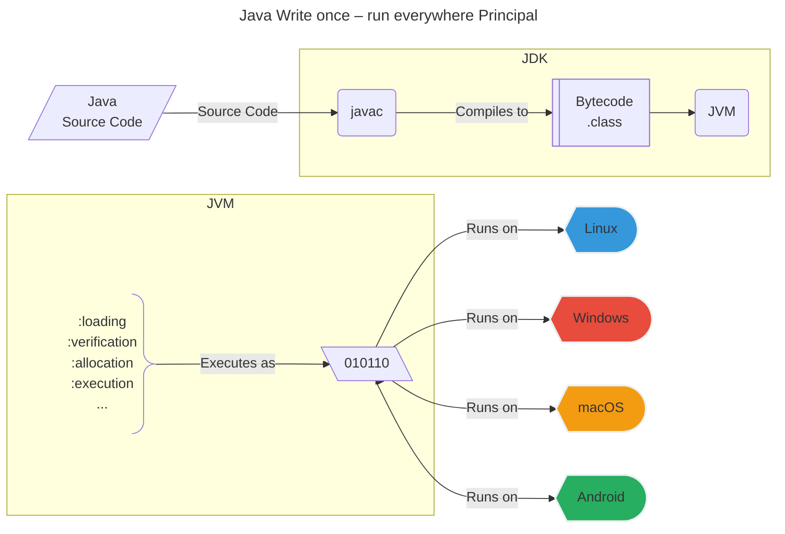
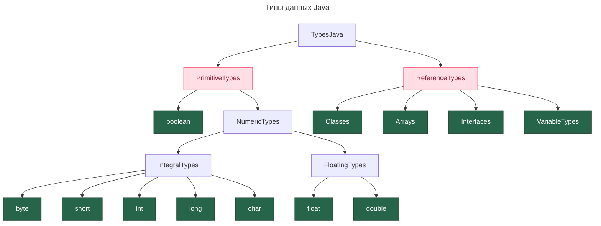

# основы java
## write once – run everywhere
этот девиз java говорит о том, что между исходным код компилируется в байт код, байт код передается в Java Virtual Machine, которая взаимодействует с ОС. JVM можно адоптировать под любую ОС и гарантирует нам работу одного кода на разных платформах.\



## структура проекта
- Все методы всегда внутри класса, ООП, строгая типизация
	- Статические методы можно вызывать не создавая экземпляр класса
	- `.class` файлы могу содержать класс, абстрактный класс, или интерфейс
		- Инициализировать можно только класс
		- Класс расширяет \[абстрактный\] класс
		- Интерфейс может быть имплементирован в \[абстрактном\] классе
- Типы файлов в проекте
    - `.class` - бинарный код, котоды получается в результате компиляции .java,
    - `.java` – исходный код ~ `<папка_проекта>/src/main/java`
    - `.class` – байткод, скомпилированный `.java`, ~ `<папка_проекта>/target/`
	- `MANIFEST.MF`
- `public static void main(String[] args)` – точкой входа в приложение
	- если в проекте несколько классов с таких методом, то 
		1. можно указать в явном виде при запуске приложения надо указать `java -cp jar-file-name main-class-name [args …]` 
		2. можно объявить в явном виде в файл `MANIFEST.MF`
			- `Main-Class: org.sample.HelloWorldApp`
- Пакет `java.lang` является базой языка. Импортируется в каждый класс  по-умолчанию. Поэтому нет необходимости его импортировать отдельно. Содержит напр. `Thread`, `String`
- `null` специальное значение, означает отсутствие ссылки на объект
# управляющие структуры
## операторы
### операторы перехода
* `break` прерывает цикл.  
* `continue` переходит к началу следующей итерации, пропуская все опраторы ниже  
* `return` возврат значения вызывающему методу
```Java
int i = 0;
while(i<=99){
    i += 3;
    System.out.println(i);
    if (i>60)
        break; // прервать весь цикл
    if(0==i%2){
        continue; // прервать текущую итеррацию цикла
    }
    System.out.println("this number is odd");
}
```
### оператор цикла
`do...while` гарантирует что тело цикла будет выполнено минимум 1 раз, вне зависимости от наличия условия выхода из цикла, так как итерация выполняется до проверки условий выхода.
```Java
// FOREACH
String[] strArrOne = {"один", "два", "три"};
for (String str:strArrOne) {
    System.out.println(str);
}
for (int j=5; j>=0; j--)
    System.out.println(j);
int i = 1;
while (i<5){
    i++;
    System.out.println(i);
}
int userInput;
do{
    System.out.println("give me int five");
    userInput = input.nextInt();
}while (5 != userInput );
```

### условный оператор
```Java
// Условный оператор
if( i > 10 )
    System.out.println("var i is over 10");
else if( i > 50 )
    System.out.println("var i is over 50");
else{
    i = 50;
    System.out.println("var i is equal to 50");
}
int day = 4;
switch (day) {
    case 6:
        System.out.println("Today is Saturday");
        break;
    case 7:
        System.out.println("Today is Sunday");
        break;
    default:
        System.out.println("Looking forward to the Weekend");
}
```
### специальные операторы
### `assert` проверка утверждений
Оператор проверки утверждений. Проверяет утверждение, выбрасывает `AssertionError` и прекращает выполнение.
Чтобы ассерты (утверждения) работали, надо запускать VM с директивой `-ea` or `-enableassertions`
```Java
public static void main(String[] args)
 {
    int x = -1;
    assert x >= 0;
    assert x >= 0 : "var x is more than expected";
 }
```
### `instanceof` — проверка класса объекта

### простые операторы 
`+, - , *, /, %` — modulo, остаток от целочисленного деления
### инкремент, декремент
`++i, --i` префиксная запись  
  
`i++, i--` постфиксная запись  
разница в том, что в постфиксной записи инкремент случится после того, как будет считано (передано) значение переменной  
### операторы присваивания
|     |                                                                                                                           |
| --- | ------------------------------------------------------------------------------------------------------------------------- |
| =   | Простой оператор присваивания, присваивает значения из правой стороны операндов к левому операнду                         |
| +=  | Оператор присваивания «Добавления», он присваивает левому операнду значения правого                                       |
| -=  | Оператор присваивания «Вычитания», он вычитает из правого операнда левый операнд                                          |
| *=  | Оператор присваивания «Умножение», он умножает правый операнд на левый операнд                                            |
| /=  | Оператор присваивания «Деление», он делит левый операнд на правый операнд                                                 |
| %=  | Оператор присваивания «Модуль», он принимает модуль, с помощью двух операндов и присваивает его результат левому операнду |
| <<= | Оператор присваивания «Сдвиг влево»                                                                                       |
| >>= | Оператор присваивания «Сдвиг вправо»                                                                                      |
| &=  | Оператор присваивания побитового «И» («AND»)                                                                              |
| ^=  | Оператор присваивания побитового исключающего «ИЛИ» («XOR»)                                                               |
| \|= | Оператор присваивания побитового «ИЛИ» («OR»)                                                                             |
### логические операторы
`&&, ||, !` — И, ИЛИ, НЕ.
### операторы сравнения
`==, !=, >, <, >=, <=`
### побитовые операторы
`&` (побитовое и)  
`|` (побитовое или)  
`^` (побитовое логическое или)  
`~` (побитовое дополнение)  
`<<` (сдвиг влево)  
`<<` (сдвиг вправо)  
`>>>` (сдвиг вправо)(нулевой вправо без знака)
```Java
public static void main(String args[]) {
   int a = 60;	    /* 60 = 0011 1100 */  
   int b = 13;	    /* 13 = 0000 1101 */
   int c = 0;
   c = a & b;       /* 12 = 0000 1100 */ 
   System.out.println("a & b = " + c );
   c = a | b;       /* 61 = 0011 1101 */
   System.out.println("a | b = " + c );
   c = a ^ b;       /* 49 = 0011 0001 */
   System.out.println("a ^ b = " + c );
   c = ~a;          /*-61 = 1100 0011 */
   System.out.println("~a = " + c );
   c = a << 2;     /* 240 = 1111 0000 */
   System.out.println("a << 2 = " + c );
   c = a >> 2;     /* 215 = 1111 */
   System.out.println("a >> 2  = " + c );
   c = a >>> 2;     /* 215 = 0000 1111 */
   System.out.println("a >>> 2 = " + c );
}
```
## потоки
Для создания потока, класс должен наследоваться от `extends Thread` [[Thread]]
У всех потоков есть приоритет, он задается в диапазоне 1— 10. Приоритет по-умолчанию 5. Для установки приоритета мтеод.
```Java
class Loader extends Thread {
    public void run() {
        System.out.println("Hello");
    }
}
class MyClass {
    public static void main(String[ ] args) {
        Loader obj = new Loader();
        obj.start();
    }
}
```
- `void run()` описывает действия в потоке
- `.start()` запускает поток
- `.sleep(int delay)` ставит поток на паузу
- `.setPriority(int priopity)` установить приоритет потока
Другой способ создания потока - через имплементацию исполняемого интерфейса, `implements Runnable`. Он подходит когда, есть необходимо наследовать класс с потоком от родителя.
```Java
class Loader implements Runnable {
    public void run() {
        System.out.println("Hello");
    }
}
class MyClass {
    public static void main(String[ ] args) {
        Thread t = new Thread(new Loader());
        t.start();
    }
}
```

## исключения
Исключения бывают контролируемые `checked` и некотролируемые `unchecked (runtime)`**.** Разница в том, что контролируемые исключения проверяются на этапе компиляции, а неконтролируемые на этапе выполнения.
[[Exception]]
- Ловим исключение
    
    ```Java
    public class MyClass {
        public static void main(String[ ] args) {
            try {
                int a[ ] = new int[2];
                System.out.println(a[5]);
            } catch (Exception e) {
                System.out.println("An error occurred");
            } catch (InputMismatchException e) {
    	        System.out.println("Mistake: wrong value type");
    	    }
        }
    }
    ```
    
- Выбрасываем исключение
    
    ```Java
    public class Program {
        static int div(int a, int b) throws ArithmeticException {
            if(b == 0) {
                throw new ArithmeticException("Division by Zero");
            } else {
                return a / b;
            }
        }
        public static void main(String[] args) {
            System.out.println(div(42, 0));
        }
    
    }
    ```
    
## приведение типов – casting
```Java
public static void main(String[] args) {
        double a = 42.571;
        int b = (int) a;
        System.out.println(b); // 42
    }
}
```
### boxing / unboxing
`boxing` **—** Создание объекта-оболочки из переменной примитивного типа называется упаковкой , а получение значения примитивного типа из объекта-оболочки — распаковкой `unboxing`.
```Java
int a = 5; // Integer a = 5; -- упакованный вариант переменной boxed
ArrayList list = new ArrayList();
String s = a.toString(); // ERROR, когда unboxed
list.add(a))             // OK, но произойдет автоупаковка
                         // и в коллекцию будет помещен Integer
```
- Компилятор по необходимости делает автоупаковку и автораспаковку
    
    ```JavaScript
    int a = 5;
    Integer b = 10;
    a = b;             // OK, атораспаковка
    b = a * 123;       // OK, автоупаковка
    ```
    
Все объекты-оболочки - неизменяемые (`**immutable**`) типы, т.е. когда мы присваиваем им новое значение, фактически на замену прежнему объекту создается новый.

# типы данных
**Примитивные** типы данных всегда хранят в себе значение. **Ссылочные типы** всегда начинается с Большой буквы, так как является классом.

иерархия типов




- ## Примитивные типы – Primitive Types
- `byte`, `short`, `int`, `long` — целочисленные типы    
- `float`, `double` — вещественные типы данных    
- `boolean` — логический
- `char` — символьный
- `[ref]` – ссылка

Сколько [[software-engineer/стандарты/Память ЭВМ|памяти]] используют примитивные типы java

## Ссылочные типы – Reference Types
- К ним относятся все классы, интерфейсы, массивы, а также тип данных String. Не хранят значение, а являются ссылкой на объект заданного типа.
-  Enum type
	- An `Enum` is a special type used to define collections of constants
		```Java
		   public class Program {
			  enum Rank {
				 SOLDIER,
				 SERGEANT,
				 CAPTAIN
			  }
			  public static void main(String[] args) {
				 Rank a = Rank.SOLDIER;
		   
				 switch(a) {
					case SOLDIER:
					    System.out.println("Soldier says hi!");
					    break;
					case SERGEANT:
					    System.out.println("Sergeant says Hello!");
					    break;
					case CAPTAIN:
					    System.out.println("Captain says Welcome!");
					    break;
				 }
			  }
		   }
		```
- [[record type]]

## ссылки на объекты

[[Java Reference]]
# hello world
```Java
public class HelloWorld {
    public static void main(String [] args){
        System.out.println("hello world");
    }
}
```
## Файлы
### Чтение файлов
```Java
import java.io.File;
import java.util.Scanner;
public class MyClass {
	public static void main(String[] args) {
    String pathname = "C:\\sololearn\\test.txt";
    File x = new File(pathname);
    if(x.exists()) {
        System.out.println(x.getName() +  "exists!");
    }
    else {
        System.out.println("The file does not exist");
        try {
            Scanner sc = new Scanner(x);
            while(sc.hasNext()) {
                System.out.println(sc.next());
            }
            sc.close();
        }
        catch (FileNotFoundException e) {
            System.out.println(e);
        }
    }
}
```
### Запись в файл
java.io метод
```Java
import java.io.File;
import java.io.IOException;
try {
	FileUtils.writeStringToFile(new File("1.txt"), "test", StandardCharsets.UTF_8, true);
} catch (IOException e) {
    System.out.println(e);
}
```
Стандартные утилиты для записи файлов в пакет `java.util.Formatter`
```Java
import java.io.File;
import java.util.Scanner;
import java.util.Formatter;
public class MyClass {
    public static void main(String[ ] args) {
        try {
            Formatter f = new Formatter("test.txt");
            f.format("%s %s %s", "1","John", "Smith \r\n");
            f.format("%s %s %s", "2","Amy", "Brown");
            f.close();
            File x = new File("test.txt");
            Scanner sc = new Scanner(x);
            while(sc.hasNext()) {
                System.out.println(sc.next());
            }
            sc.close();
        } catch (Exception e) {
	        System.out.println("Error");
        }
    }
}
```
Буферизованная запись в файл.
```Java
FileWriter fw = null;
try {
    fw = new FileWriter(fileName);
    BufferedWriter bw = new BufferedWriter(fw);
    bw.write("looong data");
    bw.flush();
} catch (IOException e) {
    e.printStackTrace();
} finally {
    try {
        if (fw != null) {
            fw.close();
        }
    } catch (IOException e) {
        e.printStackTrace();
    }
}
```
## Ввод данных
```Java
import java.util.Scanner;
Scanner input = new Scanner(System.in);
System.out.println("gi <br><br><br><br><br><br><br><br><br><br>ыыф<br><br><br><br><br><br> r><br> next());
```
# ключевые слова
## `default` метод
Используется в интерфейсах. Позволяет описать реализацию метода, которая будет автоматически уснаследована потомками (имплементаторами). Это позвляет расширять возмождности реализаций, хозяину интерфейса, без изменения самих реализаций
## `transient` поле
говорит о том, что данное поле не должно быть сериализовано. Поля, помеченные ключевым словом `transient` не серилизуются.
## `native` метод
говорит о том, что данная програмная сущность реализована на другом языке
## `synchronized` метод
говорит о том, что данный метод может быть заблокирован, для других потоков, если первый поток его использует.
## `volatile` поле
говорит о том, к данное поле испоьзуют методы блокирующей синхронизации. Модификатор обозначает поле видимости для потоков.
## `static` поле, метод
static поле, которе будет общее для всех экземпляров класса
static method можно вызвать без инициализации класса
## `final` класс
class is simply a class that can't be extended
## `final` поле
поле, которое не может быть изменено. константа.
## `final` поле
поле, которое не может быть изменено. константа.
## `sealed`, `non-sealed`, `permits` класс
`sealed` — “запечатанный” класс говорит о том. Запрещает расширение (наследование) для любых субклассов за исключением тех, которые указаны в модификаторе `permits`. Наследник запечатанного класса всегда должен быть `final`, `sealed` либо `non-sealed`
```Java
public sealed class Device permits Computer, Mobile {
	//...
}
public final class Computer extends Device{
	//...
}
```
Запечатанными могут быть интерфейсы и записи. Фича поддерживаются с jdk-17.
## `abstract` класс
класс, который не требует реализации и не может рождать сущности.
## `abstract` метод
метод, который не требует реализации. если в класс есть хотябы 1 abstract метод, класс должен быть abstract
# синтаксический сахар
## … — троеточие в типе параметра метода
- Означает что на вход может поступить любое количество объектов заданного типа либо массив, которые будут доступны в теле метода как массив объектов.
    
    ```Java
    public static void dotsParameterType(String... strings) {
        System.out.println("input is "+String.join(", ", strings));
      }
    public static void main(String[] args) {
      dotsParameterType();
      dotsParameterType("one", "two", "three");
      dotsParameterType("solo");
      dotsParameterType(new String[]{"a", "b", "c"});
    }
    ```
    
## троичный оператор — (…)?{…}:{…}
```Java
//variable = (condition) ? expressionTrue :  expressionFalse;
var x = 10;
Boolean isEven = (0==x%2) ? true : false;
System.out.println(isEven);
```
## coma separated variables declaration style
```Java
int a=1, b=2, c=3;
System.out.println(a+b+c);
```
## `arrow operator` → стрелочный оператор
Служит для обозначения стрелочной функции — `лямбда функция`.
```XML
BiFunction<Integer, Integer, Integer> sum = (a, b) -> Math.abs(a + b);
System.out.println(sum.apply(-722, -55));
```
### лямбда функция — λ-функция
Лямбда-выражения или анонимные функции — это блоки кода с параметрами, которые можно вызвать из другого места программы. Они называются анонимными, потому что в отличие от функций, у них нет имён.
# refs
[[Class]]
[[Generic]]
[[record type]]
[[Exception]]
[[JDK JLS JNI]]
