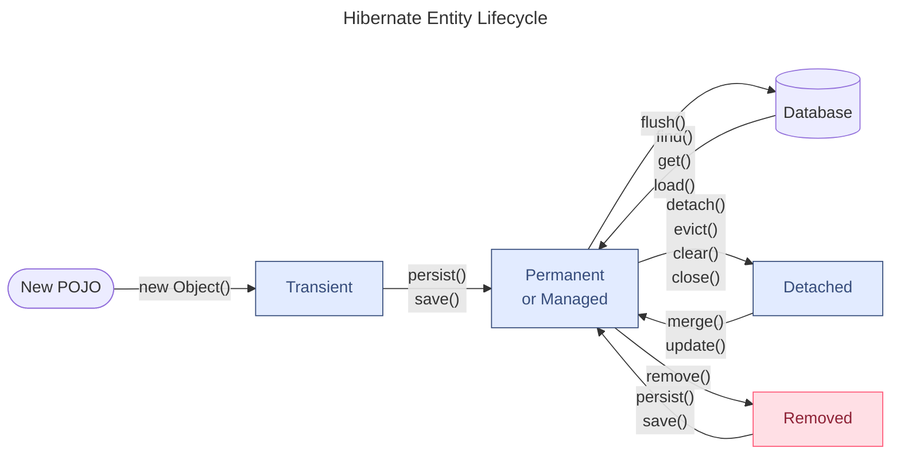
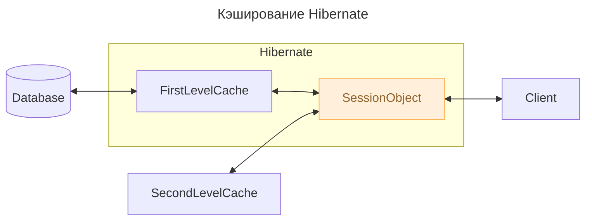

---
aliases:
  - hibernate
  - LazyInitializationException
  - Java Persistence API
  - JPA
  - n+1
---
Hibernate -- имплементация апи [[Java Persistence API]]
# JPA Entity Graph

> [!info] JPA Entity Graph | Baeldung  
> Load related associations using the JPA Entity Graph feature.  
> [https://www.baeldung.com/jpa-entity-graph](https://www.baeldung.com/jpa-entity-graph)  
Основная цель JPA Entity Graph - улучшить производительность в рантайме при загрузке базовых полей сущности и связанных сущностей и коллекций. Вкратце, Hibernate загружает весь граф в одном SELECT-запросе, то есть все указанные связи от нужной нам сущности.
Он позволяет определить шаблон путем группировки связанных полей, которые мы хотим получить, и позволяет нам выбирать тип графа во время выполнения.
## `@NamedEntityGraph`
- The `@NamedEntityGraph` annotation allows specifying the attributes to include when we want to load the entity and the related associations.
    
    ```Java
    @NamedEntityGraph(
      name = "post-entity-graph-with-comment-users",
      attributeNodes = {
        @NamedAttributeNode("subject"),
        @NamedAttributeNode("user"),
        @NamedAttributeNode(value = "comments", subgraph = "comments-subgraph"),
      },
      subgraphs = {
        @NamedSubgraph(
          name = "comments-subgraph",
          attributeNodes = {
            @NamedAttributeNode("user")
          }
        )
      }
    )
    @Entity
    public class Post {
    
        @OneToMany(mappedBy = "post")
        private List<Comment> comments = new ArrayList<>();
        //...
    }
    ```
    
### `@NamedSubgraph`
`@NamedSubgraph` позволяет указать атрибуты которые мы хотим выгружать из дочерней сущности. Таким образом, мы можем построить полный граф.
- Описание EntityGraph-ов можно так же произвести на JPA API
    
    ```Java
    EntityGraph<Post> entityGraph = entityManager.createEntityGraph(Post.class);
    entityGraph.addAttributeNodes("subject");
    entityGraph.addAttributeNodes("user");
    entityGraph.addSubgraph("comments")
      .addAttributeNodes("user");
    ```
- Описание EntityGraph-ов можно так же произвести на XML
# N+1 problem in JPA & Hibernate
Проблема N+1 в SQL состоит в неоптимальной конфигурации NativeQuery-запросов когда нам требуется приобщить к данным информацию из иерархически более высокой таблицы. Неопытный разработчик может может начать опрашивать иерархически более высокую таблицу по FOREIGN_KEY в полученной выборке.
- Решается проблема простым простым INNER JOIN -ом
    
    ```Java
    List<Tuple> comments = entityManager.createNativeQuery("""
        SELECT
            pc.id AS id,
            pc.review AS review,
            p.title AS postTitle
        FROM post_comment pc
        JOIN post p ON pc.post_id = p.id
        """, Tuple.class)
    .getResultList();
    ```
    
Для того чтобы обойти эту проблему в Hibernate в зависимости от ситуации надо использовать методы
- **`JOIN FETCH`** — HQL-запрос, который позволит в 1 запрос прочитать сущность со всеми связями при @ManyToMany
- `**FetchType.LAZY**` — параметр нотации связей для поля (внутри нотации @OneToMany(), etc)
- `@LazyCollection(LazyCollectionOption.TRUE)`
- `@LazyCollection(LazyCollectionOption.EXTRA)`
    - часто может выступать как оптимальный вариант для `@ManyToMany`-связи
    - НО! может провоцировать N+1 проблему в если обходить в цикле значения полученной коллекции
# Hibernate ORM Framework
[https://docs.jboss.org/hibernate/orm/5.3/userguide/html_single/Hibernate_User_Guide.html](https://docs.jboss.org/hibernate/orm/5.3/userguide/html_single/Hibernate_User_Guide.html)
[http://proselyte.net/tutorials/hibernate-tutorial/architecture/](http://proselyte.net/tutorials/hibernate-tutorial/architecture/)
Hibernate Framework — это фреймворк для языка Java, предназначенный для работы с базами данных. Он реализует ==объектно-реляционную модель — технологию, которая «соединяет» программные сущности и соответствующие записи в базе==.
Hibernate построен на спецификации JPA 2.1 — наборе правил, который описывает взаимодействие программных объектов с записями в базах данных. JPA поясняет, как управлять сохранением данных из кода на Java в базу. Но сама по себе спецификация — только теоретические правила, а в «чистой» Java ее реализации нет. ==Hibernate — одна из самых популярных реализаций== **==JPA==** ==на рынке==.
Главная функция Hibernate заключается в том, что мы можем взять значения из нашего Java-класса и отобразить его в таблице базы данных. С помощью конфигурации мы указываем Hibernate как извлечь данные из класса и соединить с определённым столбцами в таблице БД.
## Как отслеживать SQL операции Hibernate в логе?
- Можно вызвать метод `LOGGER.info` относительно коллекции, возвращенной запросом
    
    ```Java
    List<PostComment> comments = entityManager.createQuery("""
        select pc
        from PostComment pc
        join fetch pc.post p
        """, PostComment.class)
    .getResultList();
     
    for(PostComment comment : comments) {
        LOGGER.info(
            "The Post '{}' got this review '{}'",
            comment.getPost().getTitle(),
            comment.getReview()
        );
    }
    ```
    
    - в терминала увидим
        
        ```Java
        SELECT p.id AS id1_0_0_, p.title AS title2_0_0_ FROM post p WHERE p.id = 1
        -- The Post 'High-Performance Java Persistence - Part 1' got this review
        -- 'Excellent book to understand Java Persistence'
         
        SELECT p.id AS id1_0_0_, p.title AS title2_0_0_ FROM post p WHERE p.id = 2
        -- The Post 'High-Performance Java Persistence - Part 2' got this review
        -- 'Must-read for Java developers'
         
        SELECT p.id AS id1_0_0_, p.title AS title2_0_0_ FROM post p WHERE p.id = 3
        -- The Post 'High-Performance Java Persistence - Part 3' got this review
        -- 'Five Stars'
         
        SELECT p.id AS id1_0_0_, p.title AS title2_0_0_ FROM post p WHERE p.id = 4
        -- The Post 'High-Performance Java Persistence - Part 4' got this review
        -- 'A great reference book'
        ```
        
# Hibernate Entity Lifecycle

Каждой `Entity` всегда находится в одном из 4 состояний: 

$$Transient → Persistent (Managed) → Detached → Removed$$    



- `evict()` — изгнать
## Transient — краткосрочный
- Это объект, который создан вручную, как POJO, а не загруженный из базы. Особенность объекта в том, что Hibernate не учитывает этот объект, и действия с объектом не влияют на Hibernate
    
    ```Java
    EmployeeEntity employee = new EmployeeEntity();
    ```
    
## Persistent (Managed) — управляемый
- Самый распространенный случай – это объекты, связанный с движком Hibernate. Для того, чтобы перевести объект в это состояние надо Загрузить объект из Hibernate или Сохранить объект в Hibernate.
    
    ```Java
    Employee employee = session.load(Employee.class, 1);
    // OR
    Employee employee = new Employee ();
    session.save(employee);
    ```
    
      
    
## Detached — отделенный
- Состояние, в котором находится объект, когда он был отключен от сессии, когда транзакция закрыта. 
    
    ```Java
    session.close();
    session.evict(entity);
    ```
    
## Removed
- Состояние, когда объект удален из базы, но остался в Java
    
    ```Java
    Employee employee = session.load(Employee.class, 1);
    //после загрузки у объекта состояние Persisted
    session.remove(employee);
    //после удаления у объекта состояние Removed
    session.save(employee);
    //а теперь снова Persisted
    session.close();
    //а теперь состояние Detached
    ```
    
# Session — Сессии
Сессия используется для получения физического соединения с базой данных (далее – БД). Сессию создают (открывают сессию) каждый раз, когда возникает необходимость, а потом, когда необходимо, уничтожают (закрывают сессию).
- Мы стараемся создавать сессии при необходимости, а затем уничтожать их из-за того, что ни не являются потокозащищёнными и не должны быть открыты в течение длительного времени.
    
    ```Java
    Session session = sessionFactory.openSession();
    Transaction transaction = null;
    try{
        transaction = session.beginTransaction();    
        /**
         * Here we make some work.
        **/
        transaction.commit();
    }catch(Exception e){
        if(transaction !=null){
            transaction.rollback();
            e.printStackTrace();
        }
        e.printStackTrace();
    }finally{
        session.close();
    }
    ```
    
- Основные методы
    
    ```Java
    Transaction beginTransaction()
    //Начинает транзакцию и возвращает объект Transaction.
    
    void cancelQuery()
    //Отменяет выполнение текущего запроса.
    
    void clear()
    //Полностью очищает сессию
    
    Connection close()
    //Заканчивает сессию, освобождает JDBC-соединение и выполняет очистку.
    
    Criteria createCriteria(String entityName)
    //Создание нового экземпляра Criteria для объекта с указанным именем.
    
    Criteria createCriteria(Class persistentClass)
    //Создание нового экземпляра Criteria для указанного класса.
    
    Serializable getIdentifier(Object object)
    //Возвращает идентификатор данной сущности, как сущности, связанной с данной сессией.
    
    void update(String entityName, Object object)
    void update(Object object)
    //Обновляет экземпляр с идентификатором, указанном в аргументе.
    
    void saveOrUpdate(Object object)
    //Сохраняет или обновляет указанный экземпляр.
    
    Serializable save(Object object)
    //Сохраняет экземпляр, предварительно назначив сгенерированный идентификатор.
    
    boolean isOpen()
    //Проверяет открыта ли сессия.
    
    boolean isDirty()
    //Проверят, есть ли в данной сессии какие-либо изменения, которые должны быть синхронизованы с базой данных (далее – БД).
    
    boolean isConnected()
    //Проверяет, подключена ли сессия в данный момент.
    
    Transaction getTransaction()
    //Получает связанную с этой сессией транзакцию.
    
    void refresh(Object object)
    //Обновляет состояние экземпляра из БД.
    
    SessionFactory getSessionFactory()
    //Возвращает фабрику сессий (SessionFactory), которая создала данную сессию.
    
    Session get(String entityName, Serializable id)
    //Возвращает сохранённый экземпляр с указанными именем сущности и идентификатором. Если таких сохранённых экземпляров нет – возвращает null.
    
    void delete(String entityName, Object object)
    //Удаляет сохранённый экземпляр из БД.
    
    void delete(Object object)
    //Удаляет сохранённый экземпляр из БД.
    
    SQLQuery createSQLQuery(String queryString)
    //Создаёт новый экземпляр SQL-запроса (SQLQuery) для данной SQL-строки.
    
    Query createQuery(String queryString)
    //Создаёт новый экземпляр запроса (Query) для данной HQL-строки.
    
    Query createFilter(Object collection, String queryString)
    //Создаёт новый экземпляр запроса (Query) для данной коллекции и фильтра-строки.
    ```
    
Экземпляр сессии может находиться в одном из трёх состояний:
## **transient**
Это новый экземпляр устойчивого класса, который не привязан к сессии и ещё не представлен в БД. Он не имеет значения, по которому может быть идентифицирован.
## **persistent**
Мы модем создать переходный экземпляр класса, связав его с сессией. Устойчивый экземпляр класса представлен в БД, а значение идентификатора связано с сессией.
## **detached**
После того как сессия закрыта, экземпляр класса становится отдельным, независимым экземпляром класса.
# Основные aннотации Hibernate JPA
[https://docs.jboss.org/hibernate/orm/5.3/userguide/html_single/Hibernate_User_Guide.html](https://docs.jboss.org/hibernate/orm/5.3/userguide/html_single/Hibernate_User_Guide.html)
## @Entity
- Эта аннотация указывает Hibernate, что данный класс является сущностью (entity bean). Такой класс должен иметь конструктор по-умолчанию (пустой конструктор).
    
    ```Java
    @Entity
    @Table(name = "HIBERNATE_DEVELOPERS")
    public class Developer {
        @Id
        @GeneratedValue (strategy = GenerationType.AUTO)
        @Column (name = "id")
        private int id;
        @Column (name = "FIRST_NAME")
        private String firstName;
        @Column (name = "LAST_NAME")
        private String lastName;
        @Column (name = "SPECIALTY")
        private String specialty;
        @Column (name = "EXPERIENCE")
        private int experience;
    
        /**
         * Default Constructor
         */
        public Developer() {
        }
    }
    ```
    
### @Table
- С помощью этой аннотации мы говорим Hibernate, с какой именно таблицей необходимо связать (map) данный класс. Аннотация @Table имеет различные атрибуты, с помощью которых мы можем указать имя таблицы, каталог, БД и уникальность столбцов в таблиц БД.
    
    ```Java
    @Table(name="CUST", schema="RECORDS")
    ```
    
### @Id
С помощью аннотации @Id мы указываем первичный ключ (Primary Key) данного класса.
### @GeneratedValue
Эта аннотация используется вместе с аннотацией @Id и определяет такие параметры, как `strategy` и `generator`.
### @Column
Аннотация @Column определяет к какому столбцу в таблице БД относится конкретное поле класса (атрибут класса).
Наиболее часто используемые атрибуты аннотации @Column такие: **name**, **unique**, **nullable**, **length**
## @OrderBy
- указание сортировки. В примере множество кошек будет отсортировано по имени по возрастанию.
    
    ```Java
    @Table(name = "cat_table")
    public class Cat implements Serializable {
     
     @OrderBy("firstName asc")
     private Set catsSet; 
    ...
    }
    ```
    
## @Transient
- указывает, что свойство не нужно записывать. Значения под этой аннотацией не записываются в базу данных (также не участвуют в сериализации). static и final переменные экземпляра всегда transient.
    
    ```Java
    @Entity
    @Table(name = "cat_table")
    public class Cat implements Serializable {
     
     @Transient
      public boolean isNew() {
          return id == null;
       }
    
    ...
    }
    ```
    
## @Temporal
- применяется к полям или свойствам с типом java.util.Date и java.util.Calendar. Например, если в БД время сохраняется как sql.Date, то чтобы использовать дату из java.util.Date указываем эту аннотацию.
    
    ```Java
    public class Cat implements Serializable {
    
      private java.util.Date birthDate; //in DB schema uses sql.Date in column BIRTH_DATE. 
    
      @Temporal(TemporalType.DATE)
      @Column(name = "BIRTH_DATE")
      public Date getBirthDate() {
    	  return this.birthDate;
      }
    ...
    }
    ```
    
## @Embeddable, @Embedded
- Определяет класс, экземпляры которого хранятся как неотъемлемая часть исходного объекта. Каждый из @Embedded экземпляров сопоставляется с таблицей базы данных сущности.
    
    ```Java
    @Embeddable public class Address {
       protected String street;
       protected String city;
       protected String state;
       @Embedded protected Zipcode zipcode;
    }
    
    @Embeddable public class Zipcode {
       protected String zip;
       protected String plusFour;
     }
    ```
    
## Аннотации связей — `@OneToMany`, `@JoinColumn` ….
- `@OneToOne(orphanRemoval, mappedBy, cascade)`
    - `CascadeType.ALL` — означает, что операция, например, записи должна распространяться и на дочерние таблицы.
    - `mappedBy` — обратная сторона связи сущности. связано с `@JoinColumn`
    - `orphanRemoval` — позволяет удалять объекты сироты. При удалении родительского объекта удаляется и дочерний.
- `@OneToMany` — указывает на связь один ко многим. Применяется с другой стороны от сущности с `@ManyToOne`
    
    ```Java
    @Entity
    public class Troop {
        @OneToMany(mappedBy="troop")
        public Set<Soldier> getSoldiers() {
        ...
    }
    
    @Entity
    public class Soldier {
        @ManyToOne
        @JoinColumn(name="troop_fk")
        public Troop getTroop() {
        ...
    }
    ```
    
- `@JoinColumn` — применяется когда внешний ключ находится в одной из сущностей. Может применяться с обеих сторон взаимосвязи.
    
    ```Java
    @Entity
    @Table(name = "contactDetail")
    public class ContactDetail implements Serializable {
     
      @Id
      @Column(name = "id")
      @GeneratedValue
      private int id;
       
      @OneToOne
      @MapsId
      @JoinColumn(name = "contactId")
      private Contact contact;
       
      ...
    }
     
    @Entity
    @Table(name = "contact")
    public class Contact implements Serializable {
     
      @Id
      @Column(name = "ID")
      @GeneratedValue
      private Integer id;
     
      @OneToOne(mappedBy = "contact", cascade = CascadeType.ALL)
      private ContactDetail contactDetail;
     
      ....
    }
    ```
    
- `@PrimaryKeyJoinColumn` — главный ключ для ассоциированной сущности с таким же ключом
- `@ManyToMany`
    
    ```Java
    @Entity
    @Table(name = "contact")
    public class Contact implements Serializable {
    
    private Set<Hobby> hobbies = new HashSet<Hobby>();
    //...
    	@ManyToMany
    	@JoinTable(name = "contact_hobby_detail", 
    	      joinColumns = @JoinColumn(name = "CONTACT_ID"), 
    	      inverseJoinColumns = @JoinColumn(name = "HOBBY_ID"))
    	public Set<Hobby> getHobbies() {
    		return this.hobbies;
    	}
    ....
    }
    
    @Entity
    @Table(name = "hobby")
    public class Hobby implements Serializable {
    
    private Set<Contact> contacts = new HashSet<Contact>();
    //...
    
           @ManyToMany
           @JoinTable(name = "contact_hobby_detail", 
    	      joinColumns = @JoinColumn(name = "HOBBY_ID"), 
    	      inverseJoinColumns = @JoinColumn(name = "CONTACT_ID"))
    	public Set<Contact> getContacts() {
    		return this.contacts;
    	}
    }
    ```
    
### FetchType **EAGER vs LAZY — стратегии загрузки полей сущности**
- Параметр `FetchType` описывает ==стратегию загрузки полей сущности== из родительского объекта в реляционной структуре.
    
    > fetch — извлечь  
    > eager — жаждущий  
    > lazy — ленивый  
    
```Java
@OneToMany(fetch = FetchType.LAZY, mappedBy = "user")
```
- `**FetchType.EAGER**`**,** родительской сущности ==будут загружены и все ее дочерние сущности==. Кроме того, Hibernate постарается сделать это одним SQL-запросом, сгенерировав здоровенный запрос и сразу получив все данные.
    - Hibernate устанавливает по-умолчанию для связей `==@OneTo==`**`==One==`**, ==`@ManyTo`==**==`One`==**
- `**FetchType.LAZY**`, то при загрузке родительской сущности, дочерняя сущность загружена не будет. Вместо нее ==будет создан proxy-объект==.
    - Hibernate устанавливает по-умолчанию для связей ==`@OneTo`==**==`Many`==**, ==`@ManyTo`==**==`Many`==**
### `@LazyCollection(LazyCollectionOption.TRUE)`
- Нотация указывается при маппинге полей
    
    ```Java
    @Entity
    @Table(name="user")
    class User {
       @Column(name="id")
       public Integer id;
    
       @OneToMany(cascade = CascadeType.ALL)
       @LazyCollection(LazyCollectionOption.TRUE)
       @OrderColumn(name = "order_id")
       public List<Comment> comments;
    }
    ```
    
- `LazyCollectionOption.``**TRUE**`
    - Аналогично `FetchType.LAZY`
- `LazyCollectionOption.``**FALSE**`
    - Аналогично `FetchType.EAGER`
- `LazyCollectionOption.``**EXTRA**`
    - ==Позволяет адресно загружать данные из подчиненной таблицы==, если зада `**@OrderColumn**``(name = "order_id")`
        
        ```Java
        User user = session.load(User.class, 1);
        List<Comment> comments = user.getComments();
        int count = commetns.size();
        Comment comment = commetns.get(3);
        ```
        
    - Максимальная ==эффективность достигается на== `@ManyToMany` ==связях==
        
        ```Java
        @Entity
        @Table(name=”employee”)
        class Employee {
           @Column(name=”id”)
           public Integer id;
        
           @ManyToMany(cascade = CascadeType.ALL)
           @JoinTable(name="employee_task",
               	joinColumns=  @JoinColumn(name="employee_id", referencedColumnName="id"),
               	inverseJoinColumns= @JoinColumn(name="task_id", referencedColumnName="id") )
           @LazyCollection(LazyCollectionOption.EXTRA)
           private Set<EmployeeTask> tasks = new HashSet<EmployeeTask>();
        }
        // ...
        @Entity
        @Table(name=”task”)
        class EmployeeTask {
           @Column(name=”id”)
           public Integer id;
        
           @ManyToMany(cascade = CascadeType.ALL)
           @JoinTable(name="employee_task",
               	joinColumns=  @JoinColumn(name="task_id", referencedColumnName="id"),
               	inverseJoinColumns= @JoinColumn(name=" employee_id", referencedColumnName="id") )
           @LazyCollection(LazyCollectionOption.EXTRA)
           private Set<Employee> employees = new HashSet<Employee>();
        }
        // ...
        Employee director = session.find(Employee.class, 4);
        EmployeeTask task = session.find(EmployeeTask.class, 101);
        task.employees.add(director);
        
        session.update(task);
        session.flush();
        
        /*
        ⇒ в таблицу employee_task будет добавлена запись 
           (4, 101) → (employee_id task_id)
           без всякий чтений коллекций
        */
        ```
        
    - ==Порождает N+1 проблему== при чтении в цикле
        
        ```Java
        User user = session.load(User.class, 1);
        List<Comment> comments = user.getComments();
        for (Comment comment : comments) {
            System.out.println(comment);
        }
        ```
        
## Аннотации запросов
- `@NamedQueries` — список именованных запросов
    
    - внутри указывается список именованных запросов.
    - `@NamedQuery` — имя именованного запроса и сам запрос.
    
    ```Java
    @NamedQueries({
            @NamedQuery(
                    name = "getContactsQuery",
                    query = "from ContactEntity ce where ce.id >= :insertId"
            })
    )
    @Entity
    @Table(name = "contact", schema = "", catalog = "javastudy")
    public class ContactEntity {...}
    
    Session session = HibernateSessionFactory.getSessionFactory().openSession();
    Transaction tx = session.beginTransaction();
    Query query = session.getNamedQuery("getContactsQuery").setString("insertId", "10");
    List contactEntity = query.list();
    tx.commit();
    session.close();
    ```
    
- `@SqlResultSetMapping` — куда будет собран результат
    
    - `@EntityResult` — указание сущности в которой будет сконструирован результат.
    
    ```Java
    @SqlResultSetMapping(
            name = "nativeSqlResult",
            entities = @EntityResult(entityClass = ContactEntity.class)
    )
    public class ContactEntity {...}
    public List<ContactEntity> findAllByNativeQuery2() {
        return em.createNativeQuery(ALL_CONTACT_NATIVE_QUERY, "nativeSqlResult").getResultList();
    }
    ```
    
  
# HQL — Hibernate Query Language
Отличие между HQL и SQL состоит в том, что SQL работает таблицами в базе данных (далее – БД) и их столбацами, а HQL – с сохраняемыми объектами (Persistent Objects) и их полями (аттрибутами класса).
- FROM
    
    ```Java
    Query query = session.createQuery("FROM Developer");
       List developers = query.list();
    ```
    
- INSERT
    
    ```Java
    Query query = 
               session.createQuery("INSERT INTO Developer (firstName, lastName, specialty, experience)");
    ```
    
- UPDATE
    
    ```Java
    Query query = 
          session.createQuery(UPDATE Developer SET experience =: experience WHERE id =: developerId);
       query.setParameter("expericence", 3);
    ```
    
- SELECT
    
    ```Java
    Query query = session.createQuery("SELECT D.lastName FROM Developer D");
       List developers = query.list();
    ```
    
## Методы агрегации
Язык запросов Hibernate (HQL) поддерживает различные методы агрегации, которые доступны и в SQL. HQL поддерживает следующие методы:
- min(имя свойства)
- max(имя свойства)
- sum(имя свойства)
- avg(имя свойства)
- count(имя свойства)
## Criteria API
Hibernate поддерживает различные способы манипулирования объектами и транслирования их в таблицы баз данных (далее – БД). Одним из таких способов является Criteria API, который позволяет нам создавать запросы с критериями, программным методом.
Для создания Criteria используется метод createCriteria() интерфейса Session. Этот метод возвращает экземпляр сохряаняемого класса (persistent class) в результате его выполнения.
```Java
Criteria criteria = session.createCriteria(Developer.class);
List developers = criteria.list();
// -----
public void listDevelopersOverThreeYears() {
    Session session = sessionFactory.openSession();
    Transaction transaction = null;
    transaction = session.beginTransaction();
    Criteria criteria = session.createCriteria(Developer.class);
    criteria.add(Restrictions.gt("experience", 3));
    List developers = criteria.list();
    for (Developer developer : developers) {
        System.out.println("=======================");
        System.out.println(developer);
        System.out.println("=======================");
    }
    transaction.commit();
    session.close();
}
```
### пагинация результатов критерия
```Java
public Criteria setFirstResult(int firstResult)
//Этот метод указывает первый ряд нашего результата, который начинается с 0.
public Criteria setMaxResults(int maxResults)
//Этот методограничивает максимальное количество оъектов, которое Hibernate сможет получить в результате запроса.
```
### JOIN FETCH запросы — ВРУБИСЬ В ЭТО
Проблема: Нужно как-то объяснить Hibernate, что мы хотим, чтобы он сразу загрузил все дочерние объекты для наших родительских объектов.

> [!info] Курс Модуль 4. Работа с БД - Лекция: JOIN FETCH  
> Описание проблемы.  
> [https://javarush.com/quests/lectures/questhibernate.level14.lecture03](https://javarush.com/quests/lectures/questhibernate.level14.lecture03)  
# Кэширование Hibernate




Для того, что кэширование стало доступным для нашего приложения мы должны активировать его следующим образом:
```Java
Session session = sessionFactory.openSession();
Query query = session.createQuery(“FROM HIBERNATE_DEVELOPERS”);
query.setCacheable(true);
query.setCacheRegion(“developer”);
List developers = query.list();
sessionFactory.close();
```
## Кэш первого уровня — First Level Cache
Кэш первого уровня – это кэш Сессии (Session), который является обязательным. Через него проходят все запросы. Перед тем, как отправить объект в БД, сессия хранит объект за счёт своих ресурсов.
В том случае, если мы выполняем несколько обновлений объекта, Hibernate старается отсрочить (насколько это возможно) обновление для того, чтобы сократить количество выполненных запросов. ==Если мы закроем сессию, то все объекты, находящиеся в кэше теряются, а далее – либо сохраняются, либо обновляются.==
## Кэш второго уровня — Second level Cache
Кэш второго уровня является необязательным (опциональным) и изначально Hibernate будет искать необходимый объект в кэше первого уровня. В основном, кэширование второго уровня отвечает за кэширование объектов
## Кэш запросов — Query Cache
В Hibernate предусмотрен кэш для запросов и он интегрирован с кэшем второго уровня. Это требует двух дополнительных физических мест для хранения кэшированных запросов и временных меток для обновления таблицы БД. Этот вид кэширования эффективен только для часто используемых запросов с одинаковыми параметрами.

# LazyInitializationException
## LazyInitializationException в JPA/Hibernate

**Проблема:** возникает, когда вы пытаетесь обратиться к лениво загруженной (FetchType.LAZY) коллекции или полю сущности за пределами сессии (Persistence Context). Сессия (EntityManager) закрывается, а прокси-объект всё ещё не инициализирован — Hibernate не знает, как получить данные из БД без открытой сессии.

**Типичные сценарии:** обращение к коллекции `orders.getItems()` в веб‑слое после завершения транзакции в сервисе.

---

## Решения

### ✅ Лучшие практики

| Решение | Как работает | Когда применять |
|---------|--------------|-----------------|
| **@Transactional** | Держит сессию открытой на время выполнения метода. | Простой случай, если логика умещается в транзакционном методе. |
| **Open Session in View (OSIV)** | Сессия открывается на время HTTP‑запроса. | Удобно для Web, но может держать соединение долго (минусы: лишние SELECT, блокировки). |
| **Fetch join в JPQL** | `SELECT o FROM Order o JOIN FETCH o.items` — подгружает коллекцию сразу. | Когда знаете, что данные понадобятся. |
| **Entity Graph** | `@EntityGraph(attributePaths = {"items"})` — декларативно указываем что загрузить. | Гибче, чем fetch join, можно переиспользовать. |
| **Hibernate.initialize()** | `Hibernate.initialize(order.getItems())` — принудительная инициализация. | Костыль, но работает. |
| **DTO проекция** | Возвращать DTO с нужными полями, а не всю сущность. | Лучший подход для отделения слоёв и контроля над запросами. |

---

### ⚠️ Компромиссное решение (не рекомендуется)

**Отключить ленивую загрузку** — `FetchType.EAGER` (на все).  
→ Приводит к избыточным JOIN, падению производительности и N+1 запросам.

---

## 🎯 Рекомендация

Используйте **DTO + явные запросы с JOIN FETCH**, либо **Entity Graph**. Избегайте OSIV в высоконагруженных системах. В простых приложениях допускается `@Transactional` на уровне контроллера, но это размывает границы слоёв.