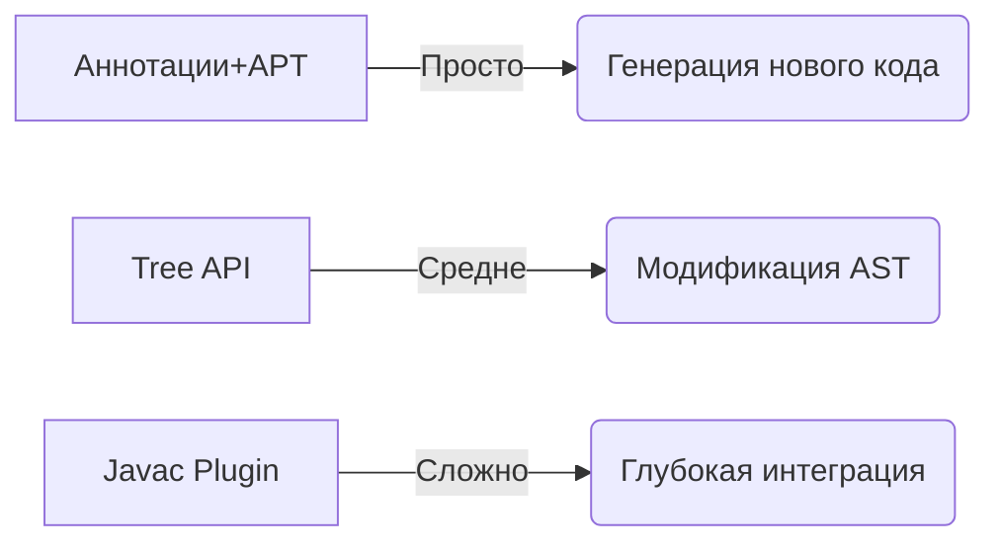

---
aliases:
  - lombok
  - APT
  - AST
  - Annotation Processing
  - Abstract Syntax Tree
---
### lombok под капотом

Lombok — это библиотека, которая **генерирует [[boilerplate]]-код (геттеры, сеттеры, `toString()`, `equals()` и др.) во время компиляции**, используя **аннотации** и **обработку аннотаций (Annotation Processing)**.

>[!info] Boilerplate-код
**Boilerplate-код** (от англ. _boilerplate_ — "шаблонный", "стандартный") — это **избыточный, шаблонный код**, который не несёт уникальной логики и написание которого можно автоматизировать.
Этот термин пришёл из журналистики, где _boilerplate_ означал готовые текстовые блоки для повторного использования. 

#### **Основные механизмы работы Lombok:**

1. **Annotation Processing (APT)**
	- Lombok подключается как **аннотационный процессор** (`javax.annotation.processing.Processor`) и работает во время компиляции Java-кода.
	- Когда компилятор (javac) встречает аннотацию Lombok (например, `@Getter`), он передаёт управление процессору Lombok.
	- Lombok анализирует [[AST]] (Abstract Syntax Tree) исходного кода и модифицирует его, добавляя новые методы.

2. **Модификация AST (Abstract Syntax Tree)**
	- Lombok **не генерирует `.java`-файлы** (как, например, делает MapStruct), а **изменяет AST напрямую**.
	- Это значит, что скомпилированный `.class`-файл будет содержать сгенерированные методы, но в исходном коде их не будет.

	1. **Интеграция с IDE (для "подсветки" методов)**
	- Чтобы IDE (IntelliJ IDEA, Eclipse) "видели" сгенерированные методы, Lombok предоставляет:
	- **Плагины для IDE** (Lombok Plugin в IntelliJ).
	- **Агент для Eclipse** (`lombok.jar` добавляется в `eclipse.ini`).
	- Эти инструменты заставляют IDE учитывать изменения, сделанные Lombok.
---

### **Пример: Как `@Getter` превращается в код?**

#### **Исходный код:**

```java

import lombok.Getter;

@Getter
public class Person {
    private String name;
    private int age;
}
```

#### **После обработки Lombok (в байт-коде `.class`):**

```java

public class Person {
    private String name;
    private int age;

    // Сгенерированные геттеры
    public String getName() {
return this.name;
    }

    public int getAge() {
return this.age;
    }
}
```

**Важно:** В исходном коде (`Person.java`) геттеров нет, но в скомпилированном классе (`Person.class`) они есть.
---

### **Как Lombok модифицирует байт-код?**

Lombok использует **внутренние API компилятора** (javac или ECJ для Eclipse):

1. **Для javac:** Lombok подключается через **`JavacAnnotationProcessor`** и изменяет AST до генерации байт-кода.
    
2. **Для Eclipse:** Используется **агент** (`lombok.agent`), который модифицирует поведение ECJ-компилятора.
    
---

### **Поддержка в сборщиках (Maven/Gradle)**
- Lombok требует **добавления зависимостей** в `pom.xml`/`build.gradle` и **аннотационного процессора**.
    
- Пример для Maven:
    
```xml
<dependency>
	<groupId>org.projectlombok</groupId>
	<artifactId>lombok</artifactId>
	<version>1.18.30</version>
	<scope>provided</scope> <!-- Не нужен в runtime -->
</dependency>
```
    
---

### **Ограничения Lombok**

1. **Зависит от внутренних API компилятора**
    
    - Может сломаться при обновлении Java (например, в Java 16+ потребовались дополнительные настройки из-за ограничений JEP 396).

2. **Проблемы с рефлексией**
    
    - Некоторые библиотеки (например, Hibernate, Jackson) могут не увидеть сгенерированные методы без дополнительных аннотаций (`@Data`, `@Getter`).

3. **Несовместимость с некоторыми инструментами**
    
    - Например, JaCoCo (покрытие кода) может некорректно учитывать сгенерированные методы.
---

### **Альтернативы Lombok**

|Способ|Описание|
|---|---|
|**Ручное написание**|Полный контроль, но много boilerplate.|
|**Records (Java 14+)**|Автоматические `equals()`, `hashCode()`, геттеры (`record Person(String name, int age) {}`).|
|**MapStruct**|Генерация кода через APT (создаёт реальные `.java`-файлы).|
|**Immutables**|Генерация неизменяемых классов.|

---

### **Вывод**

Lombok работает через **изменение AST на этапе компиляции**, добавляя методы прямо в байт-код. Это удобно, но требует:
- Подключения плагинов для IDE.
- Осторожности при обновлении Java.
- Понимания, что сгенерированный код существует только в `.class`-файлах.

Если вам не нравится "магия" Lombok, можно использовать **Records** (Java 14+) или **ручное написание** кода.

### **AST (Abstract Syntax Tree) — Абстрактное Синтаксическое Дерево**

**AST** — это древовидное представление структуры исходного кода программы, где:
- **Каждый узел** соответствует определённой языковой конструкции (оператор, выражение, объявление).
- **Листья** — это терминальные элементы (имена переменных, литералы).
- **Ветви** — отношения между конструкциями.
    
---

### **🔹 Как формируется AST?**

1. **Исходный код** → **Лексер (Tokenizer)** разбивает текст на токены (`int x = 5;` → `int`, `x`, `=`, `5`, `;`).
2. **Токены** → **Парсер (Parser)** строит дерево по правилам языка.

Пример для кода `int x = 5 + 3;`:

```java

      Declaration (int x)
       /      \
Variable(x)  BinaryExpr(+)
       /     \
   Literal(5) Literal(3)
```
---

### **🔹 Зачем нужно AST?**

1. **Анализ кода**:
    - Поиск ошибок (статический анализ).
    - Подсветка синтаксиса в IDE.

2. **Оптимизации**:
    - Упрощение выражений (`5 + 3` → `8`).

3. **Генерация кода**:
    - Трансляция в байт-код (Java) или машинный код (C++).

4. **Инструменты**:
    - Lombok (модифицирует AST для генерации геттеров).
    - Refactoring в IDE.
---

### **🔹 Пример AST для Java-метода**

Исходный код:

```java

public int sum(int a, int b) {
    return a + b;
}

AST (упрощённо):

MethodDeclaration(sum)
├── Modifiers(public)
├── ReturnType(int)
├── Parameters
│   ├── Parameter(a, int)
│   └── Parameter(b, int)
└── Body
    └── ReturnStatement
└── BinaryExpr(+)
    ├── Variable(a)
    └── Variable(b)
```
---

### **🔹 AST vs Байт-код vs Исходный код**

| Характеристика    | Исходный код          | AST                      | Байт-код            |
| ----------------- | --------------------- | ------------------------ | ------------------- |
| **Уровень**       | Текст                 | Структурированное дерево | Бинарный формат JVM |
| **Использование** | Чтение/редактирование | Анализ/трансформация     | Выполнение          |
**Пример**|`int x = 5;`|Узел `VariableDeclaration`|`iconst_5; istore_1`|
---

### **🔹 Инструменты для работы с AST в Java**

1. **Java Compiler Tree API** (встроен в `javac`) — используется Lombok.
    
2. **Eclipse JDT** — парсер AST для Eclipse.
    
3. **ANTLR** — генератор парсеров для любых языков.
    

Пример через **Eclipse JDT**:

```java

ASTParser parser = ASTParser.newParser(AST.JLS15);
parser.setSource("int x = 5;".toCharArray());
CompilationUnit cu = (CompilationUnit) parser.createAST(null);
// Обход узлов дерева...
```
---

### **🔹 Как Lombok использует AST?**

Lombok **не генерирует новый код**, а изменяет существующее AST:

1. Находит класс с `@Getter`.
2. Добавляет в AST узлы для геттеров.
3. Компилятор использует модифицированное AST для генерации байт-кода.
    

Исходный код:

```java

@Getter 
public class User { 
    private String name;
}

AST после Lombok:

ClassDeclaration(User)
├── FieldDeclaration(name)
└── MethodDeclaration(getName)  // Добавлено!
    └── ReturnStatement
└── FieldAccess(name)
```
---

### **🔹 Вывод**
- **AST** — это «скелет» кода, с которым работают компиляторы и инструменты.
    
- Позволяет анализировать и изменять код **до** генерации байт-кода.
    
- Используется в:
    
    - IDE (автодополнение, рефакторинг),
    - Lombok,
    - статических анализаторах (SonarQube).
### Изменение AST аннотированного метода в Java

Для изменения AST (Abstract Syntax Tree) аннотированных методов в Java используются следующие подходы:
---

## **1. Использование Java Compiler Tree API (компилятор javac)**

Это встроенный API для работы с AST на этапе компиляции.

### Пример: Добавление логирования в аннотированные методы

java

import com.sun.source.util.*;
import com.sun.tools.javac.api.*;
import com.sun.tools.javac.tree.*;
import com.sun.tools.javac.tree.JCTree.*;

@SupportedAnnotationTypes("Loggable") // Ваша аннотация
@SupportedSourceVersion(SourceVersion.RELEASE_11)
public class LoggingProcessor extends AbstractProcessor {
    private Trees trees;
    private TreeMaker maker;
    private Names names;

    @Override
    public void init(ProcessingEnvironment env) {
super.init(env);
this.trees = Trees.instance(env);
this.maker = TreeMaker.instance(((JavacProcessingEnvironment)env).getContext());
this.names = Names.instance(((JavacProcessingEnvironment)env).getContext());
    }

    @Override
    public boolean process(Set<? extends TypeElement> annotations, RoundEnvironment roundEnv) {
for (Element element : roundEnv.getElementsAnnotatedWith(Loggable.class)) {
    if (element.getKind() == ElementKind.METHOD) {
MethodTree methodTree = trees.getTree(element);
JCMethodDecl methodDecl = (JCMethodDecl) methodTree;

// Модифицируем тело метода
JCStatement logBefore = maker.Exec(
    maker.Apply(
List.nil(),
maker.Select(
    maker.Select(
maker.Ident(names.fromString("System")),
names.fromString("out")
    ),
    names.fromString("println")
),
List.of(maker.Literal("Начало метода " + methodDecl.name))
    )
);

JCBlock newBody = maker.Block(
    0, // flags
    List.of(logBefore).appendList(methodDecl.body.stats)
);

methodDecl.body = newBody;
    }
}
return true;
    }
}
---

## **2. Использование Eclipse JDT Core**

Альтернатива для работы с AST вне компилятора javac.

### Пример: Добавление проверки null для параметров

java

import org.eclipse.jdt.core.dom.*;
import org.eclipse.jdt.core.dom.rewrite.*;
import org.eclipse.jface.text.Document;

public class NullCheckModifier {
    public static String modifyMethod(String sourceCode) {
ASTParser parser = ASTParser.newParser(AST.JLS15);
parser.setSource(sourceCode.toCharArray());
CompilationUnit cu = (CompilationUnit) parser.createAST(null);

cu.accept(new ASTVisitor() {
    @Override
    public boolean visit(MethodDeclaration node) {
if (node.getAnnotation("NotNullParams") != null) {
    Block newBody = (Block) ASTNode.copySubtree(node.getAST(), node.getBody());
    
    for (SingleVariableDeclaration param : (List<SingleVariableDeclaration>) node.parameters()) {
IfStatement nullCheck = node.getAST().newIfStatement();
nullCheck.setExpression(
    node.getAST().newInfixExpression(
Expression.Operator.EQUALS,
node.getAST().newSimpleName(param.getName().getIdentifier()),
node.getAST().newNullLiteral()
    )
);
nullCheck.setThenStatement(
    node.getAST().newThrowStatement(
node.getAST().newClassInstanceCreation(
    node.getAST().newSimpleType(
node.getAST().newSimpleName("IllegalArgumentException")
    ),
    List.of(
node.getAST().newStringLiteral(
    "Параметр '" + param.getName() + "' не может быть null"
)
    )
)
    )
);
newBody.statements().add(0, nullCheck);
    }
    
    node.setBody(newBody);
}
return true;
    }
});

Document document = new Document(sourceCode);
ASTRewrite rewriter = ASTRewrite.create(cu.getAST());
TextEdit edits = rewriter.rewriteAST(document, null);
edits.apply(document);
return document.get();
    }
}
---

## **3. Использование Spoon (метапрограммирование для Java)**

Библиотека Spoon предоставляет удобный API для модификации Java-кода.

### Пример: Замена всех вызовов System.out на логгер

java

import spoon.processing.AbstractProcessor;
import spoon.reflect.code.CtInvocation;
import spoon.reflect.declaration.CtMethod;

public class LoggerProcessor extends AbstractProcessor<CtMethod<?>> {
    @Override
    public void process(CtMethod<?> method) {
if (method.getAnnotation(Loggable.class) != null) {
    method.getElements(e -> e instanceof CtInvocation)
.forEach(inv -> {
    CtInvocation<?> call = (CtInvocation<?>) inv;
    if (call.getTarget().toString().equals("System.out")) {
getFactory().Code()
    .createCodeSnippetStatement(
"LOGGER.info(" + call.getArguments().get(0) + ")"
    )
    .replace(call);
    }
});
}
    }
}
---

## **4. Lombok-style трансформация через плагин компилятора**

Самый сложный, но мощный способ - написать плагин для javac.

### Шаги реализации:

1. Создать класс, реализующий `com.sun.source.util.Plugin`
    
2. Зарегистрировать его в `META-INF/services/com.sun.source.util.Plugin`
    
3. В плагине перехватывать посещение узлов AST:
    

java

public class MyJavacPlugin implements Plugin {
    @Override
    public String getName() {
return "MyASTModifier";
    }

    @Override
    public void init(JavacTask task, String... args) {
task.addTaskListener(new TaskListener() {
    public void finished(TaskEvent e) {
if (e.getKind() == TaskEvent.Kind.PARSE) {
    new TreePathScanner<Void, Void>() {
@Override
public Void visitMethod(MethodTree node, Void p) {
    // Модификация метода здесь
    return super.visitMethod(node, p);
}
    }.scan(e.getCompilationUnit(), null);
}
    }
});
    }
}
---

## **Ключевые моменты**

1. **Время модификации**:
    
    - **APT** - во время компиляции
    - **Агенты** - во время загрузки классов
    - **Инструментация** - во время выполнения

2. **Сложность**:


3. **Безопасность**:
    
    - Все изменения должны сохранять семантику программы
    - Важно учитывать область видимости и побочные эффекты

Для большинства задач достаточно комбинации APT и Tree API. Полноценные плагины компилятора требуют глубокого понимания внутреннего устройства javac.