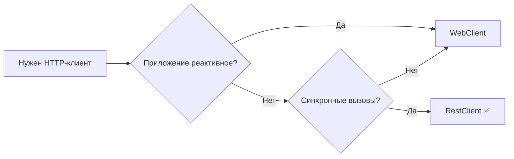

# Spring: RestTemplate vs RestClient vs WebClient

## Краткое сравнение

| Характеристика       | RestTemplate                     | RestClient                          | WebClient                  |
| -------------------- | -------------------------------- | ----------------------------------- | -------------------------- |
| **Статус**           | ⚠️ Устаревший (maintenance mode) | ✅ Актуальный                        | ✅ Актуальный               |
| **Появился в**       | Spring 3                         | Spring 6.1                          | Spring 5                   |
| **Подход**           | Синхронный (блокирующий)         | Синхронный (блокирующий)            | Реактивный (неблокирующий) |
| **API стиль**        | Много перегруженных методов      | [[Fluent API\|Fluent API]](цепочки) | Fluent API (цепочки)       |
| **Reactive Streams** | ❌ Нет                            | ❌ Нет                               | ✅ Да (Mono/Flux)           |
| **Поддержка HTTP/2** | ❌ Нет                            | ✅ Да                                | ✅ Да                       |
| **Обработка ошибок** | try-catch + ResponseErrorHandler | `.onStatus()` в цепочке             | `.onStatus()` в цепочке    |
| **Будущее**          | ❌ Не развивается                 | ✅ Развивается                       | ✅ Развивается              |

---

## 1. RestTemplate – устаревший стандарт

`RestTemplate` был основным HTTP-клиентом в Spring десятилетие. Сейчас он **переведён в режим поддержки** и не получит новых фич.

### Пример
```java
RestTemplate restTemplate = new RestTemplate();
User user = restTemplate.getForObject(
    "https://api.example.com/users/{id}", 
    User.class, 
    1L
);
```

### Недостатки
- Громоздкий API (много перегруженных методов)
- Сложная обработка ошибок
- Не поддерживает HTTP/2
- Блокирующий – каждый запрос занимает поток

---

## 2. RestClient – современная замена RestTemplate

Появился в **Spring 6.1** (Spring Boot 3.2). Это **официальная замена RestTemplate** для синхронных сценариев.

### Пример
```java
RestClient restClient = RestClient.create();

User user = restClient.get()
    .uri("https://api.example.com/users/{id}", 1L)
    .retrieve()
    .body(User.class);

// С кастомной обработкой ошибок
User user2 = restClient.get()
    .uri("https://api.example.com/users/{id}", 999L)
    .retrieve()
    .onStatus(HttpStatusCode::is4xxClientError, (req, resp) -> {
        throw new NotFoundException("User not found");
    })
    .body(User.class);
```

### Преимущества
- Чистый fluent API
- Удобная обработка ошибок через `.onStatus()`
- Поддержка HTTP/2
- Можно обернуть существующий RestTemplate
- Легко мигрировать с RestTemplate

---

## 3. WebClient – для реактивных и асинхронных сценариев

`WebClient` – основа реактивного стека Spring WebFlux. Он неблокирующий и может работать с большим количеством соединений в одном потоке.

### Пример (синхронный блокирующий вызов)
```java
WebClient webClient = WebClient.create("https://api.example.com");

User user = webClient.get()
    .uri("/users/{id}", 1L)
    .retrieve()
    .bodyToMono(User.class)
    .block();  // блокируем, только если нужен синхронный вызов
```

### Пример (реактивный неблокирующий)
```java
webClient.get()
    .uri("/users/{id}", 1L)
    .retrieve()
    .bodyToMono(User.class)
    .subscribe(user -> {
        // обработка асинхронно
    });
```

### Преимущества
- Неблокирующий (экономит ресурсы при высоких нагрузках)
- Реактивные стримы (Mono/Flux)
- Поддержка WebSocket, HTTP/2, SSE
- Один клиент подходит и для синхронных, и для асинхронных вызовов

### Недостатки
- Сложнее для простых сценариев (нужен `.block()`)
- Требует понимания реактивного программирования

---

## Что выбрать?

| Сценарий | Рекомендация |
|----------|--------------|
| **Новый проект, синхронные вызовы** | ✅ `RestClient` |
| **Старый проект на RestTemplate** | ⚠️ Оставить или постепенно мигрировать на `RestClient` |
| **Высокая нагрузка / много одновременных вызовов** | ✅ `WebClient` (реактивный) |
| **Микросервисы в неблокирующем стеке (Spring WebFlux)** | ✅ `WebClient` |
| **Простое CLI/скриптовое приложение** | ✅ `RestClient` (или даже `HttpURLConnection`) |
| **Требуется максимальная совместимость со старыми версиями** | ⚠️ `RestTemplate` |

## Итог



**Главный вывод:** Для **всех новых синхронных проектов** используйте `RestClient`. `RestTemplate` оставьте только для поддержки легаси. `WebClient` берите, когда нужна реактивность или максимальная производительность при большом количестве одновременных запросов.