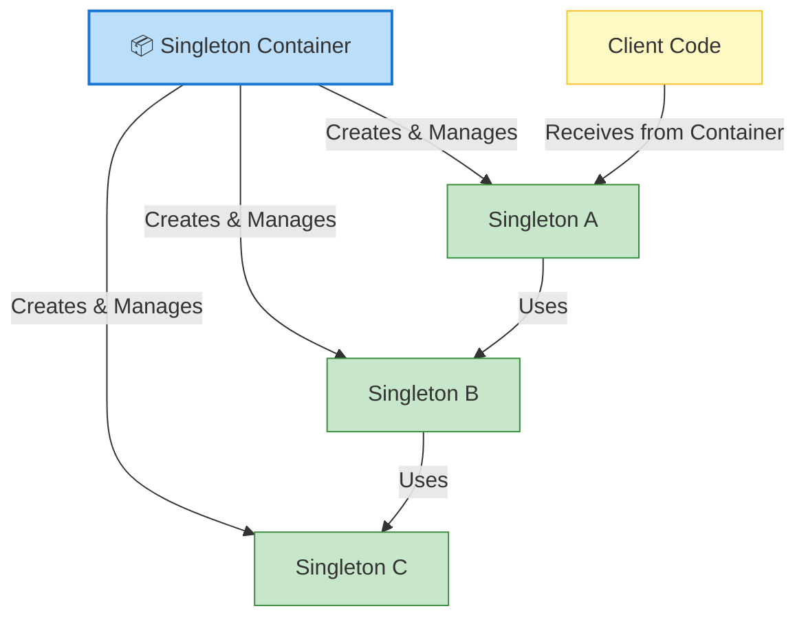
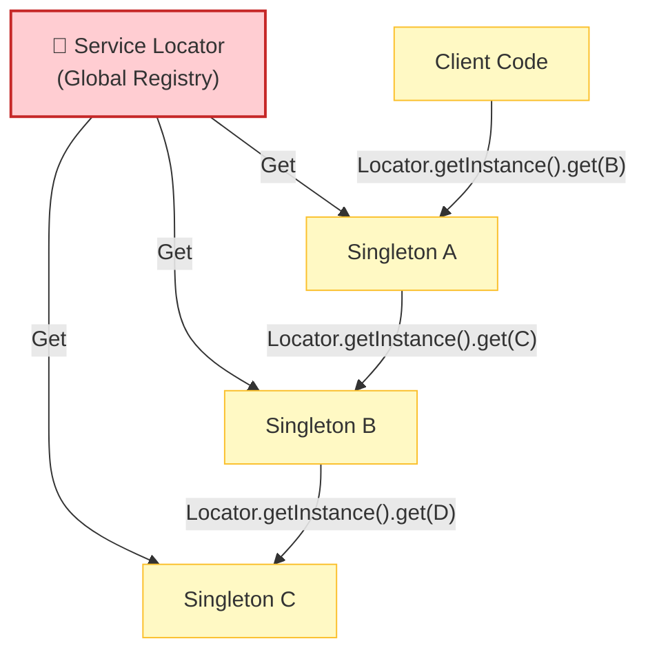
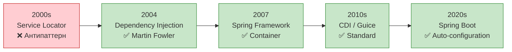

---
aliases:
  - Service Container
  - Service Locator
  - Service Locator pattern
  - ServiceContainer
  - ServiceLocator
  - Singleton
  - Singleton Container
---

**Service Locator** — это паттерн, который даёт возможность запрашивать зависимости (сервисы) по имени или типу через единый объект‑«каталог», вместо того чтобы создавать их явно или передавать через конструктор.

Простыми словами: «дай мне сервис типа `ArtifactoryClient`, а где и как он создан — мне неважно».

---

## Как это выглядит в коде

### Минимальный пример (без фреймворков)

```java
public final class ServiceLocator {
    private static final Map<Class<?>, Object> registry = new ConcurrentHashMap<>();

    public static <T> void register(Class<T> type, T instance) {
        registry.put(type, instance);
    }

    @SuppressWarnings("unchecked")
    public static <T> T get(Class<T> type) {
        T service = (T) registry.get(type);
        if (service == null) {
            throw new IllegalStateException("Service not found: " + type.getName());
        }
        return service;
    }
}
```

**Использование:**

```java
// где-то при старте (в main)
ServiceLocator.register(ArtifactoryClient.class, new ArtifactoryClient(url, creds));
ServiceLocator.register(LicenseNameResolver.class, new LicenseNameResolver());

// в любом месте кода
var client = ServiceLocator.get(ArtifactoryClient.class);
var resolver = ServiceLocator.get(LicenseNameResolver.class);
```

---

## Чем отличается от других подходов

| Подход | Где берутся зависимости | Видимость зависимостей | Тестируемость |
|--------|---------------------------|-------------------------|---------------|
| **Constructor Injection (явные)** | Передаются в конструктор | Видны в сигнатуре конструктора | Отличная (легко подменить моки) |
| **Service Locator** | Запрашиваются через локатор | Скрыты: любой класс может вызвать `get()` | Хуже: нужно настраивать локатор для тестов |
| **DI‑контейнер (Spring и т.п.)** | Контейнер внедряет сам | Часто видны (через конструктор/поля) | Хорошая (контейнер настраивается для тестов) |

---

## Почему Service Locator часто считают антипаттерном

Особенно в современных Java‑проектах (включая твой CLI‑стек):

- **Скрытые зависимости.** В коде нет явной связи: непонятно, что классу нужен `ArtifactoryClient`, пока не заглянешь внутрь метода. Это усложняет чтение и рефакторинг.
- **Глобальное состояние.** Локатор обычно делают статическим, и он становится «общей помойкой» зависимостей.
- **Сложность тестов.** Чтобы протестировать класс, нужно не только создать моки, но и зарегистрировать их в локаторе. Если логика инициализации сложная — тесты становятся хрупкими.
- **Ошибки на рантайме.** Ошибка «сервис не найден» всплывает только при вызове, а не на этапе компиляции или старта.

---

## Где Service Locator всё‑таки уместен

- **Плагины и динамические расширения.** Когда типы сервисов неизвестны на этапе компиляции, а подключаются через SPI (`ServiceLoader`) или конфиги.
- **Legacy‑код.** Когда нельзя менять сигнатуры конструкторов, но нужно как‑то получать зависимости.
- **Простые CLI‑утилиты с очень ограниченным числом компонентов**, где «локатор» — это просто удобная обертка над статическими полями (но даже тут чаще делают явную инициализацию в `main`).

---

## Сравнение с твоим предыдущим кейсом (CLI + тесты)

У тебя был `ApplicationServices` со статическими полями и `init()` — это по сути и есть упрощённый Service Locator.

**Почему для маленького CLI лучше не использовать даже такой «простой» локатор:**

1. **Тесты становятся менее прозрачными.** Вместо `new CliApp(mockClient, ...)` ты делаешь `ServiceLocator.register(...)` в каждом тесте.
2. **Риск забыть регистрацию.** Если в одном тесте забыли зарегистрировать сервис — ошибка вылезет только при выполнении конкретного метода.
3. **Хуже читаемость.** Чтобы понять, какие зависимости нужны классу, приходится читать реализацию, а не сигнатуру конструктора.

Для CLI самый чистый вариант — явная передача зависимостей в `main()`:

```java
var app = new CliApp(
    new ArtifactoryClient(url, creds),
    new LicenseNameResolver(),
    new PackageRepositoryResolver()
);
app.run(args);
```

Зависимости видны сразу, тесты простые, нет глобального состояния.

---

## Пример, где Service Locator реально полезен (твой стек)

Допустим, ты делаешь CLI‑инструмент, который поддерживает плагины: разные реализации `PackageRepository` под разные репозитории, которые подгружаются через `ServiceLoader`. Тогда локатор может быть обёрткой над SPI:

```java
public class RepositoryLocator {
    private final Map<String, PackageRepository> repos = new HashMap<>();

    public RepositoryLocator() {
        ServiceLoader<PackageRepository> loader = ServiceLoader.load(PackageRepository.class);
        for (PackageRepository r : loader) {
            repos.put(r.getType(), r);
        }
    }

    public PackageRepository get(String type) {
        return repos.get(type);
    }
}
```

Здесь локатор не скрывает зависимости приложения, а инкапсулирует механизм обнаружения плагинов — это нормальная практика.

---

## 🏛️ Singleton Container vs Service Locator

### 📌 Краткий ответ

| Паттерн | Суть | Статус |
|---------|------|--------|
| **Singleton Container** | Контейнер управляет **жизненным циклом** singleton-объектов | ✅ Рекомендуется (Spring, CDI) |
| **Service Locator** | Объект **сам запрашивает** зависимости из реестра | ❌ Антипаттерн (скрытые зависимости) |

---

## 🧩 1. Singleton Container (Контейнер одиночек)

### Что это?

> **Централизованный контейнер**, который создаёт, хранит и управляет **singleton-объектами**.
> Объекты **не знают о контейнере** — зависимости **внедряются извне** (Dependency Injection).

### Схема



### Пример (Spring)

```java
// ✅ Singleton управляется контейнером
@Component  // ← Spring создаёт и хранит singleton
public class LicenseResolver {
    
    private final ObjectMapper objectMapper;  // ← Внедрено контейнером
    
    @Autowired  // ← Контейнер внедряет зависимость
    public LicenseResolver(ObjectMapper objectMapper) {
        this.objectMapper = objectMapper;
    }
}

// Контейнер (Spring ApplicationContext)
ApplicationContext ctx = new AnnotationConfigApplicationContext(AppConfig.class);
LicenseResolver resolver = ctx.getBean(LicenseResolver.class);  // ← Получаем из контейнера
```

### Преимущества

| Преимущество | Описание |
|--------------|----------|
| **✅ Явные зависимости** | Все зависимости видны в конструкторе |
| **✅ Тестируемость** | Легко мокать зависимости в тестах |
| **✅ Инкапсуляция** | Класс не знает о контейнере |
| **✅ Lifecycle management** | Контейнер управляет созданием/уничтожением |
| **✅ AOP поддержка** | Прокси, транзакции, логирование |

### Недостатки

| Недостаток | Описание |
|------------|----------|
| **⚠️ Сложность настройки** | Требуется конфигурация контейнера |
| **⚠️ Learning curve** | Нужно знать фреймворк (Spring, CDI) |
| **⚠️ Startup time** | Контейнер инициализируется при старте |

---

## 🧩 2. Service Locator (Локатор сервисов)

### Что это?

> **Глобальный реестр**, из которого объекты **самостоятельно извлекают** свои зависимости.
> Объект **знает о локаторе** и явно запрашивает зависимости.

### Схема



### Пример

```java
// ❌ Service Locator — глобальный реестр
public class ServiceLocator {
    private static final Map<Class<?>, Object> services = new ConcurrentHashMap<>();
    
    public static <T> void register(Class<T> type, T instance) {
        services.put(type, instance);
    }
    
    public static <T> T get(Class<T> type) {
        return type.cast(services.get(type));
    }
}

// ❌ Класс зависит от локатора (скрытая зависимость)
public class LicenseResolver {
    private final ObjectMapper objectMapper;
    
    public LicenseResolver() {
        // ❌ Явный вызов локатора внутри класса
        this.objectMapper = ServiceLocator.get(ObjectMapper.class);
    }
}

// Использование
ServiceLocator.register(ObjectMapper.class, new ObjectMapper());
LicenseResolver resolver = new LicenseResolver();  // ← Внутри сам достаёт зависимость
```

### Преимущества

| Преимущество | Описание |
|--------------|----------|
| **✅ Простота** | Легко реализовать (статический Map) |
| **✅ Гибкость** | Можно менять реализации в runtime |
| **✅ Нет фреймворка** | Работает без Spring/CDI |

### Недостатки

| Недостаток                   | Описание                             |
| ---------------------------- | ------------------------------------ |
| **❌ Скрытые зависимости**    | Не видно, что нужно классу           |
| **❌ Сложно тестировать**     | Нужно регистрировать моки в локаторе |
| **❌ Нарушение инкапсуляции** | Класс знает о глобальном реестре     |
| **❌ Глобальное состояние**   | Трудно управлять lifecycle           |
| **❌ Антипаттерн**            | Не рекомендуется в современном коде  |

---

## 📊 Сравнительная таблица

| Критерий                   | **Singleton Container**       | **Service Locator**           |
| -------------------------- | ----------------------------- | ----------------------------- |
| **Зависимости**            | ✅ Внедряются (DI)             | ❌ Запрашиваются (SL)          |
| **Видимость зависимостей** | ✅ Явные (конструктор)         | ❌ Скрытые (внутри метода)     |
| **Тестируемость**          | ✅ Легко (mock в конструктор)  | ❌ Сложно (mock в локаторе)    |
| **Инкапсуляция**           | ✅ Класс не знает о контейнере | ❌ Класс знает о локаторе      |
| **Глобальное состояние**   | ✅ Изолировано в контейнере    | ❌ Статический реестр          |
| **Lifecycle**              | ✅ Управляется контейнером     | ⚠️ Ручное управление          |
| **Фреймворк**              | Spring, CDI, Guice            | Самописный или JNDI           |
| **Статус**                 | ✅ Рекомендуемый паттерн       | ❌ Антипаттерн (Martin Fowler) |

---

## 🧪 Пример: один и тот же класс по-разному

### ✅ Singleton Container (Spring DI)

```java
@Component
public class LicenseResolver {
    
    private final ObjectMapper objectMapper;
    private final CacheService cache;
    
    // ✅ Все зависимости видны в конструкторе
    @Autowired
    public LicenseResolver(ObjectMapper objectMapper, CacheService cache) {
        this.objectMapper = objectMapper;
        this.cache = cache;
    }
    
    public LicenseMatch resolve(String name) { ... }
}

// Тест — легко передать моки
@Test
void testResolve() {
    ObjectMapper mockMapper = mock(ObjectMapper.class);
    CacheService mockCache = mock(CacheService.class);
    
    LicenseResolver resolver = new LicenseResolver(mockMapper, mockCache);
    // ✅ Тест изолирован, нет глобального состояния
}
```

### ❌ Service Locator

```java
public class LicenseResolver {
    
    private final ObjectMapper objectMapper;
    private final CacheService cache;
    
    // ❌ Зависимости скрыты внутри класса
    public LicenseResolver() {
        this.objectMapper = ServiceLocator.get(ObjectMapper.class);
        this.cache = ServiceLocator.get(CacheService.class);
    }
    
    public LicenseMatch resolve(String name) { ... }
}

// Тест — нужно регистрировать моки в глобальном локаторе
@Test
void testResolve() {
    ServiceLocator.register(ObjectMapper.class, mock(ObjectMapper.class));  // ⚠️ Глобальное состояние
    ServiceLocator.register(CacheService.class, mock(CacheService.class));  // ⚠️ Влияет на другие тесты
    
    LicenseResolver resolver = new LicenseResolver();
    // ❌ Тесты могут влиять друг на друга
}
```

---

## 🎯 Когда что использовать?

| Сценарий | Рекомендация | Почему |
|----------|--------------|--------|
| **Новый проект** | ✅ Singleton Container (Spring/CDI) | Лучшая архитектура |
| **Enterprise приложение** | ✅ Singleton Container | Интеграция с экосистемой |
| **Микросервисы** | ✅ Singleton Container | Тестируемость, изоляция |
| **Legacy код** | ⚠️ Service Locator (постепенно рефакторить) | Уже используется |
| **Утилиты / CLI** | ⚠️ Service Locator (если нет фреймворка) | Простота важнее архитектуры |
| **Библиотеки** | ❌ Избегать обоих | Предоставлять API, не контейнер |

---

## 🔄 Эволюция подходов



---

## 📋 Чек-лист выбора

```
□ Нужна максимальная тестируемость? → ✅ Singleton Container
□ Команда знает Spring/CDI? → ✅ Singleton Container
□ Проект enterprise / микросервисы? → ✅ Singleton Container
□ Простой CLI / утилита? → ⚠️ Service Locator допустим
□ Legacy код с Service Locator? → ⚠️ Рефакторить постепенно
□ Пишете библиотеку для других? → ❌ Избегать обоих (чистый API)
```

---

## 📌 Памятка

```
┌─────────────────────────────────────────────────────────────┐
│  Singleton Container vs Service Locator                     │
│                                                             │
│  Singleton Container (✅ Рекомендуется)                     │
│  • Зависимости внедряются (DI)                              │
│  • Класс не знает о контейнере                              │
│  • Явные зависимости в конструкторе                         │
│  • Легко тестировать                                        │
│  • Spring, CDI, Guice                                       │
│                                                             │
│  Service Locator (❌ Антипаттерн)                           │
│  • Зависимости запрашиваются                                │
│  • Класс знает о локаторе                                   │
│  • Скрытые зависимости                                      │
│  • Сложно тестировать                                       │
│  • Глобальное статическое состояние                         │
│                                                             │
│  💡 Выбор 2026: Singleton Container (Spring Boot)           │
└─────────────────────────────────────────────────────────────┘
```

---

## 🚀 Итог

| Вопрос | Ответ |
|--------|-------|
| **Что лучше?** | ✅ Singleton Container (DI) |
| **Почему Service Locator — антипаттерн?** | Скрытые зависимости, сложно тестировать |
| **Когда допустим Service Locator?** | Legacy, простые утилиты без фреймворка |
| **Что использовать в Spring?** | ✅ @Component + @Autowired (Container) |
| **Кто назвал Service Locator антипаттерном?** | Martin Fowler (2004) |

> 💡 **Совет:** Для новых проектов **всегда выбирайте Singleton Container** (Spring, CDI). Service Locator используйте **только для легаси** или когда фреймворки недоступны. В современном Java-разработке DI — это стандарт де-факто.
