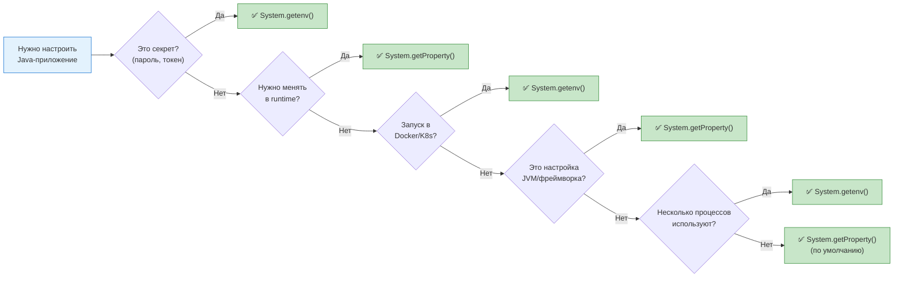

---
aliases:
  - env vars
  - getenv
  - getProperty
  - Runtime Configuration Parameters
  - System
  - system properties
  - System.getenv
  - System.getProperty
  - Параметры конфигурации среды выполнения
---
## ⚙️ `System.getenv()` vs `System.getProperty()` — Полное сравнение

---

## 📌 Краткий ответ

| Механизм | Источник | Область видимости | Пример |
|----------|----------|-------------------|--------|
| **`System.getenv()`** | Переменные окружения **ОС** | Весь процесс ОС | `DB_HOST=localhost` |
| **`System.getProperty()`** | Системные свойства **JVM** | Только текущая JVM | `-Ddb.host=localhost` |

---

## 🧩 Обобщающее понятие

| Язык             | Термин                                      |
| ---------------- | ------------------------------------------- |
| **🇷🇺 Русский** | **Параметры конфигурации среды выполнения** |
| **🇺🇸 English** | **Runtime Configuration Parameters**        |

### Более узкие термины:

| Механизм | 🇷🇺 Русский | 🇺🇸 English |
|----------|-------------|-------------|
| `System.getenv()` | **Переменные окружения** | **Environment Variables** |
| `System.getProperty()` | **Системные свойства JVM** | **JVM System Properties** |

---

## 📊 Сравнительная таблица

| Критерий                | **`System.getenv()`**            | **`System.getProperty()`**    |
| ----------------------- | -------------------------------- | ----------------------------- |
| **Источник**            | ОС (процесс)                     | JVM (при запуске)             |
| **Установка**           | `export VAR=value`               | `-Dvar=value`                 |
| **Изменение в runtime** | ❌ Нет (immutable)                | ✅ Да (`System.setProperty()`) |
| **Видимость**           | Все процессы ОС                  | Только текущая JVM            |
| **Формат имени**        | `UPPER_SNAKE_CASE`               | `lower.dot.case`              |
| **Наследование**        | ✅ Дочерние процессы              | ❌ Только текущая JVM          |
| **Безопасность**        | ⚠️ Видны в `/proc/<pid>/environ` | ⚠️ Видны в `jinfo`            |
| **Количество**          | Ограничено ОС (~128KB)           | Не ограничено                 |
| **Тип значения**        | Только `String`                  | Только `String`               |
| **Доступ**              | `System.getenv("KEY")`           | `System.getProperty("key")`   |

---

## 🧪 Примеры в Java

### `System.getenv()` — Переменные окружения

```java
// Чтение переменной окружения
String dbHost = System.getenv("DB_HOST");
String dbPort = System.getenv("DB_PORT");
String apiKey = System.getenv("API_KEY");

// Все переменные окружения
Map<String, String> env = System.getenv();
env.forEach((k, v) -> System.out.println(k + "=" + v));

// Значение по умолчанию
String host = System.getenv().getOrDefault("DB_HOST", "localhost");
```

### `System.getProperty()` — Системные свойства JVM

```java
// Чтение системного свойства
String dbHost = System.getProperty("db.host");
String dbPort = System.getProperty("db.port");
String apiKey = System.getProperty("api.key");

// Все системные свойства
Properties props = System.getProperties();
props.forEach((k, v) -> System.out.println(k + "=" + v));

// Значение по умолчанию
String host = System.getProperty("db.host", "localhost");

// ✅ Изменение в runtime (только для system properties!)
System.setProperty("app.mode", "production");
```

---

## 🎯 Когда что использовать?

### ✅ `System.getenv()` — Переменные окружения

| Сценарий | Почему |
|----------|--------|
| **Секреты** (пароли, API keys) | Не попадают в историю команд, не видны в `ps` |
| **Docker/Kubernetes** | Стандарт конфигурации контейнеров |
| **12-Factor App** | Методология рекомендует env vars |
| **CI/CD** | GitHub Actions, GitLab CI передают секреты через env |
| **Кросс-процессная конфигурация** | Несколько процессов используют одни переменные |
| **Чувствительные данные** | Не логируются, не попадают в аргументы процесса |

### ✅ `System.getProperty()` — Системные свойства JVM

| Сценарий | Почему |
|----------|--------|
| **Настройки JVM** | `-Xmx`, `-Xms`, `-Dfile.encoding` |
| **Настройки фреймворков** | Spring profiles, Hibernate dialect |
| **Динамическое изменение** | Можно менять в runtime через `setProperty()` |
| **Множественные значения** | `-Dkey1=val1 -Dkey2=val2` |
| **Флаги приложения** | `-Dapp.debug=true`, `-Dapp.mode=prod` |
| **Не чувствительные данные** | Конфигурация, не секреты |

---

## 📋 Decision Matrix



---

## 🛠️ Пример 1: Загрузка через bash (простой)

### Скрипт `start.sh`

```bash
#!/bin/bash

# ─────────────────────────────────────────────────────────────
# 1. Переменные окружения (System.getenv)
# ─────────────────────────────────────────────────────────────
export DB_HOST="localhost"
export DB_PORT="5432"
export DB_NAME="myapp"
export DB_USER="admin"
export DB_PASSWORD="s3cr3t!"          # ✅ Секрет → env var
export API_KEY="sk-1234567890"        # ✅ Секрет → env var
export LOG_LEVEL="INFO"

# ─────────────────────────────────────────────────────────────
# 2. Системные свойства JVM (System.getProperty)
# ─────────────────────────────────────────────────────────────
java \
  -Dapp.name="MyApplication" \
  -Dapp.version="1.0.0" \
  -Dapp.mode="production" \
  -Dapp.debug=false \
  -Dspring.profiles.active=prod \
  -Dserver.port=8080 \
  -Dfile.encoding=UTF-8 \
  -Duser.timezone=UTC \
  -jar myapp.jar
```

### Чтение в Java

```java
public class AppConfig {
    
    public static void load() {
        // ✅ Переменные окружения (из export)
        String dbHost = System.getenv("DB_HOST");        // "localhost"
        String dbPort = System.getenv("DB_PORT");        // "5432"
        String dbPassword = System.getenv("DB_PASSWORD"); // "s3cr3t!"
        String apiKey = System.getenv("API_KEY");         // "sk-1234567890"
        
        // ✅ Системные свойства (из -D)
        String appName = System.getProperty("app.name");     // "MyApplication"
        String appMode = System.getProperty("app.mode");     // "production"
        boolean debug = Boolean.parseBoolean(
            System.getProperty("app.debug", "false"));       // false
        String profile = System.getProperty("spring.profiles.active"); // "prod"
        
        System.out.println("DB: " + dbHost + ":" + dbPort);
        System.out.println("App: " + appName + " [" + appMode + "]");
    }
}
```

---

## 🛠️ Пример 2: Загрузка из файлов `app.env` и `app.vmoption`

### Файл `app.env` (переменные окружения)

```bash
# app.env — переменные окружения (System.getenv)
# Формат: KEY=VALUE (без export, без кавычек)

# Database
DB_HOST=localhost
DB_PORT=5432
DB_NAME=myapp
DB_USER=admin
DB_PASSWORD=s3cr3t!

# API
API_KEY=sk-1234567890
API_URL=https://api.example.com

# Logging
LOG_LEVEL=INFO
LOG_FILE=/var/log/myapp/app.log

# Feature Flags
FEATURE_NEW_UI=true
FEATURE_BETA=false
```

### Файл `app.vmoption` (системные свойства JVM)

```properties
# app.vmoption — системные свойства JVM (System.getProperty)
# Формат: -Dkey=value (по одному на строку)

-Dapp.name=MyApplication
-Dapp.version=1.0.0
-Dapp.mode=production
-Dapp.debug=false

# Spring
-Dspring.profiles.active=prod
-Dserver.port=8080

# Encoding & Timezone
-Dfile.encoding=UTF-8
-Duser.timezone=UTC

# JVM Memory (тоже можно здесь)
-Xms256m
-Xmx512m
-XX:+UseG1GC
```

### Скрипт `start.sh` (загрузка из файлов)

```bash
#!/bin/bash

# ─────────────────────────────────────────────────────────────
# Конфигурация
# ─────────────────────────────────────────────────────────────
APP_ENV_FILE="./app.env"
APP_VMOPTION_FILE="./app.vmoption"
APP_JAR="./myapp.jar"

# ─────────────────────────────────────────────────────────────
# 1. Загрузка переменных окружения из app.env
# ─────────────────────────────────────────────────────────────
if [ -f "$APP_ENV_FILE" ]; then
    echo "📄 Loading environment variables from: $APP_ENV_FILE"
    
    # Способ 1: source (выполняет файл как скрипт)
    # ⚠️ Требует format KEY=VALUE без кавычек
    set -a  # Автоматически экспортировать все переменные
    source "$APP_ENV_FILE"
    set +a  # Отключить авто-экспорт
    
    # Способ 2: построчное чтение (более безопасный)
    # while IFS='=' read -r key value; do
    #     # Пропускаем комментарии и пустые строки
    #     [[ "$key" =~ ^#.*$ ]] && continue
    #     [[ -z "$key" ]] && continue
    #     export "$key=$value"
    # done < "$APP_ENV_FILE"
    
    echo "✅ Loaded $(grep -c '=' "$APP_ENV_FILE") environment variables"
else
    echo "⚠️  Warning: $APP_ENV_FILE not found"
fi

# ─────────────────────────────────────────────────────────────
# 2. Загрузка системных свойств JVM из app.vmoption
# ─────────────────────────────────────────────────────────────
VM_OPTS=""

if [ -f "$APP_VMOPTION_FILE" ]; then
    echo "📄 Loading JVM options from: $APP_VMOPTION_FILE"
    
    # Читаем файл, пропускаем комментарии и пустые строки
    VM_OPTS=$(grep -v '^#' "$APP_VMOPTION_FILE" | grep -v '^$' | tr '\n' ' ')
    
    echo "✅ Loaded JVM options: $VM_OPTS"
else
    echo "⚠️  Warning: $APP_VMOPTION_FILE not found"
fi

# ─────────────────────────────────────────────────────────────
# 3. Запуск приложения
# ─────────────────────────────────────────────────────────────
echo "🚀 Starting application..."
echo "   JAR: $APP_JAR"
echo "   ENV: $APP_ENV_FILE"
echo "   JVM: $APP_VMOPTION_FILE"

# Запуск: VM_OPTS содержит -D и -X параметры
exec java $VM_OPTS -jar "$APP_JAR"
```

### Альтернативный скрипт (более надёжный)

```bash
#!/bin/bash
set -euo pipefail  # Строгий режим

APP_ENV_FILE="./app.env"
APP_VMOPTION_FILE="./app.vmoption"
APP_JAR="./myapp.jar"

# ─────────────────────────────────────────────────────────────
# Функция: загрузка env-файла
# ─────────────────────────────────────────────────────────────
load_env_file() {
    local file="$1"
    
    if [ ! -f "$file" ]; then
        echo "❌ Error: File not found: $file" >&2
        return 1
    fi
    
    while IFS='=' read -r key value; do
        # Пропускаем комментарии и пустые строки
        [[ "$key" =~ ^[[:space:]]*# ]] && continue
        [[ -z "${key// }" ]] && continue
        
        # Удаляем пробелы вокруг ключа и значения
        key=$(echo "$key" | xargs)
        value=$(echo "$value" | xargs)
        
        # Удаляем кавычки если есть
        value="${value%\"}"
        value="${value#\"}"
        value="${value%\'}"
        value="${value#\'}"
        
        # Экспортируем
        export "$key=$value"
        echo "   ✅ $key"
    done < "$file"
}

# ─────────────────────────────────────────────────────────────
# Функция: загрузка vmoption-файла
# ─────────────────────────────────────────────────────────────
load_vmoptions() {
    local file="$1"
    local opts=""
    
    if [ ! -f "$file" ]; then
        echo "❌ Error: File not found: $file" >&2
        return 1
    fi
    
    while IFS= read -r line; do
        # Пропускаем комментарии и пустые строки
        [[ "$line" =~ ^[[:space:]]*# ]] && continue
        [[ -z "${line// }" ]] && continue
        
        opts="$opts $line"
        echo "   ✅ $line"
    done < "$file"
    
    echo "$opts"
}

# ─────────────────────────────────────────────────────────────
# Основной скрипт
# ─────────────────────────────────────────────────────────────
echo "═══════════════════════════════════════════"
echo "  Loading configuration"
echo "═══════════════════════════════════════════"

echo ""
echo "📄 Loading environment variables..."
load_env_file "$APP_ENV_FILE"

echo ""
echo "📄 Loading JVM options..."
VM_OPTS=$(load_vmoptions "$APP_VMOPTION_FILE" | tail -1)

echo ""
echo "═══════════════════════════════════════════"
echo "  Starting application"
echo "═══════════════════════════════════════════"

exec java $VM_OPTS -jar "$APP_JAR"
```

---

## 📁 Структура проекта

```
myapp/
├── start.sh              ← Скрипт запуска
├── app.env               ← Переменные окружения
├── app.vmoption          ← Системные свойства JVM
├── myapp.jar             ← Приложение
└── src/
    └── main/
        └── java/
            └── AppConfig.java
```

---

## 🧪 Проверка в Java

```java
public class ConfigVerifier {
    
    public static void main(String[] args) {
        System.out.println("═══ Environment Variables (System.getenv) ═══");
        System.out.println("DB_HOST: " + System.getenv("DB_HOST"));
        System.out.println("DB_PORT: " + System.getenv("DB_PORT"));
        System.out.println("DB_PASSWORD: " + mask(System.getenv("DB_PASSWORD")));
        System.out.println("API_KEY: " + mask(System.getenv("API_KEY")));
        System.out.println("LOG_LEVEL: " + System.getenv("LOG_LEVEL"));
        
        System.out.println();
        System.out.println("═══ System Properties (System.getProperty) ═══");
        System.out.println("app.name: " + System.getProperty("app.name"));
        System.out.println("app.mode: " + System.getProperty("app.mode"));
        System.out.println("app.debug: " + System.getProperty("app.debug"));
        System.out.println("spring.profiles.active: " + System.getProperty("spring.profiles.active"));
        System.out.println("server.port: " + System.getProperty("server.port"));
        System.out.println("file.encoding: " + System.getProperty("file.encoding"));
    }
    
    private static String mask(String value) {
        if (value == null || value.length() < 4) return "****";
        return value.substring(0, 2) + "****" + value.substring(value.length() - 2);
    }
}
```

### Ожидаемый вывод:

```
═══ Environment Variables (System.getenv) ═══
DB_HOST: localhost
DB_PORT: 5432
DB_PASSWORD: s3****t!
API_KEY: sk****90
LOG_LEVEL: INFO

═══ System Properties (System.getProperty) ═══
app.name: MyApplication
app.mode: production
app.debug: false
spring.profiles.active: prod
server.port: 8080
file.encoding: UTF-8
```

---

## 🐳 Бонус: Docker Compose

```yaml
# docker-compose.yml
version: '3.8'

services:
  app:
    image: myapp:latest
    
    # ✅ Переменные окружения (System.getenv)
    environment:
      - DB_HOST=postgres
      - DB_PORT=5432
      - DB_NAME=myapp
      - DB_PASSWORD=${DB_PASSWORD}  # Из .env файла Docker
    
    # ✅ Или из файла
    env_file:
      - ./app.env
    
    # ✅ Системные свойства JVM (System.getProperty)
    entrypoint: >
      java
      -Dapp.mode=production
      -Dspring.profiles.active=prod
      -Dserver.port=8080
      -jar /app/myapp.jar
    
    ports:
      - "8080:8080"
```

---

## ⚠️ Безопасность

| Аспект | `System.getenv()` | `System.getProperty()` |
|--------|-------------------|------------------------|
| **Видимость в `ps aux`** | ✅ Не видны | ❌ Видны в аргументах процесса |
| **Видимость в логах** | ⚠️ Могут попасть | ⚠️ Могут попасть |
| **В `/proc/<pid>/environ`** | ❌ Видны (Linux) | ✅ Не видны |
| **В `jinfo`** | ✅ Не видны | ❌ Видны |
| **Рекомендация для секретов** | ✅ Использовать | ❌ Избегать |

> ⚠️ **Важно:** Для секретов используйте **`System.getenv()`**, так как `-D` параметры видны в `ps aux`:
> ```bash
> # ❌ Пароль виден в списке процессов!
> java -Ddb.password=secret -jar app.jar
> 
> # ✅ Пароль не виден
> export DB_PASSWORD=secret
> java -jar app.jar
> ```

---

## 📌 Памятка

```
┌─────────────────────────────────────────────────────────────┐
│  Параметры конфигурации среды выполнения                    │
│  Runtime Configuration Parameters                           │
│                                                             │
│  System.getenv() — Переменные окружения (Environment Vars)  │
│  • Источник: ОС                                             │
│  • Установка: export KEY=value                              │
│  • Для: секреты, Docker, 12-Factor                          │
│  • Формат: UPPER_SNAKE_CASE                                 │
│                                                             │
│  System.getProperty() — Системные свойства JVM              │
│  • Источник: JVM                                            │
│  • Установка: -Dkey=value                                   │
│  • Для: настройки приложения, фреймворков                   │
│  • Формат: lower.dot.case                                   │
│  • Можно менять в runtime                                   │
│                                                             │
│  📄 app.env → export → System.getenv()                      │
│  📄 app.vmoption → -D → System.getProperty()                │
└─────────────────────────────────────────────────────────────┘
```

---

## 🚀 Итог

| Вопрос | Ответ |
|--------|-------|
| **Обобщающее понятие?** | 🇷🇺 Параметры конфигурации среды выполнения / 🇺🇸 Runtime Configuration Parameters |
| **Что для секретов?** | ✅ `System.getenv()` (не видны в `ps`) |
| **Что для настроек приложения?** | ✅ `System.getProperty()` (`-D`) |
| **Можно ли менять в runtime?** | ✅ Только `System.setProperty()` |
| **Файл для env?** | `app.env` + `source` / `set -a` |
| **Файл для JVM?** | `app.vmoption` + чтение в переменную |

> 💡 **Правило:** **Секреты → env vars. Конфигурация → system properties.** Это обеспечивает безопасность и гибкость.
