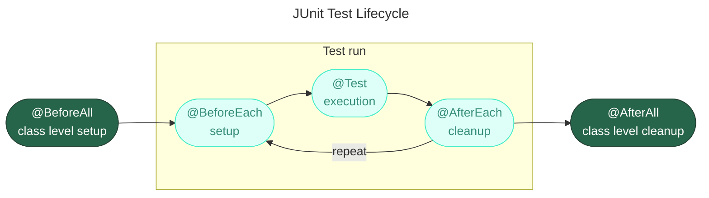

---
aliases:
  - junit
  - junit-jupiter-api
  - jupiter
  - org.junit.jupiter
  - org.junit.platform
  - unit test
---
## 🧪 JUnit 5 тест со всеми аннотациями

`JUnit` — фреймворк для тестирования

### 📄 Пример: `OrderServiceTest.java`

```java
package com.example.order;

import org.junit.jupiter.api.*;
import org.junit.jupiter.api.DynamicTest;

import java.math.BigDecimal;
import java.util.Collection;
import java.util.List;
import java.util.stream.Stream;

import static org.junit.jupiter.api.Assertions.*;
import static org.junit.jupiter.api.Assumptions.assumeTrue;

// ─────────────────────────────────────────────────────────────
// 🏷️ Теги для категоризации тестов
// ─────────────────────────────────────────────────────────────
@Tag("unit")
@Tag("order-service")
@DisplayName("🛒 Тесты сервиса заказов (OrderService)")
class OrderServiceTest {

    private OrderService sut; // system under test
    private static TestDatabase database;

    // ─────────────────────────────────────────────────────────
    // 🔵 @BeforeAll — ОДИН раз перед ВСЕМИ тестами класса
    //    Должен быть static (если не @TestInstance(PER_CLASS))
    // ─────────────────────────────────────────────────────────
    @BeforeAll
    static void init() {
        System.out.println("🔵 @BeforeAll: инициализация БД");
        database = new TestDatabase();
        database.connect();
    }

    // ─────────────────────────────────────────────────────────
    // 🔴 @AfterAll — ОДИН раз после ВСЕХ тестов класса
    //    Должен быть static
    // ─────────────────────────────────────────────────────────
    @AfterAll
    static void finalize() {
        System.out.println("🔴 @AfterAll: закрытие БД");
        if (database != null) {
            database.disconnect();
        }
    }

    // ─────────────────────────────────────────────────────────
    // 🟢 @BeforeEach — ПЕРЕД КАЖДЫМ тестом
    // ─────────────────────────────────────────────────────────
    @BeforeEach
    void setUp() {
        System.out.println("  🟢 @BeforeEach: создание сервиса");
        sut = new OrderService(database);
        database.clear();
    }

    // ─────────────────────────────────────────────────────────
    // 🟡 @AfterEach — ПОСЛЕ КАЖДОГО теста
    // ─────────────────────────────────────────────────────────
    @AfterEach
    void tearDown() {
        System.out.println("  🟡 @AfterEach: очистка состояния");
        sut = null;
    }

    // ─────────────────────────────────────────────────────────
    // ✅ @Test + @DisplayName — простой тест
    // ─────────────────────────────────────────────────────────
    @Test
    @DisplayName("✅ Создание заказа возвращает ненулевой ID")
    void createOrder_shouldReturnNonZeroId() {
        // Given
        Order order = new Order("user-1", new BigDecimal("99.99"));

        // When
        Order created = sut.create(order);

        // Then
        assertNotNull(created.getId(), "ID заказа не должен быть null");
        assertTrue(created.getId() > 0, "ID должен быть положительным");
    }

    // ─────────────────────────────────────────────────────────
    // ✅ @Test с проверкой исключения
    // ─────────────────────────────────────────────────────────
    @Test
    @DisplayName("✅ Заказ с отрицательной суммой выбрасывает IllegalArgumentException")
    void createOrder_withNegativeAmount_shouldThrowException() {
        // Given
        Order invalidOrder = new Order("user-1", new BigDecimal("-10"));

        // When & Then
        IllegalArgumentException exception = assertThrows(
            IllegalArgumentException.class,
            () -> sut.create(invalidOrder),
            "Ожидалось IllegalArgumentException для отрицательной суммы"
        );

        assertEquals("Order amount cannot be negative", exception.getMessage());
    }

    // ─────────────────────────────────────────────────────────
    // ❌ @Disabled — тест пропущен (например, ещё не готов)
    // ─────────────────────────────────────────────────────────
    @Test
    @Disabled("⏳ TODO: реализовать после добавления платёжного шлюза")
    @DisplayName("⏳ Оплата заказа через платёжный шлюз")
    void payOrder_shouldProcessPayment() {
        // Этот тест не будет выполнен
        fail("Не реализовано");
    }

    // ─────────────────────────────────────────────────────────
    // 🏷️ @Tag на уровне метода
    // ─────────────────────────────────────────────────────────
    @Test
    @Tag("slow")
    @Tag("integration")
    @DisplayName("🐢 Массовое создание 1000 заказов")
    void createOrders_bulk_shouldSucceed() {
        for (int i = 0; i < 1000; i++) {
            Order order = new Order("user-" + i, BigDecimal.TEN);
            assertNotNull(sut.create(order).getId());
        }
    }

    // ─────────────────────────────────────────────────────────
    // 📦 @Nested — вложенная группа тестов
    // ─────────────────────────────────────────────────────────
    @Nested
    @DisplayName("🧮 Расчёт скидок")
    @Tag("discount")
    class DiscountTests {

        @BeforeEach
        void setUpDiscounts() {
            System.out.println("    🟢 @BeforeEach (Nested): настройка скидок");
            sut.enableDiscounts();
        }

        @Test
        @DisplayName("✅ Скидка 10% при сумме > 1000")
        void calculateDiscount_largeOrder_shouldApply10Percent() {
            // Given
            Order order = new Order("user-1", new BigDecimal("1500"));

            // When
            BigDecimal discount = sut.calculateDiscount(order);

            // Then
            assertEquals(new BigDecimal("150.00"), discount);
        }

        @Test
        @DisplayName("✅ Нет скидки при сумме < 1000")
        void calculateDiscount_smallOrder_shouldReturnZero() {
            Order order = new Order("user-1", new BigDecimal("500"));
            assertEquals(BigDecimal.ZERO, sut.calculateDiscount(order));
        }

        // ─────────────────────────────────────────────────────
        // 🏭 @TestFactory — динамические тесты
        // ─────────────────────────────────────────────────────
        @TestFactory
        @DisplayName("🏭 Динамические тесты скидок для разных сумм")
        Collection<DynamicTest> discountDynamicTests() {
            return List.of(
                DynamicTest.dynamicTest("Сумма 999 → скидка 0",
                    () -> assertEquals(BigDecimal.ZERO,
                        sut.calculateDiscount(
                            new Order("u", new BigDecimal("999"))))),

                DynamicTest.dynamicTest("Сумма 1000 → скидка 0",
                    () -> assertEquals(BigDecimal.ZERO,
                        sut.calculateDiscount(
                            new Order("u", new BigDecimal("1000"))))),

                DynamicTest.dynamicTest("Сумма 2000 → скидка 200",
                    () -> assertEquals(new BigDecimal("200.00"),
                        sut.calculateDiscount(
                            new Order("u", new BigDecimal("2000")))))
            );
        }

        // ─────────────────────────────────────────────────────
        // 🏭 @TestFactory со стримом (больше сценариев)
        // ─────────────────────────────────────────────────────
        @TestFactory
        Stream<DynamicTest> boundaryValueTests() {
            record TestCase(BigDecimal amount, BigDecimal expectedDiscount) {}

            return Stream.of(
                new TestCase(new BigDecimal("0"),     BigDecimal.ZERO),
                new TestCase(new BigDecimal("100"),   BigDecimal.ZERO),
                new TestCase(new BigDecimal("1001"),  new BigDecimal("100.10")),
                new TestCase(new BigDecimal("9999"),  new BigDecimal("999.90"))
            ).map(tc -> DynamicTest.dynamicTest(
                String.format("Сумма %s → скидка %s", tc.amount(), tc.expectedDiscount()),
                () -> assertEquals(tc.expectedDiscount(),
                    sut.calculateDiscount(new Order("u", tc.amount())))
            ));
        }
    }

    // ─────────────────────────────────────────────────────────
    // 📦 Второй @Nested — тесты валидации
    // ─────────────────────────────────────────────────────────
    @Nested
    @DisplayName("🛡️ Валидация заказов")
    class ValidationTests {

        @Test
        @DisplayName("✅ Пустой userId отклоняется")
        void createOrder_emptyUserId_shouldFail() {
            assertThrows(IllegalArgumentException.class,
                () -> sut.create(new Order("", BigDecimal.TEN)));
        }

        @Test
        @DisplayName("✅ Null userId отклоняется")
        void createOrder_nullUserId_shouldFail() {
            assertThrows(NullPointerException.class,
                () -> sut.create(new Order(null, BigDecimal.TEN)));
        }
    }

    // ─────────────────────────────────────────────────────────
    // 🧪 Вспомогательный класс для теста
    // ─────────────────────────────────────────────────────────
    static class TestDatabase {
        void connect() { System.out.println("    📡 БД подключена"); }
        void disconnect() { System.out.println("    🔌 БД отключена"); }
        void clear() { System.out.println("    🧹 БД очищена"); }
    }
}
```

---

## 📊 Порядок выполнения

```
🔵 @BeforeAll: инициализация БД           ← 1 раз
│
├── 🟢 @BeforeEach: создание сервиса       ← перед тестом 1
│   ├── ✅ Тест 1: создание заказа
│   └── 🟡 @AfterEach: очистка
│
├── 🟢 @BeforeEach                         ← перед тестом 2
│   ├── ✅ Тест 2: отрицательная сумма
│   └── 🟡 @AfterEach
│
├── ⏳ @Disabled: пропущен
│
├── 🟢 @BeforeEach
│   ├── 🐢 Тест 3: массовое создание (@Tag("slow"))
│   └── 🟡 @AfterEach
│
├── 📦 @Nested "Расчёт скидок"
│   ├── 🟢 @BeforeEach (внешний)
│   ├── 🟢 @BeforeEach (nested)
│   │   ├── ✅ Тест скидки 10%
│   │   ├── 🏭 Динамические тесты (3 шт.)
│   │   └── 🟡 @AfterEach (внешний)
│   └── ...
│
└── 🔴 @AfterAll: закрытие БД              ← 1 раз в конце
```

---

## 📋 Сводная таблица аннотаций

| Аннотация | Когда выполняется | Метод | Назначение |
|-----------|-------------------|-------|------------|
| **`@BeforeAll`** | 1 раз перед всеми тестами | `static` | Инициализация дорогих ресурсов |
| **`@AfterAll`** | 1 раз после всех тестов | `static` | Закрытие ресурсов |
| **`@BeforeEach`** | Перед каждым тестом | экземпляр | Подготовка состояния |
| **`@AfterEach`** | После каждого теста | экземпляр | Очистка состояния |
| **`@Test`** | Сам тест | экземпляр | Проверка поведения |
| **`@DisplayName`** | Метаданные | любое | Человекочитаемое имя |
| **`@Disabled`** | Пропускается | `@Test` | Временное отключение |
| **`@Nested`** | Вложенный класс | класс | Группировка тестов |
| **`@Tag`** | Метаданные | любое | Категоризация для запуска |
| **`@TestFactory`** | Генерация тестов | возвращает `DynamicNode` | Параметризация в рантайме |

---

## 🏃 Запуск с фильтрацией по тегам

### Через Maven

```xml
<!-- pom.xml -->
<build>
    <plugins>
        <plugin>
            <groupId>org.apache.maven.plugins</groupId>
            <artifactId>maven-surefire-plugin</artifactId>
            <version>3.2.2</version>
            <configuration>
                <!-- Запуск только тестов с тегом "unit" -->
                <groups>unit</groups>
                <!-- Исключение медленных тестов -->
                <excludedGroups>slow</excludedGroups>
            </configuration>
        </plugin>
    </plugins>
</build>
```

### Через командную строку

```bash
# Только тесты с тегом "discount"
mvn test -Dgroups=discount

# Все, кроме "slow"
mvn test -DexcludedGroups=slow

# Комбинация тегов
mvn test -Dgroups="unit & !slow"
```

---

## ⚠️ Важные нюансы

### 1. **`@BeforeAll` / `@AfterAll` должны быть `static`**

```java
// ❌ Ошибка: @BeforeAll должен быть static
@BeforeAll
void init() { }  // Compilation Error

// ✅ Правильно
@BeforeAll
static void init() { }

// ✅ Альтернатива: @TestInstance(PER_CLASS)
@TestInstance(TestInstance.Lifecycle.PER_CLASS)
class MyTest {
    @BeforeAll
    void init() { }  // ✅ Теперь не нужен static
}
```

### 2. **`@Nested` классы не могут быть `static`**

```java
@Nested
class ValidTests { }  // ✅ Правильно

@Nested
static class InvalidTests { }  // ❌ Ошибка
```

### 3. **`@TestFactory` возвращает типы**

```java
// ✅ Поддерживаемые возвращаемые типы:
DynamicTest              // один тест
DynamicContainer         // контейнер с тестами
Stream<DynamicTest>      // стрим тестов
Collection<DynamicTest>  // коллекция
Iterable<DynamicTest>    // итерируемый
Iterator<DynamicTest>    // итератор
```

### 4. **`@Disabled` с причиной**

```java
@Disabled("TODO: JIRA-1234 — реализовать после миграции")  // ✅ Всегда указывайте причину
@Test
void futureFeature() { }
```

---

## 📌 Памятка

```
┌─────────────────────────────────────────────────────────────┐
│  Жизненный цикл JUnit 5 теста                               │
│                                                             │
│  🔵 @BeforeAll      → 1 раз (static)                        │
│    🟢 @BeforeEach   → перед каждым                          │
│      ✅ @Test        → сам тест                             │
│    🟡 @AfterEach    → после каждого                         │
│  🔴 @AfterAll       → 1 раз (static)                        │
│                                                             │
│  📦 @Nested          → вложенные группы                     │
│  🏭 @TestFactory     → динамические тесты                   │
│  🏷️ @Tag             → категоризация                        │
│  📝 @DisplayName     → читаемое имя                         │
│  ❌ @Disabled        → пропуск теста                        │
└─────────────────────────────────────────────────────────────┘
```

---

## 🚀 Итог

| Аннотация | Назначение | Ключевой момент |
|-----------|------------|-----------------|
| **`@BeforeAll`** | Инициализация 1 раз | Должен быть `static` |
| **`@AfterAll`** | Очистка 1 раз | Должен быть `static` |
| **`@BeforeEach`** | Подготовка перед каждым | Для изоляции тестов |
| **`@AfterEach`** | Очистка после каждого | Для изоляции тестов |
| **`@Test`** | Сам тест | Основной строительный блок |
| **`@DisplayName`** | Читаемое имя | Для отчётов |
| **`@Disabled`** | Пропуск | Всегда указывайте причину |
| **`@Nested`** | Группировка | Не может быть `static` |
| **`@Tag`** | Категории | Для выборочного запуска |
| **`@TestFactory`** | Динамические тесты | Возвращает `DynamicNode` |

> 💡 **Совет:** Используйте **`@DisplayName`** для всех тестов — это делает отчёты читаемыми. Группируйте связанные тесты через **`@Nested`**. Используйте **`@Tag`** для разделения быстрых и медленных тестов в CI/CD.
## dependency
### pom.xml for Apache Maven

[https://howtodoinjava.com/junit5/junit5-maven-dependency/](https://howtodoinjava.com/junit5/junit5-maven-dependency/)

```XML
<properties>
    <junit.jupiter.version>5.8.1</junit.jupiter.version>
    <junit.platform.version>1.8.1</junit.platform.version>
</properties>
<dependencies>
    <dependency>
        <groupId>org.junit.jupiter</groupId>
        <artifactId>junit-jupiter-engine</artifactId>
        <version>${junit.jupiter.version}</version>
        <scope>test</scope>
    </dependency>
    <dependency>
        <groupId>org.junit.jupiter</groupId>
        <artifactId>junit-jupiter-api</artifactId>
        <version>${junit.jupiter.version}</version>
        <scope>test</scope>
    </dependency>
    <dependency>
        <groupId>org.junit.jupiter</groupId>
        <artifactId>junit-jupiter-params</artifactId>
        <version>${junit.jupiter.version}</version>
        <scope>test</scope>
    </dependency>
    <dependency>
        <groupId>org.junit.platform</groupId>
        <artifactId>junit-platform-suite</artifactId>
        <version>${junit.platform.version}</version>
        <scope>test</scope>
    </dependency>
</dependencies>
```
## Аннотации JUnit5

`@TestMethodOrder`

```XML
@Order(5)
@Tag("model")
```

Они нужны для обозначения жизненного цикла среды тестирования



Типовые аннотации

| **Аннотации**  | **Описание**                                                                                                             |
| -------------- | ------------------------------------------------------------------------------------------------------------------------ |
| `@BeforeEach`  | Аннотированный метод будет запускаться перед каждым тестовым методом в тестовом классе.                                  |
| `@AfterEach`   | Аннотированный метод будет запускаться после каждого тестового метода в тестовом классе.                                 |
| `@BeforeAll`   | Аннотированный метод будет запущен перед всеми тестовыми методами в тестовом классе. Этот метод должен быть статическим. |
| `@AfterAll`    | Аннотированный метод будет запущен после всех тестовых методов в тестовом классе. Этот метод должен быть статическим.    |
| `@Test`        | Он используется, чтобы пометить метод как тест junit.                                                                    |
| `@DisplayName` | Используется для предоставления любого настраиваемого отображаемого имени для тестового класса или тестового метода      |
| `@Disable`     | Он используется для отключения или игнорирования тестового класса или тестового метода из набора тестов.                 |
| `@Nested`      | Используется для создания вложенных тестовых классов                                                                     |
| `@Tag`         | Пометьте методы тестирования или классы тестов тегами для обнаружения и фильтрации тестов.                               |
| `@TestFactory` | Отметить метод - это тестовая фабрика для динамических тестов.                                                           |

## Assertions утверждения

[https://habr.com/ru/articles/591587/](https://habr.com/ru/articles/591587/)

Assertions (утверждения) позволяют сравнить ожидаемый результат с фактическим результатом теста.

Для того чтобы держать вещи простыми, все утверждения JUnit Jupiter являются `static` методы в класса [org.junit.jupiter.Assertions](https://junit.org/junit5/docs/current/api/org.junit.jupiter.api/org/junit/jupiter/api/Assertions.html), например `assertEquals()`, `assertNotEquals()`.

```Java
void testCase()
{
    //Test will pass
    Assertions.assertNotEquals(3, Calculator.add(2, 2));
    //Test will fail
    Assertions.assertNotEquals(4, Calculator.add(2, 2), "Calculator.add(2, 2) test failed");
    //Test will fail
    Supplier<String> messageSupplier  = () -> "Calculator.add(2, 2) test failed";
    Assertions.assertNotEquals(4, Calculator.add(2, 2), messageSupplier);
}
```
### Виды ассертов
1. assertEquals() и assertNotEquals()
2. assertArrayEquals()
3. assertIterableEquals()
4. assertLinesMatch()
5. assertNotNull() и assertNull()
6. assertNotSame() и assertSame()
7. assertTimeout() и assertTimeoutPreemptively()
8. assertTrue() и assertFalse)
9. assertThrows()
10. Пример fail()
## Assumptions предположения

Класс [Assumptions](https://junit.org/junit5/docs/current/api/org.junit.jupiter.api/org/junit/jupiter/api/Assumptions.html) (предположения) предоставляет `static`методы для поддержки выполнения условного теста на основе предположений. Неуспешное предположение приводит к прерыванию теста.

Предположения обычно используются всякий раз, когда нет смысла продолжать выполнение

данного метода тестирования. В отчете о тестировании эти тесты будут

отмечены как пройденные.

Предположения класс имеет три таких методов: `assumeFalse()`, `assumeTrue()` и `assumingThat()`

```Java
public class AppTest {
    @Test
    void testOnDev()
    {
        System.setProperty("ENV", "DEV");
        Assumptions.assumeTrue("DEV".equals(System.getProperty("ENV")), AppTest::message);
    }
    @Test
    void testOnProd()
    {
        System.setProperty("ENV", "PROD");
        Assumptions.assumeFalse("DEV".equals(System.getProperty("ENV")));
    }
    private static String message () {
        return "TEST Execution Failed :: ";
    }
}
```

---
