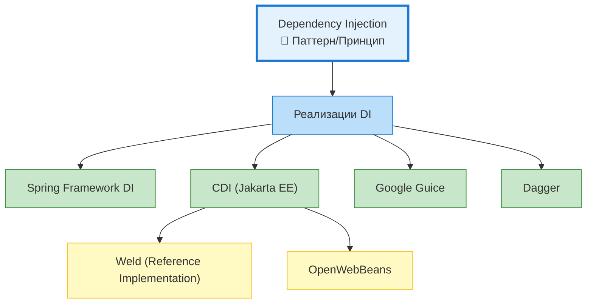
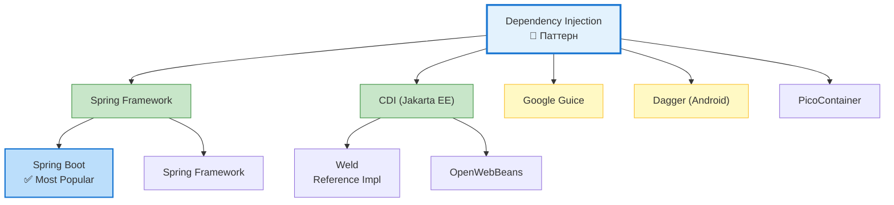

---
aliases:
  - CDI
  - Contexts and Dependency Injection
  - Dependency Injection
  - DI
---
## 🔄 Dependency Injection (DI) vs CDI

### 📌 Краткий ответ

| Термин | Что это | Статус |
|--------|---------|--------|
| **Dependency Injection (DI)** | **Паттерн/принцип** проектирования | ✅ Концепция |
| **CDI (Contexts and Dependency Injection)** | **Java-спецификация** (JSR-365), реализующая DI | ✅ Стандарт Jakarta EE |

> **DI — это ЧТО (концепция).**
> **CDI — это КАК (конкретная реализация/стандарт).**

---

## 🧩 Иерархия понятий



---

## 📊 Детальное сравнение

| Критерий | **Dependency Injection (DI)** | **CDI** |
|----------|------------------------------|---------|
| **Уровень** | Паттерн проектирования | Java-спецификация (JSR-365) |
| **Что это** | Концепция внедрения зависимостей | Стандарт + реализация DI для Java EE/Jakarta EE |
| **Зависимости** | Нет (это принцип) | `jakarta.enterprise` (ранее `javax.enterprise`) |
| **Реализации** | Spring, Guice, Dagger, CDI | Weld, OpenWebBeans |
| **Контексты** | Зависит от реализации | ✅ Встроенные (Request, Session, Application, etc.) |
| **События (Events)** | Зависит от реализации | ✅ Встроенная система событий |
| **Интерцепторы** | Зависит от реализации | ✅ Встроенные (`@Interceptor`) |
| **Декораторы** | Зависит от реализации | ✅ Встроенные (`@Decorator`) |
| **Qualifiers** | Зависит от реализации | ✅ Встроенные (`@Qualifier`) |
| **Производители** | Зависит от реализации | ✅ Встроенные (`@Produces`) |
| **Scope** | Зависит от реализации | ✅ Стандартные (`@Singleton`, `@RequestScoped`, etc.) |

---

## 🧪 Пример кода: одно и то же, по-разному

### 1. **Чистый DI (принцип)**

```java
// ✅ DI как принцип — просто внедрение через конструктор
public class LicenseResolver {
    private final ObjectMapper objectMapper;
    
    // Зависимость внедряется извне
    public LicenseResolver(ObjectMapper objectMapper) {
        this.objectMapper = objectMapper;
    }
}

// Кто-то снаружи создаёт и передаёт зависимость
ObjectMapper mapper = new ObjectMapper();
LicenseResolver resolver = new LicenseResolver(mapper);  // ✅ DI вручную
```

---

### 2. **Spring DI (реализация DI)**

```java
// ✅ Spring реализует DI через аннотации
@Component
public class LicenseResolver {
    
    private final ObjectMapper objectMapper;
    
    @Autowired  // Spring внедряет зависимость
    public LicenseResolver(ObjectMapper objectMapper) {
        this.objectMapper = objectMapper;
    }
}

// Контейнер создаёт и управляет
ApplicationContext ctx = new AnnotationConfigApplicationContext();
LicenseResolver resolver = ctx.getBean(LicenseResolver.class);
```

---

### 3. **CDI (спецификация + реализация)**

```java
// ✅ CDI — стандарт Jakarta EE
@ApplicationScoped  // CDI scope
public class LicenseResolver {
    
    @Inject  // CDI внедрение (стандартное)
    private ObjectMapper objectMapper;
    
    // CDI также поддерживает конструктор
    @Inject
    public LicenseResolver(ObjectMapper objectMapper) {
        this.objectMapper = objectMapper;
    }
}

// CDI контейнер управляет
@ApplicationScoped
public class LicenseService {
    
    @Inject  // CDI внедряет LicenseResolver
    private LicenseResolver resolver;
    
    public void check() {
        resolver.resolve("MIT");
    }
}
```

---

## 🎯 Ключевые особенности CDI

### 1. **Контексты (Contexts)**

```java
@Singleton        // Один экземпляр на приложение
@ApplicationScoped // Один экземпляр на приложение
@RequestScoped    // Один экземпляр на HTTP-запрос
@SessionScoped    // Один экземпляр на сессию
@ConversationScoped // Один экземпляр на разговор (несколько запросов)
@Dependent        // Новый экземпляр каждый раз
```

### 2. **Qualifiers (квалификаторы)**

```java
// ✅ CDI позволяет различать реализации через квалификаторы
@Qualifier
@Retention(RUNTIME)
@Target({TYPE, METHOD, FIELD, PARAMETER})
public @interface Production {}

@Production
public class ProductionLicenseService implements LicenseService { ... }

@Inject
@Production  // Внедряем конкретную реализацию
private LicenseService licenseService;
```

### 3. **Производители (Producers)**

```java
// ✅ CDI позволяет создавать объекты программно
public class ObjectMapperProducer {
    
    @Produces
    @Singleton
    public ObjectMapper createObjectMapper() {
        ObjectMapper mapper = new ObjectMapper();
        mapper.configure(DeserializationFeature.FAIL_ON_UNKNOWN_PROPERTIES, false);
        return mapper;
    }
}
```

### 4. **События (Events)**

```java
// ✅ CDI имеет встроенную систему событий
@Inject
private Event<LicenseCheckedEvent> licenseEvent;

public void checkLicense(String name) {
    // ...
    licenseEvent.fire(new LicenseCheckedEvent(name));  // Публикация события
}

// Подписчик на событие
public class LicenseAudit {
    public void onLicenseChecked(@Observes LicenseCheckedEvent event) {
        log.info("License checked: {}", event.getName());
    }
}
```

### 5. **Интерцепторы (Interceptors)**

```java
// ✅ CDI интерцепторы для кросс-забот
@Interceptor
@Logging
public class LoggingInterceptor {
    
    @AroundInvoke
    public Object log(InvocationContext ctx) throws Exception {
        log.info("Calling: {}", ctx.getMethod().getName());
        return ctx.proceed();
    }
}
```

---

## 📊 Экосистема DI



---

## 📋 Когда что использовать?

| Сценарий | Рекомендация | Почему |
|----------|--------------|--------|
| **Spring Boot приложение** | ✅ Spring DI | Интеграция, экосистема, простота |
| **Jakarta EE / Java EE** | ✅ CDI | Стандарт платформы, встроенные контексты |
| **Микросервисы (Quarkus)** | ✅ CDI | Quarkus использует CDI как стандарт |
| **Микросервисы (Spring Cloud)** | ✅ Spring DI | Интеграция с Spring экосистемой |
| **Android приложение** | ✅ Dagger/Hilt | Оптимизировано для mobile |
| **Библиотека для других** | ⚠️ Чистый DI (без контейнера) | Не навязывать фреймворк |
| **Тесты** | ✅ Чистый DI | Легко передавать моки в конструктор |

---

## 🔄 Миграция: Spring DI ↔ CDI

| Spring DI | CDI (Jakarta EE) |
|-----------|------------------|
| `@Component` | `@Named` / `@ApplicationScoped` |
| `@Autowired` | `@Inject` |
| `@Qualifier` | `@Qualifier` (своя аннотация) |
| `@Scope` | `@RequestScoped`, `@SessionScoped`, etc. |
| `@Bean` | `@Produces` |
| `ApplicationContext` | `BeanManager` |
| `@EventListener` | `@Observes` |
| `@Aspect` | `@Interceptor` |

---

## 📌 Памятка

```
┌─────────────────────────────────────────────────────────────┐
│  DI vs CDI                                                  │
│                                                             │
│  Dependency Injection (DI)                                  │
│  • 📐 Паттерн/принцип проектирования                        │
│  • "Внедряй зависимости извне"                              │
│  • Реализации: Spring, CDI, Guice, Dagger                   │
│                                                             │
│  CDI (Contexts and Dependency Injection)                    │
│  • 📄 Java-спецификация (JSR-365, Jakarta EE)               │
│  • Реализует DI + контексты + события + интерцепторы        │
│  • Реализации: Weld, OpenWebBeans                           │
│  • Используется в: Quarkus, Jakarta EE, Payara              │
│                                                             │
│  ✅ DI — это концепция                                     │
│  ✅ CDI — это одна из реализаций DI                        │
│  ✅ Spring DI — другая реализация DI                       │
└─────────────────────────────────────────────────────────────┘
```

---

## 🚀 Итог

| Вопрос | Ответ |
|--------|-------|
| **DI и CDI — это одно и то же?** | ❌ Нет. DI — паттерн, CDI — реализация |
| **Что такое CDI?** | Java-спецификация (Jakarta EE), реализующая DI |
| **Что популярнее?** | ✅ Spring DI (для большинства проектов) |
| **Когда использовать CDI?** | Jakarta EE, Quarkus, enterprise-приложения |
| **Можно ли использовать оба?** | ⚠️ Технически да, но не рекомендуется (конфликты) |
| **Что учить новичку?** | ✅ Spring DI (больше вакансий, проще старт) |

---

## 💡 Практическая рекомендация

```
┌─────────────────────────────────────────────────────────────┐
│  Выбор DI-фреймворка в 2026                                 │
│                                                             │
│  Spring Boot проект → ✅ Spring DI                          │
│  Quarkus проект     → ✅ CDI (Weld)                         │
│  Jakarta EE проект  → ✅ CDI                                │
│  Android проект     → ✅ Dagger/Hilt                        │
│  Библиотека         → ✅ Чистый DI (без контейнера)         │
│                                                             │
│  🎯 Запомните: DI — это принцип, CDI — одна реализация     │
└─────────────────────────────────────────────────────────────┘
```

> 💡 **Совет:** Не путайте **концепцию** (DI) с **реализацией** (CDI, Spring). Понимание DI как принципа сделает вас лучшим разработчиком, независимо от фреймворка.
