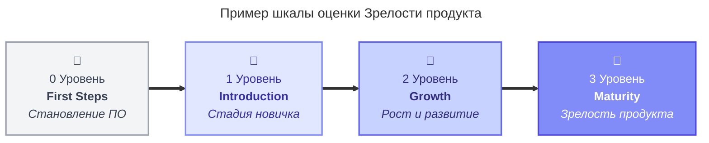

---
aliases:
  - PML
  - Product Maturity Level
---
# Product Maturity Level

**PML (Product Maturity Level)** — это система оценки зрелости продукта, которая позволяет руководству и стейкхолдерам объективно понимать, на какой стадии развития находится программное решение. Вместо бинарного статуса «готово/не готово», PML использует многомерную шкалу, оценивающую продукт по разным критическим аспектам.

Ниже приведено подробное объяснение каждого из запрошенных уровней зрелости:

### PML: Readiness to Distribution & Sales
> Готовность к дистрибуции и продажам

Этот уровень оценивает способность компании коммерциализировать продукт. Он отвечает на вопрос: *«Можем ли мы эффективно продавать и доставлять этот продукт клиентам?»*

*   **Ключевые метрики:**
    *   Наличие настроенных каналов сбыта (прямые продажи, партнеры, маркетплейсы).
    *   Готовность биллинговой системы и механизмов лицензирования.
    *   Обученность отделов продаж и поддержки (наличие battle cards, скриптов, демо-стендов).
    *   Юридическая готовность (типовые договоры, EULA, SLA).
*   **Низкий уровень:** Продукт есть, но его сложно купить, нет прайс-листа, поддержка не знает, как его администрировать.
*   **Высокий уровень:** Полностью автоматизированный процесс онбординга, обученные партнеры, отлаженная система выдачи лицензий.

### PML: Functional Maturity
> Функциональная зрелость

Оценивает полноту и качество реализованных функций с точки зрения пользовательских сценариев (User Stories). Отвечает на вопрос: *«Решает ли продукт заявленные бизнес-задачи пользователя?»*

*   **Ключевые метрики:**
    *   Покрытие требований (Requirements Coverage): процент реализованных фич из дорожной карты.
    *   Качество UX/UI: удобство использования, отсутствие критических багов.
    *   Стабильность работы основных сценариев (Happy Path).
    *   Наличие документации для конечных пользователей.
*   **Низкий уровень:** MVP с базовым функционалом, много "костылей", неудобный интерфейс.
*   **Высокий уровень:** Полный набор функций, интуитивный интерфейс, высокая надежность, наличие продвинутых настроек для power users.

### PML: Architecture & security index
> Архитектура и Индекс КБ (Кибербезопасности)

Этот уровень фокусируется на технической надежности, масштабируемости и защищенности продукта. Отвечает на вопрос: *«Насколько продукт устойчив, безопасен и готов к росту нагрузки?»*

*   **Ключевые метрики:**
    *   **Архитектура:** Модульность, возможность горизонтального масштабирования, отказоустойчивость (High Availability), время восстановления (RTO/RPO).
    *   **Индекс КБ (Cybersecurity Index):** Результаты пентестов, наличие сертификатов (SOC2, ISO 27001), шифрование данных (at rest/in transit), управление уязвимостями (CVE), соответствие регуляторным требованиям (GDPR, 152-ФЗ).
*   **Низкий уровень:** Монолит, сложно масштабировать, есть известные уязвимости, нет аудита безопасности.
*   **Высокий уровень:** Микросервисная или событийная архитектура, автоматическое масштабирование, регулярные аудиты безопасности, нулевое доверие (Zero Trust).

### PML: Market Potential
> Рыночный потенциал

Оценивает привлекательность продукта для рынка и его конкурентоспособность. Отвечает на вопрос: *«Есть ли спрос на этот продукт и может ли он захватить долю рынка?»*

*   **Ключевые метрики:**
    *   Размер целевого рынка (TAM/SAM/SOM).
    *   Уникальное торговое предложение (USP) и отличия от конкурентов.
    *   Готовность рынка к принятию технологии (Technology Adoption Lifecycle).
    *   Барьеры входа для конкурентов.
*   **Низкий уровень:** Нишевый продукт с низким спросом или высококонкурентный рынок без четкого USP.
*   **Высокий уровень:** Растущий рынок, сильный бренд, патенты или уникальные технологии, высокая лояльность ранних последователей.

### PML: Client Rates
> Оценки клиентов / Удовлетворенность

Этот уровень отражает реальное восприятие продукта существующими клиентами. Отвечает на вопрос: *«Довольны ли клиенты продуктом и готовы ли они его рекомендовать?»*

*   **Ключевые метрики:**
    *   NPS (Net Promoter Score): индекс потребительской лояльности.
    *   CSAT (Customer Satisfaction Score): удовлетворенность поддержкой и продуктом.
    *   Churn Rate: уровень оттока клиентов.
    *   Количество и тяжесть эскалаций в поддержку.
*   **Низкий уровень:** Высокий отток, много жалоб, низкий NPS (<0).
*   **Высокий уровень:** Низкий отток, высокий NPS (>50), клиенты выступают адвокатами бренда, оставляют положительные отзывы.

---

### Как использовать эту модель?

Обычно каждый из этих 5 параметров оценивается по шкале (например, от 1 до 5 или от 0% до 100%). Итоговый **PML продукта** может рассчитываться как средневзвешенное значение или определяться по «самому слабому звену» (бутылочному горлышку).

**Пример:**
У вас может быть отличный продукт с высокой **Функциональной зрелостью** (4.5/5) и хорошей **Архитектурой** (4.0/5), но если **Readiness to Sales** на уровне 1.0/5 (продавцы не умеют его продавать), то общий коммерческий успех продукта будет под угрозой. Управление PML помогает балансировать инвестиции между разработкой, безопасностью, маркетингом и поддержкой.