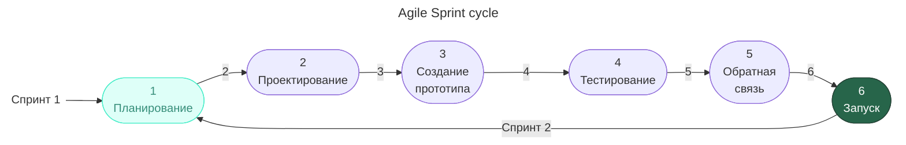
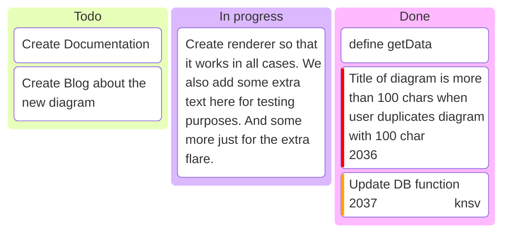

---
aliases:
  - Agile
  - Agile Manifesto
  - agile software development
  - Burndown Chart
  - Daily Scrum
  - Development Team
  - Kanban
  - LeSS
  - Product Backlog
  - Product Owner
  - Retrospective
  - Scrum
  - Scrum Master
  - Sprint
  - Sprint Planning
  - Sprint Retrospective
  - Sprint Review
  - Бэклог продукта
  - Гибкие методологии разработки
  - Канбан
  - Манифест Agile
  - Скрам
  - Спринт
---
## Agile software development

Agile (agile software development) — подход к управлению проектами по разработке программного обеспечения (ПО), который часто применяют в небольших командах.

Как правило, для гибкого подхода Agile характерна работа короткими итерациями по две-три недели. Внутри каждой итерации собрана серия задач: анализ, проектирование, непосредственно работа и тестирование. После каждой итерации команда анализирует результаты и меняет приоритеты для следующего цикла.

Старт Agile в 2001 — **манифест Agile** от 17 разработчиков в США, Юта. Включает в себя 12 принципов.

### Основные понятия

- Ретро совещание.
- Дэйли совещание.
- Покер-планинг совещание.
- Юзерстори — набор декомпозированных задач, объединённых общим смыслом.
- Спринт.
- Релиз.
- [[sprint-planning|Эпик]].

### Манифест Agile

1. **Удовлетворение клиентов** — приоритетная задача при разработке продукта. Клиенты должны своевременно и в полном объёме получать качественное ПО и его обновления.
2. **Изменения в процессе разработки приветствуются**. Гибкие процессы позволяют наделить продукт конкурентными преимуществами для клиентов.
3. **Рабочее ПО нужно доставлять клиенту часто**, в рамках 2–16 недель.
4. **Руководители и разработчики должны трудиться вместе** на протяжении всего рабочего процесса.
5. **В основе проекта — мотивированные люди**. Обеспечьте им необходимые условия работы, поддержку и доверие.
6. Лучший способ передачи информации в команде — **личная беседа**.
7. **Основное мерило прогресса — работающее ПО**, а не часы, трудозатраты и другие критерии.
8. **Гибкие процессы — основа устойчивого развития**. Они позволяют поддерживать нужный рабочий темп как на спринтерской, так и на марафонской дистанции.
9. Важно уделять внимание **техническому совершенству и качественному дизайну продукта**.
10. Важно **сокращать до минимума лишнюю работу** и не переусложнять проект и рабочие процессы.
11. Самые лучшие продукты рождаются у **самоорганизующихся команд**. Нет микроменеджменту — да свободе управления.
12. Команда должна **регулярно оценивать работу и корректировать своё поведение**.

### Ценности Agile

Из двенадцати принципов выделяют четыре ценности системы Agile:

1. **Люди и взаимодействия важнее процессов** и инструментов.
2. Работающий **продукт важнее подробной документации**.
3. **Сотрудничество с заказчиком** важнее условий договора.
4. **Готовность к изменениям** важнее следования изначальному плану.

### Scrum

[[scrum|Scrum]] — это методология (имплементация) Agile.

### Kanban

Методология Agile, которая сводится к ведению доски задач.

#### Принципы Kanban

1. **Визуализируйте все задачи на специальной Kanban-доске.** Если появляется новая задача — сразу добавляйте на доску.
2. **Ограничьте количество работы в процессе** — в каждом столбике доски должно быть не больше определённого количества задач.
3. Управляйте потоком работы — **отслеживайте, как задачи движутся по доске**.
4. **Используйте только явные правила добавления и движения задач**, понятные всем участникам.
5. Вводите петли обратной связи — набор встреч, помогающих лучше понимать процесс работы.
6. Улучшайте процессы везде, где это возможно.

### LeSS

**LeSS** (Large-Scale Scrum) — это фреймворк для масштабирования Scrum на большие команды и сложные продукты. Его цель — сохранить простоту и ценности Scrum, но применить их к нескольким командам, работающим над одним продуктом.

#### Ключевые идеи

- **Один продукт — один бэклог.** Все команды используют единый Product Backlog, а не отдельные бэклоги на команду. Это помогает держать фокус на общем результате.
- **Один Product Owner.** За продукт отвечает один Product Owner (или небольшая группа), чтобы не размывать приоритеты и требования.
- **Минимум ролей и церемоний.** LeSS сознательно убирает лишние роли и усложнения: остаются базовые элементы Scrum плюс несколько масштабных событий.
- **Кросс-командное взаимодействие.** Команды должны уметь брать задачи из общего бэклога и совместно решать сложные вопросы, а не замыкаться на «своих» частях.

#### Основные события в LeSS

- **Общий Sprint Planning.** Бывает в два этапа: сначала все команды вместе обсуждают цели спринта, потом каждая команда детализирует свою работу.
- **Ежедневные встречи (Daily Scrum).** Проходят внутри каждой команды; при необходимости — координационные встречи между командами.
- **Обзор спринта (Sprint Review).** Общий обзор результата всех команд по продукту.
- **Ретроспектива.** Может быть как отдельной по командам, так и общей, чтобы обсуждать межкомандные проблемы.

#### Два варианта LeSS

- **Basic LeSS** — для 2–8 команд.
- **LeSS Huge** — для десятков команд: добавляет роли Area Product Owner и разбивку бэклога по областям (areas).
