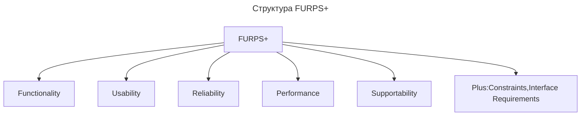
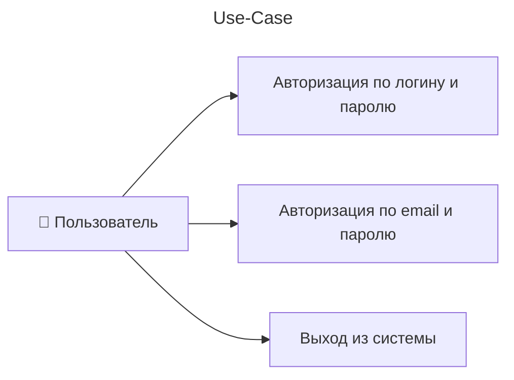
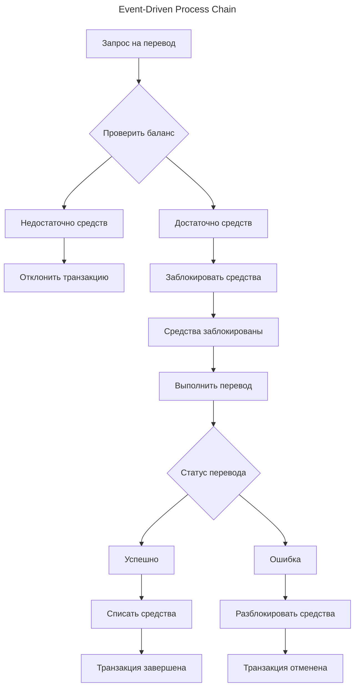
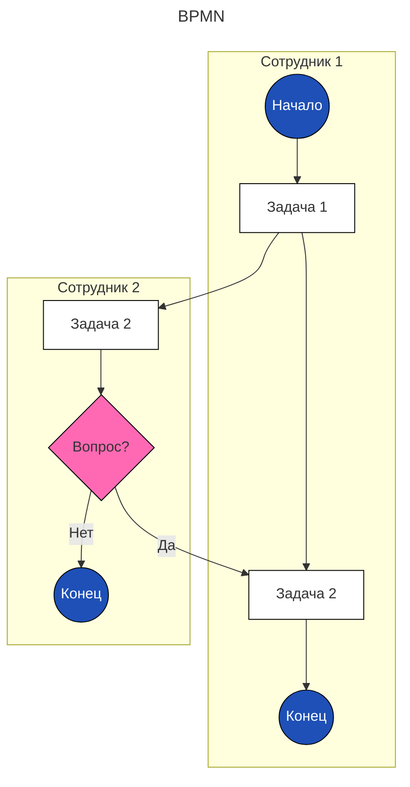

---
aliases:
  - ADR
  - Alternative Flow
  - Basic Flow
  - BPMN
  - BPMS
  - Business Process Model and Notation
  - change management
  - change request
  - Constraints
  - EPC
  - Event-Driven Process Chain
  - Functional
  - Functionality
  - FURPS
  - FURPS+
  - FURPSplus
  - Interface
  - Interface Requirements
  - Performance
  - quality attributes
  - Reliability
  - Requirements
  - stakeholders
  - Supportability
  - Usability
  - Use Case
  - Use Case Flow
  - Use Cases
  - usecase
  - User Story
  - альтернативный поток
  - архитектурно значимые требования
  - атрибуты качества
  - вариант использования
  - запрос на изменения
  - нефункциональные требования
  - основной поток
  - пользовательские сценарии
  - стейкхолдер
  - требования
  - управление изменениями
  - функциональные требования
---
## Управление изменениями (change management)

Управление изменениями (change management) — это процесс планирования, внедрения и контроля изменений проекта. Для этого нужно минимизировать негативные последствия и достичь поставленных целей.

## Работа со стейкхолдерами

Чтобы детально спланировать работы по проекту, важно определить ряд моментов:

1. выявить стейкхолдеров — людей, которые могут влиять на реализацию проекта;
2. выяснить требования к продукту;
3. описать пользовательские сценарии.

Стейкхолдеров можно разделить на две группы:

- Внутренние стейкхолдеры — это сотрудники компании, заинтересованные в проекте.
- Внешние стейкхолдеры — государственные органы и другие участники рынка, которые проявляют интерес к проекту.

После выявления стейкхолдеров надлежит определить степень вовлечённости стейкхолдеров в проект и их влияние:

1. **Высокая вовлечённость, высокое влияние**
2. **Высокая вовлечённость, низкое влияние**
3. **Низкая вовлечённость, высокое влияние**
4. **Низкая вовлечённость, низкое влияние**

**Для организации работы стейкхолдеров их интересы нужно регулярно подвергать анализу и переоценке:** проводить встречи для синхронизации, уточнять требования и рассказывать о результатах.

Для удобства взаимодействия имеет смысл создать **матрицу стейкхолдеров**.

## Работа с требованиями к продукту

Требования делятся на **функциональные** и **нефункциональные**.

- **Функциональные требования** описывают то, что система должна делать, то есть конкретные функции.
- **Нефункциональные требования** описывают то, как система будет реализовывать функции при работе. Их ещё называют **атрибутами качества**. Это могут быть требования, которые влияют на производительность, надёжность, удобство использования системы.

**Архитектурно значимые требования**

Архитектурно значимые требования — это требования, которые оказывают влияние на архитектуру системы. Это могут быть требования как к программному обеспечению, так и к оборудованию. Другими словами, если появляется архитектурно значимое требование, то оно точно окажет влияние на архитектуру и реализацию. Чаще всего в эту группу попадают нефункциональные требования.

Обычно выделяют четыре группы ограничений:

- **Ограничения проектирования:** средства разработки, технологии.
- **Ограничения реализации:** стандарты разработки кода или требования к архитектуре.
- **Требования к интерфейсам:** форматы взаимодействия компонентов, протоколы или способы взаимодействия, например, синхронные или асинхронные.
- **Физические ограничения:** они накладываются на аппаратные средства и окружение системы, например, температура, влажность, условия эксплуатации оборудования.

### [[furps-plus]] – Functionality Usability Reliability Performance Supportability Restrictions Plus

> Реализует [[software-life-cycle]]

**FURPS+** — набор критериев качества программного обеспечения для систематического анализа и оценки **нефункциональных требований**.

**Functionality, F, Функциональные** — то, что система должна выполнять на релизе.

**Usability, U, Удобство использования** — правила, по которым система взаимодействует с пользователем. Это могут быть UX/UI-дизайн, правила работы интерфейса для людей с ограниченными возможностями, справочная информация по работе с системой.

**Reliability, R, Надёжность** — всё, что относится к работоспособности системы: время простоя в случае сбоя, режим работы, график обслуживания. Обычно невозможно сделать систему устойчивой в любой ситуации, поэтому сразу важно заложить ограничения.

**Performance, P, Производительность** — всё, что относится к быстродействию и потреблению ресурсов: время отклика, масштабирование системы, число одновременных пользователей.

**Supportability, S, Поддерживаемость** — возможность и правила тестирования, параметры расширения и доработки системы.

**Plus, +, дополнительные требования** — это дополнительные ограничения, которые мы накладываем на систему: языки программирования, правила проектирования, применение определённых баз данных. Эту группу можно отнести к архитектурно значимым требованиям.

Plus декомпозируется на категории:

- Constraints
- Interface
- Requirements

### [[use-case]] – Пользовательские сценарии

Use Cases, или пользовательские сценарии, описывают, какие действия совершает пользователь и как система на них реагирует. Иначе говоря, это варианты использования.

В Agile-подходах к разработке часто используется инструмент **User Story**. Обычно это небольшая задача с фокусом на действиях пользователя в продукте.

Последовательность выполнения пользовательского сценария называют потоком варианта использования (**Use Case Flow**). Основную последовательность, которая приводит к целевому результату, называют основным потоком (**Basic Flow**), а различные ветвления — альтернативными потоками (**Alternative Flow**).

## Описание бизнес-процессов

Для описания процессов может использоваться нотация EPC. Визуально она похожа на алгоритмическую последовательность действий: имеет логические операторы, описание функций в процессе и событий, которые к ним приводят.

**Форматы нотации бизнес-процессов**
- EPC — **Event-Driven Process Chain**
  - Чередование событий и действий, образующих цикл.
- BPMN — **Business Process Model and Notation**
  - **События**, действия, шлюзы, потоки, дорожки.
- BPMS

### [[event-driven-process-chain]] – Event-Driven Process Chain

Пример EPC-схемы взаимодействия:

### [[business-process-model-notation]] – Business Process Model and Notation

Пример BPMN:

## Изменение архитектуры

- [[architecture-design-log|Описание архитектуры]]
- Презентация архитектуры
- Планирование реализации
  - План работ и роадмап реализации

## Изменение планов

Проекты по разработке редко следуют намеченным планам.

Методов работы с изменениями несколько:

- **Предиктивный** — мы заранее держим в голове риск того, что случится какое-то изменение, и имеем план на этот счёт.
- **Реактивный** — мгновенная реакция на случившееся изменение. В этом случае снизить риски уже не получится, но на него можно оперативно отреагировать.
- **Последовательный** — это систематический подход к работе с изменениями, он состоит из нескольких этапов и как раз заключается в построении модели управления.

Системный подход к управлению изменениями помогает фокусироваться на исходной цели создания продукта. А если условия изменились — поможет верно учесть все риски при появлении новых требований.

Этапы управления изменениями могут выглядеть так:

1. **Идентификация изменений**. Например, в ходе реализации проекта появляется риск не успеть реализовать работу с оплатой подписки в медиаплатформе — нужно искать альтернативу.
2. **Документирование**. Детали изменения полезно фиксировать: это можно делать, например, в корпоративном wiki, и на каждую инициативу по изменениям создавать специальный документ — **запрос на изменения (change request)**.
3. **Оценка**. Нужно определить, насколько сложно будет реализовать изменения и стоит ли рассматривать такой вариант. Этот этап не отличается от начального планирования изменений при создании проекта: определяются требования и архитектура, проводится планирование и оценка для этой локальной задачи — описываются требования и Use Cases, формируется ADR, перепланируются и оцениваются задачи.
4. **Авторизация**. Если есть оценка и понятен план работ, можно принять решение — идти таким путём или нет. Важно согласовать этот этап с заказчиком проекта: может оказаться, что стоит рассмотреть другой вариант или немного сдвинуть срок запуска.
5. **Контроль**. Реализация изменений по плану.
