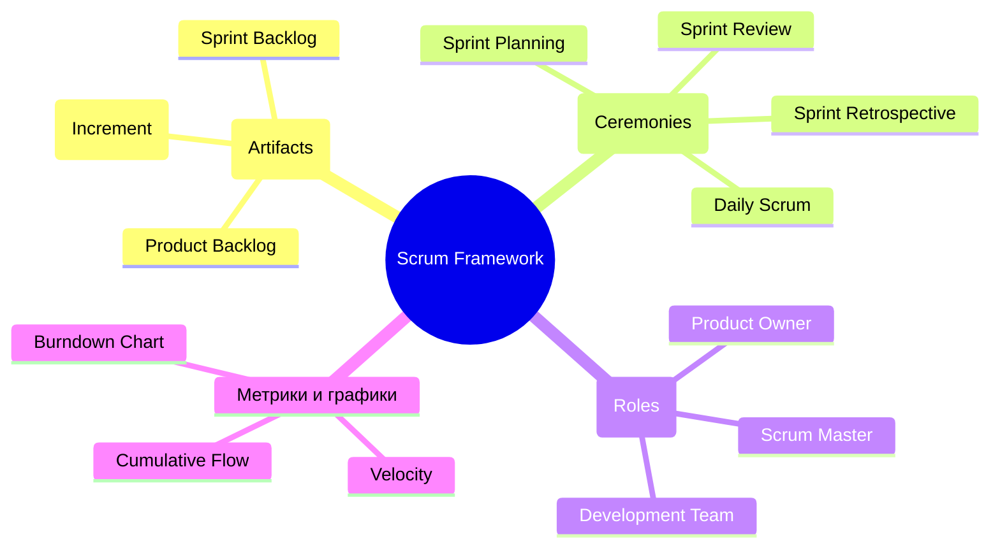
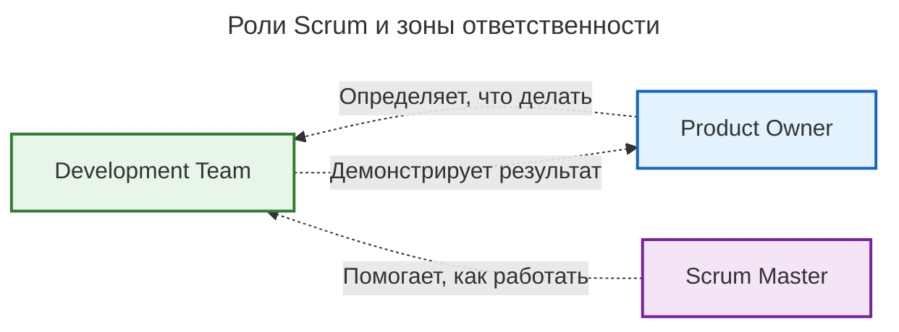
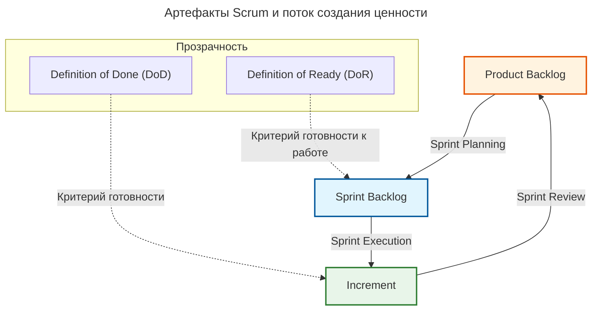
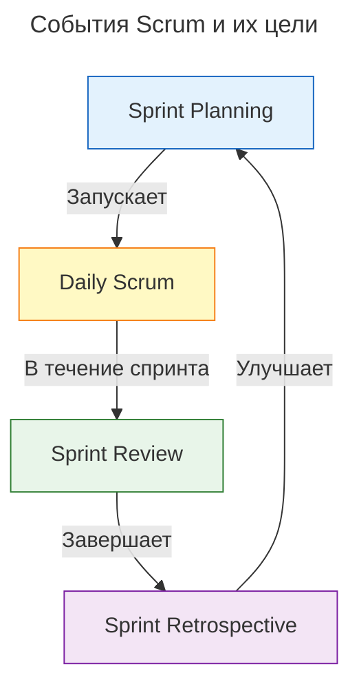
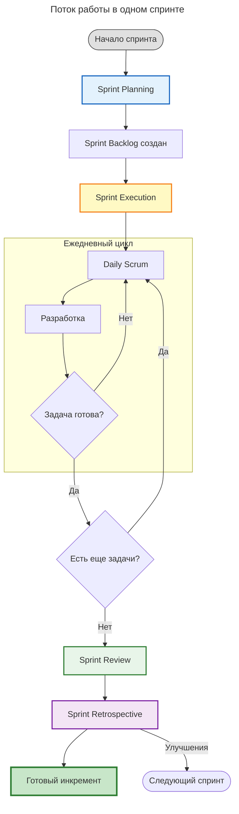
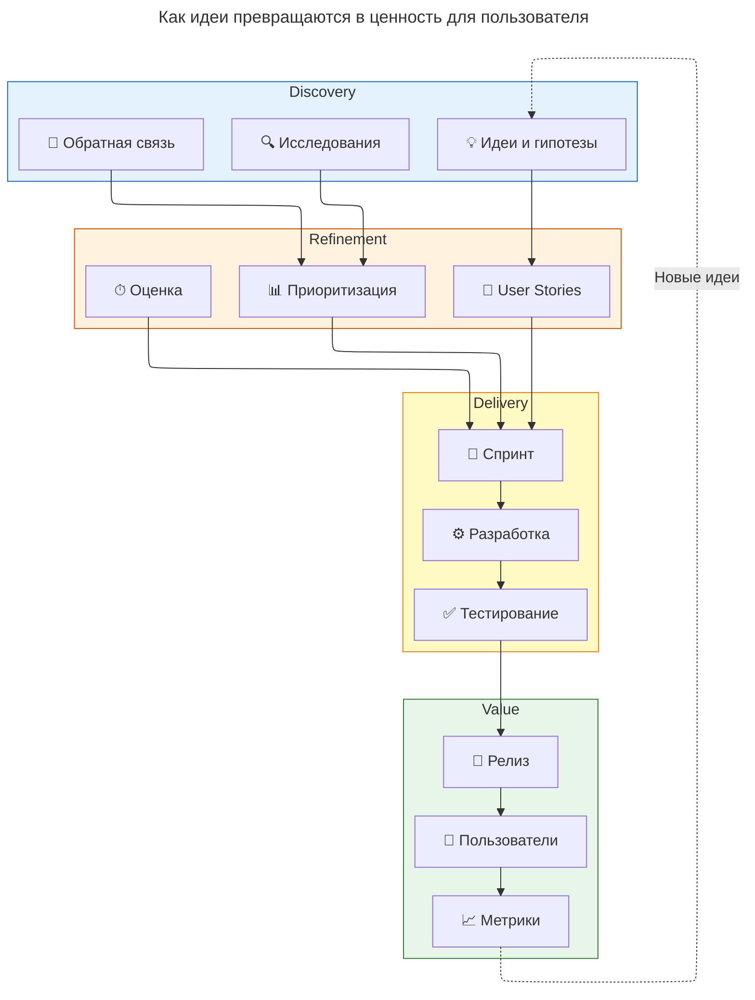
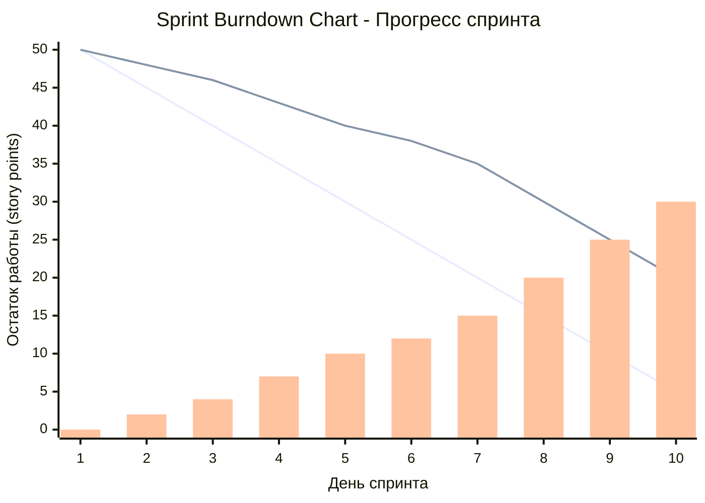
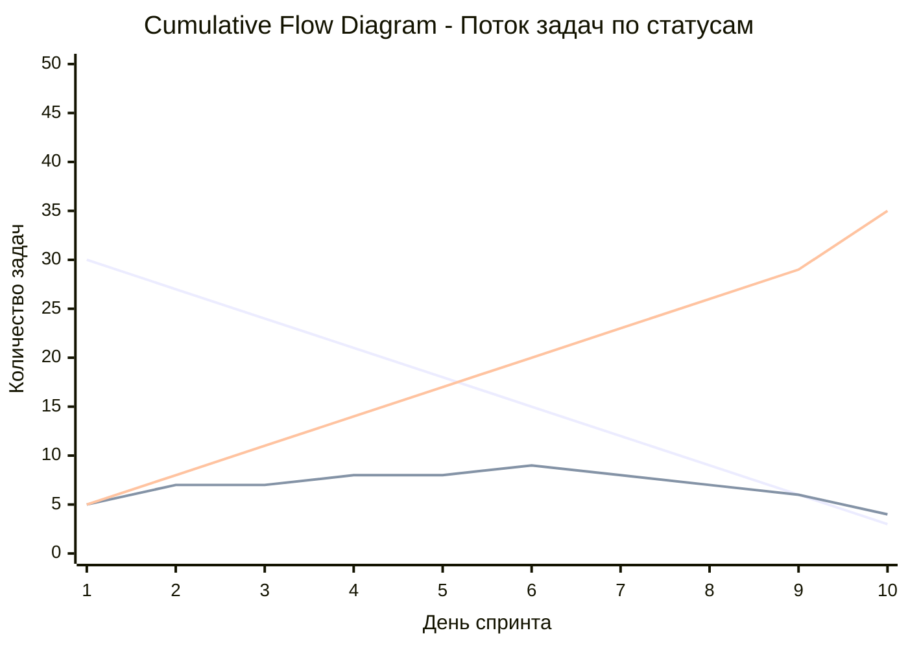

---
aliases:
  - Agile
  - Backlog
  - Burndown Chart
  - CFD
  - Cumulative Flow
  - Cumulative Flow Diagram
  - Daily Scrum
  - Daily Standup
  - Definition of Done
  - Definition of Ready
  - Development Team
  - DoD
  - DoR
  - Increment
  - PBI
  - PO
  - Product Backlog
  - Product Backlog Item
  - Product Owner
  - Retro
  - Return on Investment
  - ROI
  - Scrum
  - Scrum Ceremonies
  - Scrum Framework
  - Scrum Master
  - Self-organization
  - Sprint
  - Sprint Backlog
  - Sprint Goal
  - Sprint Planning
  - Sprint Retrospective
  - Sprint Review
  - Story Point
  - Story Points
  - Time-box
  - Timebox
  - Timeboxing
  - User Stories
  - User Story
  - Value Stream
  - Velocity
  - WIP
  - Work in Progress
  - Work In Progress
  - Бэклог
  - Бэклог спринта
  - Владелец продукта
  - Дейли
  - Диаграмма сгорания задач
  - Ежедневный Scrum
  - Инкремент
  - Команда разработки
  - Команда разработчиков
  - Критерии готовности
  - Критерии готовности к работе
  - Кросс-функциональность
  - Лимиты WIP
  - Обзор спринта
  - Определение готовности
  - Определение готовности к работе
  - Планирование спринта
  - Пользовательская история
  - Поток создания ценности
  - Продакт-оунер
  - Ретро
  - Ретроспектива
  - Самоорганизация
  - Скорость команды
  - Скрам
  - Скрам мастер
  - Скрам-мастер
  - События Scrum
  - Спринт
  - Стори поинт
  - Тайм-бокс
  - Таймбоксинг
  - Цель спринта
  - Церемонии Scrum
  - Юзер-стори
  - Юзерстори
---

## Scrum

Scrum — это процессный фреймворк, реализующий ценности [[agile|Agile]].

### Структура Scrum Framework

**Артефакты (Artifacts):**

- **Product Backlog** — элементы бэклога (PBI), приоритизация (Value), оценка усилий, user stories, баги, технический долг.
- **Sprint Backlog** — задачи спринта, Sprint Goal, план выполнения, Burndown Chart.
- **Инкремент (Increment)** — готовая функциональность, критерии готовности, качество продукта, потенциально релизный продукт.

**Церемонии (Ceremonies):**

- **Sprint Planning** — что делать? как делать? Sprint Goal, оценка задач.
- **Daily Scrum** — что сделал вчера? что сделаю сегодня? какие препятствия? 15 минут.
- **Sprint Review** — демонстрация, обратная связь, обновление бэклога, адаптация плана.
- **Sprint Retrospective** — анализ процесса, улучшения, action items, непрерывное улучшение.

**Роли (Roles):**

- **Product Owner** — видение продукта, приоритизация, принятие решений, ROI.
- **Scrum Master** — фасилитация, устранение препятствий, коучинг, защита команды.
- **Development Team** — кросс-функциональность, самоорганизация, совместная ответственность, 3-9 человек.

**Метрики и графики:**

- **Velocity** — средняя скорость, планирование, прогнозирование.
- **Burndown Chart** — остаток работы, прогресс спринта, визуализация.
- **Cumulative Flow** — поток работы, боттленеки, WIP лимиты.

---

### Роли в Scrum и их ответственность

**Ключевая идея:** три роли с четким разделением ответственности.

1. **Product Owner** отвечает за «что»: видение продукта, приоритизация бэклога, принятие решений о функциональности, максимизация ценности продукта.
2. **Development Team** отвечает за «как»: самоорганизация, кросс-функциональность, создание инкремента, оценка и планирование работы.
3. **Scrum Master** отвечает за процесс: фасилитация процессов, устранение препятствий, обучение команды Scrum, защита команды от внешних вмешательств.

---

### Артефакты Scrum

**Ключевая идея:** три артефакта представляют собой трансформацию идей в готовый продукт. Каждый артефакт имеет четкие критерии качества (DoD/DoR).

**Product Backlog** — список всех требований к продукту. Он приоритизирован Product Owner'ом, динамически обновляется и содержит user stories. Содержимое: элементы бэклога (Product Backlog Items, PBI), баги и технический долг.

**Sprint Backlog** — план на спринт: выбирается командой, имеет четкую цель (Sprint Goal) и оценки усилий по каждой задаче.

**Increment** — готовый продукт: рабочая функциональность, которая соответствует Definition of Done и демонстрируется стейкхолдерам.

**Definition of Done (DoD)** — критерий готовности: набор условий, по которым задача или инкремент считаются завершенными. «Готово» означает готово к релизу. DoD применяется к Increment.

**Definition of Ready (DoR)** — критерий готовности к работе: условия, которым должна соответствовать задача, чтобы ее можно было взять в Sprint Backlog на Sprint Planning. DoR применяется к Sprint Backlog.

---

### События Scrum (Ceremonies)

**Ключевая идея:** четыре события создают цикл непрерывного улучшения. Каждое событие имеет фиксированную длительность и четкую цель.

**Sprint Planning** — планирование спринта.
- Отвечает на вопросы: что можно сделать? как это сделать? Результат — Sprint Goal и оценка задач.
- ⏱ 2-4 часа на неделю спринта

**Daily Scrum** — ежедневная синхронизация
- Отвечает на вопросы: что сделал вчера? что сделаю сегодня? какие препятствия?
- ⏱ 15 минут ежедневно

**Sprint Review** — обзор результатов спринта.
- Включает демонстрацию инкремента, сбор обратной связи, адаптацию бэклога.
- ⏱ 1-2 часа на неделю спринта

**Sprint Retrospective** — ретроспектива.
- Анализ: что прошло хорошо? что улучшить? Результат — план действий.
- ⏱ 45 минут - 1½ часа

---

### Поток одного спринта

**Ключевая идея:** спринт — это фиксированный по времени цикл (timebox), в котором создается готовый инкремент продукта. Ежедневные встречи синхронизируют команду.

1. **Начало спринта.** Спринт имеет фиксированную длительность.
2. **Sprint Planning** — анализ Product Backlog, выбор элементов, декомпозиция задач, оценка усилий, формирование Sprint Goal.
3. **Sprint Backlog создан** — список задач на спринт.
4. **Sprint Execution** (длительность 2-4 недели) — ежедневный цикл: Daily Scrum → разработка (кодирование, code review, тестирование, интеграция) → проверка готовности задачи; цикл повторяется, пока не готова каждая задача, затем все остальные задачи.
5. **Sprint Review** — демонстрация инкремента, сбор обратной связи, обновление Product Backlog.
6. **Sprint Retrospective** — анализ процесса, выявление улучшений, план действий.
7. **Готовый инкремент** — рабочий продукт; улучшения переносятся в следующий спринт.

---

### Поток создания ценности (Value Stream)

**Value Stream (поток создания ценности)** — полный путь, который проходит идея, чтобы превратиться в ценность для пользователя: от обнаружения потребности через уточнение требований и разработку до релиза, измерения метрик и генерации новых идей. Scrum в этом контексте — система доставки ценности, а не просто процесс разработки.

**Ключевая идея:** Scrum — это не просто процесс разработки, а система доставки ценности. Непрерывный цикл: от идеи через разработку к пользователю и обратно к новым идеям на основе метрик.

**Discovery (обнаружение потребностей)** — идеи и гипотезы, исследования, обратная связь.

**Refinement (уточнение требований)** — user stories, приоритизация, оценка.

**Delivery (доставка ценности)** — спринт, разработка, тестирование.

**Value (ценность для пользователя)** — релиз, пользователи, метрики.

Поток движения: идеи → user stories → спринт → разработка → тестирование → релиз → пользователи → метрики → новые идеи.

---

### Основные идеи Scrum

**🎯 Фокус на ценности**
Scrum максимизирует ценность продукта через приоритизацию и частые релизы. Product Owner постоянно обновляет бэклог на основе обратной связи.

**🔄 Итеративность и инкрементальность**
Работа разбивается на короткие спринты (2-4 недели). В конце каждого спринта создается готовый инкремент продукта, который можно продемонстрировать.

**📊 Прозрачность и инспекция**
Все артефакты и прогресс видны всем участникам. Регулярные события (Daily, Review, Retro) позволяют инспектировать и адаптировать процесс.

**👥 Самоорганизация**
Команда разработки сама решает, как выполнять работу. Это повышает мотивацию и ответственность.

**Непрерывное улучшение**
Ретроспектива в конце каждого спринта фокусируется на улучшении процессов. Small steps lead to big changes.

**⏱ Timeboxing**
Все события имеют фиксированную длительность. Это создает ритм и предотвращает бесконечные обсуждения.

**✅ Definition of Done (DoD)**
Четкие критерии готовности гарантируют качество каждого инкремента. «Готово» означает готово к релизу.

---

### Sprint Burndown Chart

**Линия «Идеальный прогресс» (черная)** — прямая, показывающая равномерное убывание остатка работы при идеальном плане: спринт из 10 дней и общий объем 50 story points означает уменьшение на 5 пунктов в день.

**Линия «Фактический прогресс»** — реальная динамика выполнения задач. Отклонение фактической линии от идеальной вверх показывает задержки и проблемы со скоростью.

**Столбцы «Завершенная работа»** — сколько story points реально закрыто к концу каждого дня спринта.

---

### Velocity

**Velocity (скорость команды)** — метрика, показывающая, какой объем работы команда способна завершить за один спринт. Измеряется в story points: это сумма оценок задач, закрытых по Definition of Done за спринт.

**Пример расчета.**

Команда завершила 4 спринта:

| Спринт | Завершенные задачи | Story Points |
|---|---|---|
| Спринт 1 | 8 | 40 |
| Спринт 2 | 7 | 38 |
| Спринт 3 | 9 | 45 |
| Спринт 4 | 8 | 36 |

**Формула:**
$$
Velocity\ =\ сумма\ SP\ за\ спринт\ /\ количество\ спринтов.
$$
eg: `(40 + 38 + 45 + 36) / 4 = 159 / 4 ≈ 40 SP`.

**Интерпретация.**

- Средняя скорость (≈ 40 SP) — ориентир для планирования следующего спринта: команда планирует взять в Sprint Backlog объем около 40 SP.
- Для планирования берут среднее за последние 3-5 спринтов, а не единичный максимум.
- Velocity не сравнивают между командами — единица измерения субъективна (оценки команд расходятся).

---

### Cumulative Flow

**Cumulative Flow Diagram (CFD, кумулятивная диаграмма потока)** — график, показывающий количество задач в каждом статусе (To Do, In Progress, Done) в каждый день. Позволяет видеть поток работы, боттленеки и WIP-лимиты.

**Как читать.**

- Полоса «Done» растет — команда завершает задачи.
- Полоса «In Progress» — незавершенная работа (WIP); чем она выше, тем больше «хвостов» и тем дольше цикл выполнения.
- Полоса «To Do» — запас задач в бэклоге.
- **Боттленек:** если «In Progress» растет, а «Done» не растет — задачи накапливаются на этапе разработки, поток заблокирован.
- **WIP-лимиты** ограничивают количество одновременно выполняемых задач: если «In Progress» упирается в лимит, команда не берет новую задачу, пока не закроет текущую.

**Интерпретация на примере:** к 10-му дню закрыто 35 задач из 50, в работе осталось 4, в бэклоге — 3. Поток равномерный, боттленеков нет.

---

### Definition of Ready (DoR) vs Definition of Done (DoD)

| Критерий              | Definition of Ready (DoR)                                   | Definition of Done (DoD)                           |
| --------------------- | ----------------------------------------------------------- | -------------------------------------------------- |
| **Момент применения** | до начала работы, на Sprint Planning                        | после завершения работы, на Sprint Review          |
| **Суть**              | критерий готовности к работе                                | критерий готовности                                |
| **Объект**            | задача, претендующая на попадание в Sprint Backlog          | Increment (готовая функциональность)               |
| **Вопрос**            | «можно ли брать задачу в спринт?»                           | «завершена ли задача?»                             |
| **Отвечает за**       | вход в спринт                                               | выход из спринта                                   |
| **Пример условия**    | *есть Acceptance Criteria, оценка усилий, ясность требований* | *код в репозитории, тесты пройдены, деплой выполнен* |

### Product Backlog vs Sprint Backlog

| Критерий          | Product Backlog                                  | Sprint Backlog                                |
| ----------------- | ------------------------------------------------ | --------------------------------------------- |
| **Суть**          | список всех требований к продукту                | план на спринт                                |
| **Горизонт**      | весь продукт, постоянно обновляется              | один спринт, фиксирован после Sprint Planning |
| **Ответственный** | Product Owner (приоритизация)                    | Development Team (выбор и выполнение)         |
| **Содержимое**    | требования, user stories, баги, технический долг | задачи спринта, Sprint Goal, план выполнения  |
| **Оценка**        | оценка усилий для приоритизации                  | оценки по каждой задаче спринта               |
| **Итог**          | источник задач для спринтов                      | конкретный план, который команда выполняет    |
