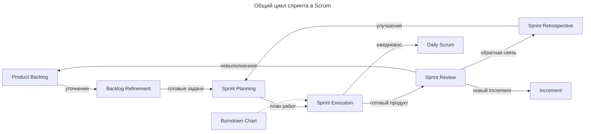
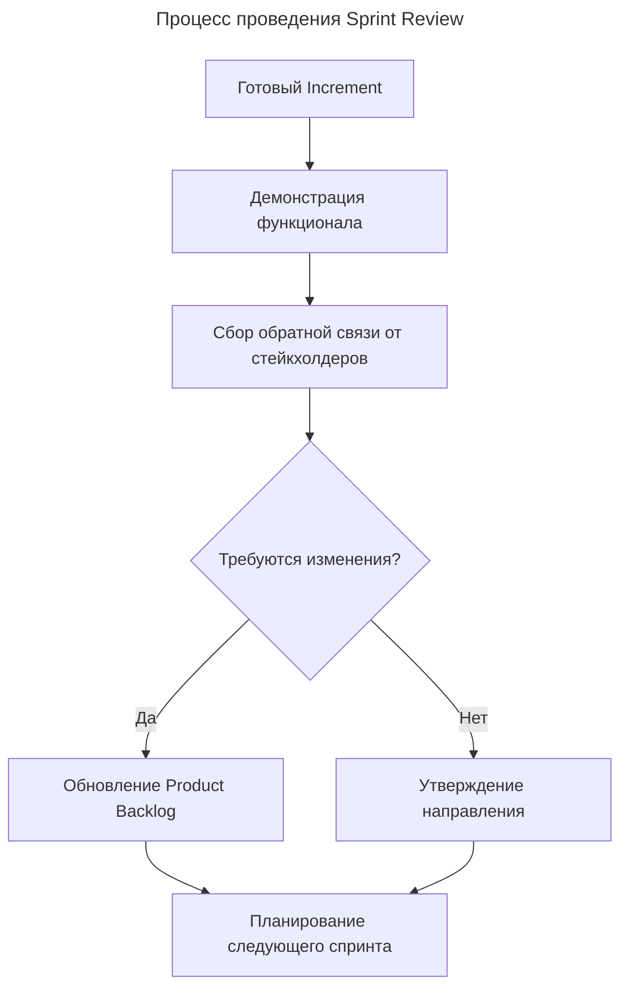
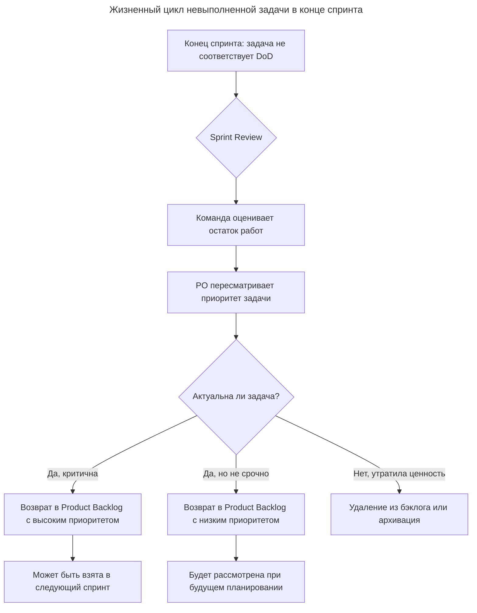
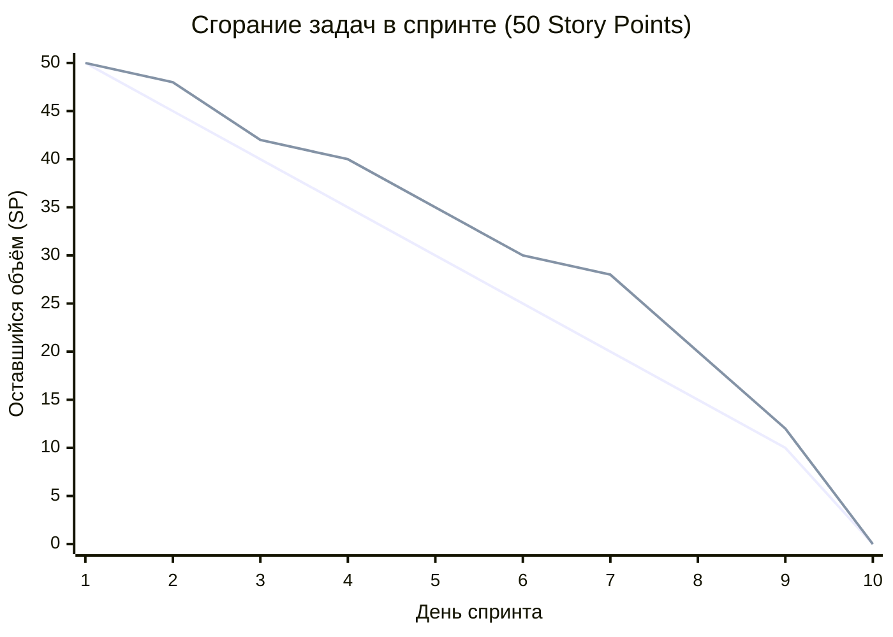

---
aliases:
  - AC
  - Acceptance Criteria
  - API contract
  - API-First
  - Backlog
  - Backlog Grooming
  - Backlog Refinement
  - burndown
  - Burndown Chart
  - burndown-chart
  - Capacity Planning
  - CI/CD
  - Continuous Delivery
  - Continuous Deployment
  - Continuous Integration
  - Daily Scrum
  - Daily Stand-up
  - Daily Standup
  - Definition of Done
  - Definition of Ready
  - Dev Team
  - Development Team
  - DoD
  - DoR
  - E2E
  - End-to-End
  - Epic
  - Feature Flag
  - Feature Flagging
  - Feature Toggle
  - Grooming
  - Impediment
  - Increment
  - Mid-sprint check
  - OpenAPI
  - PO
  - Product Backlog
  - Product Owner
  - Re-estimation
  - Scope Creep
  - Scrum
  - Scrum Master
  - SP
  - Spike
  - Sprint
  - Sprint Backlog
  - Sprint Burndown
  - Sprint Execution
  - Sprint Goal
  - Sprint Plan
  - Sprint Plan Document
  - Sprint Planning
  - Sprint Planning Document
  - Sprint Planning Guide
  - Sprint Planning Process
  - Sprint Retrospective
  - Sprint Review
  - Story Point
  - Story Points
  - Swagger
  - Time-box
  - Timeboxing
  - Two-Pizza Team
  - User Story
  - Velocity
  - Бэклог
  - Бэклог продукта
  - Бэклог спринта
  - Владелец продукта
  - Выполнение спринта
  - График сгорания задач
  - Груминг
  - Груминг бэклога
  - Диаграмма сгорания задач
  - Ёмкость спринта
  - Инкремент
  - Исполнение спринта
  - Код-ревью
  - Команда разработки
  - Команда разработчиков
  - Контракт API
  - Контрольная точка спринта
  - Критерии готовности
  - Критерии приёмки
  - Непрерывная доставка
  - Непрерывная интеграция
  - Обзор спринта
  - Определение готовности
  - Переоценка
  - Планирование ёмкости
  - Планирование спринта
  - Продакт-оунер
  - Ретро
  - Ретроспектива
  - Скорость команды
  - Скрам
  - Скрам мастер
  - Скрам-мастер
  - Спайк
  - Спринт
  - Стори поинт
  - Тайм-бокс
  - Таймбоксинг
  - Уточнение бэклога
  - Цель спринта
  - Эпик
  - Юзер-стори
  - Юзерстори
---

## Sprint Planning и цикл спринта в Scrum

**Sprint Planning** — это событие Scrum, на котором команда определяет цель спринта (Sprint Goal), отбирает задачи из Product Backlog в Sprint Backlog и составляет план работ. Спринт — итеративный цикл: после ретроспективы команда возвращается к планированию следующего спринта с учётом улучшений и обновлённых приоритетов.



**Фазы спринта:**

| Фаза                     | Цель                                  | Результат                                   |
| ------------------------ | ------------------------------------- | ------------------------------------------- |
| **Backlog Refinement**   | Уточнение и оценка задач              | Готовый Product Backlog                     |
| **Sprint Planning**      | Определение цели и плана спринта      | Sprint Backlog + Sprint Goal                |
| **Sprint Execution**     | Разработка и тестирование             | Increment (рабочий продукт)                 |
| **Daily Scrum**          | Ежедневная синхронизация              | Обновлённый план на день                    |
| **Sprint Review**        | Демонстрация результата стейкхолдерам | Обратная связь, обновлённый Product Backlog |
| **Sprint Retrospective** | Анализ процесса и поиск улучшений     | Action items для следующего спринта         |

---

### Backlog Refinement (Grooming)

**Backlog Refinement** — регулярная активность, когда команда вместе с Product Owner «причёсывает» бэклог: декомпозирует крупные задачи, уточняет требования, оценивает трудоёмкость, выявляет риски и зависимости. Цель — чтобы к моменту Sprint Planning задачи в верхней части бэклога были достаточно ясными для включения в спринт без долгих обсуждений.

**Участники:**

- **Product Owner** — приносит приоритеты, объясняет «зачем», отвечает на вопросы по бизнес-логике.
- **Команда разработки (Devs, QA, иногда архитектор)** — разбирает, как выполнить задачу, на какие подзадачи разбить, какие риски есть и сколько это займёт.
- **Scrum Master** — организует встречу, следит за таймингом, фиксирует договорённости, убирает блокирующие вопросы.

Эффективнее проводить **микро-груминг по сервисам**: PO приходит с приоритетами, а каждая задача обсуждается теми, кто знает конкретный сервис.

**Что обновляется в задачах:**

- Заголовок и описание.
- Критерии приёмки (Acceptance Criteria) — конкретные условия готовности.
- Зависимости — ссылки на другие задачи и сервисы.
- Оценка — story points или часы.
- Метки и поля — например, `service=auth`, `type=spike`, `risk=high`.
- Sub-tasks — если нужна декомпозиция, особенно для кросс-сервисных изменений.

**Где фиксируется:**

| Где | Что |
|---|---|
| Jira / трекер | Основной источник «что и сколько»: критерии приёмки, зависимости, оценки |
| Confluence / Notion | Диаграммы зависимостей, API-контракты (Swagger/OpenAPI), схемы данных, риски |
| Доска (Miro/FigJam) | Статусы To Refine → Refined → Ready for Sprint, группировка по сервисам |
| Репозиторий кода | OpenAPI-спека, документация сервиса, шаблоны миграций |

**Пример Acceptance Criteria для микросервиса:**

> - API `/v2/orders` возвращает JSON по OpenAPI-спеке v2.3.
> - При ошибке валидации возвращается 400 с полем `code=INVALID_INPUT`.
> - Логи пишутся в структурированном формате (JSON), уровень INFO.
> - Добавлены unit-тесты на 3 основных сценария + 1 негативный.

**Частота и длительность:**

- Регулярный груминг — 1–2 раза в неделю по 1–1,5 часа.
- Финальный груминг перед планированием — 2–4 часа для «дошлифовки» топ-бэклога.
- Общий объём времени на груминг — около 5–10% от ёмкости спринта.

**Частые ошибки:**

- Груминг «для галочки»: задачи остаются крупными и расплывчатыми.
- Отсутствие критериев приёмки: каждый понимает «готово» по-своему.
- Не учитываются зависимости между микросервисами.
- Контракт (API, форматы) зафиксирован только в словах, а не в коде и спеках.
- Груминг ведёт только PO или только разработчики — теряется либо бизнес-контекст, либо техническая реальность.

---

### Sprint Planning

**Двухэтапное планирование.** Для длинного (месячного) спринта всё планирование лучше не сжимать в один день.

**За 3–5 дней до старта спринта — Backlog Refinement:**

- разбор верха бэклога с Product Owner;
- оценка задач (story points или часы);
- выявление зависимостей между сервисами;
- декомпозиция крупных задач;
- выявление технических рисков и спайков.

**В день старта спринта — Sprint Planning:**

- финальный отбор задач в спринт;
- распределение по людям и парам;
- определение цели спринта (Sprint Goal);
- проговор зависимостей и последовательности работ.

#### Sprint Goal

Sprint Goal — «склейка» команды: без него спринт распадается на независимые мини-проекты.

**Пример хорошего Sprint Goal:** доставить end-to-end сценарий создания задачи через сервис А, получить решение через сервис Б и записать результат в БД через сервис В — с покрытием интеграционными тестами.

**Пример плохого Sprint Goal:** «закрыть 30 story points по каждому сервису».

#### Подкоманды по микросервисам

Команду можно разделить на 2–3 подгруппы по сервисам:

- **Подгруппа A** — 2–3 микросервиса с наибольшим объёмом изменений.
- **Подгруппа B** — 2–3 других микросервиса.
- **Подгруппа C** — инфраструктура, общие задачи, кросс-сервисные изменения, поддержка.

Каждая подгруппа выбирает задачи из общего бэклога, но Sprint Goal общий. Это снижает коммуникационную нагрузку.

#### Карта зависимостей

Для нескольких взаимосвязанных сервисов критично нарисовать карту зависимостей на спринт (Miro/Jira/Confluence). Она помогает:

- понять последовательность работ;
- выявить «бутылочное горло» — сервис, который ждут несколько команд;
- запланировать контракты и API раньше реализации.

#### Capacity Planning

Учёт доступности команды на спринт:

| Параметр | Расчёт |
|---|---|
| Всего человеко-дней | число людей × 20 (рабочих дней) |
| Минус отпуска, болезни | ~10–15% |
| Минус церемонии (planning, standup, review, retro) | ~8–10% |
| Минус support, баги, ad-hoc | ~15–20% от спринта |
| **Итого на разработку** | **~55–65% от всего человеко-времени** |

Расчёт выполняется на каждом планировании и сверяется с реальной загрузкой.

#### API-First для кросс-сервисных задач

Если задача затрагивает 2+ микросервиса, сначала согласуется контракт (API), затем реализация идёт параллельно:

1. Неделя 1 — согласование API и контрактов (Swagger/OpenAPI).
2. Недели 2–3 — параллельная реализация в каждом сервисе с моками.
3. Неделя 4 — интеграция и E2E-тесты.

#### Mid-sprint check

В длинном спринте обязательна контрольная точка в середине (примерно день 10–12): не формальная церемония, а короткий sync:

- где команда относительно Sprint Goal;
- есть ли заблокированные задачи;
- нужно ли перераспределить людей.

**Чек-лист Sprint Planning:**

- Backlog Refinement за 3–5 дней до planning.
- Sprint Goal сформулирован и понятен всем.
- Команда разбита на 2–3 подгруппы по сервисам.
- Карта зависимостей нарисована.
- Capacity посчитан с учётом отпусков и support.
- API-контракты согласованы для кросс-сервисных задач.
- Mid-sprint check запланирован.
- Sprint Plan зафиксирован.
- Definition of Done согласован.

---

### Sprint Planning Document

**Sprint Planning Document (Sprint Plan)** — Confluence-страница (или Notion, или внутренний wiki), создаваемая перед каждым спринтом.

**Структура документа:**

```markdown
# Sprint [номер] — [даты]

## Sprint Goal
[Одно-два предложения — что мы хотим доставить]

## Команда
| Роль | Имя | Доступность (дни) |
|---|---|---|

## Capacity
- Всего человекодней / доступно / на разработку

## Задачи спринта
| Epic | Story | Сервис | Assignee | SP | Зависимости |

## Карта зависимостей
[Диаграмма или описание последовательности]

## Риски
- Риск → митигация

## Definition of Done
- Список критериев готовности
```

**Где хранить:**

| Артефакт | Где |
|---|---|
| Sprint Plan (цель, capacity, задачи) | Confluence / Notion / Wiki |
| Задачи (stories, bugs, tasks) | Jira Board (Sprint) |
| Карта зависимостей | Miro / draw.io / Confluence |
| API-контракты | Swagger/OpenAPI-репозиторий |
| Технические спайки | Confluence / репозиторий сервиса |

**Форма описания — комбинированный подход:** Sprint Goal текстом, таблица задач с привязкой к сервису и исполнителям, диаграмма зависимостей (Mermaid, draw.io, Miro), Capacity табличным расчётом, риски и митигации списком. Отдельно от плана ведётся Sprint Review-страница, где фиксируется, что реально сделано и почему что-то не вышло.

---

### Definition of Done

**Definition of Done (DoD)** — чёткий список критериев, по которым задача (или весь спринт) считается реально готовой. Если хотя бы один пункт не выполнен — работа не завершена.

**Зачем нужен:**

- убирает разночтения — у всех одинаковое понимание «готово»;
- делает инкремент пригодным к релизу;
- даёт прозрачность — сразу видно, где «застряла» задача.

**Пример DoD для Java-команды с микросервисами:**

- ✅ Код в репозитории и прошёл CI: сборка успешна, нет критических ошибок в Sonar/Checkstyle/SpotBugs.
- ✅ Покрытие тестами: unit-тесты для нового кода, интеграционные тесты для затронутых сервисов.
- ✅ Код-ревью: минимум 2 ревьюера одобрили изменения.
- ✅ Документация обновлена: OpenAPI-спецификация, README, описание миграций.
- ✅ Деплой в тестовую среду: задача задеплоена в test/stage.
- ✅ Пройдены базовые E2E-сценарии.
- ✅ Миграции БД проверены — запускаются и откатываются без ошибок.

**На практике:** задача «добавить поле в заказы» не Done, если код написан, но нет тестов; тесты есть, но не обновлён OpenAPI; всё есть, но нет деплоя в test. Done — только при выполнении всех пунктов.

**Нюансы:**

- DoD — про качество и готовность, а не про бизнес-ценность: ценность определяет Sprint Goal.
- DoD должен быть реалистичным и измеримым.
- Для разных типов задач могут быть разные уровни DoD: багфикс может не требовать новых E2E-тестов, а новая фича — обязательно.

---

### Sprint Execution

**Sprint Execution** — основная рабочая фаза: команда реализует задачи согласно Sprint Goal и Definition of Done.

**Типичные действия:**

- **Daily Scrum** — ежедневный митинг на 15 минут: что сделал, что планирует, какие блокеры.
- **Декомпозиция «на ходу»** — крупную задачу дробят на подзадачи прямо в ходе спринта.
- **Параллельная работа по сервисам** — подгруппы берут задачи по своим сервисам, координируясь по API-контрактам.
- **Код-ревью и CI/CD** — каждый коммит проходит автоматические проверки, код регулярно вливается в основную ветку.
- **Интеграции и E2E-тесты** — по мере готовности отдельных сервисов проверяется их взаимодействие.
- **Mid-sprint check** — сверка прогресса относительно Sprint Goal, перераспределение ресурсов.
- **Работа с блокерами** — если сервис А ждёт контракт от сервиса B, это фиксируют и решают через приоритизацию или отдельную задачу на контракт.

**Цель этапа** — доставить готовый к использованию инкремент, соответствующий Sprint Goal и проходящий DoD, а не «закрыть как можно больше задач». Конкретно: реализовать сквозной (end-to-end) сценарий, обеспечить качество на каждом сервисе, поддерживать прозрачность, сохранить предсказуемость для следующего спринта.

---

### Sprint Review

Главная цель Sprint Review — инспектировать готовый инкремент и адаптировать Product Backlog на основе обратной связи. Событие фокусируется на результате работы, а не на процессе.

**Назначение:**

- получение обратной связи — прямой контакт со стейкхолдерами и пользователями;
- прозрачность — демонстрация реального прогресса, а не отчётов в презентациях;
- адаптация продукта — корректировка курса при изменении рынка или требований;
- синхронизация — выравнивание ожиданий бизнеса и возможностей команды.

**Порядок проведения** (до 4 часов для месячного спринта):

1. **Подготовка** — отбираются только задачи, полностью соответствующие DoD; невыполненная или сырая работа не демонстрируется.
2. **Демонстрация** — разработчики показывают работающий функционал в тестовом или прод-окружении (слайды вместо живого продукта не допускаются).
3. **Обсуждение** — PO озвучивает достигнутые и не достигнутые цели; стейкхолдеры дают обратную связь.
4. **Анализ контекста** — обсуждение изменений в бюджете, возможностях и рыночных условиях.
5. **Обновление бэклога** — PO фиксирует инсайты, добавляет, удаляет или меняет приоритеты задач в Product Backlog.



**Итог этапа** — пересмотренный Product Backlog, который определяет задачи для следующего Sprint Planning. Команда и стейкхолдеры приходят к общему пониманию сделанного и направления развития.

---

### Sprint Retrospective

**Sprint Retrospective** — анализ процесса и поиск улучшений. Команда обсуждает, что прошло хорошо, что можно улучшить, и формирует план улучшений (action items) на следующий спринт. Это эмпирическая основа Scrum: результаты ретроспективы напрямую влияют на следующее Sprint Planning.

---

### Невыполненные задачи в конце спринта

В Scrum невыполненные задачи **не переносятся автоматически** в следующий спринт: спринт имеет жёсткие временные рамки (timeboxed), и его окончание означает, что время вышло. Судьба задач определяется прозрачным процессом оценки и переоценки.

**Пошаговый процесс:**

1. **Анализ на Sprint Review** — демонстрируется только то, что соответствует DoD. Задача, выполненная на 90% (код написан, но тесты не прошли), считается невыполненной; команда честно сообщает стейкхолдерам, что и почему не сделано.
2. **Переоценка остатка работ (Re-estimation)** — разработчики оценивают усилия на завершение с текущего состояния; старая оценка аннулируется или корректируется (сделано 5 часов из 8 не означает, что осталось 3).
3. **Переоценка приоритета (PO)** — владелец продукта решает, актуальна ли задача: высокий приоритет, низкий приоритет или отмена.
4. **Возврат в Product Backlog** — задача с обновлённой оценкой и приоритетом конкурирует со всеми остальными за место в будущих спринтах.
5. **Планирование следующего спринта** — если приоритет высокий, задача включается в спринт; иначе остаётся в бэклоге.



**Частично выполненная работа** разбивается на более мелкие части при возврате в бэклог. Например, задача «Реализовать интеграцию с платёжной системой» (13 SP), где API-клиент написан, но вебхуки не обработаны:

1. Текущая задача закрывается как невыполненная (0 SP).
2. Создаются новые задачи: «Обработка вебхуков» (5 SP) и «Интеграционные тесты» (3 SP).
3. Старый код не выбрасывается — он остаётся в ветке или черновике PR.

**Анализ причин на Sprint Retrospective** (не повод для наказания, а сигнал для улучшения):

- завышена ли capacity;
- были ли внешние блокировки;
- скрытая сложность задачи;
- изменение требований в середине спринта;
- текучка и баги (тушение пожаров в проде).

**Чего категорически нельзя делать:**

| Ошибка | Почему это плохо |
|---|---|
| Автоматический перенос задач без обсуждения с PO | Ломает приоритизацию; команда тратит время на ненужное бизнесу |
| Продление спринта («дайте ещё 3 дня») | Нарушает timeboxing; скрывает проблемы с оценкой и планированием |
| Зачёт частичной работы (например, 5 из 8 SP) | Недоделанная фича — 0 ценности; искажает Velocity |
| Овертаймы для «дотягивания» | Выгорание, падение качества, маскировка проблем планирования |
| Сокрытие статуса («мы почти закончили») | Подрывает доверие стейкхолдеров, создаёт технический долг |

**Итог:** невыполненная задача — нормальная часть эмпирического процесса Scrum. Главное — сделать её видимой, честно переоценить, вернуть в бэклог и использовать на ретроспективе как данные для улучшения точности планирования.

---

### Burndown Chart

**Burndown Chart (диаграмма сгорания задач)** — линейный график, визуализирующий объём оставшейся работы в зависимости от времени. Один из ключевых инструментов прозрачности в Scrum.

**Оси графика:**

- Ось X — время (дни спринта).
- Ось Y — объём оставшейся работы (Story Points или идеальные часы).

**Две линии:**

1. **Идеальный план (Ideal Burndown)** — прямая от общего объёма до нуля: как команда *должна* закрывать задачи, чтобы успеть к концу спринта.
2. **Фактический прогресс (Actual Burndown)** — реальная линия, обновляется ежедневно после Daily Scrum.

**Для чего нужна:**

- прогнозирование — видно, успеет ли команда достичь Sprint Goal;
- выявление проблем — плато или рост линии означает блокеры или scope creep;
- мотивация и фокус — визуальное уменьшение объёма работы;
- основа для ретроспективы — исторические данные для анализа точности планирования.



**Типичные аномалии:**

- **Линия идёт вверх** — добавлены новые задачи (scope creep) либо задачи оказались сложнее оценки.
- **Горизонтальная линия (плато)** — блокеры, внешние зависимости или слишком крупные задачи.
- **Резкий обрыв вниз в конце** — статусы не обновлялись ежедневно, а закрыты скопом в последний день (нарушение прозрачности).
