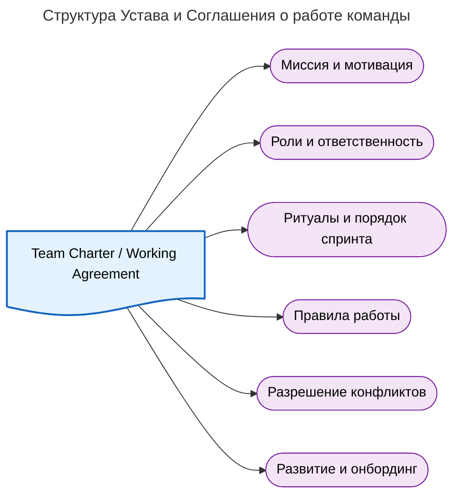

---
aliases:
  - Team Agreement
  - Team Charter
  - Team Handbook
  - Team Playbook
  - Team Working Agreement
  - Working Agreement
  - Плейбук команды
  - Соглашение о работе
  - Соглашение о работе команды
  - Устав команды
---
## Устав команды и Соглашение о работе (Team Charter / Working Agreement)

В гибких методологиях (Scrum, Kanban) фреймворк намеренно не предписывает создание объемных регламентов. Однако на практике, чтобы синхронизировать ожидания, мотивацию и процессы, команды создают **Устав команды (Team Charter)** или **Соглашение о работе команды (Team Working Agreement)**. В зрелых или крупных организациях этот документ часто расширяется до формата **Плейбука команды (Team Playbook / Team Handbook)**.

### Разница между ключевыми документами

| Документ | Фокус | Пример содержания |
|---|---|---|
| **Устав команды (Team Charter)** | Стратегический: «Зачем мы здесь?» | Миссия, ценности, мотивация, границы ответственности, видение успеха |
| **Соглашение о работе (Working Agreement)** | Тактический: «Как мы работаем?» | Время дейликов, правила код-ревью, SLA на ответы в чате, порядок проведения ретроспектив |
| **Плейбук команды (Team Playbook)** | Комплексный: «Энциклопедия команды» | Всё вышеперечисленное + онбординг новичков, описание архитектуры, глоссарий, контакты стейкхолдеров |

Часто Устав и Соглашение объединяют в один живой документ в корпоративной вики (Confluence, Notion).

---

### Структура документа

Основные разделы документа (Team Charter / Playbook):



**Содержание разделов:**

- **Миссия и мотивация** — зачем существует команда (какую бизнес-ценность команда доставляет).
- **Роли и ответственность** — кто за что отвечает: Product Owner, Scrum Master, Dev, QA; матрица ответственности (RACI).
- **Ритуалы и порядок спринта** — расписание встреч (дни, время, длительность); правила проведения Sprint Planning, Sprint Review, Sprint Retrospective; формат Daily Scrum.
- **Правила работы** — Definition of Ready (DoR), Definition of Done (DoD); SLA на Code Review и ответы в чате; рабочие часы и время для фокус-работы.
- **Разрешение конфликтов** — как команда принимает решения; что делают при разногласиях.
- **Развитие и онбординг** — как команда обучается; чек-лист выхода нового сотрудника.

---

### Порядок проведения спринтов

Конкретная процедура детализируется в разделе «Ритуалы и порядок спринта». Там фиксируются:

**Календарь спринта:**

- Старт и финиш спринта (например, среда 10:00).
- Backlog Refinement: вторник предпоследней недели, 14:00–15:30.
- Sprint Planning: среда первой недели, 10:00–13:00 (с перерывом).
- Sprint Review: последняя среда, 15:00–16:00.
- Retrospective: последняя среда, 16:00–17:30.

**Формат мероприятий:**

- Кто фасилитирует встречу (обычно Scrum Master).
- Обязательные участники (например, на Review обязательно присутствие Product Owner и ключевых [[change-management|стейкхолдеров]]).
- Используемые инструменты (Miro для ретро, Jira для демонстрации бэклога).

**Правила взаимодействия с микросервисами:**

- Как синхронизируются разработчики разных сервисов (например, обязательный 15-минутный sync после дейлика).

---

### Основные документы

#### Team Agreement / Team Charter (Соглашение команды)

Главный документ про «как мы работаем и зачем». Описывает мотивацию и базовые принципы:

- **Зачем команда использует спринты** — например, «поставлять инкременты каждые 4 недели и получать быструю обратную связь от пользователей» или «синхронизировать релизы микросервисов».
- **Ценности и договорённости** — как команда принимает решения, как относится к качеству, как реагирует на срочные задачи.
- **Роли и ответственность** — кто делает что (Product Owner, Scrum Master, разработчики, QA).
- **Правила церемоний** — длительность, частота, обязательные участники.

**Где хранят:** Confluence/Notion страница или Markdown-файл в корне репозитория (например, `TEAM_AGREEMENT.md`). Это удобно для Java-команды: новый разработчик читает файл вместе с `README.md`.

#### Как описывают мотивацию

Мотивацию фиксируют в Team Agreement и Sprint Planning Guide короткими формулировками, понятными всей команде, включая новых участников. Примеры:

- «Используем месячные спринты, потому что связанные микросервисы требуют времени на интеграцию и E2E-тесты».
- «Цель спринтов — доставлять сквозные сценарии ([[sprint-planning|end-to-end]]), а не просто закрывать задачи: каждый спринт должен приносить ценность пользователю».
- «При большой команде работу делят на подгруппы по сервисам, чтобы сохранить фокус и снизить коммуникационную нагрузку».

Такие формулировки помогают принимать решения: если приходит срочная задача, команда проверяет, соответствует ли она целям спринта.

#### Definition of Done (DoD, «Определение готовности»)

Критерии качества, делающие цель спринта измеримой: задача считается выполненной, только если выполнены все пункты.

**Примеры для Java + микросервисы:**

- Код прошёл CI (Sonar/[[software-qauality-assessment|Checkstyle]]/SpotBugs), нет критических уязвимостей.
- Unit-тесты покрыты на X% для нового кода.
- Пройдены интеграционные тесты для затронутых микросервисов.
- Документация ([[sprint-planning|OpenAPI]], README) обновлена.
- Код-ревью выполнено минимум 2 разработчиками.
- Задача задеплоена в тестовую среду.

**Где хранят:** отдельная Confluence-страница + ссылка в Jira-проекте. Часто добавляют как комментарий/шаблон в описание типа задачи.

#### Sprint Planning Guide / Process Document

Инструкция про **порядок проведения спринтов**: пошаговый регламент, тайминг, артефакты.

**Что включают:**

- Подготовка (Backlog Refinement): частота, кто участвует, что должно быть готово.
- План встречи Sprint Planning: повестка, тайминг (например, 4 часа для месячного спринта).
- Шаблоны: как формулировать Sprint Goal, как заполнять [[sprint-planning|Acceptance Criteria]].
- Правила переноса задач, mid-sprint check, работы с блокирующими зависимостями между сервисами.

**Где хранят:** Confluence-страница «Sprint Process» или папка «Processes» в Notion.

#### Jira Project Settings + Templates

Оперативная формализация порядка: правила видны прямо в трекере.

**Что настраивают:**

- Типы задач и статусы, соответствующие потоку работы команды.
- Поля (например, `Service`, `Sprint Goal`, `Dependency`).
- Templates для задач: готовые шаблоны Acceptance Criteria и чек-листы.
- Automation: автоматические действия (например, при переходе в «Done» проверяется наличие тестов).

**Где хранят:** настройки проекта в Jira.

---

### Хранение и актуальность

**Где хранится документ:**

- **Confluence / Notion / Wiki:** основной формат. Легко доступен, имеет историю изменений и возможность комментирования.
- **Физический носитель:** распечатанный постер с ключевыми правилами (DoD, ценности) в зоне работы команды или в виртуальной комнате (на доске Miro).
- **Репозиторий кода:** иногда файл `TEAM_AGREEMENT.md` или `CONTRIBUTING.md` хранят прямо в Git-репозитории проекта, чтобы он был перед глазами у разработчиков.

**Как документ поддерживается в актуальном состоянии** — документ не является статичным:

- **На ретроспективах:** если команда понимает, что дейлик в 10:00 не работает, она голосует за изменение времени и сразу вносит правку в Соглашение.
- **При онбординге:** новые члены команды читают документ в первую очередь и могут предложить улучшения, основанные на своем предыдущем опыте.
- **При изменении масштаба:** если команда растет (например, с 5 до 10 человек), документ расширяется правилами кросс-командной синхронизации.

---

### Практический шаблон страницы в Confluence

Готовая структура для быстрого создания документа:

```markdown
# Team Agreement: как мы работаем (Java + микросервисы)

## Зачем мы используем спринты
[2-3 абзаца: мотивация, особенности проекта, почему выбран месячный спринт]

## Роли и ответственность
| Роль | Обязанности |
|------|-------------|
| Product Owner | Приоритизация, критерии приёмки, согласование контрактов API |
| Scrum Master | Организация церемоний, устранение блокирующих факторов, контроль DoD |
| Разработчики | Оценка, реализация, код-ревью, поддержка качества |
| QA | Тестовые сценарии, автоматизация, валидация DoD |

## Порядок проведения спринтов
- Backlog Refinement: 1-2 раза в неделю по 1-1,5 часа.
- Sprint Planning: 4 часа в первый день спринта.
- Mid-sprint check: на 10-12 день.
- Review и Retro: в конце спринта.

## Definition of Done
[Список критериев с чек-боксами. Можно сделать отдельным документом и дать ссылку.]

## Правила зависимостей между сервисами
- Сначала контракт (OpenAPI), потом реализация.
- Если задача зависит от другого сервиса, обязательно указать ссылку и статус.
- Использовать метки `service=auth`, `service=billing` и т. п.

## Шаблоны
- Sprint Goal: «[Цель], чтобы [ценность для пользователя]».
- Acceptance Criteria: список конкретных условий.
```
