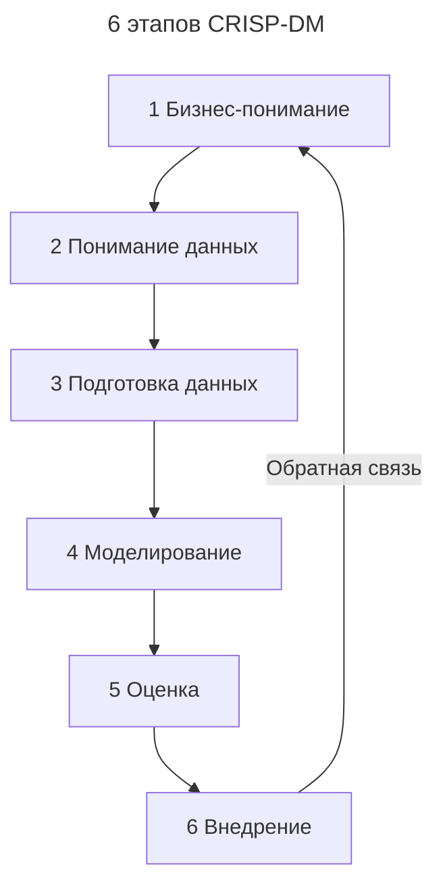
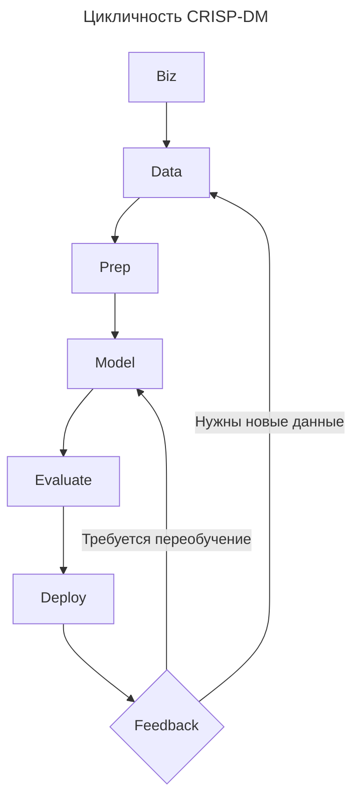

---
aliases:
  - CRISP-DM
  - Cross-Industry Standard Process for Data Mining
  - Data Mining
  - KDD
  - Knowledge Discovery in Databases
  - TDSP
  - анализ данных
---

## CRISP-DM

**CRISP-DM (Cross-Industry Standard Process for Data Mining)** — это **стандартный фреймворк для реализации проектов по анализу данных и [[machine-learning|машинному обучению]]**.

Он используется в 90% промышленных ML-проектов — от банков до стартапов.

**Определение**

**CRISP-DM** — это **циклический процесс из 6 этапов**, который помогает:

- понять бизнес;
- подготовить данные;
- построить модель;
- развернуть её.

Это как Agile для Data Science.

## 6 этапов CRISP-DM

### Бизнес-понимание (Business Understanding)

**Цель**: понять, **что нужно бизнесу**.

**Задачи**

- Какова цель? (например, снизить отток клиентов)
- Какой KPI улучшится?
- Сколько стоит успех/провал?

Без этого этапа вы будете строить «крутую модель», которая никому не нужна.

### Понимание данных (Data Understanding)

**Цель**: изучить доступные данные.

**Задачи**

- Какие источники есть? (CRM, логи, базы)
- Есть ли пробелы? Дубли?
- Качество данных
- Распределение: нормальное, перекошенное?

**Инструменты**

Python (Pandas), SQL, Excel, Tableau

### Подготовка данных (Data Preparation)

Самый долгий этап — до 70% времени.

**Что делается**

- Очистка: NaN, дубли
- Нормализация / стандартизация
- Преобразование: категориальные → числовые
- Feature engineering: создание новых признаков
- Разделение на train/test/validation

Хорошие данные > сложная модель.

### Моделирование (Modeling)

Выбор и обучение модели.

**Этапы**

- Выбор алгоритма: `Random Forest`, `XGBoost`, `Neural Net`
- Обучение
- Гиперпараметры
- Кросс-валидация

**Совет**

Не бойтесь начинать с простого (`Logistic Regression`).

### Оценка (Evaluation)

**Цель**: проверить, работает ли модель на практике.

**Метрики**

| Задача | Метрика |
|--------|---------|
| Классификация | Accuracy, Precision, Recall, F1, ROC-AUC |
| Регрессия | MAE, RMSE |
| Кластеризация | Silhouette Score |

**Важно**

Используйте **бизнесовые метрики**: «На сколько мы снизили отток?», «Сколько денег сэкономили?».

### Внедрение (Deployment)

**Цель**: перевести модель в production.

**Формы внедрения**

- API: `POST /predict`
- Batch: обработка раз в день
- Embedded: в мобильном приложении
- BI: интеграция в Power BI

**Автоматизация**

- [[model-ops|MLOps]]
- CI/CD
- Monitoring: drift, latency, accuracy

## Цикличность

CRISP-DM — **не водопад**, а **цикл**.

На основе пользовательского опыта можно вернуться на любой этап.

## Когда использовать CRISP-DM

| Проект | Подходит? |
|--------|-----------|
| Прогнозирование спроса | Да |
| Чат-бот | Да |
| Анализ отзывов | Да |
| MVP, прототип | Да — даже если быстро |
| Стандарт ISO/IEC | Да — поддерживается |

## Ограничения фреймворка

| Аспект | Почему важно |
|--------|--------------|
| Управление данными | Нужен отдельный подход |
| DevOps / MLOps | Надо добавлять |
| Этические вопросы | Ответственность команды |
| Интерпретируемость | Особенно в банках, медицине |

## Современные аналоги

| Фреймворк | Отличие |
|-----------|---------|
| **TDSP (Microsoft)** | + MLOps, DevOps |
| **Google's People+AI Guide** | UX, этика |
| **MLOps Lifecycle** | CI/CD, monitoring |
| **KDD (Knowledge Discovery in Databases)** | Похож, но старше |

**Финальный вывод**

| Этап | Главный вопрос |
|------|----------------|
| 1. Business | Что решаем? |
| 2. Data | Есть ли данные? |
| 3. Prep | Готовы ли они к обучению? |
| 4. Modeling | Какая модель лучше? |
| 5. Evaluation | Она работает в реальности? |
| 6. Deployment | Как внедрить безопасно? |

**Цитата**

"Without deployment, data science is just PowerPoint."
