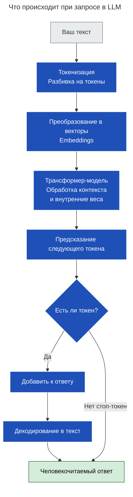

ваыа

```mermaid
---
title: Что происходит при запросе в LLM
---
graph TD
    A[Ваш текст] --> B[Токенизация<br>Разбивка на токены]
    B --> C[Преобразование в векторы<br>Embeddings]
    C --> D[Трансформер-модель<br>Обработка контекста<br>и внутренние веса]
    D --> E[Предсказание следующего токена]
    E --> F{Есть ли токен?}
    F -->|Да| G[Добавить к ответу]
    G --> H[Декодирование в текст]
    H --> I[Человекочитаемый ответ]

    F -->|Нет стоп-токен| I

    style A fill:#e9ecef,stroke:#6c757d
    classDef BCDEFGH fill:#1e50b7,stroke:#fff,color:#fff
    style I fill:#d4edda,stroke:#155724,color:#000

    classDef step fill:#1e50b7,stroke:#fff,color:#fff
    class B,C,D,E,G step
    class B,C,D,E,F,G,H BCDEFGH
```

