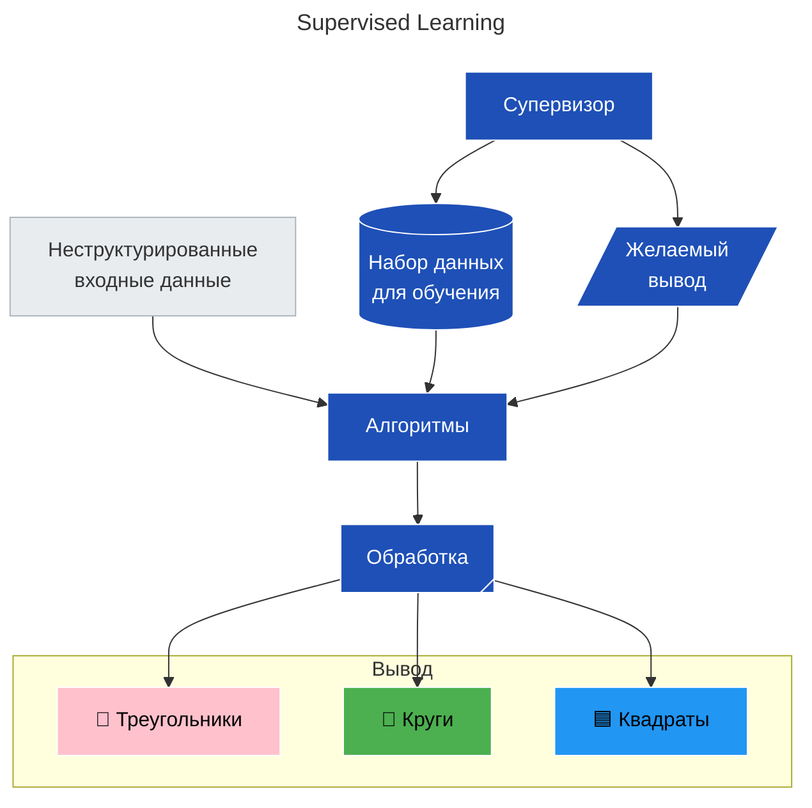
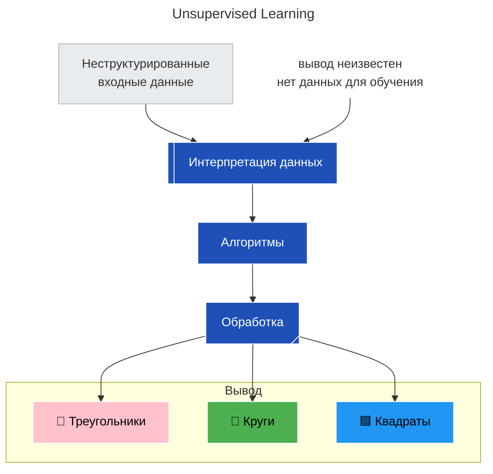
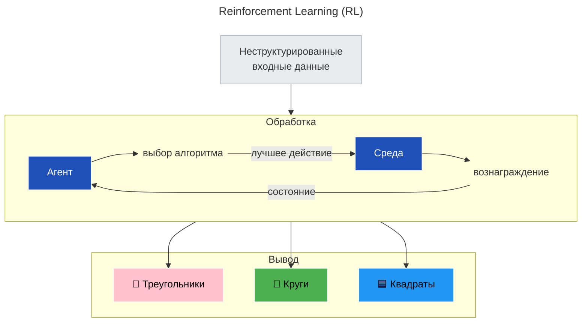

---
aliases:
  - LLMs
  - LLM
  - Модели машинного обучения
  - Machine learning model
  - neural network
  - трансформер
  - transformer
---
# Модели машинного обучения

**Модель машинного обучения** `Machine learning model` – это компьютерная программа, которая может делать прогнозы или принимать решения.

**Алгоритм машинного обучения** — то, благодаря чему модель будет учиться выполнять более точное прогнозирование.

| Категория                    | Когда использовать                  | Примеры                       |
| ---------------------------- | ----------------------------------- | ----------------------------- |
| **Регрессионные модели**     | Когда нужно предсказать **число**   | Цена, возраст, температура    |
| **Классификационные модели** | Когда нужно отнести к **категории** | Спам / не спам, болезнь / нет |
| **Генеративные модели**      | Когда нужно **создать новое**       | Текст, изображения, музыка    |
| **Кластерные модели**        | Когда **нет меток** → найти группы  | Сегментация клиентов          |
## Регрессионные модели

Регрессионные модели делают численные прогнозы на основе помеченных данных. 
* Пример: модель основана на данных о пробеге и использовании автомобиля в прошлом для прогнозирования срока службы автомобиля.
* Регрессионные модели обучаются на основе маркированных данных
* Регрессионные прогнозы являются числовыми 

## Генеративные модели

Являются частным случаем Регрессионной модели. Строятся на основе экстраполяции.

## Классификационные модели

Модели классификации присваивают вещам ярлыки в зависимости от их характеристик. Результатом работы классификационной модели является **прогнозирование метки**.
* Пример: вы раскладываете одежду для теплой или холодной погоды. Такая модель классифицирует одежду как теплую или холодную на основе данных, обозначенных на этикетке.
* Регрессионные модели обучаются на основе маркированных данных
* Классификационные прогнозы – это метки

## Кластерные модели

Модели кластеризации группируют немаркированные данные на основе найденных сходств.
* Пример: модель рекомендации фильмов, какую группу фильмов можно было бы порекомендовать зрителям, которым понравился "Титаник"?
* Кластерные модели обучаются не основе немаркированных данных

# Машинное обучение

**Обучение** `training` – это процесс, при котором модель учится на основе данных, чтобы она могла делать более точные прогнозы и принимать решения. Разные модели обучаются для решения разных задач.

Прежде чем использовать модель ее необходимо обучить.

Существует два подхода к машинному обучению: **контролируемое** `supervised` обучение и обучение без контроля `unsupervised learning`.  

**Глубокое обучение** `Deep learning` – это разновидность модели машинного обучения с несколькими слоями нейронных сетей.

Модели глубокого обучения требуют больших объемов обучающих данных и эффективны в таких задачах, как распознавание изображений, обработка естественного языка и составление более точных прогнозов.

**Виды машинного обучения**

* Supervised Learning – Обучение с учителем
* Unsupervised Learning – Обучение без учителя
* Reinforcement Learning (RL) – Обучение с подкреплением

|                        | **Supervised**       | **Unsupervised**      | **Reinforcement**         |     |
| ---------------------- | -------------------- | --------------------- | ------------------------- | --- |
| **Учитель?**           | ✅ Да                 | ❌ Нет                 | ⚠️ Reward вместо метки    |     |
| **Цель**               | Предсказание         | Обнаружение паттернов | Оптимальная стратегия     |     |
| **Метки нужны?**       | ✅ Да                 | ❌ Нет                 | ❌ Нет (но нужен feedback) |     |
| **Сложность**          | Средняя              | Низкая                | Очень высокая             |     |
| **Интерпретируемость** | Выше                 | Зависит от алгоритма  | Низкая                    |     |
| **Реальные проекты**   | 80% всех ML-проектов | 15%                   | 5%                        |     |

> 💬 _“Supervised learning tells you what is.<br>Unsupervised shows you what you didn’t see.<br>Reinforcement teaches how to act.”_

## Обучение с учителем

> 🔹 Есть **вход** и **правильный ответ**

Пример:
```text
Почта: "Выиграйте миллион!" → Метка: SPAM
Почта: "Заказ №123 доставлен" → NOT SPAM
```

→ Модель учится:  
> _«Если письмо содержит “выиграй”, “бесплатно” → вероятно, спам»_

Типичные применения:
- Классификация изображений
- Прогноз цен
- Распознавание лиц
- Чат-боты (intent recognition)



## Обучение без учителя

> 🔹 Нет меток → модель сама **находит структуру**

Пример:
```text
Данные: {user_id, покупки, частота, сумма}
→ Модель говорит: "Вот 4 группы пользователей"
```

Типичные применения:
- Сегментация клиентов
- Поиск аномалий (например, мошенничество)
- Рекомендации: «Похожие товары»
- Снижение размерности (PCA)
- Topic Modeling (LDA)

Алгоритмы:
- **K-Means**, **DBSCAN**
- **PCA**, **t-SNE**
- **Autoencoder**
- **Apriori** (ассоциативные правила)


## Обучение с подкреплением

> 🔹 Агент взаимодействует со средой → получает **награду (reward)** за хорошее действие

Пример:
```text
Агент: автономный робот-консультант
Действие: "Предложить кольцо из платины"
Reward: если купили → +10; если ушли → -2
```

→ Агент учится выбирать лучшие действия

Типичные применения:
- Игровые ИИ (AlphaGo, Dota 2)
- Робототехника
- Управление складом / логистикой
- Персонализированные рекомендации в реальном времени

Алгоритмы:
- **Q-Learning**
- **Deep Q-Networks (DQN)**
- **Policy Gradient**
- **PPO (Proximal Policy Optimization)**

___
# Large Language Models

**Большие языковые модели** (Large Language Models – LLMs) революционизируют искусственный интеллект, позволяя компьютерам понимать и генерировать текст, похожий на человеческий.
* Языковая модель извлекаемая из совокупности текстов, называемых **корпус** `corpus`.
* Языковая модель измеряет, как часто слова следуют за другими словами и последовательностями в тексте. Затем она может рассчитать вероятности.
* Глубокое обучение `deep learning` - это разновидность модели машинного обучения с несколькими слоями нейронных сетей `neural networks`.

>[!success] Generative Pre-trained Transformer
>GPT — это конкретная реализация LLM.
>“Pre-trained” означает, что модель предварительно обучена на большом корпусе текстов, а затем может быть дообучена для выполнения специфических задач.

___
# Нейросети

**Нейросети** — это те же модели, которые мы упомянули ранее, но только с особенной структурой. Если представить графически, то это многослойная структура, состоящая из нейронов (функций), напоминающих биологические нейронные связи в человеческом мозге. Поэтому они и называются нейросети.

Не программируется, а обучается. В отличие от традиционных алгоритмов, нейросеть не получает жёстких инструкций — она «учится» на примерах, находя закономерности в данных.

Состоит из взаимосвязанных «нейронов». Модель включает слои искусственных нейронов, соединённых синаптическими весами (коэффициентами связей).

Способна к обобщению. После обучения сеть может давать верные ответы на новых, ранее не встречавшихся данных, включая неполные или зашумлённые.

```mermaid
---
title: Нейросеть, пример
config:
  layout: elk
---
flowchart LR
 subgraph s1["скрытые слои"]
        I["Слой 2: идентифицированы линии"]
        J["Слой 3: обнаружены группы линий"]
        K["Слой 4: обнаружены другие особенности"]
  end
 subgraph s2["входной слой"]
        H["Слой 1: обнаружено значение пикселей"]
  end
 subgraph s3["<span style=padding-left:>выходной слой</span>"]
        L["Слой 5: обнаружены группы этих особенностей"]
  end
    H --> I
    I --> J
    J --> K
    K --> L
    L --> M["Выход: «это собака»"]
    n1@{ label: "<span style=\"padding-left:\">🐶 Собака</span>" } --> A["Вход: изображение, разобранное на пиксели"]
    A --> H

    n1@{ shape: text}
     I:::layer2
     I:::layer2
     J:::layer3
     J:::layer3
     K:::layer4
     K:::layer4
     H:::layer1
     H:::layer1
     L:::layer5
     L:::layer5
     M:::output
     M:::output
     A:::input
     A:::input
    classDef input fill:#e9ecef,stroke:#adb5bd
    classDef pixel fill:#1e50b7,stroke:#fff,color:#fff
    classDef layer1 fill:#1e50b7,stroke:#fff,color:#fff
    classDef layer2 fill:#6c757d,stroke:#fff,color:#fff
    classDef layer3 fill:#ff69b4,stroke:#fff,color:#fff
    classDef layer4 fill:#dc3545,stroke:#fff,color:#fff
    classDef layer5 fill:#00a080,stroke:#fff,color:#fff
    classDef output fill:#e9ecef,stroke:#adb5bd
```



LLM — это более общее понятие, а `neural network` — это одна из реализаций LLM
### Трансформер

**Трансформер** `transformer` — это нейросетевая архитектура, которая состоит из нескольких компонентов:

Как работает
1. **Входной слой** получает данные (текст, изображение, числа и т. п.).
2. **Скрытые слои** последовательно обрабатывают информацию, выявляя признаки и закономерности.
3. **Выходной слой** выдаёт результат (классификацию, прогноз, генерацию и т. д.).
4. **Обучение** происходит через настройку синаптических весов: сеть сравнивает свои предсказания с правильными ответами и корректирует ошибки.

Основные типы нейросетей
- **Полносвязные (feedforward)** — простейший тип для классификации и прогнозирования.   
- **Свёрточные (CNN)** — специализируются на обработке изображений.
- **Рекуррентные (RNN)** — работают с последовательностями (текст, речь, временные ряды).
- **Генеративные (GAN)** — создают новый контент (текст, изображения, музыку).


___
## Инференс модели

**Инференс модели машинного обучения** (от англ. _inference_ — «вывод, заключение») — это **процесс применения уже обученной модели к новым (неизвестным ей ранее) данным для получения предсказаний или решений**.

По сути, это «рабочий режим» модели: после того как её обучили на размеченных данных, она использует усвоенные закономерности, чтобы обрабатывать свежие входные данные и выдавать результат.

Инференс — **«лицо» ML‑системы** для пользователя. От его скорости, точности и стабильности зависит:
- удобство интерфейсов (чат‑боты, поиск);
- безопасность (автопилоты, системы видеонаблюдения);
- экономическая эффективность (прогнозирование, автоматизация).

___
___

