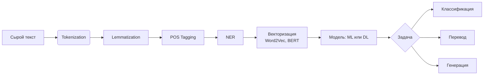
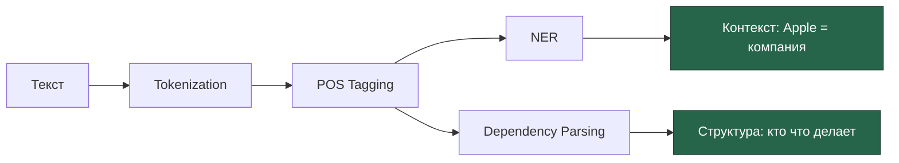

---
aliases:
  - NLP
  - Natural language processing
  - Fine-tuning
  - Transformers
  - Attention Mechanism
  - TF-IDF
  - Word2Vec
  - LSTM
  - RNN
---
**Обработка естественного языка** (Natural Language Processing, NLP) — это область искусственного интеллекта и компьютерной лингвистики, занимающаяся взаимодействием между компьютерами и человеческим (естественным) языком.

### Суть и цели

NLP позволяет компьютерам:
- понимать, анализировать и интерпретировать человеческий язык;
- генерировать осмысленные текстовые ответы;
- извлекать информацию из неструктурированных текстовых данных;
- автоматизировать коммуникацию на естественном языке.

### Ключевые задачи NLP

1. **Распознавание речи**
    Преобразование устной речи в текстовый формат (ASR — Automatic Speech Recognition).
2. **Синтез речи**
    Преобразование текста в устную речь (TTS — Text‑to‑Speech).
3. **Машинный перевод**
    Автоматический перевод текста между языками (например, Google Translate).
4. **Анализ тональности** (Sentiment Analysis)
    Определение эмоциональной окраски текста (позитив/негатив/нейтраль).
5. **Извлечение информации** (Information Extraction)
    Выделение сущностей (имена, даты, локации), отношений, фактов из текста.
6. **Распознавание именованных сущностей** (NER — Named Entity Recognition)
    Идентификация и классификация именованных объектов (люди, организации, места).
7. **Суммирование текста** (Text Summarization)
    Создание краткого содержания длинного текста.
8. **Ответы на вопросы** (Question Answering)
    Извлечение точных ответов из текста на основе заданного вопроса.
9. **Генерация текста**
    Создание осмысленных предложений и абзацев (например, чат‑боты, автогенерация контента).
10. **Синтаксический и семантический анализ**
    Разбор структуры предложений и смысла текста.

| Задача                             | Объяснение                      | Пример                                                  |
| ---------------------------------- | ------------------------------- | ------------------------------------------------------- |
| **Tokenization**                   | Разбивает текст на слова/токены | `"Hello world!"` → `["Hello", "world"]`                 |
| **Lemmatization / Stemming**       | Приводит слова к базовой форме  | `"running"` → `"run"`                                   |
| **Part-of-Speech Tagging**         | Определяет части речи           | "run" = глагол, "dog" = существительное                 |
| **Named Entity Recognition (NER)** | Находит имена, даты, города     | "Alice lives in Moscow" → Alice=Person, Moscow=Location |
| **Sentiment Analysis**             | Определяет эмоции в тексте      | Отзыв: "Отличный сервис!" → положительный               |
| **Text Classification**            | Категоризация текста            | Спам vs. Не спам                                        |
| **Machine Translation**            | Перевод текста                  | Google Translate                                        |
| **Question Answering**             | Ответы на вопросы по тексту     | QA-боты                                                 |
| **Text Summarization**             | Создание краткого содержания    | Новость → 3 предложения                                 |
| **Chatbots / Virtual Assistants**  | Диалог с пользователем          | Siri, Alexa, чат-бот поддержки                          |

### Основные методы и технологии

- **Статистические методы** (n‑граммы, скрытые марковские модели).
- **Машинное обучение** (SVM, случайные леса).
- **Глубокое обучение** (RNN, LSTM, Transformer).
- **Предварительно обученные языковые модели** (BERT, GPT, T5).
- **Векторные представления слов** (Word2Vec, GloVe, FastText).
- **Токенизация, лемматизация, стемминг** (предварительная обработка текста).

### Практические применения

- **Чат‑боты и виртуальные ассистенты** (Siri, Alexa, чат‑боты поддержки).
- **Фильтрация спама и анализ отзывов**.
- **Поиск информации** (поисковые системы, интеллектуальные базы знаний).
- **Автоматическое аннотирование документов**.
- **Медицинская аналитика** (извлечение данных из историй болезни).
- **Юридическая аналитика** (анализ договоров, судебных решений).
- **Социальный мониторинг** (анализ соцсетей, трендов).

### Вызовы и сложности

- **Многозначность слов** (омонимия, полисемия).
- **Сленг, жаргон, опечатки, диалекты**.
- **Контекстная зависимость смысла**.
- **Ирония, сарказм, подтекст**.
- **Различия между языками** (грамматика, порядок слов, идиомы).

## 🤖 Как работает NLP?


## 📚 Популярные модели и библиотеки

| Модель                                       | Где используется                          |
| -------------------------------------------- | ----------------------------------------- |
| **BERT**                                     | Google Search, QA, перевод                |
| **GPT (Generative Pre-trained Transformer)** | ChatGPT, письма, статьи                   |
| **spaCy**                                    | Python, NER, предобработка                |
| **NLTK**                                     | Обучение, лингвистический анализ          |
| **Hugging Face Transformers**                | Библиотека для BERT, GPT и других моделей |
| **Stanford NLP**                             | Академическое использование               |

---

## Технологии NLP
Вот **краткое объяснение** каждой из технологий в NLP и машинном обучении:

---

### 1. **TF-IDF**
> **(Term Frequency – Inverse Document Frequency)**

- 🔹 Преобразует текст в числа (векторы)
- 🔹 Учитывает:
  - `TF` — как часто слово встречается в документе
  - `IDF` — насколько редко слово в целом
- ✅ Используется в:
  - Поиске
  - Классификации (например, спам-фильтр)
- ❌ Устарел для сложных задач → не учитывает контекст

---

### 2. **Word2Vec**
> Модель, которая превращает слова в векторы (числовые представления)

- 🔹 Слова с похожим смыслом — близки в векторном пространстве
  → `"король" - "мужчина" + "женщина" ≈ "королева"`
- ✅ Работает без аннотированных данных (обучается на большом тексте)
- ✅ Подходит для:
  - Поиска синонимов
  - Упрощённого анализа
- ❌ Не работает с омонимами ("банк" — река / учреждение)

---

### 3. **RNN / LSTM**
> **Recurrent Neural Network / Long Short-Term Memory**

- 🔹 RNN — нейросеть для последовательностей (текст, временные ряды)
- 🔹 LSTM — улучшенная версия RNN, которая **не забывает** важное
- ✅ Хороша для:
  - Генерации текста
  - Прогнозирования
  - Перевода (ранние системы)
- ❌ Медленно обучается
- ❌ Трудно масштабировать
- ❌ Не параллелизуется

---

### 4. **Attention Mechanism**
> **Механизм внимания**

- 🔹 Позволяет модели **фокусироваться на важных частях входа**
- 🔹 Например: при переводе — смотрит на ключевые слова
- ✅ Основа всех современных моделей
- ✅ Увеличивает точность
- 💡 Без него — Transformer'ы невозможны

---

### 5. **Transformers**
> Архитектура нейросети, основанная на **механизме внимания**

- 🔹 Заменила RNN и LSTM
- 🔹 Параллельная обработка → быстро
- 🔹 Долгосрочные зависимости — хорошо
- ✅ Используется в:
  - BERT
  - GPT
  - T5
  - LLM (большие языковые модели)
- ✅ Лучше всего подходит для:
  - QA
  - Перевода
  - Генерации текста

---

### 6. **Fine-tuning**
> **Дообучение предобученной модели под свою задачу**

- 🔹 Берёте модель (например, BERT)
- 🔹 Дообучаете её на своих данных (например, отзывы клиентов)
- ✅ Выгоды:
  - Не нужно обучать с нуля
  - Меньше данных
  - Быстрее результат
- ✅ Пример:
  - `BERT` → fine-tune → ваш **анализатор отзывов**
- 💡 Часто используется с Hugging Face Transformers

---

## 🆚 Сравнение: Эволюция NLP

| Технология                  | Год   | Когда использовать                        |
| --------------------------- | ----- | ----------------------------------------- |
| **TF-IDF**                  | 1970s | Простые задачи, MVP                       |
| **Word2Vec**                | 2013  | Векторизация слов                         |
| **LSTM**                    | 1997  | Если нет GPU, но нужна последовательность |
| **Transformer + Attention** | 2017  | Почти все современные задачи              |
| **Fine-tuning**             | 2018+ | При использовании BERT, GPT, RoBERTa      |

---

## ✅ Финальный вывод

| Технология       | Главное назначение                   |
| ---------------- | ------------------------------------ |
| **TF-IDF**       | Простой векторный анализ             |
| **Word2Vec**     | Смысловые векторы слов               |
| **RNN/LSTM**     | Последовательности, короткие диалоги |
| **Attention**    | Фокус на важных словах               |
| **Transformers** | Современные LLM, чат-боты, перевод   |
| **Fine-tuning**  | Адаптация модели под ваш бизнес      |

> 💬 _“Transformers + Fine-tuning = новая эра NLP”_

---

## ✅ 1. POS (Part-of-Speech Tagging) — Части речи

> **POS** — это процесс определения **грамматической роли каждого слова** в предложении.

### 💬 Пример:
```text
Alice booked a flight to Paris.
```

| Слово | POS |
|-------|-----|
| Alice | NOUN (существительное)
| booked | VERB (глагол)
| a | DET (определитель)
| flight | NOUN
| to | ADP (предлог)
| Paris | PROPN (собственное имя)

### ✅ Зачем нужен?
- Чтобы понять структуру предложения
- Для последующего анализа: синтаксис, зависимости
- Основа для машинного перевода, чат-ботов

### 🛠️ Инструменты:
- spaCy
- NLTK
- Stanza (Stanford NLP)

---

## ✅ 2. NER (Named Entity Recognition) — Распознавание именованных сущностей

> **NER** — это выделение **важных "имён" из текста**: людей, организаций, дат, мест и т.д.

### 💬 Пример:
```text
Apple plans to open a new store in Berlin next month.
```

| Текст | Сущность | Тип |
|--------|----------|------|
| Apple | → ORGANIZATION |
| Berlin | → GPE (геополитическая единица) |
| next month | → DATE |

### ✅ Типы сущностей (стандартные):
- `PERSON` — люди
- `ORG` / `ORGANIZATION` — компании
- `GPE` — страны, города
- `DATE`, `TIME`
- `MONEY`, `PERCENT`
- `PRODUCT`, `EVENT` (в некоторых моделях)

### ✅ Где используется?
- Поиск информации
- Чат-боты
- Обработка новостей
- HR: анализ резюме (компании, навыки)

---

## ✅ 3. Зависимости (Dependency Parsing) — Синтаксический разбор

> **Dependency parsing** — это построение **дерева зависимостей**, где каждое слово связано с другим как **зависимое от главного**

### 💬 Пример:
```text
She bought a red car.
```

→ Дерево:
```
       bought
      /   |    \
    She   a     car
             |
           red
```

- `bought` — корень
- `She` — подлежащее (`nsubj`)
- `car` — прямое дополнение (`dobj`)
- `red` — атрибут (`amod`) → описывает `car`

### ✅ Что показывает?
- Кто кого купил?
- Какой именно автомобиль?
- Какие прилагательные относятся к существительному?

### 🛠️ Отношения (частые):
- `nsubj` — nominal subject
- `dobj` — direct object
- `amod` — adjectival modifier
- `advmod` — adverbial modifier
- `prep` — preposition
- `pobj` — object of preposition

---

## 🔗 Как они работают вместе?



### 💡 Пример: "Elon Musk founded Tesla in 2003"
- **POS**:
  - `founded` → `VERB`
  - `Tesla` → `PROPN`
- **NER**:
  - `Elon Musk` → `PERSON`
  - `Tesla` → `ORG`
  - `2003` → `DATE`
- **Dependencies**:
  - `founded` — корень
  - `Elon Musk` — подлежащее (`nsubj`)
  - `Tesla` — прямое дополнение (`dobj`)
  - `in 2003` — временной модификатор (`tmod`)

→ Машина понимает: **Кто основал? Что? Когда?**

---

## ✅ Финальный вывод

| Технология | Отвечает на вопрос |
|------------|---------------------|
| **POS** | Какая грамматическая роль у слова? |
| **NER** | Это человек, город или организация? |
| **Dependency Parsing** | Кто сделал что кому и когда? |

> 🔍 Вместе — это **основа понимания языка машиной**.

---

## 📚 Где учиться дальше?

- [spaCy](https://spacy.io/usage/linguistic-features)
- [NLTK Book](https://www.nltk.org/book/)
- YouTube: *“Dependency Parsing Explained”* — Stanford NLP
- Hugging Face Course: [https://huggingface.co/course/chapter1](https://huggingface.co/course/chapter1)

---

✅ **POS, NER, Dependencies — три кита NLP.**
Без них — нет чат-ботов, переводчиков, аналитики отзывов.

📌 Сохраните это — как шпаргалку для команды.

> 🧠 _“Words mean nothing without structure.”_

___

## методы представления текста

Рассмотрим три классических метода представления текста для информационного поиска — от простейшего к более продвинутому.

### 1. One‑hot encoding (одноразовое кодирование)

**Суть:** каждое слово в словаре получает уникальный вектор, где только одна позиция равна 1 (соответствующая этому слову), а остальные — 0.

**Как строится:**
* формируется словарь всех слов (размер словаря = *V*);
* каждому слову присваивается индекс от 0 до *V* − 1;
* слово кодируется вектором длины *V*, где на позиции его индекса стоит 1, остальные — 0.

**Пример** (словарь: [«кот», «пес», «дом»]):  
* «кот» → [1, 0, 0];  
* «пес» → [0, 1, 0];  
* «дом» → [0, 0, 1].

**Плюсы:**  
* простота реализации;  
* однозначное соответствие слово ↔ вектор.

**Минусы:**  
* векторы очень длинные (размер словаря может быть 10⁵–10⁶);  
* разреженность (почти все элементы — 0);  
* нет семантической близости (расстояние между любыми двумя векторами одинаково);  
* не учитывает частоту слов.

### 2. Bag‑of‑words (мешок слов)

**Суть:** текст представляется как неупорядоченный набор слов с учётом их частоты (без учёта грамматики и порядка).

**Как строится:**  
* формируется словарь всех слов в коллекции текстов;  
* для каждого текста считается, сколько раз в нём встречается каждое слово из словаря;  
* получается вектор частот длины *V* (размер словаря).

**Пример** (текст: «кот дома, кот спит»):  
* вектор: [2, 0, 1] (если словарь: [«кот», «пес», «дом»]).

**Плюсы:**  
* учитывает частоту слов;  
* проще, чем модели с учётом порядка слов;  
* работает для классификации и поиска.

**Минусы:**  
* игнорирует порядок слов и грамматику;  
* разреженные векторы;  
* частые слова (союзы, предлоги) могут доминировать;  
* не учитывает семантическую близость.

### 3. TF‑IDF (Term Frequency‑Inverse Document Frequency)

**Суть:** взвешивает слова не просто по частоте, а с учётом их значимости в коллекции: частые в документе, но редкие в коллекции слова получают больший вес.

**Формула:**  
$$
\text{TF‑IDF}(t, d) = \text{TF}(t, d) \times \text{IDF}(t),
$$  
где:  
* $\text{TF}(t, d)$ — частота термина $t$ в документе $d$ (например, число вхождений);  
* $\text{IDF}(t) = \log \frac{N}{\text{df}(t)}$, где:  
  * $N$ — число документов в коллекции;  
  * $\text{df}(t)$ — число документов, содержащих термин $t$.

**Как строится:**  
1. Для каждого слова в каждом документе вычисляется TF.  
2. Для каждого слова вычисляется IDF по всей коллекции.  
3. Перемножаются TF и IDF для получения веса каждого слова в каждом документе.  
4. Получается матрица *документы × слова* с весами.

**Пример:**  
* слово «кот» встречается в 10 документах из 1000:  
  * $\text{IDF}(\text{«кот»}) = \log \frac{1000}{10} = \log 100 = 2$ (если логарифм по основанию 10);  
* в конкретном документе «кот» встречается 3 раза:  
  * $\text{TF‑IDF} = 3 \times 2 = 6$.

**Плюсы:**  
* снижает вес частых, но малоинформативных слов (союзы, предлоги);  
* выделяет ключевые слова документа;  
* улучшает качество поиска и классификации;  
* интерпретируемо (можно понять, какие слова «важны»).

**Минусы:**  
* всё ещё игнорирует порядок слов и семантику;  
* требует достаточно большой коллекции для надёжного расчёта IDF;  
* чувствителен к шуму в данных.

### Итоговый сравнительный обзор

| Метод | Учитывает частоту | Учитывает редкость в коллекции | Игнорирует порядок слов | Разреженность |
|-------|-----------------|-----------------------------|------------------------|-------------|
| One‑hot | Нет | Нет | Да | Очень высокая |
| Bag‑of‑words | Да | Нет | Да | Высокая |
| TF‑IDF | Да | Да | Да | Средняя (веса сглаживают разреженность) |


**Когда что применять:**  
* **One‑hot** — редко, в учебных примерах или простых задачах;  
* **Bag‑of‑words** — когда важна частота слов, но не их значимость;  
* **TF‑IDF** — когда нужно выделить ключевые слова и улучшить качество поиска/классификации.