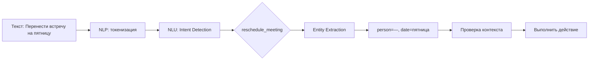

---
aliases:
  - Natural Language Understanding
  - NLU
---
Отлично!  
**NLU (Natural Language Understanding)** — это **ключевой компонент искусственного интеллекта**, который позволяет машинам **понимать смысл, намерение и контекст человеческого языка**.

---

## ✅ Что такое NLU?

> **NLU (Natural Language Understanding)** — это подраздел [[NLP]] (обработки естественного языка), при котором:
- Компьютер не просто видит слова
- Он **понимает**, что вы имели в виду

### 💬 Пример:

```text
"Перенести встречу с Иваном на пятницу"
```

→ Без NLU:  
`[перенести, встреча, Иван, пятница]` → просто токены

→ С NLU:  
- **Намерение (intent):** `reschedule_meeting`
- **Сущности:**  
  - `person = "Иван"`  
  - `new_date = "пятница"`

---

## 🔧 Чем отличается от NLP?

| Термин | Описание |
|--------|----------|
| **NLP (Natural Language Processing)** | Общий термин: всё, что связано с текстом<br>• Токенизация<br>• POS Tagging<br>• Лемматизация |
| **NLU (Natural Language Understanding)** | Подмножество NLP<br>Фокусируется на **смысле**:<br>• Намерение<br>• Контекст<br>• Диалоговое состояние |

> 🔑 **NLP = «Что написано?»**  
> **NLU = «Что имеется в виду?»**

---

## ✅ Основные задачи NLU

| Задача | Объяснение | Пример |
|-------|------------|--------|
| **Intent Recognition** | Какое действие хочет пользователь? | "Закажи пиццу" → `order_food` |
| **Entity Recognition (NER)** | Выделить сущности | "Встреча в Москве" → `location=Москва` |
| **Slot Filling** | Заполнить параметры действия | Пользователь: "Выключи свет"<br>→ команда: `turn_off_light`, room: `гостиная` |
| **Context Management** | Помнить контекст диалога | Пользователь: "А как насчёт завтра?"<br>→ Что значит "завтра"? Только если помнить, о чём речь |
| **Sentiment Analysis** | Эмоции в тексте | "Ужасный сервис!" → негативный |
| **Coreference Resolution** | Разрешение местоимений | "Купил iPhone. Он классный." → "Он" = iPhone |
| **Paraphrasing / Normalization** | Разные фразы → одно действие | "Отмени", "Удали", "Не надо" → `cancel_order` |

---

## 🤖 Где используется NLU?

| Система | Пример использования |
|--------|-------------------------|
| **Голосовые помощники** | Alexa, Siri, Алиса |
| **Чат-боты** | Поддержка, заказ пиццы |
| **Поисковые системы** | Google: "фильмы рядом" → понимает гео и намерение |
| **CRM** | Автообнаружение темы письма |
| **Call centers** | Анализ разговоров в реальном времени |
| **Email-фильтрация** | "Это спам или важное письмо?" |

---

## 🔍 Как работает NLU (простыми словами)



1. Разбиваем на слова
2. Узнаём: **что хочет пользователь?**
3. Находим: **что нужно изменить?**
4. Смотрим: **была ли уже встреча?**
5. Отвечаем: _«Встреча перенесена на пятницу»_

---

## 📚 Технологии и модели

| Модель | Назначение |
|--------|-----------|
| **BERT, RoBERTa** | Понимание контекста, intent recognition |
| **SpaCy, Rasa** | Open-source NLU для ботов |
| **Dialogflow (Google)** | Готовый движок для голосовых интерфейсов |
| **Lex (AWS)** | Интеграция с AWS Lambda |
| **Luis (Microsoft Azure)** | Встраивается в Power Virtual Agents |
| **Rasa** | Полностью open source, self-hosted |
| **Hugging Face Transformers** | Библиотека для своих моделей |

---

## ⚠️ Ограничения NLU

| Проблема | Объяснение |
|--------|------------|
| ❌ **Двойной смысл** | "Я устал" — жалоба или метафора? |
| ❌ **Сленг, аббревиатуры** | "Бахнули квадроцикл" → что значит "бахнули"? |
| ❌ **Культурные особенности** | Одни и те же слова — разный смысл |
| ❌ **Шум в аудио** | Распознавание → ошибка → NLU ломается |
| ❌ **Редкие языки** | Мало обучающих данных |

---

## ✅ Преимущества

| Плюс | Объяснение |
|------|------------|
| ✅ **Автоматизация поддержки** | 24/7 без оператора |
| ✅ **Снижение нагрузки** | Боты решают 80% запросов |
| ✅ **Лучший UX** | Говорите, как хотите — система поймёт |
| ✅ **Масштабирование** | Один бот обслуживает миллион людей |
| ✅ **Интеграция с CRM, ERP** | Может выполнять реальные действия |

---

## ✅ Финальный вывод

| NLP | NLU |
|-----|-----|
| ✅ Токенизация, стемминг | ✅ Понимание намерения |
| ✅ Синтаксис | ✅ Семантика |
| ✅ Слова | ✅ Смысл |

> 💬 _“NLP reads the text. NLU understands the user.”_

---

## 📚 Где учиться дальше?

- [Rasa Docs](https://rasa.com/docs/)
- [Hugging Face Course](https://huggingface.co/course/chapter1)
- Book: *“Speech and Language Processing”* — Jurafsky & Martin
- YouTube: *“How NLU Works”* — Siraj Raval

---

✅ **NLU — основа всех умных систем**:  
- Чат-ботов
- Голосовых помощников
- Поиска по смыслу

📌 Сохраните эту информацию — она станет основой вашей AI-стратегии.

> 🧠 _“Don’t build a bot that only matches keywords. Build one that understands people.”_