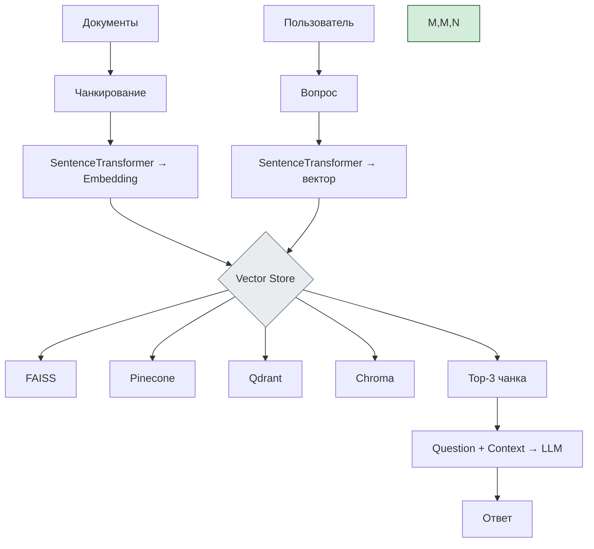

---
aliases:
  - Vector Store
  - Хранилища эмбедингов
  - Хранилища векторов
  - vector databases
---
Вы хотите **сравнение векторных хранилищ (vector databases)**, которые используются в **RAG (Retrieval-Augmented Generation)** и системах на основе эмбеддингов.

Ниже — **подробное сравнение** четырёх популярных решений:
- **FAISS**
- **Pinecone**
- **Qdrant**
- **ChromaDB**

---

## ✅ Сравнительная таблица

| Критерий | **FAISS** | **Pinecone** | **Qdrant** | **ChromaDB** |
|---------|----------|------------|-----------|-------------|
| **Тип** | Библиотека / инструмент поиска | Управляемый SaaS/Serverless | Self-hosted + Cloud | Лёгкая embedded DB |
| **Разработчик** | Facebook (Meta) | Pinecone Systems | Qdrant Team | Chroma Team |
| **Лицензия** | MIT (open source) | Proprietary | Apache 2.0 (open source) | Apache 2.0 |
| **Масштабирование** | В памяти или с кастомным бэкендом | ✅ Автоматическое |
| **ANN-поиск** | HNSW, IVF-PQ | HNSW, L2, IP | HNSW, Quantization | HNSW, Flat Index |
| **Поддержка метаданных** | Ограниченная | ✅ Да | ✅ Да | ✅ Да |
| **Фильтрация по метаданным** | Через внешний код | ✅ Да | ✅ Да | ✅ Да |
| **Кластеризация** | ❌ Только одиночный процесс | ✅ Managed clusters | ✅ Поддерживает масштабирование |
| **Интеграции** | LangChain, LlamaIndex | Все основные |
| **Простота установки** | ⚠️ Нужно самому управлять | ✅ Проще всего |
| **Производительность** | Очень высокая (на GPU) | Высокая | Высокая | Умеренная |
| **Хранение на диске** | ❌ Только RAM (по умолчанию) | ✅ Да | ✅ Да | ✅ Да |
| **Где используется** | Исследования, MVP, offline | Производство, RAG | Production, облако | Dev, прототипы |

---

## 📊 Где использовать?

### 🔹 **1. FAISS (Facebook AI Similarity Search)**

#### ✅ Когда выбрать?
- ✅ MVP
- ✅ Офлайн-анализ
- ✅ Маленький бюджет → бесплатен
- ✅ Нужны HNSW / IVF для быстрого поиска

#### ❌ Минусы:
- ❌ Нет встроенного API
- ❌ Нет фильтрации по метаданным
- ❌ Нужно вручную управлять сериализацией
- ❌ Не подходит для production без доработок

#### 💡 Используйте с:
- `LangChain`, `Hugging Face`, `Sentence Transformers`

```python
import faiss
index = faiss.IndexFlatL2(dimension)
index.add(embeddings)
```

---

### 🔹 **2. Pinecone**

#### ✅ Когда выбрать?
- ✅ Вы хотите быстро запустить RAG
- ✅ Нет команды DevOps
- ✅ Облачная архитектура
- ✅ Serverless подход

#### ✅ Плюсы:
- ✅ Полностью managed
- ✅ Auto-scaling
- ✅ Фильтрация: `where: { "source": "faq" }`
- ✅ REST/gRPC API
- ✅ Поддержка sparse + dense vectors

#### ❌ Минусы:
- ❌ Дорогой при росте объёмов
- ❌ Vendor lock-in
- ❌ Менее гибкий чем open-source

#### 💡 Пример запроса:

```python
results = index.query(
    vector=query_embedding,
    filter={"doc_type": "pension_rules"},
    top_k=5
)
```

---

### 🔹 **3. Qdrant**

#### ✅ Когда выбрать?
- ✅ Вам нужна производительность + контроль
- ✅ Self-hosted решение
- ✅ Хочется open source + cloud

#### ✅ Плюсы:
- ✅ Очень быстрый (на Rust)
- ✅ Поддержка фильтров, payload'ов
- ✅ Web UI
- ✅ gRPC / REST
- ✅ ANN: HNSW, quantization
- ✅ Хорошая документация

#### 💡 Пример фильтра:
```json
{
  "must": [
    { "key": "lang", "match": { "value": "ru" } }
  ]
}
```

#### ❌ Минусы:
- ❌ Требует больше ресурсов, чем Chroma
- ❌ Нужно администрировать (если self-hosted)

---

### 🔹 **4. ChromaDB**

#### ✅ Когда выбрать?
- ✅ Разработка, тесты, MVP
- ✅ Хотите embeddable DB (как SQLite)
- ✅ Простота > масштабируемость

#### ✅ Плюсы:
- ✅ Простое API
- ✅ Работает локально: `chromadb` в Python
- ✅ Отлично для Jupyter, Notebooks
- ✅ Интеграция с LangChain — идеальная

#### ❌ Минусы:
- ❌ Не готов к production
- ❌ Нет распределённости
- ❌ Медленнее при >1M векторов
- ❌ Ограниченная фильтрация

#### 💡 Пример:

```python
import chromadb
client = chromadb.Client()
collection = client.create_collection("pensions")

collection.add(
    embeddings=[...],
    documents=["Пенсионеры могут бесплатно..."],
    metadatas=[{"source": "faq.pdf"}]
)

results = collection.query(query_embeddings=[...], n_results=3)
```

---

## 🆚 Когда что использовать?

| Ваша цель | Рекомендация |
|----------|--------------|
| ✅ MVP, POC, обучение | ➤ **ChromaDB**
| ✅ Максимально быстро, нет DevOps | ➤ **Pinecone**
| ✅ Production, self-hosted, контроль | ➤ **Qdrant**
| ✅ Офлайн, исследование, GPU | ➤ **FAISS**
| ✅ Выбор: open source | ➤ **Qdrant**, **FAISS**
| ✅ У вас уже есть Kubernetes | ➤ **Qdrant**
| ✅ Нужен serverless | ➤ **Pinecone**
| ✅ Маленькие данные | ➤ **ChromaDB**
| ✅ Большие данные, low latency | ➤ **Qdrant** или **Pinecone**

---

## ✅ Архитектура: Как они работают в RAG



---

## ✅ Финальный вывод

| Хранилище | Для кого? |
|----------|-----------|
| **FAISS** | Исследователи, ML-инженеры |
| **Pinecone** | Команды, которым нужно быстро |
| **Qdrant** | Производственные системы, self-hosted |
| **ChromaDB** | Dev, MVP, Jupyter |

> 💬 _“Chroma is for learning. Qdrant is for production.”_

---

## 📚 Где учиться дальше?

- [Pinecone Docs](https://docs.pinecone.io/)
- [Qdrant Documentation](https://qdrant.tech/documentation/)
- [FAISS GitHub](https://github.com/facebookresearch/faiss)
- [Chroma Docs](https://www.trychroma.com/learn)

---

✅ **Теперь вы можете выбрать правильное векторное хранилище** — исходя из ваших требований.

📌 Сохраните эту таблицу — она станет шаблоном для всех будущих проектов RAG.

> 🔍 **Embed once, search forever. Choose wisely.**