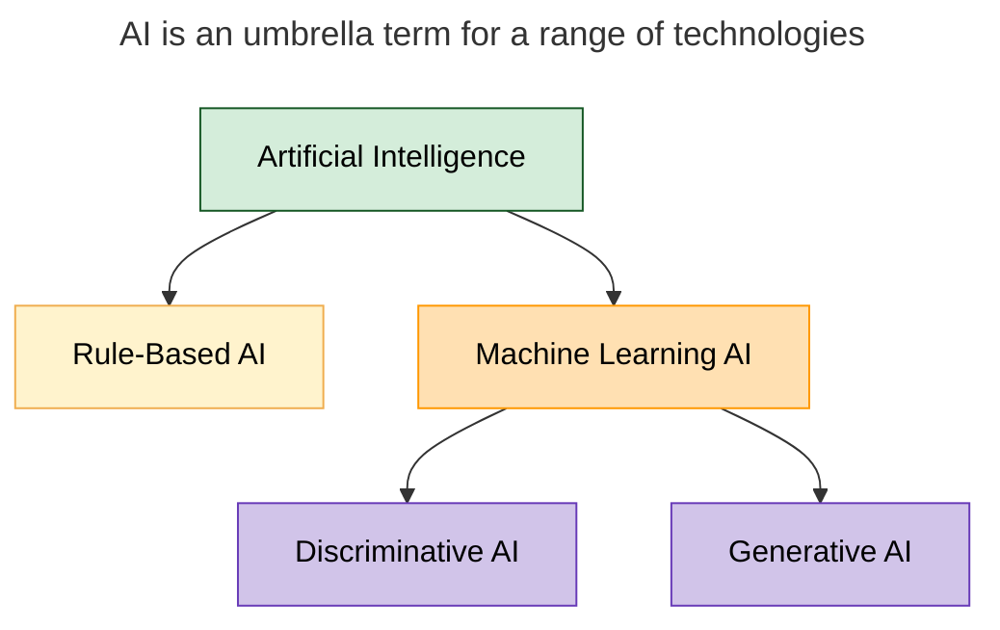
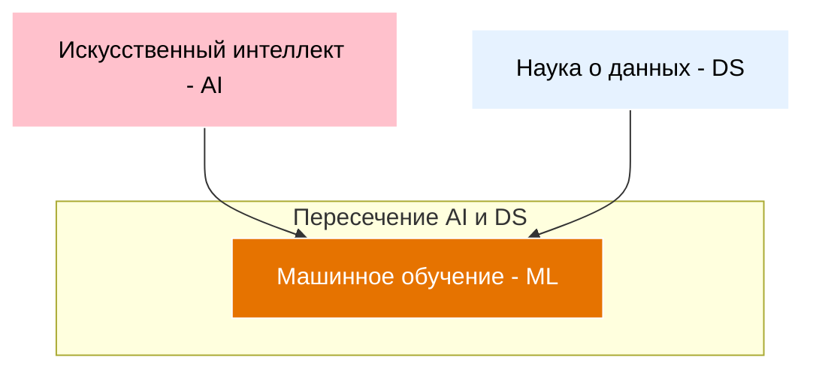

---
aliases:
  - Искусственный интеллект
  - ai
  - artificial intelligence
  - Artificial Intelligence
---
# AI

**rule-based AI** relies on set rules to make decisions
* *ИИ, основанный на правилах*

**machine learning** evolves by learning from data
* **discriminative AI** divides data into classes by learning where the boundaries are – *дискриминационный ИИ делит данные на классы, изучая границы*
	* пример – спам фильтр, который сортирует почту
* **generative AI** creates new content using learning models

___
## Что такое искусственный интеллект (ИИ, AI)

**Искусственный интеллект** (Artificial Intelligence, AI) — это область компьютерных наук, занимающаяся созданием систем, способных выполнять задачи, требующие человеческого интеллекта:
* понимать естественный язык;
* распознавать образы и речь;
* принимать решения;
* обучаться на основе опыта;
* решать сложные проблемы.

Ключевая идея — не просто автоматизация, а **имитация когнитивных функций человека**.

## Основные подходы к определению ИИ

1. **Сильный ИИ** (Strong AI / Artificial General Intelligence, AGI)
   Гипотетическая система, обладающая сознанием и способностью к общему пониманию мира — аналогично человеческому интеллекту. На сегодня не существует.

2. **Слабый ИИ** (Weak AI / Narrow AI)
   Реальные системы, решающие конкретные задачи в ограниченной области (распознавание лиц, перевод текста, игры). Доминирующий тип в современной практике.

## Классификация ИИ по функциональным возможностям

1. **Реактивные машины**
   * не имеют памяти о прошлом;
   * реагируют только на текущий ввод;
   * пример: шахматный суперкомпьютер Deep Blue.

2. **ИИ с ограниченной памятью**
   * учитывают недавние события;
   * используют краткосрочную историю для принятия решений;
   * пример: автономные автомобили (анализируют данные с датчиков за последние секунды).

3. **Теория разума** (Theory of Mind, в разработке)
   * способны понимать эмоции, намерения и убеждения других;
   * могут взаимодействовать как социальные агенты;
   * пока существуют лишь в виде прототипов.

4. **Самосознающий ИИ** (Self‑aware AI, гипотетический)
   * обладают самосознанием и пониманием собственного существования;
   * способны к рефлексии;
   * на сегодня — предмет научной фантастики.

## Классификация по технологиям и методам

1. **Символический ИИ** (Rule‑based AI)
   * основан на явных правилах и логических выводах;
   * легко интерпретируем, но ограничен в гибкости;
   * примеры: экспертные системы 1980‑х.

1. **Машинное обучение** (Machine Learning, [[ML]])
   * системы учатся на данных без явного программирования правил;
   * включает: обучение с учителем, без учителя, с подкреплением.

3. **Глубокое обучение** (Deep Learning)
   * подмножество ML на основе нейронных сетей с множеством слоёв;
   * эффективно для задач распознавания образов, речи, текста.

4. **Эволюционные алгоритмы**
   * имитируют процессы естественного отбора для оптимизации решений;
   * применяются в робототехнике, проектировании.

## Классификация по областям применения

1. **Компьютерное зрение**
   * распознавание объектов, лиц, сцен;
   * анализ видео;
   * медицинская диагностика по изображениям.

1. **Обработка естественного языка** ([[NLP]])
   * машинный перевод;
   * чат‑боты;
   * анализ тональности.

3. **Робототехника**
   * автономные роботы;
   * манипуляторы;
   * дроны.

4. **Рекомендательные системы**
   * персонализация контента (Netflix, Amazon);
   * таргетированная реклама.

5. **Игры и симуляции**
   * ИИ для игр (AlphaGo, Dota 2);
   * виртуальные тренажёры.

6. **Прогнозирование и аналитика**
   * финансовые прогнозы;
   * предсказание спроса;
   * предиктивная аналитика в производстве.

## Ключевые технологии современного ИИ

* **Нейронные сети** (CNN, RNN, Transformers);
* **Большие языковые модели** ([[MLM|LLM]], например GPT, Llama);
* **Генеративные модели** (GAN, Diffusion Models);
* **Обучение с подкреплением** (Reinforcement Learning);
* **Федеративное обучение** (обучение на распределённых данных).

## Важные ограничения и вызовы

* **Отсутствие общего интеллекта** — современный ИИ узкоспециализирован;
* **Проблема «чёрного ящика»** — сложность интерпретации решений нейронных сетей;
* **Предвзятость данных** — модели могут усиливать социальные стереотипы;
* **Энергозатратность** — обучение крупных моделей требует огромных вычислительных ресурсов;
* **Этические и правовые вопросы** — конфиденциальность, ответственность, регулирование.

## Вывод

ИИ — это не единая технология, а **совокупность методов и систем** для решения интеллектуальных задач. Современный ИИ преимущественно «слабый» и узкоспециализированный, но стремительно развивается благодаря машинному обучению и большим данным. Будущее направление — движение к более универсальным и объяснимым системам с учётом этических норм.

# [[ML]]
Вместо того чтобы вручную прописывать алгоритмы для выполнения задач, создают универсальные модели, которые «учатся» на примерах. Эти примеры могут быть в виде таблиц, текстов, картинок или видео

