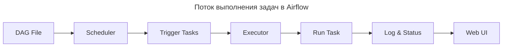

---
aliases:
  - Airflow
  - Apache Airflow
  - DAG
  - Directed Acyclic Graph
  - Executor
  - Metadata DB
  - Operator
  - orchestration
  - Scheduler
  - Sensor
  - Task
  - Web UI
  - workflow
  - Задача
  - Исполнитель
  - Оркестрация
  - Планировщик
---
## Обзор

**Apache Airflow** — это открытая платформа для **оркестрации, планирования и мониторинга рабочих процессов** (пайплайнов) в области обработки данных.

По сути, это «диспетчер», который:

- задаёт порядок выполнения задач;
- следит за зависимостями между ними;
- запускает процессы по расписанию или по событию;
- показывает статус выполнения и логи.

> **Простыми словами**: «Я хочу, чтобы каждую ночь:
> 1. Скачал данные из базы
> 2. Обработал их
> 3. Загрузил в Data Warehouse
> 4. Отправил отчёт»
> → Airflow сделает это автоматически.

## Для чего применяют Airflow

- **[[extract-load-transform|ELT]]-процессы** (Extract, Transform, Load): извлечение, преобразование и загрузка данных.
- Автоматизация отчётов и выгрузок.
- Управление инфраструктурой и сервисами.
- Запуск моделей машинного обучения ([[machine-learning|ML]] pipelines).
- Интеграция между базами данных и внешними системами.
- Планирование и мониторинг сложных последовательностей задач.

**Когда использовать Airflow**

| Сценарий | Рекомендация |
|----------|--------------|
| Ежедневная ETL-обработка | **Airflow** |
| Обучение ML-моделей | **Airflow** |
| Аналитика с периодическими отчётами | **Airflow** |
| Автоматизация рутинных задач | **Airflow** |
| Реальное время / потоковые данные | **Kafka + Flink / Spark Streaming** |

## Ключевые понятия

1. **[[DAG|DAG]] (Directed Acyclic Graph)** — «направленный ациклический граф»:
   - логическая группа задач, которые нужно выполнить в определённом порядке;
   - не содержит циклов (одна задача не может запускать саму себя);
   - имеет расписание (например, раз в час или ежедневно в 03:00).
2. **Task (задача)** — отдельная операция в DAG (загрузка данных, SQL-запрос, скрипт на Python и т. п.).
3. **Operator (оператор)** — шаблон для выполнения задачи. Примеры:
   - `PythonOperator` — запуск Python-кода;
   - `BashOperator` — выполнение команды Bash;
   - `SqlOperator` — выполнение SQL-запроса;
   - `EmailOperator` — отправка письма;
   - `HttpOperator` — HTTP-запрос.
4. **Sensor** — оператор, ожидающий определённого события (появления файла, времени, ответа API и т. п.).
5. **Execution Date** — логическая дата запуска DAG (позволяет воспроизводить результаты за прошлую дату).

## Основные компоненты архитектуры

- **Scheduler (планировщик)** — читает расписание DAG и решает, какие задачи и когда запускать.
- **Executor (исполнитель)** — определяет, как и где выполнять задачи. Варианты:
  - `SequentialExecutor` — последовательное выполнение (для тестов);
  - `LocalExecutor` — параллельные задачи на одном узле;
  - `CeleryExecutor` — распределение задач между несколькими рабочими узлами;
  - `KubernetesExecutor` — запуск в контейнерах Kubernetes.
- **Metadata DB (база метаданных)** — хранит статусы задач, зависимости, историю запусков (поддерживает PostgreSQL, MySQL и др.).
- **Web Server** — веб-интерфейс для мониторинга, управления и настройки DAG.
- **Workers (рабочие процессы)** — исполняют задачи, назначенные Executor.

## Как это работает (упрощённо)

1. Разработчик описывает DAG на Python: какие задачи, в каком порядке, по какому расписанию.
2. Airflow загружает DAG в базу метаданных.
3. Планировщик (Scheduler) следит за расписанием и условиями запуска.
4. Когда наступает время, Scheduler передаёт задачу Executor.
5. Executor запускает Worker, который выполняет задачу через соответствующий Operator.
6. Статус задачи записывается в Metadata DB и отображается в Web UI.



## Пример DAG (Python)

```python
from airflow import DAG
from airflow.operators.python import PythonOperator
from datetime import datetime

def extract_data():
    print("Extracting data...")

def transform_data():
    print("Transforming data...")

def load_data():
    print("Loading data...")

dag = DAG(
    'my_etl_pipeline',
    start_date=datetime(2026, 1, 1),
    schedule_interval='@daily',
    catchup=False
)

extract_task = PythonOperator(
    task_id='extract',
    python_callable=extract_data,
    dag=dag
)

transform_task = PythonOperator(
    task_id='transform',
    python_callable=transform_data,
    dag=dag
)

load_task = PythonOperator(
    task_id='load',
    python_callable=load_data,
    dag=dag
)

extract_task >> transform_task >> load_task
```

## Преимущества

- **Открытый код** и активное сообщество.
- **Гибкость** — можно писать собственные операторы и интеграции.
- **Масштабируемость** — поддержка распределённых исполнений (Celery, Kubernetes).
- **Мониторинг** — веб-интерфейс с дашбордами, логами и историей запусков.
- **Интеграции** — работа с SQL, NoSQL, облаками (AWS, GCP, Azure), Hadoop, Spark и др.
- **Воспроизводимость** — запуск за прошлую дату без влияния на текущее состояние.

## Ограничения и нюансы

- Требует навыков **программирования на Python**.
- Не предназначен для **потоковой обработки** (лучше подойдут Apache Flink, Spark Streaming).
- Настройка Executor (особенно Celery/Kubernetes) может быть сложной.
- Необходимо следить за зависимостями и ресурсами (память, CPU).

## Кому подойдёт

- **Инженерам данных** — для ETL, интеграции и автоматизации.
- **Data Scientists** — для развёртывания ML-пайплайнов.
- **Разработчикам** — для оркестрации сервисов и задач.
- **Аналитикам** — для автоматизации отчётов и витрин данных.
- **Менеджерам** — для мониторинга и планирования процессов.

## Альтернативы

| Инструмент | Когда использовать |
|------------|---------------------|
| **Prefect** | Более современный, лучше подходит для ML |
| **Luigi** | Простой, но устаревший |
| **DBT** | Для трансформаций в DW (ELT), а не для планирования |
| **Cron** | Для простых задач без сложных зависимостей |

## Итог

Airflow — мощный инструмент для управления сложными последовательностями задач в data-инженерии и смежных областях. Он превращает процессы обработки данных в код, делая их прозрачными, тестируемыми и масштабируемыми.

> 💬 _«Airflow — "рабочая лошадка" для данных: он управляет всеми вашими ETL, ML и аналитическими процессами»_

## Где учиться дальше

- Book: _«Data Engineering with Apache Airflow»_ — Kunal Chaudhary
- YouTube: _«Apache Airflow Tutorial»_ — TechWorld with Nana
