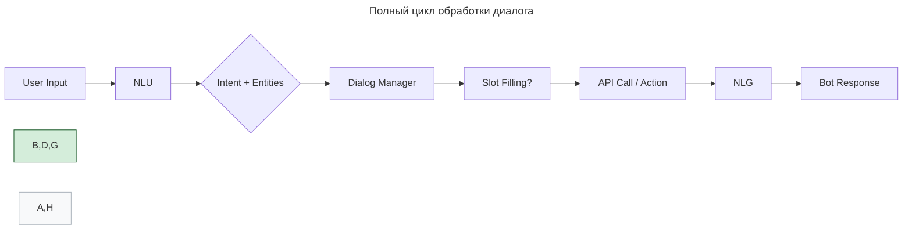

---
aliases:
  - Dialog Management
  - DM
  - Natural Language Generation
  - Natural Language Understanding
  - NLG
  - NLU
  - генерация естественного языка
  - понимание естественного языка
  - управление диалогом
---

## 1. NLU — Natural Language Understanding

**NLU** — это способность системы **понять смысл** пользовательского ввода.

### Что делает NLU?

| Функция | Пример |
|--------|--------|
| **Intent Recognition** | «Перенести встречу» → `intent: reschedule_meeting` |
| **Entity Extraction** | «на пятницу» → `date=Friday`, «с Иваном» → `person=Иван` |
| **Sentiment Analysis** | «Это ужасно!» → негативный тон |
| **Normalization** | Разные фразы → один intent: «отменить», «не надо», «удали» → `cancel_order` |

**Пример:**

```text
Пользователь: "Я хочу перенести нашу встречу на следующую пятницу"
```

NLU выдаёт:

```json
{
  "intent": "reschedule_meeting",
  "entities": {
    "new_date": "2025-04-18",
    "original_event": "our meeting"
  },
  "confidence": 0.96
}
```

## 2. DM — Dialog Management (управление диалогом)

**Dialog Manager** — «мозг» бота. Он решает:

- как реагировать;
- нужно ли уточнить;
- в каком состоянии находится диалог.

### Основные задачи DM

| Задача | Объяснение |
|--------|------------|
| **Слежение за состоянием диалога** | Где мы сейчас? Ждём дату, подтверждения? |
| **Выбор действия** | Ответить, спросить, выполнить API-вызов |
| **Ведение контекста** | Помнить, о какой встрече речь |
| **Slot Filling** | Собрать все данные для действия |
| **Обработка неопределённости** | Если NLU не уверен → уточнить |

### Slot Filling (заполнение слотов)

Это процесс **сбора недостающих параметров** для выполнения действия.

**Пример: бронирование звонка**

```text
Пользователь: "Хочу записаться к врачу"
```

DM понимает: нужно собрать:

- тип визита (`slot: visit_type`);
- дату (`slot: date`);
- время (`slot: time`);
- врача (`slot: doctor`).

**Диалог:**

```text
Бот: К какому врачу вы хотите записаться?
Пользователь: К кардиологу.
Бот: На какую дату?
Пользователь: На пятницу.
...
```

Когда все слоты заполнены → бот выполняет действие.

### Политики управления диалогом (Dialog Policies)

| Политика | Как работает | Пример |
|---------|----------------|--------|
| **Rule-based** | Жёсткие правила (if-else) | `Если intent=book_appointment → начни slot filling` |
| **Data-driven** | Обучена на реальных диалогах | Модель предсказывает следующее действие |

Data-driven политики бывают двух типов:

- **Retrieval-based** — выбирает лучший ответ из базы (например, «Чем могу помочь?»);
- **Generating (Generative)** — генерирует ответ с нуля (GPT-3, [[LLM|LLM]]).

## Rule-based vs Data-driven

| Критерий | Rule-Based | Data-Driven |
|----------|------------|-------------|
| **Гибкость** | Жёстко закодировано | Учится на данных |
| **Начало работы** | Быстро | Нужны данные |
| **Масштабирование** | Сложно | Легче с ML |
| **Поддержка** | Ручное обновление | Retrain модель |
| **Контроль** | Полный | Чёрный ящик |
| **Пример** | [[rasa|Rasa]] Core (ранние версии) | Google Meena, ChatGPT |

## 3. NLG — Natural Language Generation

**NLG** — это **генерация человечески читаемого текста** на основе данных или команды.

**Пример:**

```json
{
  "action": "appointment_confirmed",
  "doctor": "Кардиолог",
  "date": "2025-04-18",
  "time": "10:00"
}
```

NLG генерирует:

> _«Запись к кардиологу назначена на пятницу, 18 апреля, в 10:00. Приходите вовремя!»_

### Этапы NLG

1. **Content Determination** — что сказать?
2. **Text Planning** — структура ответа.
3. **Sentence Realization** — грамматика, стиль.
4. **Output** — текст / речь.

### Архитектура: полный цикл



## Сравнение подходов

| Компонент | Rule-Based | Data-Driven |
|----------|-----------|------------|
| **NLU** | Регулярки, словари | BERT, Spacy, [[hugging-face|Hugging Face]] |
| **DM** | State Machine, if-else | Reinforcement Learning, [[machine-learning-model|Transformer]] |
| **NLG** | Шаблоны (`"Запись подтверждена на {date}"`) | GPT, T5, BART |

## Когда использовать?

| Сценарий | Рекомендация |
|----------|--------------|
| MVP, простой бот | Rule-based + шаблоны |
| Поддержка 24/7 | Data-driven |
| Много вариантов ввода | Data-driven NLU |
| Нужен контроль над ответами | Шаблоны NLG |
| Персонализированный UX | Generative NLG |
| CRM, ERP, legacy | Retrieval-based DM |

**Итог:**

| Часть   | Отвечает на вопрос      |
| ------- | ----------------------- |
| **NLU** | Что хочет пользователь? |
| **DM**  | Что делать дальше?      |
| **NLG** | Как сказать?            |

> _NLU hears the words. DM decides the action. NLG speaks back._
