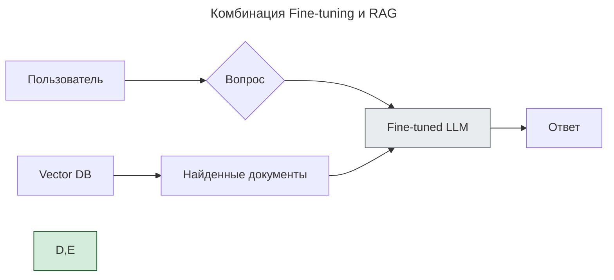

---
aliases:
  - Fine-tuning
  - LoRA
  - QLoRA
  - RAG
  - Retrieval-Augmented Generation
  - дообучение
  - тонкая настройка
---

## Fine-tuning и RAG

**Fine-tuning** и **RAG (Retrieval-Augmented Generation)** — два ключевых подхода для адаптации больших языковых моделей (LLM) под бизнес-задачи. Статья «Optimizing LLM Performance: RAG vs Finetune vs Both» сравнивает три подхода к оптимизации LLM: **RAG**, **тонкую настройку (finetuning)** и **их комбинацию**.

### Fine-tuning

**Суть**

Дообучение предобученной модели на специализированном датасете для конкретной задачи: берётся предобученная LLM (например, GPT, Llama), дообучается на своих данных, и получается **специализированная модель**, которая понимает ваш стиль, использует нужный тон и знает терминологию.

**Пример**

```text
Вы хотите, чтобы бот отвечал как "дружелюбный консультант", а не формально.

Дообучаете на 10K диалогах → модель начинает говорить:
→ «Привет! Чем могу помочь?» вместо «Здравствуйте. Ваш запрос принят»
```

**Особенности**

- ✅ Высокая специализация под задачу
- ✅ Стабильная производительность
- ✅ Более быстрый инференс (нет поиска)
- ✅ Возможность настроить стиль и тон ответов
- ✅ Модель усваивает данные через обучение и после fine-tuning работает автономно
- ❌ Дорого и трудоёмко (нужны данные и вычислительные мощности)
- ❌ Риск «катастрофического забывания» (потеря общих знаний)
- ❌ Требует переобучения при обновлении данных
- ❌ Не гибко
- ❌ Риск утечки PII (если в данных были персональные сведения)

**Когда выбирать**

- данные стабильны;
- нужна высокая точность в узкой области;
- критична скорость ответа;
- нужно изменить поведение модели или настроить стиль общения.

### RAG

**Суть**

Модель в реальном времени извлекает актуальную информацию из внешних источников (баз данных, документов) и использует её для генерации ответа: при запросе ищет релевантные фрагменты и отвечает строго по ним.

**Особенности**

- ✅ Всегда актуальные данные (не требуется переобучение: обновил базу → всё готово)
- ✅ Снижение «галлюцинаций» (ответы опираются на факты из контекста)
- ✅ Прозрачность: можно показать источники («ответ из FAQ №5»)
- ✅ Экономичность (не требует больших вычислительных ресурсов)
- ✅ Безопасность: нет обучения на чувствительных данных
- ❌ Зависимость от качества поиска
- ❌ Возможные проблемы с согласованностью данных
- ❌ Дополнительная задержка на поиск информации (latency зависит от поиска в базе)
- ❌ Требует внешнюю систему (векторную БД)
- ❌ Нужно качество эмбеддингов и ранжирования
- ❌ Сложнее тестировать

**Когда выбирать**

- данные часто обновляются (тарифы, законы, политики);
- нужен доступ к внешним знаниям;
- важна проверяемость ответов;
- важна точность.

### Комбинация RAG + Fine-tuning

**Суть**

Совмещение преимуществ обоих подходов:

- finetuning задаёт базовый уровень экспертизы и стиль;
- RAG обеспечивает доступ к актуальным данным.

**Схема**



**Особенности**

- ✅ Баланс специализации и актуальности
- ✅ Максимальная точность и достоверность
- ✅ Гибкость при изменении данных

**Когда выбирать**

- высокие требования к качеству и актуальности;
- сложная предметная область с динамичными данными;
- есть ресурсы для реализации обоих подходов.

### Сравнительная таблица

| Критерий | **Fine-tuning** | **RAG** |
|----------|-----------------|---------|
| **Цель** | Изменить поведение/тон модели | Дать доступ к актуальным данным |
| **Когда использовать** | Чтобы модель говорила как бренд | Чтобы она знала свежую информацию |
| **Обновление знаний** | ❌ Нужно переобучать | ✅ Обновил базу → всё готово |
| **Стоимость** | Высокая (GPU, время) | Низкая (векторная БД + промпты) |
| **Latency** | Как у исходной модели | Зависит от поиска в базе |
| **Hallucinations** | Может быть меньше | Сильно снижены — ответы из контекста |
| **Где хранятся данные** | Веса модели | Внешняя система (Pinecone, Weaviate, Elasticsearch) |
| **Типичные данные** | Диалоги, примеры ответов | FAQ, документы, KB, PDF |
| **Контроль над источниками** | ❌ Нет — модель «знает» | ✅ Да — можно показать: «ответ из FAQ №5» |
| **Инструменты** | Hugging Face, LoRA, QLoRA | LangChain, LlamaIndex, Vector DB |

### Ключевые критерии выбора

1. **Динамика данных**
    - частые обновления → RAG;
    - стабильные данные → finetuning.
2. **Ресурсы**
    - ограниченные → RAG;
    - достаточные → finetuning или комбинация.
3. **Точность vs актуальность**
    - нужна свежесть данных → RAG;
    - нужна глубокая экспертиза → finetuning.
4. **Прозрачность**
    - важно показать источники → RAG;
    - не критично → finetuning.

### Когда что выбирать

| Ваша цель | Решение |
|-----------|---------|
| ✅ Хочу, чтобы бот говорил как мой бренд | ➤ **Fine-tuning** |
| ✅ Нужны актуальные данные (например, цены) | ➤ **RAG** |
| ✅ Я боюсь hallucination'ов | ➤ **RAG** |
| ✅ У меня динамические данные | ➤ **RAG** |
| ✅ Мне нужен уникальный стиль | ➤ **Fine-tuning** |
| ✅ У меня есть и стиль, и данные | ➤ **Fine-tuning + RAG** |

**Финальный вывод**

Сводная таблица:

| | **Fine-tuning** | **RAG** |
|--|-----------------|---------|
| **Что делает** | Меняет внутренние веса | Добавляет контекст |
| **Какие данные** | Диалоги, примеры | Документы, FAQ, KB |
| **Актуальность** | При обновлении — retrain | Автоматически |
| **Контроль источников** | ❌ | ✅ |
| **Скорость внедрения** | ❌ Долго | ✅ Быстро |
| **Стоимость** | Высокая | Низкая |
| **Подходит для** | Тоны, стили | Знания, факты |

Лучше всего — комбинация:

- **Fine-tuned LLM** — говорит правильно;
- **RAG** — говорит правду.

Нет универсального решения. Оптимальный подход зависит от конкретной задачи, ресурсов и требований к качеству. Во многих случаях комбинация RAG и finetuning даёт наилучший результат.

**Цитата**

"RAG tells you what it knows. Fine-tuning shows you how it thinks."

**Где учиться дальше**

- [Hugging Face Fine-tuning](https://huggingface.co/docs/transformers/training)
- [LangChain + RAG](https://docs.langchain.com/)
- **Fine-tuning vs RAG** — James Briggs #👨 (YouTube)
- **Building LLM-Powered Applications** #📘
