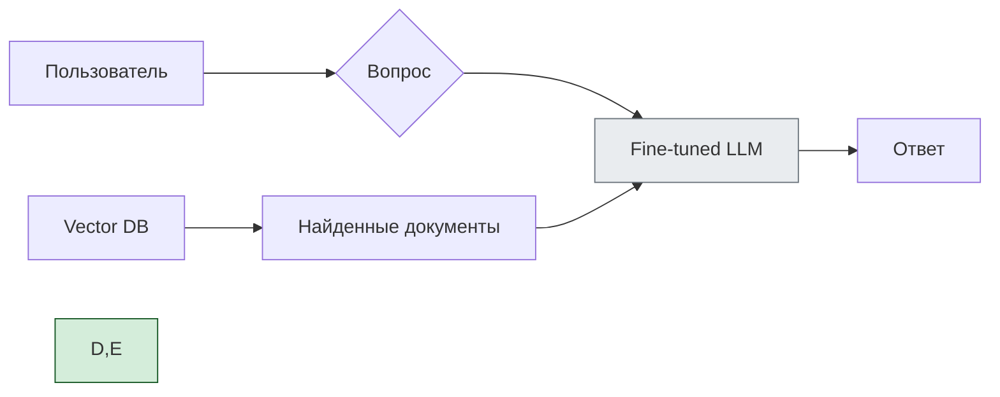

### Краткое изложение статьи «Optimizing LLM Performance: RAG vs Finetune vs Both»

Статья сравнивает три подхода к оптимизации больших языковых моделей (LLM): **RAG**, **тонкую настройку (finetuning)** и **их комбинацию**.

#### 1. RAG (Retrieval‑Augmented Generation)

**Суть:**  
Модель в реальном времени извлекает актуальную информацию из внешних источников (баз данных, документов) и использует её для генерации ответа.

**Плюсы:**

- всегда актуальные данные (не требуется переобучение);
    
- снижение «галлюцинаций» (ответы опираются на факты);
    
- прозрачность (можно показать источники);
    
- экономичность (не требует больших вычислительных ресурсов).
    

**Минусы:**

- зависимость от качества поиска;
    
- возможные проблемы с согласованностью данных;
    
- дополнительная задержка на поиск информации.
    

**Когда выбирать:**

- данные часто обновляются;
    
- нужен доступ к внешним знаниям;
    
- важна проверяемость ответов.
    

#### 2. Finetuning (тонкая настройка)

**Суть:**  
Дообучение предобученной модели на специализированном датасете для конкретной задачи.

**Плюсы:**

- высокая специализация под задачу;
    
- стабильная производительность;
    
- более быстрый инференс (нет поиска);
    
- возможность настроить стиль и тон ответов.
    

**Минусы:**

- дорого и трудоёмко (нужны данные и вычислительные мощности);
    
- риск «катастрофического забывания» (потеря общих знаний);
    
- требует переобучения при обновлении данных.
    

**Когда выбирать:**

- данные стабильны;
    
- нужна высокая точность в узкой области;
    
- критична скорость ответа.
    

#### 3. Комбинация RAG + Finetuning

**Суть:**  
Совмещение преимуществ обоих подходов:

- finetuning задаёт базовый уровень экспертизы и стиль;
    
- RAG обеспечивает доступ к актуальным данным.
    

**Плюсы:**

- баланс специализации и актуальности;
    
- максимальная точность и достоверность;
    
- гибкость при изменении данных.
    

**Когда выбирать:**

- высокие требования к качеству и актуальности;
    
- сложная предметная область с динамичными данными;
    
- есть ресурсы для реализации обоих подходов.
    

#### Ключевые критерии выбора

1. **Динамика данных:**
    
    - частые обновления → RAG;
        
    - стабильные данные → finetuning.
        
2. **Ресурсы:**
    
    - ограниченные → RAG;
        
    - достаточные → finetuning или комбинация.
        
3. **Точность vs актуальность:**
    
    - нужна свежесть данных → RAG;
        
    - нужна глубокая экспертиза → finetuning.
        
4. **Прозрачность:**
    
    - важно показать источники → RAG;
        
    - не критично → finetuning.
        

**Вывод:**  
Нет универсального решения. Оптимальный подход зависит от конкретной задачи, ресурсов и требований к качеству. Во многих случаях комбинация RAG и finetuning даёт наилучший результат.

___
Отличный и очень важный вопрос!  
**Fine-tuning** и **RAG (Retrieval-Augmented Generation)** — это два ключевых подхода для адаптации больших языковых моделей (LLM) под бизнес-задачи.

---

## ✅ Что такое Fine-tuning?

> **Fine-tuning (дообучение)** — это процесс, при котором вы:
1. Берёте предобученную LLM (например, GPT, Llama)
2. Дообучаете её на своих данных
3. Получаете **специализированную модель**, которая:
   - Понимает ваш стиль
   - Использует нужный тон
   - Знает терминологию

### 💡 Пример:

```text
Вы хотите, чтобы бот отвечал как "дружелюбный консультант", а не формально.

Дообучаете на 10K диалогах → модель начинает говорить:  
→ _«Привет! Чем могу помочь?»_ вместо _«Здравствуйте. Ваш запрос принят»_
```

---

## 🆚 Сравнение: Fine-tuning vs RAG

| Критерий | **Fine-tuning** | **RAG** |
|----------|------------------|---------|
| **Цель** | Изменить поведение/тон модели | Дать доступ к актуальным данным |
| **Когда использовать** | Чтобы модель говорила как бренд | Чтобы она знала свежую информацию |
| **Обновление знаний** | ❌ Нужно переобучать | ✅ Обновил базу → всё готово |
| **Стоимость** | Высокая (GPU, время) | Низкая (векторная БД + промпты) |
| **Latency** | Как у исходной модели | Зависит от поиска в базе |
| **Hallucinations** | Может быть меньше | Сильно снижены — ответы из контекста |
| **Где хранятся данные** | Веса модели | Внешняя система (Pinecone, Weaviate, Elasticsearch) |
| **Типичные данные** | Диалоги, примеры ответов | FAQ, документы, KB, PDF |
| **Контроль над источниками** | ❌ Нет — модель "знает" | ✅ Да — можно показать: «ответ из FAQ №5» |
| **Инструменты** | Hugging Face, LoRA, QLoRA | LangChain, LlamaIndex, Vector DB |

---

## 🔍 Глубокое сравнение

### 1. **Fine-tuning**
- Модель **усваивает** данные через обучение
- После fine-tuning — работает автономно
- Но если информация меняется → нужно дообучать заново

#### ✅ Подходит:
- Для стиля общения
- Если нужно изменить поведение
- Когда данные статичны

#### ❌ Минусы:
- Дорого и долго
- Не гибко
- Риск утечки PII (если в данных были персональные сведения)

---

### 2. **RAG (Retrieval-Augmented Generation)**
- Модель **не знает заранее**
- При запросе — ищет релевантные фрагменты
- Отвечает строго по ним

#### ✅ Подходит:
- Для часто меняющихся данных (тарифы, законы, политики)
- Если нужна точность
- Безопасность: нет обучения на чувствительных данных

#### ❌ Минусы:
- Требует внешнюю систему (векторную БД)
- Нужно качество эмбеддингов и ранжирования
- Сложнее тестировать

---

## 🔄 Комбинированный подход: Fine-tuning + RAG



> ✅ **Fine-tuned LLM** — понимает стиль и тон  
> ✅ **RAG** — обеспечивает точность и актуальность

---

## ✅ Когда что выбирать?

| Ваша цель | Решение |
|----------|--------|
| ✅ Хочу, чтобы бот говорил как мой бренд | ➤ **Fine-tuning** |
| ✅ Нужны актуальные данные (например, цены) | ➤ **RAG** |
| ✅ Я боюсь hallucination'ов | ➤ **RAG** |
| ✅ У меня динамические данные | ➤ **RAG** |
| ✅ Мне нужен уникальный стиль | ➤ **Fine-tuning** |
| ✅ У меня есть и стиль, и данные | ➤ **Fine-tuning + RAG** |

---

## 💬 Цитата:

> _“RAG tells you what it knows.<br>Fine-tuning shows you how it thinks.”_

---

## ✅ Финальный вывод

| | **Fine-tuning** | **RAG** |
|--|----------------|--------|
| **Что делает** | Меняет внутренние веса | Добавляет контекст |
| **Какие данные** | Диалоги, примеры | Документы, FAQ, KB |
| **Актуальность** | При обновлении — retrain | Автоматически |
| **Контроль источников** | ❌ | ✅ |
| **Скорость внедрения** | ❌ Долго | ✅ Быстро |
| **Стоимость** | Высокая | Низкая |
| **Подходит для** | Тоны, стили | Знания, факты |

> ✅ **Лучше всего — комбинация**:  
> - `Fine-tuned LLM` — говорит правильно  
> - `RAG` — говорит правду

---

## 📚 Где учиться дальше?

- [Hugging Face Fine-tuning](https://huggingface.co/docs/transformers/training)
- [LangChain + RAG](https://docs.langchain.com/)
- YouTube: *“Fine-tuning vs RAG”* — James Briggs
- Book: *“Building LLM-Powered Applications”*

---

✅ **Теперь вы знаете:**  
Как выбрать между дообучением и поиском — или использовать оба.

📌 Сохраните эту таблицу — она станет основой вашего AI-стратегии.

> 🧠 _“Don’t hallucinate. Don’t forget. Combine RAG and fine-tuning.”_