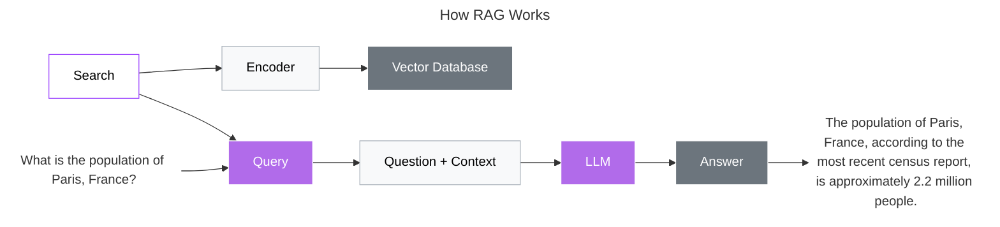
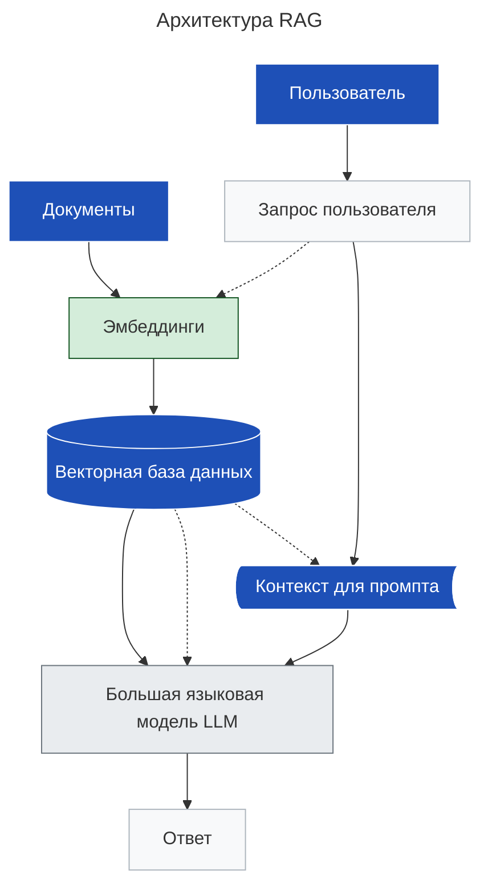

## Retrieval‑Augmented Generation (RAG): суть паттерна
> Retrieval‑Augmented Generation ~ **генерация, дополненная поиском**

**RAG** — это архитектурный паттерн в области [[NLP]], объединяющий *поиск информации* (retrieval) и *генерацию текста* (generation). Его цель — повысить точность и обоснованность ответов генеративных моделей за счёт привлечения внешних знаний.
### Как работает RAG: пошаговый процесс

1. **Получение запроса**  
   Пользователь задаёт вопрос или формулирует задачу (например, *«Какие симптомы у дефицита витамина D?»*).

2. **Поиск релевантных документов**  
   Система обращается к внешнему хранилищу знаний (база статей, документация, векторная база данных) и извлекает 3–5 наиболее релевантных фрагментов текста.  
   *Используются методы:*  
   - семантический поиск (на основе векторных представлений);  
   - keyword‑поиск;  
   - гибридные подходы.

3. **Объединение контекста с запросом**  
   Исходный запрос дополняется найденными фрагментами:  
   ```
   Запрос: "Какие симптомы у дефицита витамина D?"
   Контекст 1: "При дефиците витамина D часто наблюдаются мышечная слабость и боли в костях."
   Контекст 2: "Хронический недостаток витамина D может вызывать усталость и перепады настроения."
   ```

4. **Генерация ответа**  
   Языковая модель (LLM) анализирует объединённый контекст и формирует ответ, опираясь на фактические данные из найденных документов.

5. **Возврат результата**  
   Пользователь получает ответ с ссылками на источники (опционально).



### Ключевые компоненты RAG

- **Retriever** — модуль поиска:  
  - преобразует запрос в вектор;  
  - ищет ближайшие векторы в базе данных;  
  - возвращает топ‑N документов.  
  *Примеры:* FAISS, Elasticsearch, Pinecone.

- **Generator** — языковая модель:  
  - принимает запрос + контекст;  
  - генерирует связный ответ;  
  - может указывать источники.  
  *Примеры:* GPT, Llama, Claude.

- **База знаний** — хранилище документов:  
  - структурированные базы данных;  
  - векторные базы (для семантического поиска);  
  - файловые хранилища.

### Преимущества RAG

1. **Актуальность данных**  
   Модель использует свежие источники, а не только знания из предобучения.

2. **Проверяемость**  
   Ответы можно верифицировать по приведённым источникам.

3. **Снижение «галлюцинаций»**  
   Меньше вымышленных фактов за счёт опоры на реальный контекст.

4. **Гибкость**  
   Можно менять базу знаний без переобучения модели.

5. **Экономичность**  
   Не требует дообучения LLM — достаточно обновить базу документов.

### Ограничения и вызовы

- **Качество поиска**: если Retriever возвращает нерелевантные документы, ответ будет ошибочным.
- **Объём контекста**: LLM имеют лимит на длину входного текста (например, 8K токенов).
- **Задержка**: дополнительный этап поиска увеличивает время ответа.
- **Интеграция**: настройка взаимодействия между Retriever и Generator требует усилий.

### Типичные сценарии применения

- **Чат‑боты поддержки**: ответы на вопросы по документации.  
- **Поисковые системы**: генерация кратких ответов с источниками.  
- **Аналитические инструменты**: суммирование отчётов и исследований.  
- **Образование**: объяснение тем с опорой на учебные материалы.  
- **Медицина**: предоставление информации на основе клинических рекомендаций.

### Пример работы RAG

**Запрос пользователя:**  
> «Какой метод лечения рекомендован при переломе лучевой кости?»

**Шаги системы:**  
1. Retriever находит статьи о переломах лучевой кости из медицинской базы.  
2. Генератор получает запрос + 3 релевантных фрагмента из клинических протоколов.  
3. LLM формирует ответ:  
   > «При переломе лучевой кости обычно применяют:  
   > - иммобилизацию гипсом (при неосложнённых случаях);  
   > - хирургическую фиксацию пластиной (при смещённых переломах).  
   > Решение зависит от типа перелома и сопутствующих повреждений (источник: Клинические рекомендации Минздрава, 2023)».

### Отличие от классического prompt engineering

- **Без RAG**: модель отвечает на основе знаний, заложенных при обучении.  
- **С RAG**: модель получает актуальные данные из внешних источников *в момент запроса*.

RAG стал стандартом для задач, где критичны точность и проверяемость — от корпоративных помощников до систем принятия решений.


___


# ключевые термины RAG
(Retrieval-Augmented Generation) — это фундамент для построения **умных, точных и безопасных LLM-приложений**.

---

## ✅ Кратко: Все термины в одном примере

```text
Документ: "Пенсионеры имеют право на бесплатный проезд..."
→ Чанкируется → каждый чанк токенизируется → 
→ превращается в вектор → сохраняется с метаданными → 
→ при запросе "льготы пенсионеров" → SentenceTransformer находит релевантный чанк
```

---

## 🔍 Подробное объяснение каждого термина в контексте RAG

---

### 1. **Токены (Tokens)**

> **Токен** — это **минимальная единица текста**, на которую разбивается предложение перед обработкой LLM.

#### 💬 Пример:
```text
"Бесплатный проезд для пенсионеров"
→ Токены: ["Бесплат", "ный", "проезд", "для", "пенс", "ионеров"]
```

#### ✅ Зачем в RAG?
- Нужны для **токенизации входного текста**
- Ограничение длины контекста (например, GPT-4 = 32K токенов)
- Используются при эмбеддинге и генерации

#### 🛠️ Где используется?
- `Tiktoken` (OpenAI)
- `SentencePiece`, `WordPiece`
- `Hugging Face Tokenizers`

---

### 2. **Векторы (Embeddings / Vectors)**

> **Вектор** — это **числовой массив**, представляющий смысл текста.

#### 💬 Пример:
```python
"бесплатный проезд" → [0.89, -0.34, 0.67, ..., 0.12]
```

→ Два схожих предложения будут близки в векторном пространстве

#### ✅ Зачем в RAG?
- Чтобы **найти релевантные документы**
- Поиск «по смыслу», а не по словам

#### 📌 Используется:
- При индексации: документ → вектор
- При запросе: вопрос → вектор → поиск в базе

#### 🎯 Модели:
- `all-MiniLM-L6-v2` (Sentence Transformers)
- `E5`, `GTE`
- `text-embedding-3-small` (OpenAI)

---

### 3. **Чанки (Chunks)**

> **Чанк** — это **фрагмент документа**, который:
- Разрезан по размеру (например, 512 токенов)
- Сохранён как отдельный блок
- Может быть извлечён целиком

#### ❗ Почему нужно чанковать?
LLM имеет **ограничение на длину контекста**

Если весь PDF положить в один чанк → он не поместится в промпт

#### ✅ Правила чанкирования:
| Метод | Когда использовать |
|--------|---------------------|
| **Фиксированная длина** | Универсально |
| **По абзацам** | Если важен контекст |
| **Рекурсивное чанкирование** | Сложные документы |
| **Semantic chunking** | На основе смысловых границ |

#### 💡 Пример:
```text
[Чанк 1] Пенсионеры могут бесплатно ездить...
[Чанк 2] Также предусмотрены льготы на ЖКХ...
```

→ При запросе о проезде → возвращается только первый

---

### 4. **Метаданные (Metadata)**

> **Метаданные** — это **информация о чанке**, которая помогает:
- Фильтровать
- Ранжировать
- Объяснять источник

#### ✅ Что можно хранить?

| Поле | Пример |
|------|--------|
| `source` | `"faq_pensions.pdf"` |
| `page_number` | `12` |
| `section` | `"transport_benefits"` |
| `lang` | `"ru"` |
| `updated_at` | `"2025-04-10"` |
| `chunk_id` | `"doc_123_chunk_4"` |
| `access_level` | `"public"`, `"internal"` |

#### ✅ Зачем в RAG?
- Ограничить доступ: _«не показывать внутренние документы»_
- Улучшить ранжирование: _«новее = лучше»_
- Ответить пользователю: _«Информация из FAQ, стр. 12»_

---

### 5. **SentenceTransformer**

> **SentenceTransformer** — это **библиотека/модель**, которая создаёт **семантические эмбеддинги** из текста.

#### 🔧 Как работает?
```python
from sentence_transformers import SentenceTransformer
model = SentenceTransformer('paraphrase-multilingual-MiniLM-L12-v2')

sentences = [
    "Какие льготы у пенсионеров?",
    "Пенсионеры могут бесплатно ездить в общественном транспорте"
]

embeddings = model.encode(sentences)
# embeddings[0], embeddings[1] — векторы
cosine_similarity(embeddings[0], embeddings[1]) ≈ 0.95 → очень похожи
```

#### ✅ Преимущества:
- Поддержка **многих языков**
- Легко дообучается
- Бесплатно и open source
- Интеграция с FAISS, Chroma, Weaviate

#### 🚀 Популярные модели:
- `all-MiniLM-L6-v2` — быстрая, маленькая
- `paraphrase-multilingual` — поддерживает русский
- `e5-large` — state-of-the-art
- `BAAI/bge-base-en-v1.5` — хорошо для английского

---

## 🔄 Как всё работает вместе в RAG?

```mermaid
graph TD
    A[Документы] --> B[Чанкирование]
    B --> C[Токенизация]
    C --> D[SentenceTransformer → Embedding]
    D --> E[Vector DB + Metadata]

    F[Пользователь: "льготы пенсионеров"] --> G[Tok tokenize]
    G --> H[SentenceTransformer → вектор]
    H --> I[ANN Search в VectorDB]
    I --> J{Top-3 chunks}
    J --> K[С метаданными]
    K --> L["Question + Context" → LLM]
    L --> M[Ответ: "Пенсионеры могут бесплатно..."]
    M --> N[Ссылка: "Источник: faq_pensions.pdf, стр. 12"]

    style A,B,C,D,E,J,K fill:#d4edda,stroke:#155724
    style F,G,H,I fill:#fff3cd,stroke:#856404
    style L,M,N fill:#f8d7da,stroke:#721c24
```

---

## ✅ Финальный вывод: Роль каждого компонента в RAG

| Компонент | Роль |
|----------|------|
| **Токены** | Разбивают текст на части для модели |
| **Чанки** | Делят документы на управляемые куски |
| **Векторы** | Представляют смысл числом → для сравнения |
| **Метаданные** | Контролируют доступ, улучшают ранжирование |
| **SentenceTransformer** | Создаёт качественные эмбеддинги без GPU |

---

## 💬 Цитата:

> _“RAG is only as good as your embeddings.”_

---

## 📚 Где учиться дальше?

- [Sentence Transformers Docs](https://www.sbert.net/)
- [LangChain RAG Guide](https://docs.langchain.com/docs/components/chains/index_retrieval)
- YouTube: *“How RAG Works”* — James Briggs
- Book: *“Building LLM-Powered Applications”*

---

✅ **Теперь вы знаете:**  
Как текст становится вектором, как он разбивается, где хранится — и как возвращается в виде ответа.

📌 Сохраните эту информацию — она станет основой вашей RAG-системы.

> 🔁 **Chunk → Embed → Store → Retrieve → Generate**  
> Это и есть **Retrieval-Augmented Generation**.

___
### Процесс обработки запроса для LLM-ответа

1. Препроцессинг запроса
	- «Причёсываем» фразу пользователя.  
2. Embedding + фильтрация
	- Запрос превращается в вектор.  
3. Recall
	- Вектор попадает в индекс.  
4. Rerank
	- Процесс точной сортировки.  
5. Trim
	- Сложить длины чанков и вопроса и сверить с лимитом модели.
6. Prompt compose
	- Формируем системное сообщение и вставляем:  сначала пронумерованные чанки,  затем — вопрос пользователя.
7. LLM-ответ
	- Модель, опираясь на свежий контекст, выдаёт точный и проверяемый текст.  
8. Post-processing
	- Чистим двойные пробелы, форматируем ссылки, если нужно:  
		- добавляем Markdown-заголовки;  
		- прогоняем быстрый regression-check.  

➡️ **Финальный результат**

Такой формат сохраняет логику последовательности этапов и делает информацию удобной для чтения в текстовом виде. Если нужно адаптировать под конкретный стиль Markdown (например, с использованием таблиц или списков с отступами) — дайте знать, дополню!