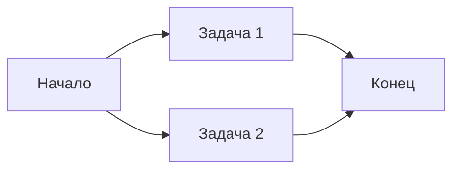
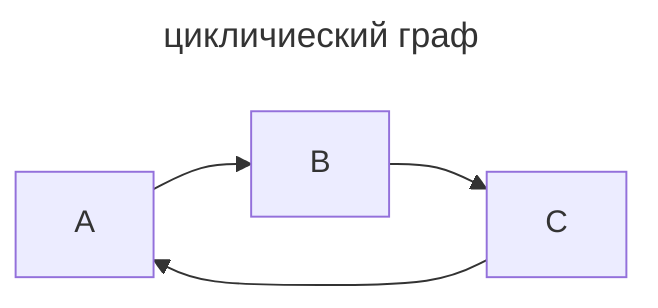

---
aliases:
  - Directed Acyclic Graph
  - DAG
  - Направленный Ациклический Граф
---
Отличный вопрос! **DAG (Directed Acyclic Graph)** — это **основная концепция Apache [[Airflow]]**, лежащая в основе всего планирования и выполнения задач.

---

## 🎯 Что такое DAG?

**DAG = Направленный Ациклический Граф**

- **Направленный (Directed)**: связи между задачами имеют **направление** (от A к B).
- **Ациклический (Acyclic)**: **нет циклов** — нельзя вернуться к уже выполненной задаче.
- **Граф (Graph)**: набор **узлов (задач)** и **рёбер (зависимостей)**.

> 💡 В Airflow **DAG — это описание workflow (рабочего процесса)**: какие задачи выполнять и в каком порядке.

---

## 🧩 Пример DAG

Представьте ETL-процесс:

1. Извлечь данные из API
2. Преобразовать данные
3. Загрузить в хранилище
4. Отправить уведомление

В виде DAG это выглядит так:


→ Это **направленный граф без циклов** → корректный DAG.

---

## 📜 Как описывается DAG в Airflow?

На Python (Airflow использует код как конфигурацию):

```python
from airflow import DAG
from airflow.operators.python import PythonOperator
from datetime import datetime

def extract():
    print("Извлекаем данные")

def transform():
    print("Преобразуем данные")

def load():
    print("Загружаем данные")

# Определяем DAG
dag = DAG(
    dag_id="etl_pipeline",
    start_date=datetime(2025, 5, 27),
    schedule="@daily",
    catchup=False
)

# Определяем задачи
extract_task = PythonOperator(task_id="extract", python_callable=extract, dag=dag)
transform_task = PythonOperator(task_id="transform", python_callable=transform, dag=dag)
load_task = PythonOperator(task_id="load", python_callable=load, dag=dag)

# Задаём зависимости
extract_task >> transform_task >> load_task
```

> 🔁 Оператор `>>` задаёт **порядок выполнения**: `A >> B` означает «A, затем B».

---

## 🔑 Ключевые свойства DAG в Airflow

| Свойство | Описание |
|---------|----------|
| **Идемпотентность** | DAG можно запускать много раз — результат будет одинаковым |
| **Повторяемость** | Каждый запуск DAG — отдельный **DAG Run** с уникальным временем |
| **Параллелизм** | Независимые задачи выполняются **параллельно** |
| **Перезапуск** | Можно перезапустить **отдельную задачу**, не весь DAG |
| **Мониторинг** | Каждая задача имеет статус (success, failed, skipped) |

---

## 🌐 Пример с параллелизмом



→ Задачи 1 и 2 выполняются **одновременно**.

В коде:
```python
start >> [task1, task2] >> end
```

---

## ⚠️ Почему "ациклический"?

Если бы был цикл:



→ Airflow **не смог бы выполнить** такой DAG — он завис бы в бесконечном цикле.

> ✅ Airflow **автоматически проверяет** отсутствие циклов при загрузке DAG.

---

## 📊 DAG в UI Airflow

В веб-интерфейсе Airflow вы видите:
- **Список DAG'ов**
- **Граф зависимостей** (как на схеме выше)
- **Статусы задач** (зелёный = успех, красный = ошибка)
- **Историю запусков**

---

## 💡 Зачем нужен DAG?

1. **Описывает бизнес-логику** визуально и программно.
2. **Обеспечивает порядок выполнения** (например, нельзя загрузить данные до их извлечения).
3. **Позволяет повторять процессы** (ежедневные отчёты, ежечасные джобы).
4. **Даёт контроль**: мониторинг, логи, повторные запуски.

---

## 🎯 Итог

> **DAG в Airflow — это декларативное описание workflow в виде направленного графа без циклов.**  
> Он определяет:
> - **Что** делать (задачи)
> - **В каком порядке** (зависимости)
> - **Когда** (расписание)

Без DAG'ов Airflow — просто планировщик. С DAG'ами — мощная система оркестрации данных.

---

Хочешь пример **динамического DAG** или **обработки ошибок в задачах**? Напиши — подготовлю! 😊