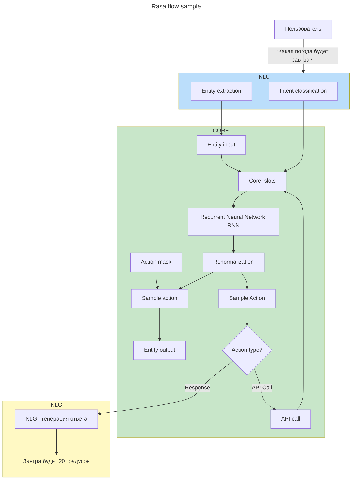

### Rasa — фреймворк для создания разговорного ИИ

**Rasa** — это открытый (open‑source) фреймворк машинного обучения для разработки чат‑ботов и виртуальных ассистентов с продвинутым пониманием естественного языка.

#### Ключевые особенности

* **Открытый код** — полная прозрачность и контроль над реализацией.
* **Гибкая настройка** — возможность адаптировать бота под специфические задачи.
* **Масштабируемость** — поддержка тысяч одновременных пользователей.
* **Многоязычность** — работа с разными языками.
* **Интеграции** — подключение к Facebook, Telegram, WhatsApp, Slack, Discord и др.

#### Основные компоненты

1. **Rasa Open Source** (ядро фреймворка):
   * **[[NLU]] (Natural Language Understanding)** — распознавание намерений (intents) и сущностей (entities) в сообщениях пользователя;
   * **[[DM|Dialogue Management]]** — управление ходом диалога, принятие решений о следующем действии бота.

2. **Rasa Pro** (ранее Rasa X) — дополнительный слой для:
   * разметки данных;
   * тестирования в реальном времени;
   * командной работы;
   * развёртывания и мониторинга в продакшене.

#### Как работает Rasa

1. **Обработка ввода ([[NLU]])**:
   * определение **намерения** пользователя (например, «забронировать отель»);
   * выделение **сущностей** (даты, места, имена и т. д.);
   * преобразование текста в структурированные данные (словарь с ключом `intent` и `entities`).

2. **Управление диалогом**:
   * анализ текущего состояния разговора (трекер);
   * выбор следующего действия на основе политик (правил или ML‑моделей);
   * формирование ответа или выполнение действия (например, вызов API).

#### Ключевые концепции

* **Intents (намерения)** — цель сообщения пользователя (например, `book_flight`).
* **Entities (сущности)** — ключевая информация в сообщении (например, `New York` как место назначения).
* **Stories (истории)** — примеры диалогов, описывающие последовательность намерений и действий.
* **Slots (слоты)** — память бота для хранения данных (например, имя пользователя, выбранные параметры).
* **Actions (действия)** — операции, выполняемые ботом (ответ текстом, вызов API, переход к другому сценарию).

#### Типичные сценарии применения

* **Поддержка клиентов** — автоматизация ответов на частые вопросы.
* **E‑commerce** — помощь в выборе товаров, отслеживание заказов.
* **Здравоохранение** — запись на приём, консультации по симптомам.
* **Образование** — ответы на вопросы студентов, предоставление материалов.

#### Преимущества перед аналогами

* **Контроль данных** — нет передачи информации сторонним сервисам.
* **Глубокое понимание контекста** — поддержка многоэтапных диалогов.
* **Настраиваемые ML‑модели** — возможность дообучения под специфику домена.
* **Активное сообщество** — обширная документация и примеры.

#### Пример рабочего процесса

1. Пользователь отправляет сообщение: *«Хочу забронировать билет в Париж на 15 июня»*.
2. NLU определяет:
   * intent: `book_ticket`;
   * entities: `{ "destination": "Париж", "date": "15.06" }`.
3. Dialogue Management выбирает действие (например, запросить дополнительные детали).
4. Бот отвечает: *«Какой класс билета вас интересует?»*.

Rasa сочетает машинное обучение и декларативные правила, что позволяет создавать как простые FAQ‑боты, так и сложные ассистенты с динамическими сценариями.

___
[[Rasa]] flow sample
