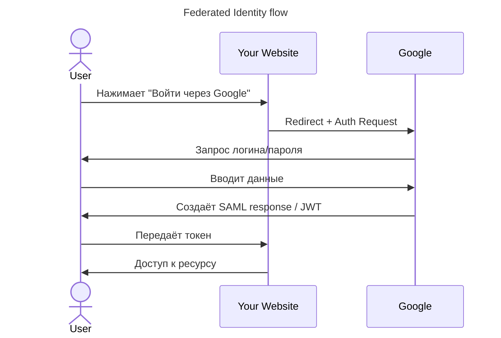

---
aliases:
  - Федеративная идентификация
  - Federated Identity
---
Отлично!  
**Federated Identity (Федеративная идентификация)** — это **система, позволяющая пользователям аутентифицироваться в одной системе (Identity Provider) и получать доступ к другим системам (Service Providers) без повторного входа.**

---

## ✅ Что такое Federated Identity?

> **Federated Identity** — это **обмен доверием между разными системами**.  
> Пользователь аутентифицируется один раз → получает доступ ко всем связанным сервисам.

### 💬 Простыми словами:
> «Я захожу в Google → могу сразу зайти на YouTube, Gmail, Drive — без повторного ввода пароля»

---

## ✅ Зачем нужна Federated Identity?

| Цель | Объяснение |
|------|------------|
| ✅ Удобство для пользователей | Один вход — во все сервисы |
| ✅ Безопасность | Не нужно хранить пароли в каждом сервисе |
| ✅ Снижение нагрузки на IT | Меньше запросов "забыл пароль" |
| ✅ Интеграция с внешними сервисами | Вход через Facebook, Google, GitHub |
| ✅ Поддержка SSO (Single Sign-On) | Один вход — во всё |

---

## ✅ Как устроена Федеративная идентификация?

### 🔧 Ключевые компоненты:

| Компонент                   | Роль                                                                      |
| --------------------------- | ------------------------------------------------------------------------- |
| **Identity Provider (IdP)** | Сервис, который проверяет личность пользователя (Google, Microsoft, Okta) |
| **Service Provider (SP)**   | Сервис, который предоставляет ресурсы (ваш сайт, CRM, ERP)                |
| **User**                    | Пользователь                                                              |
| **Protocol**                | OAuth 2.0, OpenID Connect, SAML                                           |

---

## ✅ Пример: Вход через Google

---

## ✅ Типичные протоколы

| Протокол | Используется для |
|----------|------------------|
| **SAML** | Корпоративные SSO (Active Directory, Okta) |
| **OAuth 2.0 + OpenID Connect** | Веб-приложения, SaaS, мобильные приложения |
| **Kerberos** | Локальные сети, Windows Active Directory |

---

## ✅ Форматы токенов

| Токен | Назначение |
|-------|------------|
| **JWT (JSON Web Token)** | Для передачи данных о пользователе (OpenID Connect) |
| **SAML Assertion** | XML-документ с данными о пользователе (SAML) |

---

## ✅ Где используется Федеративная идентификация?

| Сценарий | Пример |
|----------|--------|
| ✅ Веб-приложение | Вход через Google/Facebook/GitHub |
| ✅ Корпоративный портал | Вход в CRM, ERP, почту через единую точку |
| ✅ Облачные сервисы | Salesforce, Dropbox, Slack |
| ✅ Мобильные приложения | Авторизация через соцсети |

---

## ✅ Финальный вывод

> ✅ **Federated Identity = Single Sign-On + Trust between systems**  
> ✅ Она позволяет:
> - Упростить вход для пользователей
> - Увеличить безопасность
> - Снизить нагрузку на IT

> 💬 _“Federation is not about sharing passwords. It’s about sharing trust.”_

---

## 📚 Где учиться дальше?

- Book: *“Designing Identity and Access Management”* — Mark R. Miller  
- [OpenID Connect Docs](https://openid.net/connect/)  
- [SAML Docs](https://www.oasis-open.org/committees/tc_home.php?wg_abbrev=saml)  
- YouTube: *“Federated Identity Explained”* — TechWorld with Nana

---

✅ **Теперь вы знаете:**  
Как работает Федеративная идентификация, зачем она нужна и как устроены её компоненты.

📌 Сохраните эту таблицу — она станет вашей **картой безопасности**.

> 🔐 _“Trust is the foundation of identity.”_