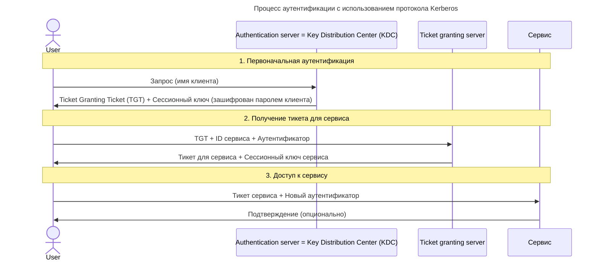

---
aliases:
  - Kerberos
  - SAML
---
### Что такое Kerberos?

**Kerberos** — это протокол аутентификации, который обеспечивает безопасную идентификацию пользователей и сервисов в сети. Его основная задача — подтвердить, что стороны, участвующие в обмене данными, действительно являются теми, за кого себя выдают. Используется, например, в [[AD|Windows Active Directory]] для управления доступом к ресурсам.

### Принцип работы Kerberos

Аутентификация в Kerberos основана на **передаче зашифрованных сообщений**. Если получатель может расшифровать сообщение, считается, что информация в нём верна. Для шифрования используются ключи симметричного шифрования, созданные на основе паролей участников.




Пошаговый процесс аутентификации:
1. **Пользователь (клиент) отправляет запрос** к центру распределения ключей (KDC) — серверу, который хранит пароли всех пользователей и компьютеров в домене.
2. **KDC генерирует зашифрованное «идентификационное сообщение»** (ticket), используя ключ шифрования, известный только KDC и запрашиваемому сервису.
3. **KDC отправляет клиенту этот ticket**, зашифрованный на основе ключа пользователя. Клиент не может расшифровать или изменить ticket — он просто передаёт его нужному сервису.
4. **Клиент пересылает ticket сервису**, для которого хочет получить доступ.
5. **Сервис расшифровывает ticket** своим ключом и подтверждает аутентификацию клиента.

### Ключевые компоненты Kerberos

1. **Key Distribution Center (KDC)** — центр распределения ключей:
   - хранит пароли пользователей и сервисов;
   - выдаёт зашифрованные tickets;
   - в Active Directory KDC объединён с другими сущностями (AS — Authentication Service и TGS — Ticket-Granting Service).
2. **Ticket** — зашифрованное сообщение, подтверждающее личность пользователя.
3. **Принципал** — сущность (пользователь или сервис), которая проходит аутентификацию.
4. **Шифрование** — Kerberos использует схемы шифрования (чаще всего AES), а также специальные 4-байтовые **key usage numbers** для каждой фазы передачи сообщений.
5. **AS-REQ / AS-REP** — сообщения для первичного запроса и ответа от KDC.
6. **TGS-REQ / TGS-REP** — сообщения для запроса и выдачи ticket-granting ticket (TGT), который позволяет запрашивать дополнительные tickets для других сервисов.

### Коммуникация с KDC

KDC слушает запросы на **порту 88** через:
- **TCP** — для надёжной передачи данных;
- **UDP** — для более быстрой, но менее надёжной передачи.

Адрес KDC можно узнать с помощью команды:
```
nslookup -type=SRV _kerberos._tcp.<имя_домена>  # для TCP
nslookup -type=SRV _kerberos._udp.<имя_домена>  # для UDP
```
> [[nslookup]]
### Дополнительные возможности

- **PKINIT (Public Key Infrastructure)** — расширение Kerberos, позволяющее использовать сертификаты вместо паролей.
- **User-To-User (U2U)** — расширение для коммуникации без шифрования на пароле, только с использованием сессионных ключей.
- **Авторизация** — Kerberos занимается только аутентификацией (подтверждает «кто вы»), а доступ к ресурсам (авторизация) регулируется отдельно (например, через security descriptor в Windows).

### Преимущества Kerberos

- **Безопасность** — все сообщения зашифрованы, пароли не передаются по сети.
- **Однократная аутентификация** — после получения TGT пользователь может обращаться к разным сервисам без повторного ввода пароля.
- **Масштабируемость** — подходит для крупных сетей (например, корпоративных доменов).
- **Поддержка множества платформ** — работает не только в Windows, но и в Linux, macOS и других ОС.

### Итог

Kerberos — это надёжный способ аутентификации в сети, который минимизирует риски перехвата паролей и обеспечивает безопасный доступ к ресурсам. Протокол широко используется в корпоративных средах для защиты данных и управления доступом.


___
# SAML vs Kerberos
## ✅ 1. Основные различия

| Критерий | **SAML (Security Assertion Markup Language)** | **Kerberos** |
|----------|-----------------------------------------------|--------------|
| **Тип** | XML-протокол для SSO (Single Sign-On) | Протокол с тикетами (ticket-based) |
| **Формат данных** | XML | Бинарный (в основном) |
| **Архитектура** | Web-ориентированная | Сеть/Windows-ориентированная |
| **Основное применение** | Веб-приложения, SaaS, корпоративные порталы | Windows Active Directory, внутренние системы |
| **Сессии** | Глобальные (по всем сервисам) | Локальные (на уровне домена) |
| **Шифрование** | HTTPS + цифровые подписи | Симметричное шифрование (пароли, ключи) |
| **Инициатор** | Может быть SP или IdP | Только KDC (Key Distribution Center) |
| **Примеры** | Google Workspace, Okta, Azure AD | Microsoft Active Directory, Linux Kerberos |

---

## ✅ 2. Когда использовать SAML?

> ✅ **SAML — для веб-приложений и SaaS-сервисов**

### 🎯 Используйте SAML, если:
- Вы разрабатываете **веб-приложение**, которое должно поддерживать вход через Google, Facebook, GitHub
- Вам нужен **SSO между веб-сервисами**
- У вас есть **корпоративный портал**, где пользователи должны войти один раз и получить доступ ко всем системам
- Вы интегрируетесь с **облачными сервисами** (Salesforce, Zendesk, Dropbox)

### 💡 Пример:
```text
Пользователь → заходит на ваш сайт → 
→ нажимает "Войти через Google" → 
→ Google (IdP) проверяет его → 
→ отправляет SAML response → 
→ ваш сервис (SP) даёт доступ
```

---

## ✅ 3. Когда использовать Kerberos?

> ✅ **Kerberos — для корпоративных сетей и Windows-систем**

### 🎯 Используйте Kerberos, если:
- Вы работаете в **Windows-домене** (Active Directory)
- Нужно аутентифицировать пользователей в **локальной сети** (например, на рабочих станциях, серверах)
- Вы хотите **автоматическую аутентификацию** без паролей (например, при подключении к файл-серверу)
- Вам нужно **высокое быстродействие** и **низкая задержка**

### 💡 Пример:
```text
Пользователь → вводит логин/пароль в Windows → 
→ получает TGT от KDC → 
→ использует TGT для получения тикетов к файл-серверу, почте, базе данных
```

---

## ✅ 4. Сравнение: Когда что выбрать?

| Сценарий | Рекомендация |
|----------|--------------|
| ✅ Веб-приложение с входом через Google/Facebook | ➤ **SAML** |
| ✅ Корпоративная система с Active Directory | ➤ **Kerberos** |
| ✅ Облачный SaaS-сервис | ➤ **SAML** |
| ✅ Локальная сеть, рабочие станции | ➤ **Kerberos** |
| ✅ Интеграция с внешними сервисами (CRM, ERP) | ➤ **SAML** |
| ✅ Аутентификация в базе данных или на сервере | ➤ **Kerberos** |
| ✅ Нужна высокая безопасность и контроль | ➤ **Kerberos** |
| ✅ Нужна простота и совместимость | ➤ **SAML** |

---

## ✅ Финальный вывод

| | **SAML** | **Kerberos** |
|--|----------|--------------|
| **Цель** | SSO для веб-приложений | Аутентификация в сети |
| **Формат** | XML | Бинарный |
| **Окружение** | Веб, SaaS, облачные сервисы | Windows, Active Directory, локальные сети |
| **Удобство** | Высокое | Среднее |
| **Безопасность** | Высокая (подписи, HTTPS) | Очень высокая (симметричное шифрование) |
| **Масштабируемость** | Отлично | Хорошо (внутри домена) |
| **Распространённость** | В SaaS | В корпоративных IT |

> 💬 _“SAML is for the web. Kerberos is for the network.”_

---

## 📚 Где учиться дальше?

- Book: *“Designing Identity and Access Management”* — Mark R. Miller  
- [SAML Docs](https://www.oasis-open.org/committees/tc_home.php?wg_abbrev=saml)  
- [Kerberos Docs](https://web.mit.edu/kerberos/)  
- YouTube: *“SAML vs Kerberos”* — TechWorld with Nana

---

✅ **Теперь вы знаете:**  
Когда выбирать **SAML** — для веба и SaaS,  
а когда — **Kerberos** — для Windows и корпоративных сетей.

📌 Сохраните эту таблицу — она станет вашей **картой безопасности**.

> 🔐 _“The right authentication protocol depends on your environment.”_